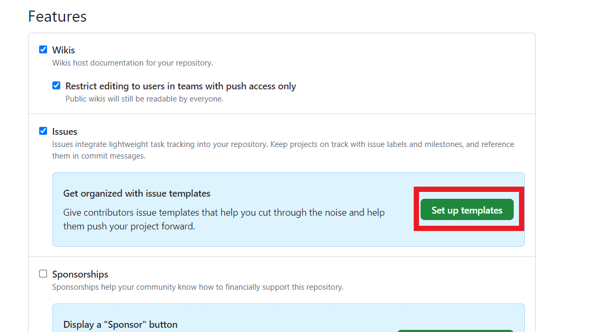
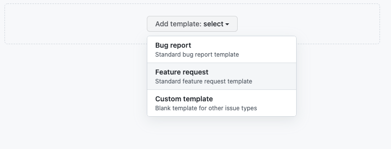
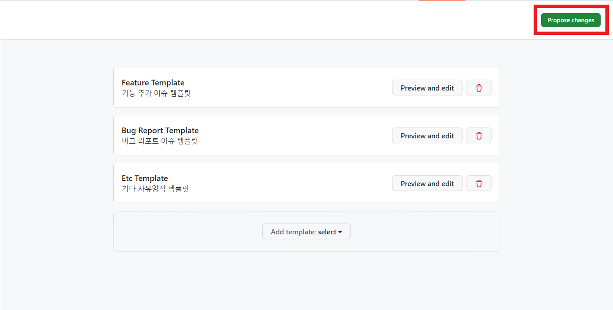
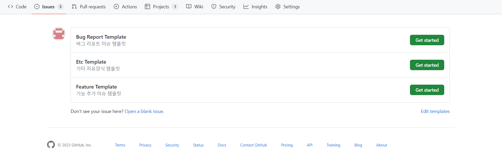
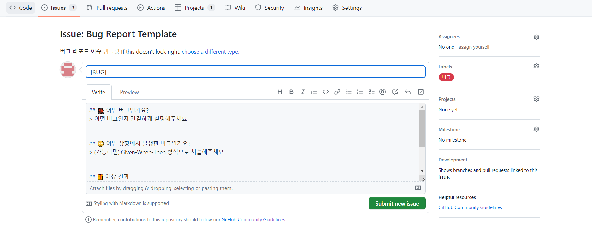
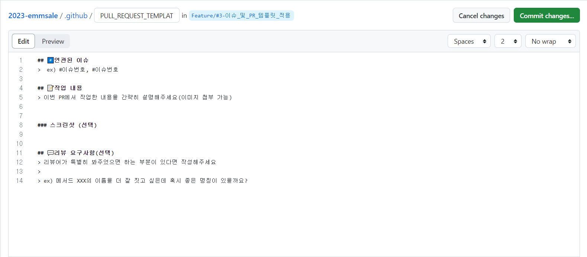
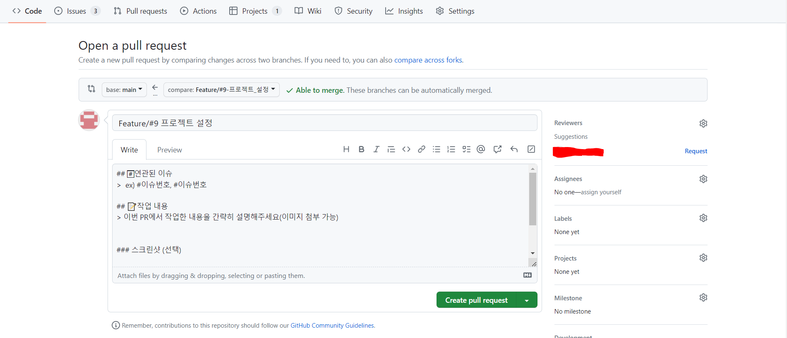

## 개요

---

Issue와 PR(풀 리퀘스트)은 프로젝트 과정에서 여러 팀원들이 매우 빈번하게 작성하는 문서이니 만큼, 공통된 양식이 있다면 같은 양식을 일일이 작성할 필요가 없어 편리하고 커뮤니케이션이 용이해진다.

오늘은 Issue/PR의 이러한 공통 양식(Template)를 설정해보자.

## Issue Template

---

먼저 레파지토리의 **[Setting]** 탭으로 들어간 뒤, **Features** 항목의 **Issues**에 있는 ‘**_Set up templates_**’ 버튼을 누르면 이슈 템플릿을 등록할 수 있는 화면이 나온다.



여기서 ‘**_Add template:select_**'를 클릭해 원하는 형식의 이슈 템플릿을 추가할 수 있다.



이슈 템플릿은 크게 버그 리포트와 기능 요청 이슈로 나눌 수 있다.

다음은 우리 팀 프로젝트에 적용한 이슈 템플릿 양식이다.

- 기능 요청 이슈

  ```markdown
  ## 어떤 기능인가요?

  > 추가하려는 기능에 대해 간결하게 설명해주세요

  ## 작업 상세 내용

  - [ ] TODO
  - [ ] TODO
  - [ ] TODO

  ## 참고할만한 자료(선택)
  ```

- 버그 리포트 이슈

  ```markdown
  ## 어떤 버그인가요?

  > 어떤 버그인지 간결하게 설명해주세요

  ## 어떤 상황에서 발생한 버그인가요?

  > (가능하면) Given-When-Then 형식으로 서술해주세요

  ## 예상 결과

  > 예상했던 정상적인 결과가 어떤 것이었는지 설명해주세요

  ## 참고할만한 자료(선택)
  ```

우리 팀에서는 개발 외의 테스크도 종종 Issue로 작성하기 때문에, 자유 양식의 빈 템플릿을 하나 더 만들었다.



다 만들고 나면 우측 상단의 ‘**_Propose Change_**’ 버튼을 클릭하고 변경 사항을 커밋한다.

이슈의 경우 PR 템플릿과 달리 여러 템플릿을 등록할 수 있어서, 이슈 템플릿을 설정하고 나면 다음과 같이 Issue를 만들 때 양식을 설정하는 화면이 뜨게 된다.



‘**_Get started_**’를 클릭하면 다음과 같이 설정해둔 템플릿을 사용할 수 있다.



## PR Template

---

PR 템플릿은 Issue 템플릿처럼 여러 개를 설정할 수 없다.

마찬가지로 마크다운 문법을 지원하며, 적용하는 방법은 간단하다.

기본 브랜치로 설정된 브랜치(default는 main)에서 프로젝트의 최상위 경로를 기준으로 `.github` 폴더를 만들고 그 안에 템플릿 내용을 담은 `PULL_REQUEST_TEMPLATE.md` 파일을 만들면 된다.



```markdown
## #️⃣연관된 이슈

> ex) #이슈번호, #이슈번호

## 📝작업 내용

> 이번 PR에서 작업한 내용을 간략히 설명해주세요(이미지 첨부 가능)

### 스크린샷 (선택)

## 💬리뷰 요구사항(선택)

> 리뷰어가 특별히 봐주었으면 하는 부분이 있다면 작성해주세요
>
> ex) 메서드 XXX의 이름을 더 잘 짓고 싶은데 혹시 좋은 명칭이 있을까요?
```

PR을 읽는 목적은 주로 코드 리뷰에 있으므로, 작업 내용(PR 요약)과 함께 코드를 읽는 데 걸리는 예상 시간, 리뷰어에게 요청하고 싶은 점(특별하게 봐주었으면 하는 점), 결과 화면 등을 첨부해주면 좋다.

(이러한 양식엔 정해진 컨벤션이 있는 것은 아니므로 팀의 상황에 맞춰서 결정하는 게 좋다.)



이제 PR을 생성할 때 위와 같이 파일에 작성한 템플릿이 자동 완성된다.

## 참고 자료

---

[[git, github] git issue 생성 및 작성 방법 (1)](https://hyeonic.tistory.com/181)

[Github Issue Templates으로 Issue 쉽고 체계적이게 작성해보기](https://velog.io/@yulhee741/Github-Issue-Templates으로-Issue-쉽고-체계적이게-작성해보기)
