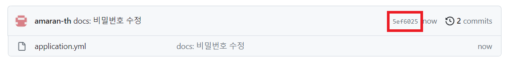

## 개요

---

spring으로 애플리케이션을 만들다보면 application.yml에 외부에 노출되어선 안되는 민감한 정보가 들어가곤 한다.

DB 커넥션의 유저명, 비밀번호라든지, jwt 토큰의 시크릿 키 등등…

당연히 이런 민감 정보는 Github에 남기면 안되기 때문에, 우리는 개발할 때 해당 파일의 정보를 별도로 관리할 필요가 있다.

흔히들 `.env`라고 하는 설정 파일을 만들어 이러한 민감 정보를 저장하고 해당 파일을 .gitignore에 추가함으로써 github에 노출되는 것을 방지한다. 그리고 이 파일을 별도의 방법으로 서버에 전달한 뒤 운영 서버에서 민감 정보를 사용할 수 있게 하는 방법이 있다.

이 방법은 민감 정보에 변경 사항이 생길 때마다 일일이 서버의 설정 파일을 별도로 수정해주어야 하기 때문에 번거롭다.

이런 경우 Github의 private 서브모듈을 활용하면 이런 민감 정보를 손쉽게 관리할 수 있다.

## Git Submodules

---

저장소 안에 다른 저장소를 원하는 디렉토리로 복제하는 기능.

다시말해 Github Repository를 모듈화 시켜 다른 Github Repository에 포함시키는 것이다.

간단한 실습을 위해 자동차 경주 미션 프로젝트 파일을 재탕했다.

이 때 DB로 h2를 사용했는데, application.yml 파일에서 h2 DB의 사용자명과 비밀번호를 설정해보겠다.

```yaml
spring:
  h2:
    console:
      enabled: true
  datasource:
    url: jdbc:h2:mem:testdb;MODE=MySQL
    driver-class-name: org.h2.Driver
    username: root
    password: 1234
```

그 다음 애플리케이션을 실행하고 `localhost:8080/h2-console`에 접속한다.


그리고 앞서 설정해준 유저명과 비밀번호를 입력하면 h2 콘솔에 접속할 수 있다.


이렇게 DB 유저명/비밀번호만 있다면 애플리케이션의 DB 환경에 쉽게 접속할 수 있기 때문에, 유저명/비밀번호가 기재되어 있는 application.yml 파일을 남들이 보지 못하도록 submodule로 만들어보겠다.

### 1. Private 레파지토리 생성


먼저 private 레포지토리를 새로 생성해준다.

이 때 README.md 파일은 추가하지 않는다.


그리고 application.yml을 레포에 작성해준다.

### 2. 프로젝트에서 private 레포를 서브모듈로 불러오기

다음 명령어를 통해 Private 레포를 서브 모듈로서 가져온다.

```bash
git submodule add [git repo url] [서브모듈 경로]
```


그럼 이렇게 지정해둔 경로에 private repository 내의 파일들이 불러와지는 것을 확인할 수 있다.


그리고 프로젝트 최상위 경로에 `.gitmodules`라는 파일이 새로 생성되는데, 서브모듈의 정보를 담고 있는 파일이다.

```bash
[submodule "src/main/resources/config"]
	path = src/main/resources/config
	url = https://github.com/amaran-th/submodule-practice.git
```

내용은 위와 같으며, path는 서브 모듈의 위치, 폴더 명을 의미하고 url은 서브 모듈의 저장소 위치를 나타낸다.

<aside>

💡 여기서 **branch**를 지정해주면 서브 모듈의 특정 브랜치를 사용할 수 있다.

```bash
[submodule "src/main/resources/config"]
	path = src/main/resources/config
	url = https://github.com/amaran-th/submodule-practice.git
	branch = main
```

현재 private 레포에는 main 외에 다른 브랜치는 없으므로 사용할 필요가 없다.

</aside>

이 상태로 프로젝트 레포의 변경사항을 push하면 다음과 같이 서브모듈 디렉토리가 연결된 것을 확인할 수 있다.


### 3. Submodule이 있는 레포지토리 Clone하기

이렇게 서브모듈을 설정한 프로젝트 레포를 새로 clone하면, private 레포에 접근할 권한이 있는 사람은 서브모듈을 포함해서 받아오고, 권한이 없는 경우 서브모듈 디렉토리를 제외하고 받아오게 된다.

### +) 서브모듈 변경사항 업데이트하기


서브모듈 디렉토리를 보면 서브 모듈 repo의 특정 커밋을 가리키고 있는데, 만약 서브 모듈 repo에 새로운 변경 사항이 있는 경우 다음 명령어를 통해 서브모듈의 변경사항을 업데이트 해주어야 한다.

```bash
git submodule update --remote --merge
```

다음 명령어를 통해 서브모듈의 최신 상태를 확인할 수 있다.

```bash
git submodule status
```

예시를 위해 application.yml에 설정해둔 db password를 4321로 수정해보겠다.




비밀번호를 변경한 커밋의 id는 `5ef6025`로 시작한다.

하지만 프로젝트의 서브모듈은 여전히 이전 커밋을 가리키고 있음을 확인할 수 있다.


이 때 `git submodule update --remote --merge` 명령을 통해 서브모듈을 업데이트 하고 이 변경사항을 프로젝트 레포에 푸시해주면, 다음과 같이 프로젝트 레포에서도 서브모듈이 업데이트된 것을 확인할 수 있다.


# 참고 자료

---

[Git Submodules를 활용한 secret, config 파일 관리, 배포 (feat. SpringBoot, GitHub Actions)](https://kukim.tistory.com/151)
