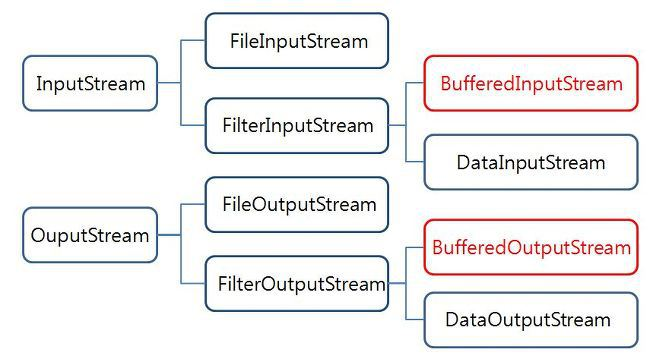

## I/O Stream

---

### OutputStream

자바의 기본 출력 클래스는 java.io.OutputStream이다.

- **ByteArrayOutputStream**
    
    ```java
    @Test
        void OutputStream은_데이터를_바이트로_처리한다() throws IOException {
          final byte[] bytes = {110, 101, 120, 116, 115, 116, 101, 112};
          final OutputStream outputStream = new ByteArrayOutputStream(bytes.length);
    
          outputStream.write(bytes);
    
          final String actual = outputStream.toString();
    
          assertThat(actual).isEqualTo("nextstep");
          outputStream.close();
        }
    ```
    
    OutputStream 객체의 write 메서드를 사용해서 outputStream에 바이트 데이터를 전송할 수 있다.
    

### try-with-resources

java 9 이상 버전에서 try(…)문에 선언된 객체들에 대해 try문이 종료될 때 자동으로 자원을 close() 처리해주는 기능.

```java
@Test
    void OutputStream은_사용하고_나서_close_처리를_해준다() throws IOException {
      final OutputStream outputStream = mock(OutputStream.class);
      
      try (outputStream) {
      }

      verify(outputStream, atLeastOnce()).close();
    }
  }
```

### InputStream

inputStream에서 byte로 반환한 값을 문자열로 바꾸는 방법

Reader를 사용한다.

자바의 기본 문자열은 UTF-16 유니코드 인코딩을 사용한다. 

바이트 데이터를 문자(char)로 처리하려면 인코딩을 신경써야 한다. **reader, writer**를 사용하면 입출력 스트림을 바이트가 아닌 문자 단위로 데이터를 처리하게 된다.

InputStreamReader를 사용하면 지정된 인코딩에 따라 유니코드 문자로 변환할 수 있다.

```java
@Test
    void InputStream은_데이터를_바이트로_읽는다() throws IOException {
      byte[] bytes = {-16, -97, -92, -87};
      final InputStream inputStream = new ByteArrayInputStream(bytes);

      Reader reader = new InputStreamReader(inputStream);
      StringBuilder result = new StringBuilder();
      for (int data = reader.read(); data != -1; data = reader.read()) {
        result.append((char) data);
      }

      final String actual = result.toString();
      assertThat(actual).isEqualTo("🤩");
      assertThat(inputStream.read()).isEqualTo(-1);
      inputStream.close();
    }
```

### FilterStream



FilterOutputStream과 달리 FilterInputStream의 생성자는 protected로 선언되어 있기 때문에 해당 객체를 생성하기 위해서는 FilterInputStream을 상속받는 클래스를 사용해야 한다.

대표적인 FilterInputStream의 상속 클래스는 BufferedInputStream이 있다.

- **BufferedInputStream**
    
    데이터를 버퍼에 저장하여 데이터 처리 속도를 높인다.
    
    버퍼 사이즈를 지정해주지 않을 경우 기본 버퍼의 크기는 8192이다.
    
- **BufferedOutputStream**
    
    : byte 단위로 데이터를 출력할 때 사용하는 버퍼 스트림.
    
    - 버퍼가 모두 채워지거나 close(), flush() 메서드가 호출되면 write된 모든 내용을 하드 디스크 파일에 출력한다.
    - 데이터를 기록할 때 8192byte의 버퍼를 두고 작업하기 때문에 처리속도가 매우 빠르다.
    
    [자바 BufferedOutputStream  [북붙따라하기]](https://hey79.tistory.com/56)
    

## File

---

### File vs. Path

IO 패키지는 파일의 속성 정보를 읽기 위한 File 클래스를 제공한다.

NIO는 IO보다 좀 더 다양한 파일의 속성 정보를 제공하는 패키지이다.

Path는 IO의 java.io.File 클래스에 대응되는 NIO 인터페이스로, NIO의 API에서 파일의 경로를 지정하기 위해 사용된다.

Path 구현 객체는 java.nio.file.Paths 클래스의 정적 메소드 get()을 통해 생성할 수 있다.

```java
Path path = Paths.get(String first, String....more)
Path path = Paths.get(URI uri);
```

get()의 매개 변수는 **파일의 경로**.

[[ JAVA ] - NIO(2) : 파일과 디렉토리(1) - 경로 정의(Path)](https://blog.naver.com/rain483/220642503709)

### File 읽는 법

```java
@Test
  void 파일의_내용을_읽는다() throws IOException, URISyntaxException {
    final String fileName = "nextstep.txt";

    final Path path = Paths.get(getClass().getResource("/" + fileName).toURI());

    Charset charset = StandardCharsets.UTF_8;
    final List<String> actual = Files.readAllLines(path, charset);

    assertThat(actual).containsOnly("nextstep");
  }
```

- `getClass().getResource(fileName)`
    
    resources 경로에 존재하는 파일을 찾아 경로(URL) 객체를 반환한다.
    
    
    
    *resources 폴더에 fileName 경로에 해당하는 파일이 존재하지 않을 경우 null을 반환한다.
    
- `Files.readAllLines(path, charset)`
    
    파일의 내용을 리스트로 담는다. 파일 경로(Path) 객체와 Charset 객체를 입력으로 받는다.
    

[자바 파일 입출력 (txt파일 한 문자씩, 한 줄씩, 한 번에 읽기)](https://jeong-pro.tistory.com/69)