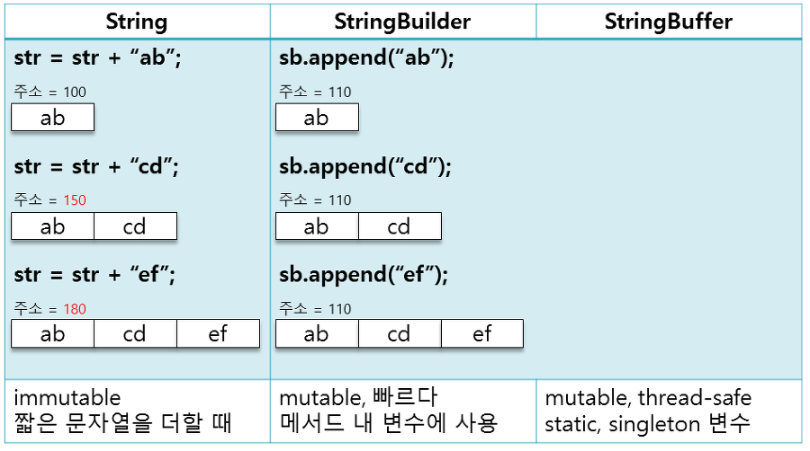

## String Pool과 intern() 메서드는 무엇일까?

### String 객체를 생성하는 방법

자바에서 String 객체의 생성하는 방식은 크게 2가지가 있다.

1. **new 연산자를 이용한 String 객체 생성**

   생성된 객체가 Heap 메모리 영역에 존재하게 된다.

2. **리터럴을 이용한 방식**

   생성된 객체가 Heap 내의 String Constanct Pool이라는 영역에 존재하게 된다.

new 연산자를 사용하여 객체를 생성하면 같은 내용이라도 새 메모리 공간을 할당받는 반면,

String pool에 있는 문자열은 같은 내용일 경우 메모리를 **재사용**한다.

### intern() 메서드

String을 리터럴로 선언할 경우 내부적으로 String 클래스의 `intern()` 메서드가 호출되는데, `intern()` 메서드는 주어진 문자열이 String Constant Pool에 존재하는지 검색하고, 존재할 경우 해당 주소 값을 반환하고 없다면 String Constant Pool에 넣고 새로운 주소 값을 반환한다.

즉, new 키워드로 생성한 객체를 리터럴로 생성한 것과 동일하게 사용할 수 있게 한다.

---

## StringBuilder

### StringBuilder란?

String은 **불변 객체**이기 때문에 ‘+’ 연산자로 복수의 문자열을 더해질 때 기존 문자열의 메모리를 해제하고 새로운 메모리가 할당된다.

이러한 동작이 반복적으로 일어날 시 불필요한 객체가 많이 생성되어 성능 저하가 발생 할 수 있다. 이를 보완하기 위한 다양한 도구가 있다.

StringBuilder는 가변 객체여서 문자열을 변경할 수 있다. 때문에 문자열을 변경할 때 매번 새로운 메모리 주소를 할당받지 않고 같은 메모리 주소에 저장하게 해준다.

+) JDK5부터는 + 연산자를 사용해도 컴파일러가 자동으로 StringBuilder를 생성해서 처리한다.

### StringConcatFactory?

`StringBuilder`을 사용할 경우 문자열에 +를 했을 때보다 객체 생성 비용이 줄어들지만 루프 같은 상황에서는 `StringBuilder`가 계속해서 생기게 된다.

이러한 문제를 개선시키고자 도입된 것이 `StringConcatFactory`.

`StringConcatFactory`가 사용하는 6가지 전략이 있는데, 부트스트랩이 런타임에 문자열 연결에 사용할 전략을 MethodHandle로 전달해준다.

### StringBuilder와 StringBuffer의 차이

`StringBuilder`와 `StringBuffer`는 모두 `AbstractStrinigBuilder`라는 추상 클래스를 상속하는데, `StringBuffer`는 `StringBuilder`와 달리 공통 메서드가 **동기화**되기 때문에 멀티 스레딩 환경에서는 `StringBuffer`를 쓰는 것이 더 좋다.(thread safe)

<nav>

참고 게시글

- [https://kic1.tistory.com/41](https://kic1.tistory.com/41)
- [https://12bme.tistory.com/94](https://12bme.tistory.com/94)

</nav>
