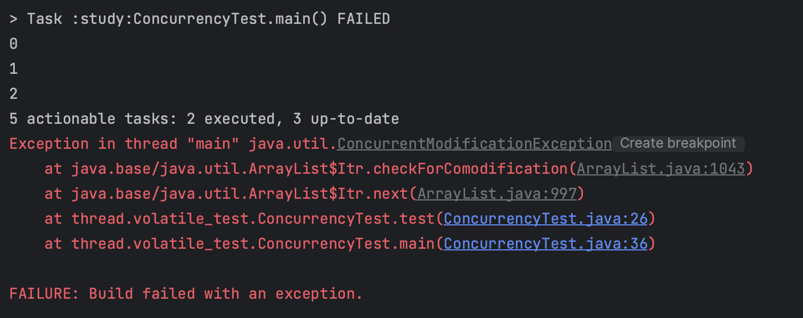

# Thread-Safety 자료구조

---

**스레드 안전성** : [멀티 스레드](https://ko.wikipedia.org/wiki/%EC%8A%A4%EB%A0%88%EB%93%9C) 프로그래밍에서 일반적으로 어떤 [함수](https://ko.wikipedia.org/wiki/%ED%95%A8%EC%88%98_(%ED%94%84%EB%A1%9C%EA%B7%B8%EB%9E%98%EB%B0%8D))나 [변수](https://ko.wikipedia.org/wiki/%EB%B3%80%EC%88%98_(%EC%BB%B4%ED%93%A8%ED%84%B0_%EA%B3%BC%ED%95%99)), 혹은 [객체](https://ko.wikipedia.org/wiki/%EA%B0%9D%EC%B2%B4_(%EC%BB%B4%ED%93%A8%ED%84%B0_%EA%B3%BC%ED%95%99))가 여러 [스레드](https://ko.wikipedia.org/wiki/%EC%8A%A4%EB%A0%88%EB%93%9C)로부터 동시에 접근이 이루어져도 [프로그램](https://ko.wikipedia.org/wiki/%EC%BB%B4%ED%93%A8%ED%84%B0_%ED%94%84%EB%A1%9C%EA%B7%B8%EB%9E%A8)의 실행에 문제가 없는 특성

스레드 안전성을 보장하는 자료구조에는 크게 Synchronized Collection과 Concurrent Collection이 있다.

## Synchronized Collection(동기화 컬렉션)

---

| 컬렉션 종류 | 컬렉션 |
| --- | --- |
| List | Vector |
| Map | HashTable |
| synchronizedXXX | synchronizedHashMap, HashSet, ArrayList, … |

내부적으로 메서드에 **synchronized 키워드**가 걸려있기 때문에 한 번에 한 스레드만 내부의 값을 사용할 수 있다.

<aside>

💡 **synchronized 키워드**

---

자바 멀티 스레드 환경에서는 스레드끼리 static 영역과 heap 영역을 공유한다. 이 공유자원에 대한 동기화 문제를 해결하기 위해, synchronized 키워드를 사용할 수 있다.

synchronized 키워드는 l**ock을 이용해 동기화를 수행**한다.

synchronized 메서드는 인스턴스 단위로 락을 걸지만 synchronized 키워드가 붙은 메서드들에 대해서만 lock을 공유한다.

한 스레드가 synchronized.메서드를 호출하는 순간, 모든 synchronized 메서드에 lock이 걸리기 때문에 다른 스레드는 해당 메서드가 종료될 때까지 어떠한 synchronized 메서드도 호출할 수 없다.

[[Java] synchronized 키워드란?](https://steady-coding.tistory.com/556)

</aside>

```java
public class Vector<E> extends AbstractList<E>
    implements List<E>, RandomAccess, Cloneable, java.io.Serializable {
    ...

    public synchronized boolean add(E e) {
        modCount++;
        add(e, elementData, elementCount);
        return true;
    }

		public synchronized int size() {
        return elementCount;
    }

    ...
}
```

- 한 동기화 컬렉션에 여러 스레드가 동시에 접근할 수 없다.
- **동기화 컬렉션(Vector, HashTable)의 다중 연산 문제**
    - 두 개 이상의 연산을 묶어 사용하는 경우(다중 연산) 문제가 발생할 수 있다.
    1. 반복문
        
        ```java
        for (int i = 0; i< vector.size(); i++) {
        	doSomething(vector.get(i));
        }
        ```
        
        위와 같은 반복문 실행 도중에 다른 스레드에서 데이터를 삭제하거나 변경해버리면 `ArrayIndexOutOfBoundesException` 예외가 발생한다.
        
    2. 삭제와 조회
        
        ```java
        public static Object getLast(Vector list) {
        	int lastIndex = list.size() -1;    // 1
        	return list.get(lastIndex);   // 3
        }
        
        public static void delteteLast(Vector list) {
        	int lastIndex = list.size() -1;
        	list.remove(lastIdndex);    // 2
        }
        ```
        
        위와 같은 메서드를 정의했을 때, 한 스레드에서 deleteLast() 메서드를 먼저 실행시키고 다른 스레드에서 getLast() 메서드를 실행시켜 삭제된 데이터를 조회하는 경우가 발생하면 `ArrayIndexOutOfBoundesException` 예외가 발생한다.
        
    
    ⭐ **해결 방법** - 반복문 전체를 락으로 동기화시킨다.
    
    ```java
    synchronized (vector) {
    	for(int i = 0; i < vector.size(); i++) {
    		doSomething(vector.get(i));
    	}
    }
    ```
    
    - **문제** - 성능적 이슈가 발생할 수 있다.
        - 컬렉션의 요소가 많을 경우 반복문 실행 작업이 많은 시간을 소모할 수 있는데, 이렇게 되면 동일한 컬렉션을 사용하고자 하는 스레드가 오랫동안 대기상태에 있게 될 수 있다.
        - 반복문에서 락을 잡고 있는 상황에서 또다른 락을 확보해야 한다면 데드락이 발생할 수도 있다.
- **Collection 클래스의 다중 연산 문제**
    
    *synchronizedXXX*() 정팩메를 사용해서 Collection 클래스에 대한 동기화 컬렉션을 만들 수 있다.
    
    ```java
    Map<String, String> map = Collections.synchronizedMap(new HashMap(...));
    ```
    
    ```java
    // Collections.java
    private static class SynchronizedMap<K,V>
            implements Map<K,V>, Serializable {
            private static final long serialVersionUID = 1978198479659022715L;
    
            private final Map<K,V> m;     // Backing Map
            final Object      mutex;        // Object on which to synchronize
    
            ...
    
            public V get(Object key) {
                synchronized (mutex) {return m.get(key);}
            }
    
            public V put(K key, V value) {
                synchronized (mutex) {return m.put(key, value);}
            }
            public V remove(Object key) {
                synchronized (mutex) {return m.remove(key);}
            }
            public void clear() {
                synchronized (mutex) {m.clear();}
            }
    ```
    
    앞서 다룬 두 동기화 컬렉션에서와 마찬가지로 다중 연산 문제가 발생하며, 한 가지 차이점은 **fail fast(즉시 멈춤**)라는 특징이 있다는 것이다.
    
    <aside>

    💡 **fail fast 방식**
    
    ---
    
    : 빠르게 실패하기.
    
    동작중 오류가 발생하면 바로 오류를 알리고 작업을 중단하는 것.
    
    미래에 의도하지 않은 문제가 발생하는 것을 원칙적으로 차단하기 위해 적용한다.
    
    </aside>
    
    반복문을 실행하는 도중에 컬렉션 객체 내부의 값이 변경되는 상황이 포착되면 그 즉시 `ConcurrentModificationException` 예외가 발생하고 동작을 멈춘다.
    
    예제 )
    
    ```java
    public void test() throws InterruptedException {
        List<Integer> list = new ArrayList<>();
        for (int i = 0; i < 10; i++) {
            list.add(i);
        }
        int cnt = 0;
        for (int i : list) {
            System.out.println(i);
            cnt++;
            if (cnt == 3) {
                list.remove(0);
            }
        }
    }
    ```
    
    
    
    Collection 클래스는 내부에 값 변경 횟수를 카운트하는 변수를 가지고 있고, 이 값이 반복문을 실행하는 동안 변경되면 `ConcurrentModificationException` 예외를 반환한다.
    
    [java ) Fail-Safe Iterator vs Fail-Fast Iterator](https://shanepark.tistory.com/212)
    

## Concurrent Collection(병렬 컬렉션)

---

| 컬렉션 종류 | 컬렉션 |
| --- | --- |
| List | CopyOnWriteArrayList |
| Map | ConcurrentMap, ConcurrentHashMap |
| Set | CopyOnWriteArraySet |
| SortedMap | ConcurrentSkipListMap |
| SortedSet | ConcurrentSkipListSet |
| Queue | BlockingQueue, ConcurrentLinkedQueue |

*위 컬렉션들은 모두 java.util.concurrent 패키지에 존재한다.

동기화 컬렉션은 변수에 접근하는 통로를 일련화시켜 스레드 안전성을 확보했다.

하지만 여러 스레드가 한 동기화 컬렉션 객체에 동시에 접근할 수 없기 때문에, 성능상으로 문제가 발생할 수 있다.(동시성이 떨어진다)

**병렬 컬렉션**은 스레드 안전성을 보장하면서 여러 스레드가 동시에 접근할 수 있도록 설계된 자료구조이다.

크게 두 종류로 나누어서 보면, CopyOnWrite… 컬렉션과 Concurrent… 컬렉션이 있는 것을 볼 수 있다.

### ConcurrentHashMap

동기화 컬렉션에서는 모든 연산에서 **단 하나의 락**을 사용했기 때문에 특정 시점에 하나의 스레드만이 해당 컬렉션을 사용할 수 있었다.

ConcurrentHashMap은 Lock Striping(락 스트라이핑) 덕분에 동기화 컬렉션에 비해 높은 동시성을 보장한다.

- **Lock Striping**이란, 컬렉션 데이터를 여러 개의 범위로 나누어서 각 범위마다 특정 락이 담당하도록 하는 것이다. ConcurrentHashMap은 16개의 락을 배열로 마련해두고 각각의 락이 전체 해시 범위의 1/16에 대한 락을 담당한다.
    
    각 영역이 서로 영향을 주지 않는 작업에 대해서는 경쟁이 일어나지 않아 여러 스레드에서 동시 접근이 가능하고 락 획득을 위한 대기시간을 줄일 수 있다.
    

ConcurrentHashMap은 반복문 사용 중 fail fast 대신 **미약한 일관성 전략**을 사용한다.

- 미약한 일관성 전략이란, 반복문을 실행하는 도중 컬렉션의 내용이 변경되어도 iterator를 만들었던 시점의 상황대로 반복을 계속하는 것이다.

- 단점
    - size(), isEmpty()와 같은 메서드의 의미가 희미해진다. 다중 연산의 결과를 내는 시점(=반복문이 종료된 시점)에 이미 컬렉션 데이터가 변경된 상황일 수도 있기 때문.
    - 한 스레드가 컬렉션 객체를 독점적으로 사용할 수가 없다.

### CopyOnWriteArrayList

크게 읽기 작업과 쓰기 작업 시 동작으로 나누어서 설명을 하겠다.

- **쓰기 작업의 경우**
    
    명시적 락을 사용한다.
    
    컬렉션의 값이 변경되는 시점마다 원본 배열에 있는 요소의 **복사본**을 새로 만들고 이 복사본에 변경 작업을 수행한 후 원본 배열을 갱신하는 식으로 동작한다.
    
    때문에 여러 스레드에서 한 컬렉션에 동시에 접근하더라도 앞에서 언급된 문제가 발생하지 않는다.(다만 데이터 불일치는 발생할 수 있다.)
    
- **읽기 작업의 경우**
    
    읽기 작업에는 lock이 걸리지 않는다.
    

- 단점
    - 데이터가 변경될 때마다 복사본을 만들기 때문에 성능상 손해를 볼 수 있다.(컬렉션에 데이터가 많은 경우 더욱 그렇다.)
        
        ⇒변경 작업보다 반복문으로 읽는 일이 훨씬 빈번한 경우에 사용하면 효과적이다.
        

## 요약

---

- 동기화 컬렉션의 특징
    - 내부 메서드에 synchronized 키워드를 사용해 컬렉션 내부의 값을 하나의 스레드만 사용할 수 있도록 제어한다.
    - 하나의 락을 컬렉션 전반에 걸기 때문에 확장성에 장애물이 된다.
- 병렬 컬렉션의 특징
    - 여러 스레드가 한 번에 접근할 수 있기 때문에 스레드 대기시간이 적다.
    - 동기화 컬렉션에 비해 더 높은 확장성과 동시성을 보장한다.

[동기화, 비동기화, 컨커런트 컬랙션](https://wms0603.tistory.com/53)

[자바 컬렉션 프레임워크, thread safe한 컬렉션](https://velog.io/@meme2367/면접-준비-자바-컬렉션-프레임워크)