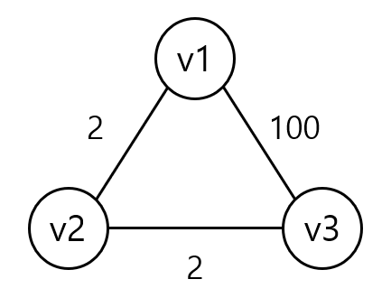
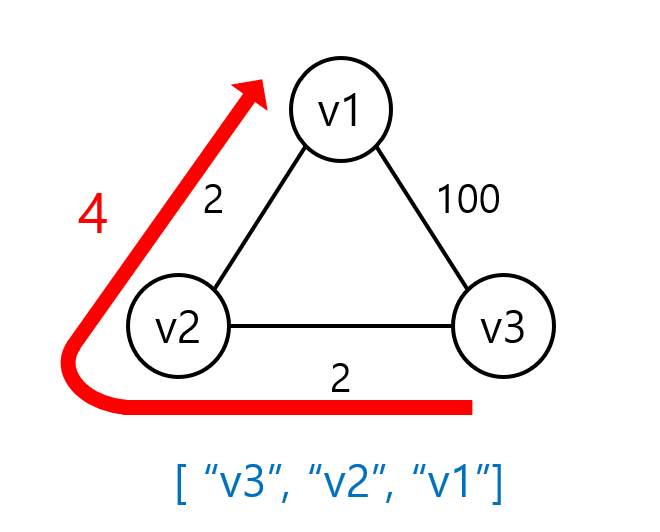

### jgrapht란?

Graph 자료구조를 지원하는 Java 기반 라이브러리이다.

jgrapht에서 제공하는 기능을 사용해 최단 경로를 도출하거나 가중치의 합을 구할 수 있다.

### 의존성 추가

gradle.build 파일에 다음 코드를 추가해준다.

```java
dependencies {
		implementation 'org.jgrapht:jgrapht-core:1.0.1'
		...
}
```

### 사용법

- 우테코 지하철 미션의 제공 코드

  ```java
  @Test
  public void getDijkstraShortestPath() {
      WeightedMultigraph<String, DefaultWeightedEdge> graph
              = new WeightedMultigraph(DefaultWeightedEdge.class);
      graph.addVertex("v1");
      graph.addVertex("v2");
      graph.addVertex("v3");
      graph.setEdgeWeight(graph.addEdge("v1", "v2"), 2);
      graph.setEdgeWeight(graph.addEdge("v2", "v3"), 2);
      graph.setEdgeWeight(graph.addEdge("v1", "v3"), 100);

      DijkstraShortestPath dijkstraShortestPath
              = new DijkstraShortestPath(graph);
      List<String> shortestPath
              = dijkstraShortestPath.getPath("v3", "v1").getVertexList();

      assertThat(shortestPath.size()).isEqualTo(3);
  }
  ```

  위 코드는 다음과 같은 구조의 그래프를 생성하고, v3에서 v1까지의 최단 경로를 도출한다.
  
  

- `WeightedMultigraph<V, E>`(양방향 가중치 그래프) 객체

  - `addVertex()`로 vertex를 추가해줄 수 있다.
    ```java
    graph.addVertex("v1");
    ```
  - `addEdge()`로 edge를 추가해줄 수 있다.

    ```java
    E edge=graph.addEdge("v1", "v2");
    ```

      <aside>
      ⚠️ 당연하지만, edge의 양 끝단의 vertex가 먼저 추가되어야 한다.
      
      </aside>
      
      <aside>
      ⚠️ addEdge()로 간선을 추가할 때 순환참조가 형성될 경우 다음과 같은 예외가 발생한다.
      
      ```java
      addEdge("a", "b")
      addEdge("b", "c")
      addEdge("c", "a")    //Exception
      addEdge("a", "a")    //Exception
      addEdge("b", "a")    //Exception
      ```
      
      ```
      IllegalArgumentException: loops not allowed
      ```
      
      </aside>

  - `setEdgeWeight()`로 edge의 가중치를 설정해줄 수 있다.
    ```java
    graph.setEdgeWeight(edge, 2);
    ```

이렇게 만든 graph에 dijkstra 알고리즘이 적용된 `DijkstraShortestPath` 객체를 생성한다.

- `DijkstraShortestPath<V, E>` 객체

  - `getPath()` 메서드를 통해 두 vertex 사이의 최적의 경로 정보를 `GraphPath` 객체로 받아올 수 있다.
      <aside>
      ⚠️ 만약 최단 거리를 구할 수 없는 경우(**두 vertex가 연결되어 있지 않을 경우**) null이 반환되기 때문에 이에 대해 적절히 처리하지 않으면 NullPointerException이 발생할 수 있다.
      
      </aside>

- `GraphPath` 객체
  - `getWeight()`는 해당 경로의 총 가중치를 반환한다.
  - `getVertexList()`는 해당 경로의 vertex 리스트를 반환한다.

## 참고 자료

---

[[Java] JGraphT 라이브러리를 통한 최단경로 조회](https://bugoverdose.github.io/development/finding-shortest-path-with-jgrapht/)
