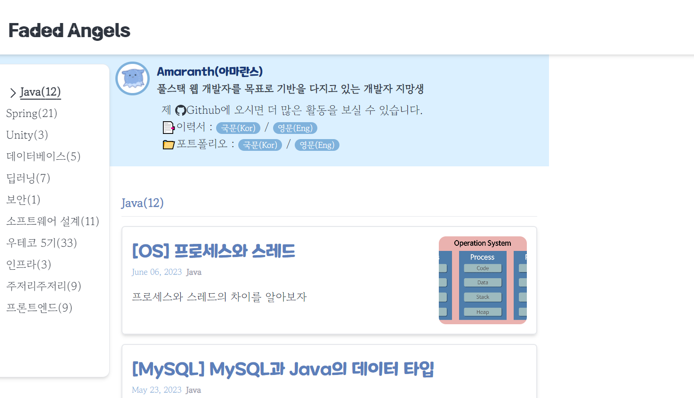

## 개요

---

jsoup 라이브러리를 사용해서 웹사이트를 크롤링해보자.

예제로 내 블로그의 Java 카테고리 내 게시글들을 크롤링해보았다.

## jsoup

---

자바로 만들어진 HTML 파서(Parser).

jsoup 라이브러리는 다음의 기능들을 제공한다.

- URL, 파일, 문자열을 소스로 하여 HTML 문서를 파싱할 수 있다.
- 문서 내의 HTML 요소, 속성, 텍스트를 조작할 수 있다.
- CSS 선택자를 사용해 데이터를 추출할 수 있다.
- …

요약하면 HTML 문서를 조작할 수 있게 해주는 라이브러리로, 해당 라이브러리를 통해 웹사이트로부터 원하는 데이터를 추출할 수 있다.

- 의존성 추가
  ```
  implementation 'org.jsoup:jsoup:1.13.1'
  ```

### document 불러오기

먼저 크롤링하고자 하는 웹사이트의 url을 가져온다.

```
https://amaran-th.github.io/
```


만약 특정 카테고리의 게시글들만 크롤링할 경우, 다음과 같이 카테고리명이 url에 포함될 것이다.

‘Java’ 카테고리를 크롤링 해보자.

```java
https://amaran-th.github.io/Java/
```



url의 Document 문서를 불러오는 코드는 다음과 같다.

```java
final String url = "https://amaran-th.github.io/Java/";

Connection connection = Jsoup.connect(url);
Document document = connection.get();
```

### HTML 요소 추출하기

개발자도구의 **Elements**를 확인해보면, 각 게시글 블럭은 다음과 같은 하나의 <li\> 태그로 구성되어 있다.

```html
<li
  class="flex justify-between justify-items-center border-2 rounded-md shadow-md p-4 my-4 hover:bg-slate-100"
>
  <article class="" itemscope="" itemtype="http://schema.org/Article">
    <header class="mb-4">
      <h2 class="mt-2 text-main text-3xl font-title">
        <span itemprop="headline">[Java] jgrapht 사용법</span>
      </h2>
      <span class="text-sub text-sm"
        >May 21, 2023<span class="font-bold mx-2 text-gray-400 text-sm"
          >Java</span
        ></span
      >
    </header>
    <section>
      <p class="mb-0" itemprop="description">
        Java 라이브러리 jgrapht의 사용법에 대해 알아보자.
      </p>
    </section>
  </article>
  <div class="min-w-[5rem] max-w-[20rem] w-[150px] h-[150px]">
    <div
      class="rounded-xl h-full w-full gatsby-image-wrapper"
      style="position: relative; overflow: hidden"
    >
      <div aria-hidden="true" style="width: 100%; padding-bottom: 78.5%"></div>
      <picture
        ><source
          srcset="
            /static/2f2c5ac60692d07dc14284436917fdf8/69585/graph.png 200w,
            /static/2f2c5ac60692d07dc14284436917fdf8/497c6/graph.png 400w,
            /static/2f2c5ac60692d07dc14284436917fdf8/c30fe/graph.png 433w
          "
          sizes="(max-width: 433px) 100vw, 433px" />
        </picture
      ><noscript
        ><picture
          ><source
            srcset="
              /static/2f2c5ac60692d07dc14284436917fdf8/69585/graph.png 200w,
              /static/2f2c5ac60692d07dc14284436917fdf8/497c6/graph.png 400w,
              /static/2f2c5ac60692d07dc14284436917fdf8/c30fe/graph.png 433w
            "
            sizes="(max-width: 433px) 100vw, 433px" />
          </picture
      ></noscript>
    </div>
  </div>
</li>
```


여기서, 게시글의 **제목, 업로드 날짜, 요약 설명, 섬네일 이미지**를 불러오고 싶다고 하자.

해당 정보가 포함된 태그만 추출해보면 다음과 같을 것이다.

```java
<span itemprop="headline">[OS] 프로세스와 스레드</span>
```

```java
<span class="text-sub text-sm">June 06, 2023<span class="font-bold mx-2 text-gray-400 text-sm">Java</span></span>
```

```java
<p class="mb-0" itemprop="description">프로세스와 스레드의 차이를 알아보자</p>
```

```java

```

이제 쿼리 선택자를 이용해 Document로부터 각 상품의 데이터를 추출해야 한다.

아래처럼 개발자 도구의 [Element]에서 특정하고자 하는 요소를 [Copy selector]하여 요소 선택자를 가져올 수 있다.


이렇게 **제목, 업로드 날짜, 요약 설명, 섬네일 이미지**에 대한 선택자를 가져왔다.

```java
String TITLE_SELECTOR = "body > div > div > div.w-full.flex.max-w-6xl.justify-between > div > ol > a:nth-child(1) > li > article > header > h2 > span";
String DATE_SELECTOR = "body > div > div > div.w-full.flex.max-w-6xl.justify-between > div > ol > a:nth-child(1) > li > article > header > span";
String DESCRIPTION_SELECTOR ="body > div > div > div.w-full.flex.max-w-6xl.justify-between > div > ol > a:nth-child(1) > li > article > section > p";
String IMAGE_SELECTOR = "body > div > div > div.w-full.flex.max-w-6xl.justify-between > div > ol > a:nth-child(1) > li > div > div > picture > img";
```

앞서 불러왔던 document에 대해 `select()`, `selectFirst()` 등을 통해 선택자 조건에 부합하는 요소(들)을 불러올 수 있다.

```java
Document document = connection.get();

final Elements titleElements = document.select(TITLE_SELECTOR);
final Elements dateElements = document.select(DATE_SELECTOR);
final Elements descriptionElements = document.select(DESCRIPTION_SELECTOR);
final Elements imageElements = document.select(IMAGE_SELECTOR);
```

(왠진 모르겠지만 개발자도구에서 추출한 Selector가 안 먹혀서 직접 다시 만들어주었다. 아마 tailwindcss 때문에 클래스가 복잡해져서 선택자 추출이 잘 안된 듯 하다.)

예시로 불러온 title 태그들을 콘솔에 출력해보면 다음과 같은 결과를 확인할 수 있다.

```java
final Elements titleElements = document.select(TITLE_SELECTOR);

System.out.println(titleElements);
```


이렇게 위에서 보여준 4개의 태그를 불러올 수 있다.(페이지 내 모든 게시글에 대해 불러와짐.)

<aside>

💡 `select()`는 조건에 부합하는 모든 요소들을 불러오기 때문에 반환 타입이 **Elements**이고, `selectFirst()`는 조건에 부합하는 요소들 중 첫 번째 요소를 불러오기 때문에 반환타입이 **Element**이다.

</aside>

### 요소로부터 데이터 추출하기

제목, 날짜, 요약 설명의 경우 text 요소로 정의되어 있기 때문에 `Element.text()` 메서드로 불러오고 파싱한다.

```java
<span itemprop="headline">[OS] 프로세스와 스레드</span>
```

```java
final List<String> titles = titleElements.stream()
    .map(it -> it.text())
    .collect(Collectors.toList());

System.out.println(titles);
```


이 중에서 날짜는 다음과 같이 카테고리와 한 태그에 같이 묶여있는데, 여기서 두 데이터를 모두 감싸고 있는 <span\>태그의 text를 추출하면 “**Jun 06, 2023Java**”와 같이 파싱이 된다.

그래서 String 메서드를 사용해 날짜만 추출하도록 처리하였다.

```java
<span class="text-sub text-sm">June 06, 2023<span class="font-bold mx-2 text-gray-400 text-sm">Java</span></span>
```

```java
final List<String> dates = dateElements.stream()
    .map(it ->{
      final String[] split = it.text().split(", ");
      return String.join(", ",split[0],split[1].substring(0,4));
    })
    .collect(Collectors.toList());
```


그리고 이미지 url의 경우 다음과 같이  태그의 src 속성 값으로 저장되어 있다.

```java

```

`Element.attr()` 메서드로 추출한다.

```java
final List<String> images = imageElements.stream()
    .map(it -> PREFIX_URL+it.attr("src"))
    .collect(Collectors.toList());

System.out.println(images);
```


<aside>

⚠️ **주의사항**

---

모든 게시글이 썸네일 이미지를 가지고 있지 않기 때문에, 이런 방식으로 게시글의 썸네일을 가져오면 썸네일이 있는 게시글의 것만 가져오기 때문에 다른 데이터들과 싱크가 맞지 않는다.

그래서 섬네일 이미지에 해당하는  태그를 포함하고 모든 게시글이 공통으로 가지고 있는 상위 태그를 Elements로 불러오고,

해당 Elements에 대해 반복문을 돌며 `selector()`로  태그를 추출해서 썸네일이 없는 게시글은 빈 문자열로 처리하는 등의 방법을 통해 모든 게시글에 대한 썸네일 데이터를 가져올 수 있다.

이러한 DOM 구조는 웹사이트마다 천차만별이기 때문에, 크롤링하려는 사이트의 DOM 구조를 파악하고 적절한 방법으로 필요한 데이터를 추출해야 한다.

</aside>

추출 코드 전문은 다음과 같다.

```java
final Elements titleElements = document.select(TITLE_SELECTOR);
final Elements dateElements = document.select(DATE_SELECTOR);
final Elements descriptionElements = document.select(DESCRIPTION_SELECTOR);
final Elements imageElements = document.select(IMAGE_SELECTOR);

final List<String> titles = titleElements.stream()
    .map(it -> it.text())
    .collect(Collectors.toList());

final List<String> dates = dateElements.stream()
    .map(it ->{
      final String[] split = it.text().split(", ");
      return String.join(", ",split[0],split[1].substring(0,4));
    })
    .collect(Collectors.toList());

final List<String> descriptions = descriptionElements.stream()
    .map(it -> it.text())
    .collect(Collectors.toList());

final List<String> images = imageElements.stream()
    .map(it -> PREFIX_URL+it.attr("src"))
    .collect(Collectors.toList());
```

## 마무리

---

이렇게 jsoup 라이브러리를 사용해서 특정 웹사이트로부터 원하는 데이터를 추출하는 방법을 알아봤다.

나중에 기회가 되면, 여러 페이지를 순차적으로 크롤링하는 코드를 짜보고 일정 시간마다 크롤러가 실행되도록 셋팅하는 작업을 포스팅해보도록 하겠다.

## 참고 자료

---

[jsoup : 자바 HTML 파서(Java HTML Parser)](https://offbyone.tistory.com/116)

[[Java] - Jsoup을 이용한 크롤링(feat. 인프런)](https://zzang9ha.tistory.com/337)
