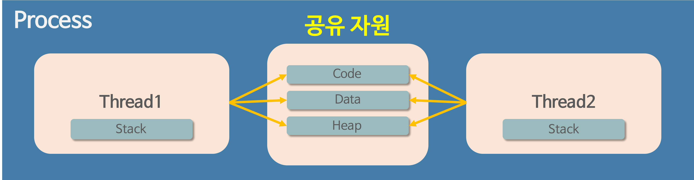
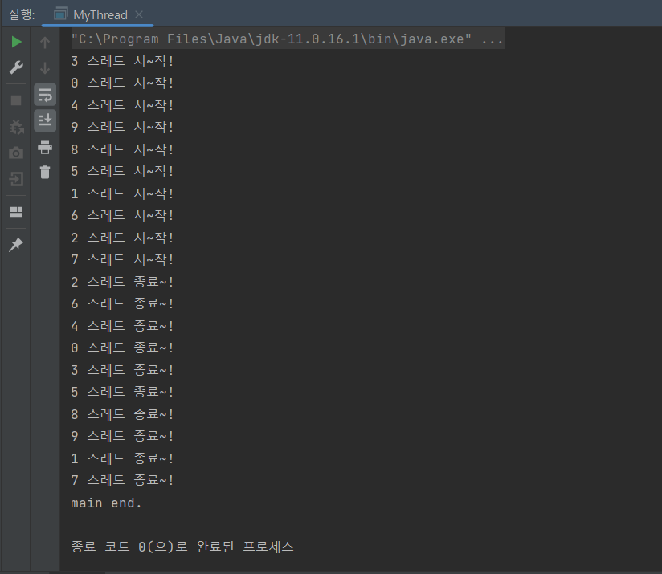

## 프로세스와 스레드의 개념

---

- **프로그램(Program)**
  : 어떤 작업을 위해 실행할 수 있는 파일
- **프로세스(Process)**
  : 컴퓨터에서 연속적으로 실행되고 있는 컴퓨터 프로그램.
  메모리에 올라와 **실행되고 있는 프로그램의 인스턴스(독립적인 개체)**
  운영체제로부터 시스템 자원을 할당받는 작업의 단위
    <aside>

  💡 **시스템 자원?**

  여기서 의미하는 시스템 자원은 **CPU 점유율**, 운영되기 위해 필요한 **주소 공간**, Code, Data, Stack, Heap의 구조로 되어있는 **메모리 영역** 등이 있다.

    </aside>

  - 특징

  

  각각의 프로세스는 각각의 독립된 메모리 영역을 할당받는다.

  - 기본적으로 프로세스당 최소 1개의 스레드(=메인 스레드)를 가지고 있다.

  - 각 프로세스는 별도의 주소 공간에서 실행되며, 한 프로세스는 다른 프로세스의 변수나 자료구조에 접근할 수 없다.

  - 한 프로세스가 다른 프로세스의 자원에 접근하려면 프로세스 간의 통신(inter-process communication, IPC)을 사용해야 한다.

    ex) 파이프, 파일, 소켓 등을 활용

  - 프로세스는 상태(Status)가 변경되며 수행되는데, 상태의 종류는 다음과 같다.

    - `Running` : CPU를 잡고 instruction을 수행 중인 상태
    - `Ready` : CPU를 기다리는 상태
    - `Blocked(waiting, sleep)` : CPU를 주어도 당장 instruction을 수행할 수 없는 상태. Process가 요청한 이벤트(입출력 등)가 완료되지 않아 대기 중인 상태
    - `New` : 디스크에서 메모리로 프로그램이 올라가 실행준비를 하는 상태
    - `Terminated` : 수행(execution)이 끝난 상태
      
    - `ps` 명령어

      `ps` 명령어는 현재 실행중인 프로세스의 목록과 상태를 보여준다.
      
      이 명령어에서 사용할 수 있는 옵션은 다음과 같다.

      | 옵션    | 설명                                                                                          |
      | ------- | --------------------------------------------------------------------------------------------- |
      | -A      | 모든 프로세스 출력                                                                            |
      | a       | 터미널과 연관된 프로세스를 출력. 보통 x 옵션과 연계하여 모든 프로세스를 출력할 때 사용        |
      | -a      | 세션 리더를 제외한 터미널에 종속되지 않은 모든 프로세스를 출력                                |
      | -e      | 커널 프로세스를 제외한 모든 프로세스 출력                                                     |
      | -f      | 프로세스 정보를 풀 포맷으로 출력. UID, PID, PPID 등이 함께 표시된다.                          |
      | -o [값] | 출력 포맷 지정. pid, tty, time, cmd 등을 지정할 수 있다.                                      |
      | -M      | 64bit 프로세스들을 출력                                                                       |
      | -m      | 프로세스 뿐만 아니라 커널 스레드들도 출력                                                     |
      | -p      | 특정 PID를 지정할 때 사용                                                                     |
      | -r      | 실행중인 모든 프로세스를 출력(running)                                                        |
      | -u      | 특정 사용자의 프로세스 정보를 출력(사용자를 지정하지 않으면 현재 사용자를 기준으로 정보 출력) |

    특정 프로세스를 확인하기 위해 주로 `grep` 명령어와 함께 쓰인다.

    ```
    ps -ef | grep '프로세스 명'
    ```

    

이해를 돕기 위해 비유를 해보자면, 메모장 앱은 프로그램이고, 메모장 앱을 실행시켰을 때 뜨는 각 창들이 각각의 프로세스로서 동작하고 있는 것이라고 할 수 있다.

| 프로그램                  | 프로세스                   |
| ------------------------- | -------------------------- |
|  |  |

- **스레드(Thread)**
  : 프로세스 내에서 실행되는 여러 흐름의 단위
  - 프로세스의 특정한 수행 경로
  - 프로세스가 할당받은 자원을 이용하는 실행의 단위
  - 특징
    
    - 각각의 스레드는 프로세스 내에서 각각 Stack 메모리 영역만을 따로 할당받고 나머지 Code, Data, Heap 영역은 **공유한다**.
    - 프로세스 내의 주소 공간이나 자원들(Heap 등)을 같은 프로세스 내의 스레드끼리 공유하면서 실행된다.
    - 한 스레드가 프로세스 자원을 변경하면, 다른 이웃 스레드(sibling thread)도 그 변경 결과를 즉시 볼 수 있다.
      

## 프로세스와 스레드의 차이

---

| 특징                   | 프로세스                                        | 스레드                                                                  |
| ---------------------- | ----------------------------------------------- | ----------------------------------------------------------------------- |
| 메모리 공유            | 프로세스 별로 별도의 메모리 영역을 할당 받는다. | 스레드 별로 Stack 영역만 별도로 할당받고 Code/Data/Heap영역은 공유한다. |
| Context Switching 속도 | (상대적으로) 느림                               | 빠름                                                                    |

## 멀티 프로세스 대신 멀티 스레드를 사용하는 이유

---

### 멀티 프로세싱

: 하나의 응용 프로그램을 여러 개의 프로세스로 구성하여 각 프로세스가 하나의 작업(task)을 처리하도록 하는 것.

- 장점

  : 여러 개의 자식 프로세스 중 하나에 문제가 발생하면 해당 자식 프로세스만 죽고 그 이상으로 다른 영향이 확산되지 않는다.

- 단점

  - Context Switching로 인한 오버헤드가 발생할 수 있다.
      <aside>

    💡 **Context Switching이란?**

    CPU에서 여러 프로세스를 돌아가며 작업을 처리하는 과정으로, 동작중인 프로세스가 대기 상태에 들어가며 해당 프로세스의 상태(Context)가 저장되고, 대기 상태에 있던 다음 순서의 프로세스가 동작하면서 이전에 저장했던 프로세스의 상태를 복구하는 작업을 의미한다.

      </aside>

    - Context Switching 과정에서 캐시 메모리 초기화 등 무거운 작업이 실행되고 많은 시간이 소요된다.
    - 프로세스는 각각의 독립된 메모리 영역을 할당받기 때문에 프로세스 사이에서 공유하는 메모리가 없어 Context Switching 시 캐시에 저장된 모든 데이터를 모두 삭제하고 다시 캐시 정보를 불러와야 한다.

  - 프로세스 사이의 통신이 어렵고 복잡하다.(IPC\)

### 멀티 스레딩

: 하나의 응용프로그램을 여러 개의 스레드로 구성하고 각 스레드가 하나의 작업을 수행하게 하는 것.

- 윈도우, 리눅스 등 많은 운영체제들이 멀티 프로세싱을 지원하고 있지만 대부분은 멀티 스레딩을 기본으로 한다.
- 웹 서버가 대표적 예시.
- 장점
  - 시스템 자원 소모가 감소(자원의 효율성 증대)
  - 시스템 처리량 증가(처리 비용 감소)
    - 스레드 간 데이터를 주고 받는 작업이 간단해지고 시스템 자원 소모가 줄어든다.
    - 스레드 사이의 작업량이 작기 때문에 Context Switching이 빠르다.
  - 간단한 통신 방법으로 인한 플로그램 응답 시간 단축.
    - 스레드는 프로세스 내의 Stack 영역을 제외한 모든 메모리를 공유하기 때문에 스레드 간 통신 시 부담이 적다.
- 단점
  - 주의 깊은 설계가 필요하다.
  - 디버깅이 까다롭다.
  - 하나의 스레드에 문제가 생기면 전체 프로세스가 영향을 받는다.
  - 자원 공유 문제(동기화)

### 멀티 프로세스 대신 멀티 스레드를 사용하는 이유?

- 주요 이유 : 프로그램을 여러 개 키는 것보다 하나의 프로그램 안에서 여러 작업을 해결하기 위해
  

1.  자원의 효율성 증대

    - 멀티 프로세스로 실행되는 작업을 멀티 스레드로 실행할 경우, **프로세스를 생성하여 자원을 할당하는 시스템 콜**이 줄어들어 자원을 효율적으로 관리할 수 있다.
    - 스레드는 프로세스 내의 메모리를 공유하기 때문에 독립적인 프로세스와 달리 스레드 간 데이터를 주고 받는 것이 간단하고 시스템 자원 소모도 적다.

2.  처리 비용 감소 및 응답 시간 단축 - 프로세스 간의 전환 속도보다 스레드 간의 전환 속도가 빠르다.
    => Context Switching 시 스레드는 Stack 영역만 처리하기 때문
    <aside>

    ⚠ **동기화 문제(Synchronization Issue)**

    스레드 간의 자원 공유는 전역 변수를 사용하기 때문에 함께 사용할 때 충돌이 발생할 수 있다.

    </aside>

## 자바 멀티 스레딩

### 자바 스레드(Java Thread)

- 일반 스레드와 거의 차이가 없으며, JVM이 운영체제(OS)의 역할을 한다.
- 자바에는 프로세스가 존재하지 않고 스레드만 존재하며, 자바 스레드는 JVM에 의해 스케줄링되는 실행단위 코드 블록이다.
- 자바에서 스레드 스케줄링은 전적으로 JVM에 의해 이루어진다.
- 다음과 같은 스레드와 관련된 많은 정보들도 JVM이 관리한다.
  - 스레드가 몇 개 존재하는지
  - 스레드로 실행되는 프로그램 코드의 메모리 위치는 어디인지
  - 스레드의 상태는 무엇인지
  - 스레드 우선순위는 얼마인지
- 개발자가 자바 스레드로 작동할 스레드 코드를 작성한 후 JVM에 스레드 코드 실행을 요청하는 방식이다.

### 자바에서 Thread를 사용하는 법

`Thread` 클래스를 상속하면 `run()` 메서드를 구현해야 한다. 각 스레드에서 실행되는 코드를 run 메서드에 작성하면 된다.
그리고 `start()` 메서드를 호출하면 thread의 `run()` 메서드가 호출된다.

```java
public class MyThread extends Thread {
    public void run() {
        System.out.pringln("스레드 작동 중~");
    }

    public static void main(String[] args){
        Thread thread = new MyThread();
        thread.start();
    }
}
```

멀티 스레딩을 구현하기 위해 `run()`에 1초 정도의 지연이 생기는 코드를 작성하고, 여러 개의 스레드 객체를 실행시켜 보자.
다음은 스레드 객체를 10개 만들어 순차적으로 1초 동안 쉬는 동작을 실행시키는 코드이다.

```java
public class MyThread extends Thread {
    int seq;

    public MyThread(int seq) {
        this.seq = seq;
    }

    public void run() {
        System.out.println(this.seq + " 스레드 시~작!");
        try {
            Thread.sleep(1000);
        } catch (Exception e) {
        }
        System.out.println(this.seq + " 스레드 종료~!");
    }

    public static void main(String[] args) {
        for (int i = 0; i < 10; i++) {
            Thread thread = new MyThread(i);
            thread.start();
        }
        System.out.println("main 메서드 동작 끝~");
    }
}
```

Thread.sleep() 메서드는 ms단위로 일정 시간동안 Thread를 대기시킨다.
위 코드를 실행시키면 다음과 같은 결과가 출력된다.(스레드 실행 순서는 실행할 때마다 랜덤하게 정해진다.)

결과를 보면 스레드가 종료되기 전에 main 메서드가 종료된 것을 확인할 수 있다.

만약 스레드가 모두 종료된 후에 main 메서드를 종료하고 싶다면 join()을 사용하여 스레드가 종료될때까지 기다리게 할 수 있다.

```java
import java.util.ArrayList;

public class MyThread extends Thread {
    int seq;
    public MyThread(int seq) {
        this.seq = seq;
    }

    public void run() {
        System.out.println(this.seq+" 스레드 시~작!");
        try {
            Thread.sleep(1000);
        }catch(Exception e) {
        }
        System.out.println(this.seq+" 스레드 종료~!");
    }

    public static void main(String[] args) {
        ArrayList<Thread> threads = new ArrayList<>();
        for(int i=0; i<10; i++) {
            Thread thread = new MyThread(i);
            thread.start();
            threads.add(thread);
        }

        for(int i=0; i<threads.size(); i++) {
            Thread stackedThread = threads.get(i);
            try {
                stackedThread.join();
            }catch(Exception e) {
            }
        }
        System.out.println("main end.");
    }
}
```

main() 메서드를 보면 스레드 객체들을 실행시킴과 동시에 리스트에 담아두고, 리스트 내의 모든 Thread 객체의 실행이 종료될 때까지 대기한다.

출력된 결과를 보면 의도한 대로 Thread의 실행이 모두 끝난 후 main() 메서드의 실행이 끝나는 것을 확인할 수 있다.


일반적으로 Thread 클래스보단 Runnable 인터페이스를 구현하는 방식으로 만든다.
사용 방법은 Thread 클래스를 상속하는 방법과 거의 동일하다.

```java
public class MyThread implements Runnable {
    public void run() {
        System.out.pringln("스레드 작동 중~");
    }

    public static void main(String[] args){
        Thread thread = new Thread(new MyThread());
        thread.start();
    }
}
```

이 경우 extends 키워드를 implements로 변경하고, 객체 생성 시 Thread 클래스의 생성자에 인자로 구현체 객체를 넣어주면 된다.

## 참고 자료

---

[[OS] 프로세스와 스레드의 차이 - Heee's Development Blog](https://gmlwjd9405.github.io/2018/09/14/process-vs-thread.html)

[[운영체제] 프로세스와 스레드](https://velog.io/@aeong98/%EC%9A%B4%EC%98%81%EC%B2%B4%EC%A0%9COS-%ED%94%84%EB%A1%9C%EC%84%B8%EC%8A%A4%EC%99%80-%EC%8A%A4%EB%A0%88%EB%93%9C)

[[리눅스, 유닉스] ps 프로세스 명령어 완벽 정리, 프로세스 관리, 계열에 따른 옵션 차이, 조건에 맞게 프로세스 정보 추출하기](https://jhnyang.tistory.com/268)
