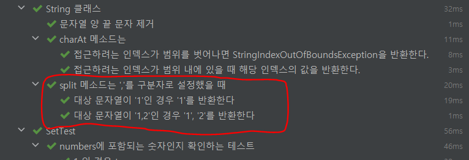

### @Nested

테스트 메서드의 가독성을 높이기 위한 방법 중 하나.

@Nested 어노테이션을 사용하여 inner class를 만들고 그 안에 테스트 메서드를 작성하면 비슷한 부류의 함수들을 묶어줄 수 있어 가독성을 높일 수 있다.

- 예시 코드

  ```java
  @DisplayName("String 클래스")
  public class StringTest {

    @Nested
    @DisplayName("split 메소드는 ','를 구분자로 설정했을 때")
    class Describe_split {

      @Test
      @DisplayName("대상 문자열이 '1,2'인 경우 '1', '2'를 반환한다")
      public void splitOneTwo() {/* */}

  		@Test
      @DisplayName("대상 문자열이 '1'인 경우 '1'를 반환한다")
      public void splitOnlyOne() {/* */}
    }
  	...
  ```


테스트 결과 창에서도 이와 같이 카테고리 분류가 되어 확인하기 쉬워진다.

단점 : 코드의 양이 늘어난다.

### 테스트 메서드 네이밍(Naming)

찾아보니 테스트 메서드를 네이밍하는 규칙이 다양하게 나와있었는데, 나는 여러 게시글을 읽고 다음과 같은 규칙을 정했다.

- 메서드 명은 영어로 작성하고, @DisplayName 어노테이션을 사용해서 한글로 작성하자.

이렇게 결정한 이유는 1. 메서드 명을 한글로 작성하기엔 언어 특성상 카멜케이스를 적용할 수 없기 때문에 언더바(\_)를 많이 사용하게 되어 메서드 명칭이 길어지고 2. 경험상 영어로 작성하는 것이 문법 상 작성하기 편한 경우가 많아서이다.

- 네이밍에도 **When-Given-Then 규칙**을 적용하자.

`Given_사전 조건_When_테스트상태_Expect_기대결과`

여러 네이밍 규칙을 봤는데, 위와 같이 When-Given-Then 방식을 적용한 방식이 테스트의 목적와 결과를 표현하기 좋아보여 채택하였다.

추가) @Nested와 함께 사용할 경우, 클래스 명칭(@DisplayName)을 When, 메서드 명칭을 Given-Then 형식으로 분리해서 명명한다든지 상황에 맞춰 사용하면 좋을 것 같다.

- 클래스명 : **…가…할 때(When)**
- 메소드명 : **…하면(Given)..한다.(Then)**

<nav> 참고 게시글

- [[TDD/스크랩&번역] 7가지 유닛테스트 네이밍](https://it-is-mine.tistory.com/3)
- [[Spring] JUnit 5 에서 @Nested 와 @DisplayName 으로 가독성 있는 테스트 코드 작성하기](https://bcp0109.tistory.com/297)
</nav>
