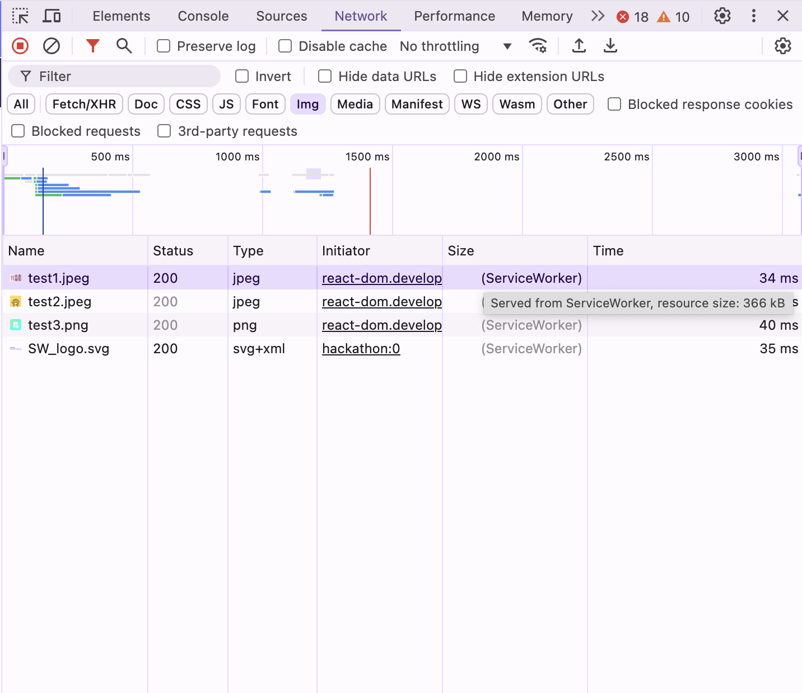
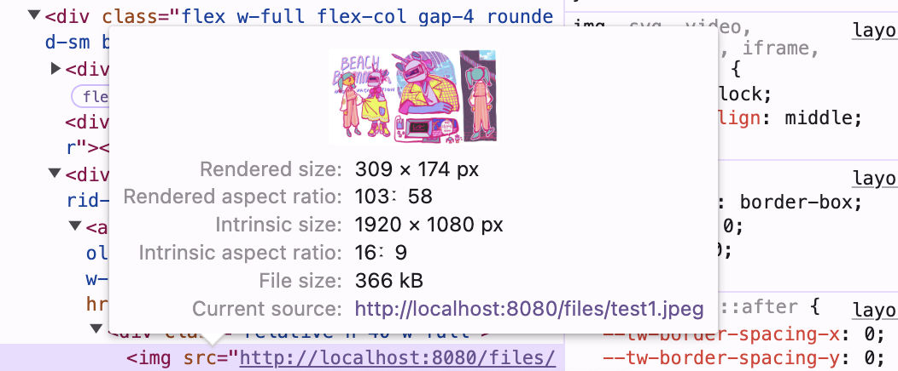
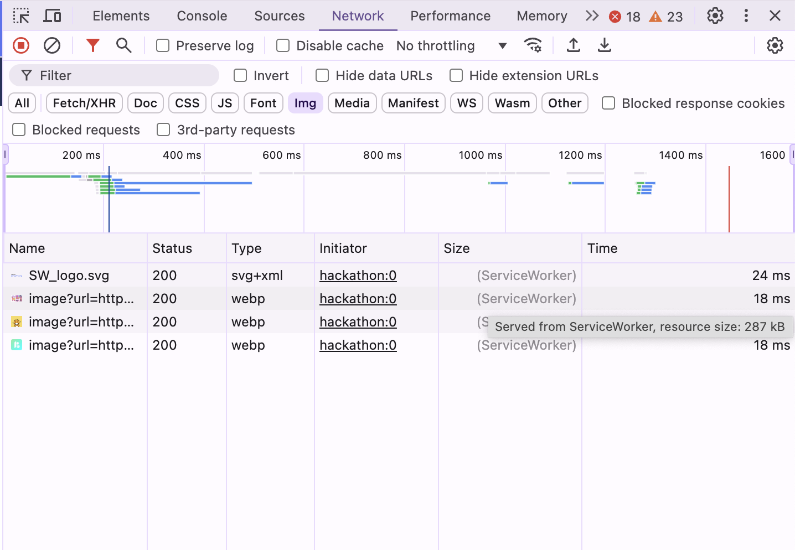
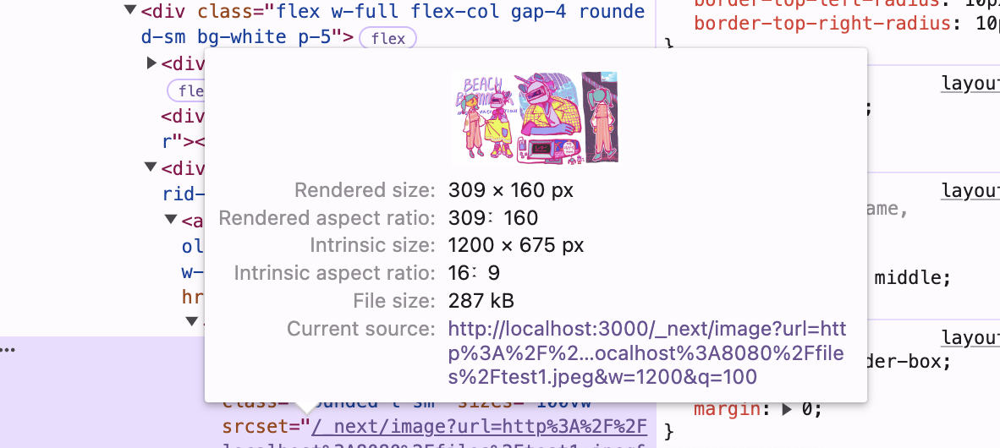

Next.js에서는 이미지 최적화를 위해 `Image` 컴포넌트를 제공하고 있다. Image 컴포넌트는 다음과 같은 장점을 제공하여 이미지를 최적화하고 성능을 향상시킬 수 있다.

- **이미지 사이즈 최적화** - 이미지를 webp와 같은 용량이 작은 포맷으로 이미지를 변환해서 제공한다.
- 모든 이미지 소스에서 작동한다. 즉, 이미지가 CMS와 같은 외부 데이터 소스에서 호스팅되는 경우에도 최적화가 가능하다.
- **CLS** - placeholder를 제공하여 자동으로 CLS를 막아준다.
  - 화면에 보여질 이미지가 동적으로 렌더링되는 경우, 화면에 있던 다른 컴포넌트들이 밀리는 현상을 CLS(Cumulative Layout Shift)라고 한다.
- **Lazy Loading** - 이미지가 뷰포트에 들어왔을 때 로드되도록 lazy load를 지원한다.
- 네트워크가 불안정해 이미지 로딩이 느려질 경우 blur표시된 화면을 보여준다.

요약하면 Image 컴포넌트는 이미지를 관리하는 데 **성능을 향상**시키고, **시각적인 안정성**을 제공하며 **빠른 페이지 로딩을 보장**할 수 있다

## Next.js 적용 예제

### 이미지 사이즈 최적화

- `` 태그를 사용한 경우
  
  
- `<Image>` 컴포넌트를 사용한 경우
  
  
  같은 이미지에 대해 2가지 상황을 비교해보면, img의 경우 366kb(원본크기)의 크기, Image의 경우 287kb로 나타나고 이미지 Type 또한 다른 것을 확인할 수 있다.

## Image 컴포넌트 사용법

```jsx
import Image from 'next/image'
...
<Image
	src={process.env.NEXT_PUBLIC_FILE_URL + '/' + hackathon.thumbnailImageName}
	alt={'해커톤 섬네일'}
	layout="fill"
	objectFit="cover"
	objectPosition="center"
	quality={100}
/>
```

## Image 컴포넌트의 주요 속성

- `src` : 이미지의 경로를 문자열 혹은 import한 파일(필수).
- `alt` : 이미지의 대체 텍스트(필수)
- `layout` : 이미지를 뷰포트가 변경될 때 어떤 너비로 렌더링할지 지정
  - `instrinsic`(기본값) : **width, height 어트리뷰트 값**으로 이미지 렌더링  
     만약 이미지의 부모 요소의 너비가 이미지 사이즈보다 작아지는 경우 **이미지 너비도 그에 맞게 줄어듭니다.**
  - `fixed` : 부모 요소의 너비와는 상관없이 **width, height 어트리뷰트 값으로 렌더링**. 즉, 뷰포트가 변경되더라도 이미지 너비 변경되지 않고 width, height 값으로 고정됩니다.
  - `responsive` : **부모 요소의 display 속성값이 반드시 block**이어야 합니다.
    **부모 요소의 가로 너비 100%를 차지**하도록 이미지가 렌더링됩니다. 렌더링될 때 **항상 이미지의 비율이 일정하게 유지**됩니다.
  - `fill` : **`position: relative;`인 상위 요소의 가로, 세로 너비 100%를 차지하도록 렌더링**됩니다.  
     즉, 언제나 **부모 요소의 가로, 세로 너비 전체**를 채우게 됩니다. reponsive처럼 이미지가 **일정한 비율로 유지되지 않고** 렌더링됩니다.
- `width` (필수, 로컬 이미지 혹은 layout="fill"인 경우 제외)
  : layout이 "intrinsic", "fixed"인 경우 **렌더될 이미지의 가로 너비**  
   "responsive"나 "fill"인 경우 **이미지의 원본 가로 너비**를 숫자값으로 작성(이미지 비율을 추정하는데 사용)
- `height` (필수, 로컬 이미지 혹은 layout="fill"인 경우 제외) : layout이 "intrinsic", "fixed"인 경우 **렌더될 이미지의 세로 너비**  
   "responsive"나 "fill"인 경우 **이미지의 원본 세로 너비**를 숫자값으로 작성(이미지 비율을 추정하는데 사용)
- `placeholder` : 이미지가 로드되는 동안 사용될 placeholder 설정. empty와 blur 값 작성 가능  
   기본값은 "empty"이며 이미지가 로드되기 전 **이미지가 렌더링될 영역을 빈 공간**으로 설정  
   "blur" 값은 **blurDataURL 어트리뷰트 값으로 작성한 이미지**가 로드되기 전에 이미지 영역에 표시됩니다.  
   **로컬 이미지**인 경우 placeholder 값을 blur로만 설정해주면 **빌드시 생성된 blur 이미지**가 자동적으로 로드되기 전 이미지 영역에 표시됩니다.
- `blurDataURL` : **placeholder 어트리뷰트 값이 blur인 경우**에 사용되며, 로드되기 전 이미지가 렌더링될 영역에 표시할 이미지를 **base64 형식으로 인코딩된 이미지 데이터**를 작성
- `priority` : 이미지에 `priority` 속성을 추가하면, next.js가 로드할 **이미지의 우선순위**를 지정할 수 있어 성능을 향상시킬 수 있다. 뷰포트에서 중요도가 높은 이미지의 priority를 높게 설정하는 것이 효율적이다.
- `quality` : **이미지의 선명도**를 결정하는 수치로, 1에서 100 사이의 값을 가진다. default 값은 75이다.
