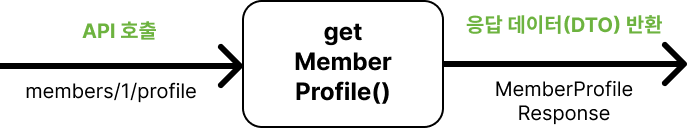
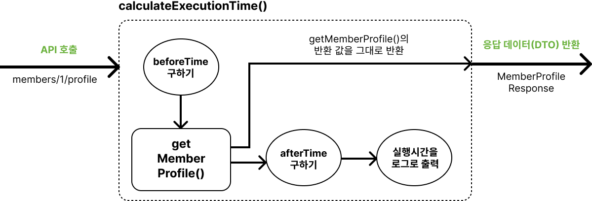
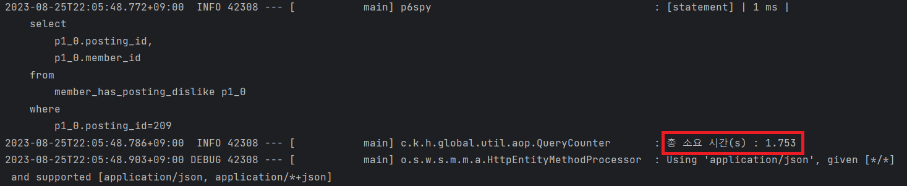
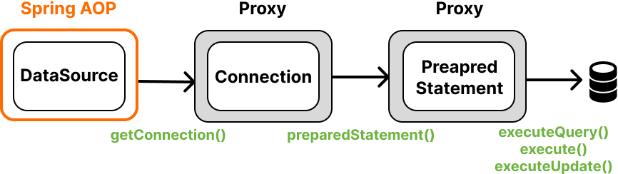
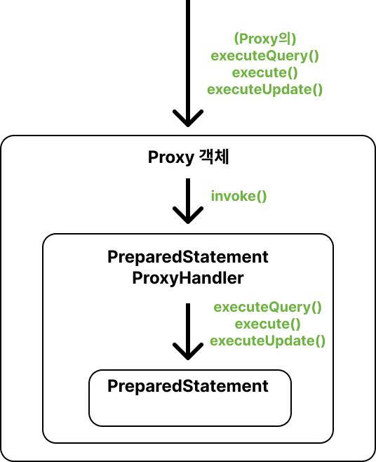
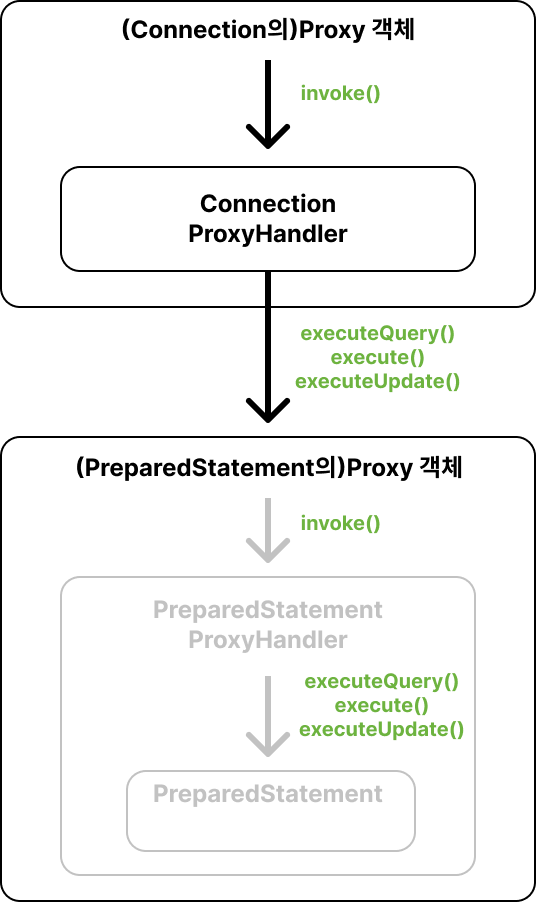
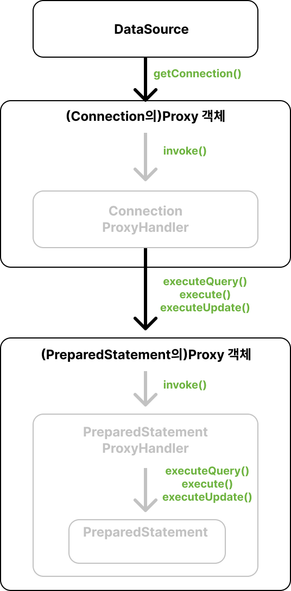
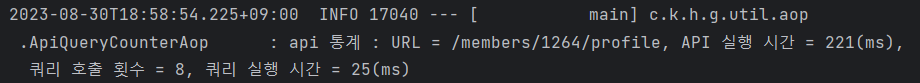

## 들어가며

---

JPA를 사용하다 보면 [N+1 문제](https://amaran-th.github.io/Spring/[JPA]%20%EB%8B%A4%EB%8C%80%EB%8B%A4%20%EA%B4%80%EA%B3%84%EC%97%90%EC%84%9C%20FetchJoin%EC%9C%BC%EB%A1%9C%20N+1%20%EB%AC%B8%EC%A0%9C%20%ED%95%B4%EA%B2%B0%ED%95%98%EA%B8%B0/)와 같이 예상보다 많은 개수의 쿼리가 실행되는 경우가 있다.

이런 문제가 발생하는지를 확인하려면 `show_sql` 기능을 켜서 쿼리 로그를 확인해 쿼리의 개수를 일일이 세어줘야 하는데, 이는 꽤 아날로그적인 방식이기 때문에 좀 더 편리하게 확인할 수 있는 방법이 있으면 좋겠다는 생각을 했었다.

마침 우테코에서 같은 프로젝트를 한 팀원 분께서 이번에 AOP를 활용해 쿼리 실행 횟수를 측정하고 그 결과를 로그로 출력하는 N+1 Detector를 만들어서 프로젝트에 적용하셨는데, 굉장히 유용한 기능인 것 같아 키퍼 홈페이지에도 적용하면 좋겠다는 생각이 들었다.

AOP에 대해 공부해볼 겸 키퍼 백엔드 팀이 좀 더 편리하게 성능 개선을 할 수 있도록 쿼리 카운터 & 실행 시간 측정기를 만들어보게 되었다.

## 아이디어

---

핵심적인 아이디어는 다음과 같다.

“**한 API 내에서 쿼리가 실행될 때마다 카운팅을 해서 API 요청이 종료되는 시점에 총 쿼리 실행 횟수와 실행 시간을 로그로 출력한다.”**

이 기능을 구현하기 위한 조건은 다음의 2가지였다.

1. **쿼리가 실행되는 시점에 query count 값을 증가시키는 메서드를 호출할 수 있어야 한다.**
2. **query count를 관리하는 객체의 생명주기가 API(=HTTP request)와 일치해야 한다.**

2번 조건은 스프링의 @RequestScope를 사용해 HTTP request 생명주기를 가지는 빈을 만들어 사용하는 것으로 충족시킬 수 있다.

1번 조건은 2가지 방법으로 충족 시킬 수 있는데, 하나는 하이버네이트에서 제공하는 StatementInspector를 사용하는 것이고, 하나는 AOP를 활용하는 것이다. 전자의 경우 하이버네이트에 의존해야 한다는 단점이 있기 때문에 후자의 방식으로 구현하는 것을 선택했다.

## 구현 과정

---

나는 AOP를 이용해 다음의 3가지 정보를 로그로 출력하려 한다.

1. API의 경로(URI)
2. API를 호출하고 요청이 종료되기까지 걸린 소요 시간
3. API를 호출하고 쿼리가 실행된 횟수
4. API를 호출한 뒤 소요된 쿼리의 실행 시간 총합

그리고 이 결과를 API 정보와 함께 로그 파일로 남기려고 한다.

제일 먼저 가닥을 잡기 위해 1번 요구사항부터 구현을 해보겠다.

### 1. API 요청 처리 소요 시간 계산하기

이전에 AOP를 공부하면서 비슷한 로직을 구현한 적이 있다.

[https://amaran-th.github.io/Spring/[Spring] AOP/](https://amaran-th.github.io/Spring/%5BSpring%5D%20AOP/)

```java
@Aspect
@Component
@Slf4j
public class ApiQueryCounterAop {

  @Around("within(@org.springframework.web.bind.annotation.RestController *)")    // (1)
  public Object calculateExecutionTime(final ProceedingJoinPoint joinPoint) throws Throwable {
    final Long beforeTime = System.currentTimeMillis();    // (2)

    Object result=joinPoint.proceed();    // (3)

    final Long afterTime = System.currentTimeMillis();    // (4)
    final Double secDiffTime = ((double) (afterTime - beforeTime) / 1000);     // (5)

    log.info("총 소요 시간(s) : {}", secDiffTime);    // (6)
    return result;    // (7)
  }
}
```

(1) Advice와 Pointcut을 통해 JoinPoint를 RestController 어노테이션을 포함하고 있는 메서드로 지정해주어 API 호출 전/후에 실행할 작업을 지정할 수 있게 하였다.

`@Around`는 메서드의 호출 전/후 작업을 명시할 수 있는 Advice이다.

(2) JoinPoint의 메서드가 실행되기 전 시간을 측정한다.

(3) JoinPoint의 메서드 실행하고 그 반환값을 저장한다.

(4) JoinPoint의 메서드가 실행된 후 시간을 측정한다.

(5) JoinPoint가 실행된 전/후의 시간 차를 계산해 API 요청을 처리하는 데 걸린 시간을 얻는다.

(6) API 실행 시간을 로그로 출력한다.

(7) `@Around`는 반환값을 통해 메서드의 반환값을 조작할 수 있는데, 여기서는 메서드의 반환값을 그대로 반환하도록 하였다.

- **AOP 적용 전**
  
- **AOP 적용 후**
  

실행 결과 콘솔 로그로 실행 시간이 잘 출력되는 것을 확인할 수 있다.



### 2. API당 쿼리 실행 횟수 측정

이제 총 실행시간 외에 실행된 API의 uri 경로, 실행된 쿼리 개수, 쿼리 실행 시간을 구해보려고 한다.

데이터가 여러 개이기 때문에, 앞의 4개의 데이터를 필드로 가지고 있는 클래스 객체를 만들어보자.

```java
@Component
@RequestScope
@Getter
@ToString
public class ApiStatistic {

  private String apiUrl;
  private Long totalTime = 0L;
  private Long queryCounts = 0L;
  private Long queryTime = 0L;

  public void queryCountUp() {
    queryCounts++;
  }

  public void addQueryTime(final Long queryTime) {
    this.queryTime += queryTime;
  }

  public void updateApiUrl(final String apiUrl) {
    this.apiUrl = apiUrl;
  }

  public void updateTotalTime(final Long totalTime) {
    this.totalTime = totalTime;
  }
}
```

이 ApiStatistic 클래스는 자바 빈으로 등록되어 있기 때문에 Aop 클래스의 필드로 주입시켜줄 수 있다. 또한 @RequestScope 어노테이션을 사용해 빈의 생명 주기를 HTTP request 생명주기와 동일하게 만들었기 때문에, Http 요청이 들어올 때마다 새로운 객체로 생성될 것이다.

이제 이 클래스의 메서드가 적절한 시점에 실행되도록 해야 하는데, 쿼리 실행 횟수를 측정하기 위해서는 쿼리가 실행되는 시점을 가져올 수 있어야 한다.

**쿼리는 언제, 어디서 실행이 될까?**

기본적으로 자바에서 쿼리를 실행하려면, 다음과 같은 과정이 필요하다.

1. Connection 객체를 가져온다.
2. PrepareStatement 객체를 얻는다.
3. **PrepareStatement 객체의 `executeQuery()`, `execute()`, `executeUpdate()` 메서드를 호출한다.**

```java
public void insertGame(final Connection connection) {
    final String query = "INSERT INTO game VALUES();";
    try (final var preparedStatement = connection.prepareStatement(query)) {
        preparedStatement.executeUpdate();
    } catch (final SQLException e) {
        throw new IllegalStateException("게임을 저장하는 데 실패하였습니다.");
    }
}
```

이 중 3번째 단계에서 쿼리가 실행되므로, 해당 시점을 가로채면 될 것이다.

**하지만** AOP를 적용하기 위해서는 가로채려는 메서드가 정의된 클래스가 스프링 빈으로 등록되어 있어야 하는데, 안타깝게도 PreparedStatement는 스프링 빈으로 등록되어 있지 않은 인터페이스이다.

PreparedStatement 객체를 생성하는 Connection도 마찬가지이다.

Connection을 가져오는 DataSource 인터페이스는 스프링 빈으로 등록되어 있기 때문에, 우리는 DataSource 객체의 getConnection() 메서드에 AOP를 적용해야 한다.

<aside>

💡 **DataSource**

---

자바가 제공하는 표준 인터페이스(javax,sql.DataSource)로, **커넥션을 획득하는 방법을 추상화 한 것이다.**


```java
public interface DataSource {
 Connection getConnection() throws SQLException;
}
```

</aside>

Connection, PreparedStatement 프록시 객체를 만들어 각 프록시에서 `preparedStatement()`, `executeQuery()`/`execute()`/`executeUpdate()`가 호출되는 시점에 원하는 로직이 실행되도록 구현하면 된다.



먼저 가장 안쪽에 있는 프록시 객체 PreparedStatementProxyHandler를 만들어보자.

### PreparedStatementProxyHandler

```java
@Slf4j
@RequiredArgsConstructor
public class PreparedStatementProxyHandler implements
    InvocationHandler {    // (1)

  private static final List<String> JDBC_QUERY_METHOD =
      List.of("executeQuery", "execute", "executeUpdate");

  private final Object preparedStatement;
  private final ApiStatistic apiStatistic;    // (2)

  @Override
  public Object invoke(final Object proxy, final Method method, final Object[] args)
      throws Throwable {
    if (isExecuteQuery(method)) {   // (3)
      final Long beforeTime = System.currentTimeMillis();
      final Object result = method.invoke(preparedStatement, args);
      final Long afterTime = System.currentTimeMillis();
      apiStatistic.queryCountUp();    // (4)
      apiStatistic.addQueryTime(afterTime - beforeTime);    //(5)

      return result;    // (6)
    }
    return method.invoke(preparedStatement, args);    // (3-1)
  }

  private boolean isExecuteQuery(final Method method) {
    return JDBC_QUERY_METHOD.contains(method.getName());
  }
}
```

이 프록시는 `executeQuery()`/`execute()`/`executeUpdate()` 메서드가 호출될 때, ApiStatistic 객체의 queryCount를 1 증가시키고 QueryTime(쿼리 실행 시간)을 더해 업데이트한다.

위에서부터 차근차근 설명해보겠다.

(1) PreparedStatementProxyHandler가 구현하고 있는 **InvocationHandler**인터페이스는 invoke()라는 메소드를 가지고 있다.

invoke()는 동적 프록시의 어떤 메소드가 호출되었을 때 호출되는 메소드로, 여기서 특정 메서드에 대해 확장된 기능을 구현할 수 있다.

첫 번째 인자인 proxy는 프록시 객체이고, 두 번째 인자인 method는 클라이언트가 호출한 메서드 객체이며, 세 번째 인자인 args는 클라이언트가 메서드에 전달한 인자(들)이다.

AOP의 @Around가 붙은 메서드와 비슷한 메커니즘으로 동작한다고 생각하면 된다.



(2) 상위 클래스로부터 넘겨받을 ApiStatistic 객체이다. 이 객체는 한 요청이 종료될 때까지 공유된다.

(3) 호출된 메소드가 `executeQuery()`, `execute()`, `executeUpdate()` 중에 해당되는지를 확인한다.

(3-1) 해당되지 않을 경우 원래 메서드를 실행하고 결과를 그대로 반환한다.

(4) ApiStatistic의 queryCounts 값을 1 증가시킨다.(쿼리 개수 카운트)

(5) ApiStatistic의 queryTime 값에 타겟 메서드(`executeQuery()`, `execute()`, `executeUpdate()`)를 실행하는 데 걸린 시간을 업데이트한다.

(6) 타겟 메서드의 반환 결과를 그대로 반환한다.

### ConnectionProxyHandler

```java
@RequiredArgsConstructor
public class ConnectionProxyHandler implements InvocationHandler {

  private static final String JDBC_PREPARE_STATEMENT_METHOD_NAME = "prepareStatement";

  private final Object connection;
  private final ApiStatistic apiStatistic;

  @Override
  public Object invoke(final Object proxy, final Method method, final Object[] args)
      throws Throwable {
    Object invokeResult = method.invoke(connection, args);
    if (isGeneratePrepareStatement(method)) {    // (1)
      return Proxy.newProxyInstance(
          invokeResult.getClass().getClassLoader(),
          invokeResult.getClass().getInterfaces(),
          new PreparedStatementProxyHandler(invokeResult, apiStatistic)
      );    //(2)
    }
    return invokeResult;    // (3)
  }

  private boolean isGeneratePrepareStatement(final Method method) {
    return JDBC_PREPARE_STATEMENT_METHOD_NAME.equals(method.getName());
  }
}
```

앞에서 InvocationHandler를 만들기만 했지, 실제로 사용되는 곳은 없다. ConnectionProxyHandler에서 PreparedStatement의 Proxy 객체를 만들어줄 것이다.

PreparedStatementProxyHandler와 비슷하게 prepareStatement 메서드에 분기 처리를 해주면 된다.

(1) 호출된 메서드가 `prepareStatement()`인지 여부에 따라 분기처리를 한다.

(2) `prepareStatement()`가 호출된 경우, 프록시 객체를 반환한다.

(3) `prepareStatement()` 외의 메서드가 호출된 경우, 기존의 PreparedStatement 객체를 반환한다.



### ApiStatisticAop

이 ConnectionProxyHandler 역시 사용되고 있지 않으므로, 이 핸들러가 동작할 수 있는 Connection의 다이나믹 프록시를 만들어주어야 한다. 이 작업은 DataSource에서 getConnection이 호출될 때 수행될 것이다.

<aside>

⚠️ 기존 ApiQueryCounterAop로 설정해준 이름을 좀 더 포괄적인 의미를 가질 수 있도록 ApiStatisticAop로 변경했다.

</aside>

```java
@Aspect
@Component
@Slf4j
@RequiredArgsConstructor
public class ApiStatisticAop {

  private final ApiStatistic apiStatistic;    // (1)

  @Around("execution(* javax.sql.DataSource.getConnection())")    // (2)
  public Object getConnection(ProceedingJoinPoint joinPoint) throws Throwable {
    Object connection = joinPoint.proceed();
    return Proxy.newProxyInstance(    // (3)
        connection.getClass().getClassLoader(),
        connection.getClass().getInterfaces(),
        new ConnectionProxyHandler(connection, apiStatistic)
    );
  }

  @Around("within(@org.springframework.web.bind.annotation.RestController *)")    // (4)
  public Object calculateExecutionTime(final ProceedingJoinPoint joinPoint) throws Throwable {
    ServletRequestAttributes attributes =
        (ServletRequestAttributes) RequestContextHolder.getRequestAttributes();
    if (isInRequestScope(attributes)) {    // (5)
      apiStatistic.updateApiUrl(attributes.getRequest().getRequestURI());    // (6)
    }

    final Long beforeTime = System.currentTimeMillis();

    Object result = joinPoint.proceed();

    final Long afterTime = System.currentTimeMillis();
    apiStatistic.updateTotalTime(afterTime - beforeTime);    // (7)
    log.info("api 통계 : URL = {}, API 실행 시간 = {}(ms), 쿼리 호출 횟수 = {}번, 쿼리 실행 시간 = {}(ms)",
        apiStatistic.getApiUrl(), apiStatistic.getTotalTime(), apiStatistic.getQueryCounts(),
        apiStatistic.getQueryTime());    // (8)
    return result;
  }

  private boolean isInRequestScope(final ServletRequestAttributes attributes) {
    return Objects.nonNull(attributes);
  }
}
```

(1) Spring Context로부터 ApiStatistic 객체를 필드 값으로 주입 받는다.

(2) Spring Bean으로 등록되어 있는 DataSource의 메서드가 호출되는 시점을 @Around로 가져온다.

(3) ConnectionProxyHandler를 사용해 Connection의 프록시 객체를 만들어 반환한다.

(4) RestController의 메서드(=API 메서드)가 호출되는 시점을 @Around로 가져온다.

(5) 이 요청이 API 요청 내에서 이루어지고 있는지 확인한다.

(6) API 경로를 가져와 apiStatistic 객체의 apiUrl으로 설정한다.

(7) 메서드의 실행 시간을 apiStatistic 객체의 totalTime으로 설정한다.

(8) 지금까지 수집된 결과를 로그로 출력한다.



### 결과



원하던 대로 API의 경로, 실행 시간, 쿼리 실행 횟수 등이 출력된 것을 확인할 수 있다.

쿼리 횟수를 직접 세 보니 8개가 맞았다!

## 참고 자료

---

[https://amaran-th.github.io/Spring/[Spring] AOP/](https://amaran-th.github.io/Spring/%5BSpring%5D%20AOP/)

[자바를 통해 다이나믹 프록시(Dynamic Proxy)를 구현하는 방법](https://live-everyday.tistory.com/217)

https://c-king.tistory.com/entry/N1-detector-만들어보기

[API의 쿼리 개수 세기 - (2) JDBC, Spring AOP, Dynamic Proxy를 활용한 카운팅](https://velog.io/@ohzzi/API의-쿼리-개수-세기-2-JDBC-Spring-AOP-Dynamic-Proxy를-활용한-카운팅)
