## HTTP 최적화

---

웹사이트 성능을 높이기 위한 기술

- HTTP 압축
- 다양한 리소스 최적화 기법(이미지, JS, CSS 등)
- HTTP 캐싱

### HTTP 압축

- HTTP로 주고받는 텍스트 기반 리소스(html, css, js, json 등)을 압축할 수 있다.
- 웹 개발자가 압축 메커니즘을 구현할 필요는 없고, 보통은 서버(tomcat, nginx)에 구현되어 있다.
    - Tomcat은 gzip을 지원
- 특정 content type에 대해서만 제공되는 기능⇒공식문서 참조

[Compression in HTTP - HTTP | MDN](https://developer.mozilla.org/en-US/docs/Web/HTTP/Compression)

[Spring Boot Reference Documentation](https://docs.spring.io/spring-boot/docs/current/reference/htmlsingle/#howto.webserver.enable-response-compression)

### 리소스 최적화

- 이미지 압축
- javascript, css minify
- 이미지, javascript, css 지연 로딩
- Javascript와 css 파일을 하나의 파일로 통합
- HTML에서 CSS는 <head> 태그에 위치시키고, Javascript는 </body> 태그 앞에 위치시키기
- data URI를 활용하기
    
    `data:[<mediatype>][;base64],<data>`
    
    ex) 
    
    ```html
    
    ```
    

## HTTP 캐싱

---

HTTP 캐시란?

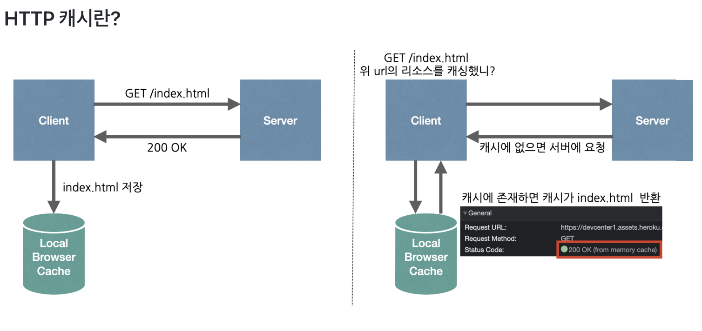

- 캐시를 사용하는 이유 - 리소스를 불러오는 속도(성능)를 향상시키기 위해
- HTTP 캐시가 위치하는 곳
    
    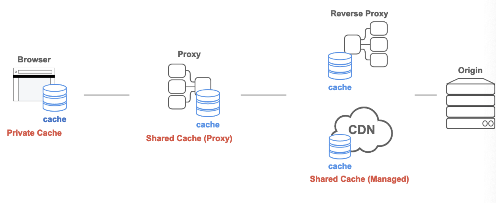
    
    캐시는 브라우저의 private Cache로 존재할 수도 있고, 프록시 서버의 Shared Cache로 존재할 수도 있다.
    
- 캐시의 동작 원리
    
    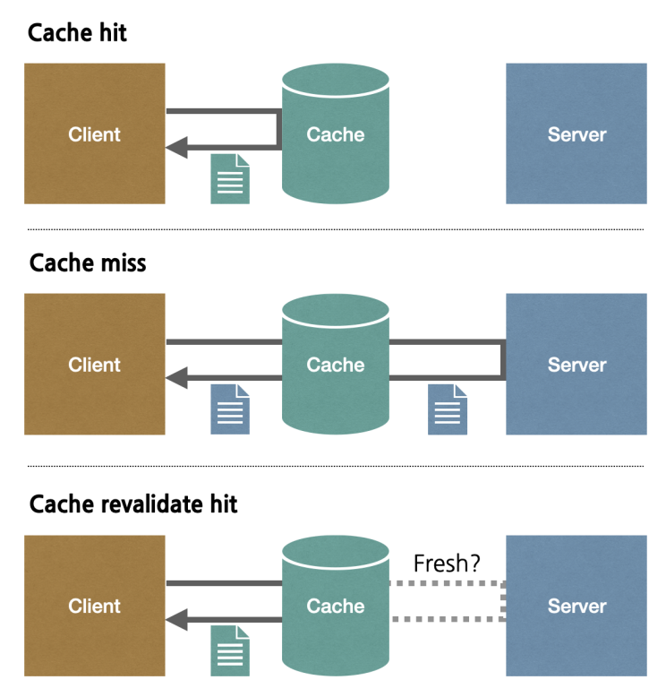
    
    - hit : 캐시에 클라이언트가 요청한 데이터가 있는 경우, 서버를 거치지 않고 캐시에 존재하는 데이터를 클라이언트에게 반환한다.
    - miss: 캐시에 클라이언트가 요청한 데이터가 없는 경우 서버로부터 데이터를 가져와 클라이언트에게 반환한다. 이 데이터는 캐시에 저장된다.
    - revalidation(재검사): 캐시한 사본이 최신의 것인지 서버에 다시 검사를 요청하는 것
        
        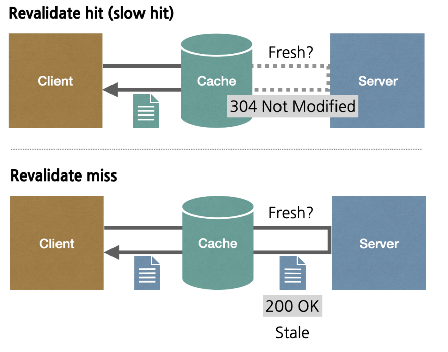
        
        캐시는 서버에 주기적으로 revalidate 요청을 보낸다.
        
        캐시의 데이터가 만약 최신의 것이라면 서버는 304 상태코드를 반환하고 클라이언트는 캐시에 존재하는 데이터를 반환받는다.
        
        캐시의 데이터가 최신의 것이 아니라면 서버는 200 상태코드와 함께 최신 데이터를 반환하고, 캐시에 다시 저장되며 클라이언트는 새로 업데이트된 데이터를 반환받는다.
        
- HTTP 캐시 적용하기
    - HTTP 응답 헤더에 `Cache-Control` 헤더를 명시함으로써 웹 요청/응답에 캐시를 적용할 수 있다.
        
        <aside>

        💡 `Cache-Control` 헤더의 파라미터 종류
        
        ---
        
        - max-age: 캐시 유효시간(초 단위)
        - no-cache: 데이터는 캐시하지만, 항상 Origin Server에 검증을 하고 사용한다.
        - no-store: 캐시에 저장하지 않거나 최대한 빨리 삭제한다.
        - public: 프록시 캐시 서버에 캐시를 저장할 수 있다.
        - private: 프록시 캐시 서버에 캐시를 저장할 수 없다.(브라우저에 캐싱됨)
        - s-maxage: 프록시 캐시 서버에 적용되는 max-age
        - Age: Origin Server의 응답이 프록시 캐시 서버에 머문 시간(초 단위)
        - must-revalidate: 캐시 만료 후 최초 조회 시 Origin Server에 검증한다.
        </aside>
        
    - `Cache-Control` 또는 `Expires` 헤더를 명시하지 않을 경우, 휴리스틱 캐싱(Heuristic caching)이 자동으로 적용된다.
        - 휴리스틱 캐싱 : 경험적으로 만료 일자를 정하는 캐싱 방법으로, 클라이언트(브라우저)가 임의로 캐시를 조절한다.
            - 휴리스틱 캐싱의 경우, 서버에서 해당 캐시를 제거할 수 없기 때문에 클라이언트가 서버에서 최신 데이터를 받아올 수 있는 방법이 없다.

### 캐시 만료 기간

- 유효 기간
    - `Cache-Control: max-age=604800`
    - `Expires: Fri, 05, Jul 2002, 05:00:00 GMT`
    
    현재는 `Expires`보다 `Cache-Control`의 max-age를 사용하는 것이 더 권장된다.
    
- 조건부 요청(coditional request)
    - `If-Modified-Since`/`Last-Modified`(날짜 재검사)
    - `If-None-Match`/`ETag`(엔티티 태그 재검사)
- 강제 재검사(force revalidation)

### If-Modified-Since 헤더

: Last-Modified를 비교해서 유효성 검증을 한다. 

- 이 때 Last-Modified는 초 단위로 헤더에 저장되기 때문에, 간발의 차이로 서버의 최신 데이터를 받아오지 못하는 경우가 생길 수 있다.

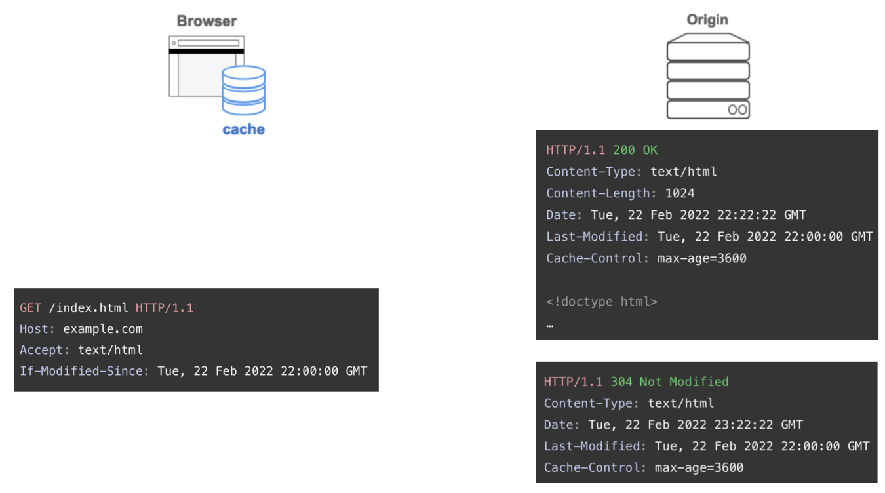

### If-None-Match 헤더

: ETag를 비교해서 유효성 검증을 한다.

`Etag` 헤더는 해시 값을 저장하기 때문에 `If-Modified-Since`와 달리 나노초와 같은 더 미세한 간격까지 처리할 수 있다.

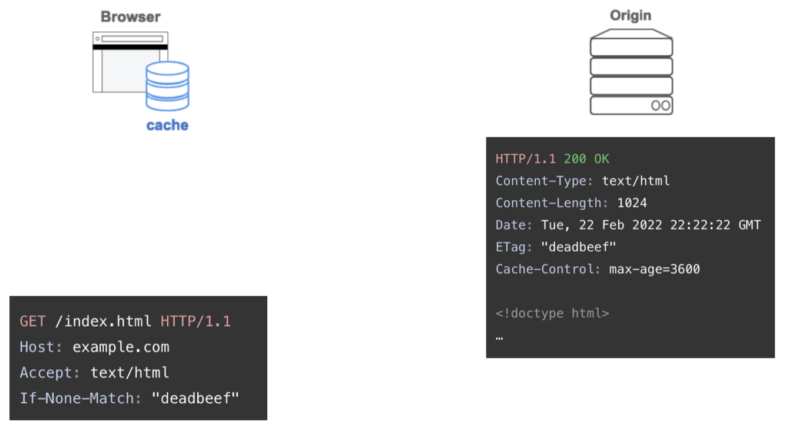

- `Last-Modified`와 `ETag`를 함께 사용하면, 재검증에는 ETag를 사용하고 Last-Modified는 캐싱 외에 크롤러에게 마지막 수정시간을 알려줄 수 있어 크롤링 빈도를 조정할 수 있다.
    
    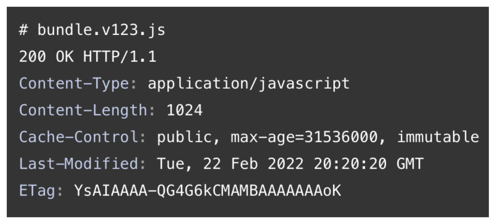
    

### Force Revalidation 헤더

`Cache-Control: no-cache` - 캐시를 사용하지만 항상 서버에 재검증 요청을 보낸다.

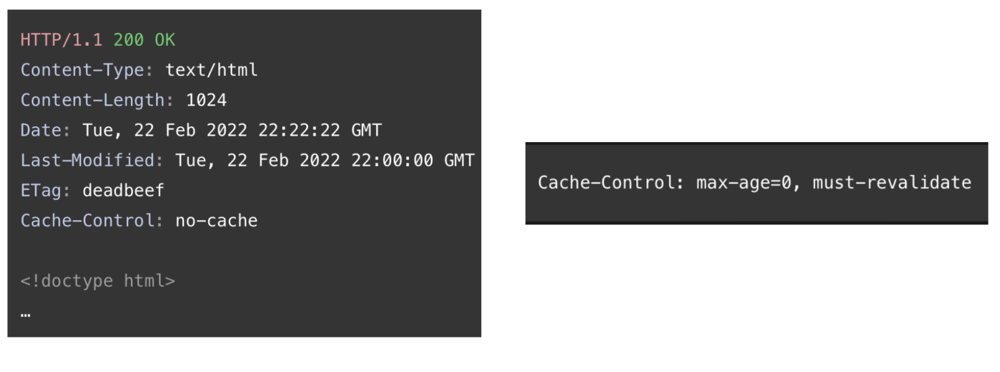

### 일반적인 캐싱 패턴

- 기본 캐시 설정
    - HTTP 응답 헤더에 Cache-Control이 없어도 웹 브라우저가 휴리스틱 캐싱에 따른 암시적 캐싱을 한다.
    - 의도하지 않은 캐싱을 막기 위해 모든 응답의 헤더에 다음 속성을 명시한다.
        
        `Cache-Control: no-cache`
        
    - 쿠키, 사용자 개인정보 유출을 막기 위해 private 속성도 추가한다.
        
        `Cache-Control: no-cache, private`
        
        private 속성은 중간 서버에서 캐싱하지 않고 오로지 웹 브라우저에서만 캐싱할 수 있도록 설정한다.
        
        *서버 응답에 authorization 헤더가 있을 경우 private Cache에 저장되지 않는다.
        
    
- 캐시 무효화(Cache Busting)
    
    : 브라우저가 캐시에서 이전 파일을 검색하지 않고 서버에 새 파일을 요청하도록 하는 것.
    
    ⇒컨텐츠가 변경될 때 URL을 변경하여 정적 리소스를 장기간 캐시하도록 만드는 기술
    
    js, css와 같은 정적 파일은 캐시 유효기간이 1년으로 설정된다. 캐시는 url별로 관리되기 때문에, url이 바뀌지 않는 이상 브라우저는 서버에 요청을 보내지 않는다.
    
    그래서 js, css 파일이 수정될 경우 서버에서는 해당 js, css 자원 요청 url에 버저닝을 더해준다.
    
    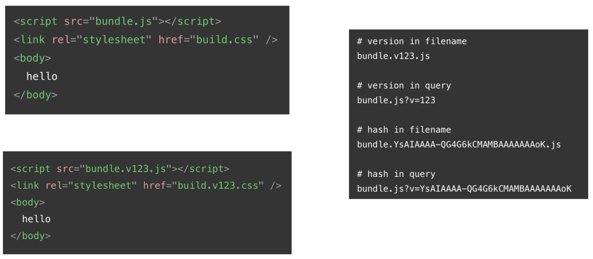
    
    Main resources를 no-cache, private으로 관리하게 설정해서 클라이언트가 main resources(html 파일)에 대해 항상 재검증 요청을 보내게 하면, html 파일에 태그되어 있는 새로운 버전의 정적 파일을 캐싱하게 되어 캐시를 효율적으로 관리할 수 있다.
    
    <aside>
    
    💡 CDN을 사용할 경우, `Cache-Control` 속성을 public으로 설정해서 기존에 서버가 받던 재검증 요청을 CDN이 받도록 설정할 수 있다. s-maxage 값(=프록시 캐시 서버에 적용되는 캐시 유효 시간)을 설정해서 재검증 요청 주기를 설정할 수 있다.
    
    </aside>
    

## Spring 코드로 HTTP 최적화 설정하기

---

### Cache-Control 설정 방법

Config 파일을 설정해주면 된다.

```java
@Configuration
public class CacheWebConfig implements WebMvcConfigurer {

    @Override
    public void addInterceptors(final InterceptorRegistry registry) {
        WebContentInterceptor interceptor = new WebContentInterceptor();
        interceptor.addCacheMapping(CacheControl.noCache().cachePrivate(), "/*");
        registry.addInterceptor(interceptor);
    }
}
```

### HTTP Compression 설정하기

- Spring에서 HTTP 응답 압축을 활성화하는 방법
    - application.yml
        
        ```yaml
        server:
        	compression:
        		enabled: true
        ```
        
        이렇게 하면 기본적으로 gzip 압축 알고리즘이 HTTP 응답 데이터에 적용된다.
        
        - 적용 전
        
        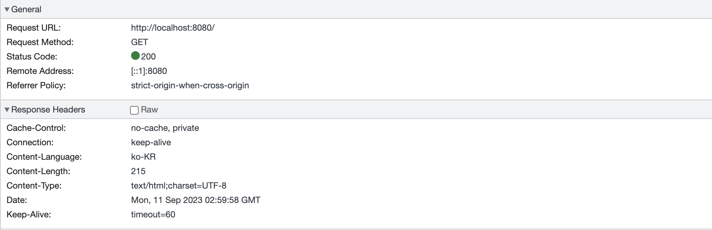
        
        - 적용 후
        
        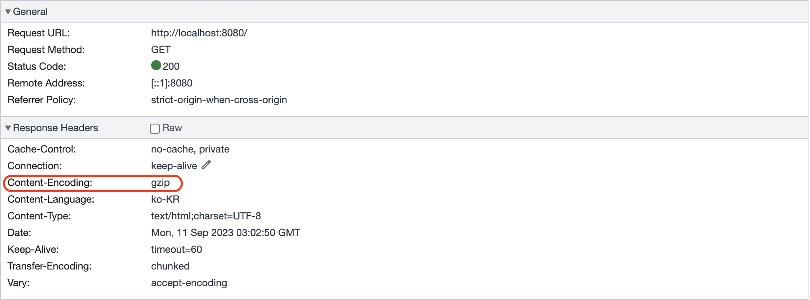
        
- 압축 최소 크기 설정
    
    : 기본적으로 압축을 수행하려면 응답의 길이가 2048 Byte 이상이어야 하는데, 작은 크기의 html도 압축되게 하고 싶을 경우 `server.compression.min-response-size` 값을 설정해주면 된다.
    
    - application.yml
        
        ```yaml
        server:
        	compression:
        		min-response-size: 10
        ```
        

### If-None-Match/ETag 적용하기

ETag를 사용하기 위해서는 ShallowEtagHeaderFilter를 사용하면 된다.

- Config 파일 작성
    
    : FilterRegistrationBean을 사용해 ShallowEtagHeaderFilter를 빈으로 등록한다.
    
    ```java
    @Configuration
    public class EtagFilterConfiguration {
    
        @Bean
        public FilterRegistrationBean<ShallowEtagHeaderFilter> shallowEtagHeaderFilter() {
            final FilterRegistrationBean<ShallowEtagHeaderFilter> registration = new FilterRegistrationBean<>();
            registration.setFilter(new ShallowEtagHeaderFilter());
            registration.addUrlPatterns("/etag");
            return registration;
        }
    }
    ```
    
    이렇게 해주면 addUrlPatterns() 메서드에 파라미터로 넣어준 url 패턴에 부합하는 요청에 대해 eTag가 붙게 된다.
    
    
    

### 캐시 무효화(Cache Busting)

정적 리소스 파일 요청에 ETag를 설정하고, max-age를 최대치(1년)으로 설정해보자.

JS, CSS 리소스에 변경사항이 생기면 캐시가 제거되도록 url에 버전을 적용한다.

- Config 파일
    - 캐시 정책 적용(max-age)
        
        ```java
        @Configuration
        public class CacheBustingWebConfig implements WebMvcConfigurer {
        
            public static final String PREFIX_STATIC_RESOURCES = "/resources";
        
            private final ResourceVersion version;
        
            @Autowired
            public CacheBustingWebConfig(ResourceVersion version) {
                this.version = version;
            }
        
            @Override
            public void addResourceHandlers(final ResourceHandlerRegistry registry) {
                registry.addResourceHandler(PREFIX_STATIC_RESOURCES + "/" + version.getVersion() + "/**")
                        .addResourceLocations("classpath:/static/")
                        .setCacheControl(CacheControl.maxAge(Duration.ofDays(365)).cachePublic());
            }
        }
        ```
        
        ResourceHandlerRegistry는 리소스를 등록하고 핸들러를 관리하는 객체로, addResourceHandler() 메서드는 리소스의 위치와 리소스와 매칭될 url을 등록한다.
        
        즉 `/resources/{버전}/**`로 접근하는 경우 `/resources/static` 경로와 매칭되게 한 것이다.
        
        그리고 setCacheControl() 메서드를 통해 요청받은 리소스의 캐시 유효기간을 1년으로 설정한다.
        
    - 인터셉터에 설정해준 no-cache 설정을 제거한다.
        
        ```java
        @Configuration
        public class CacheWebConfig implements WebMvcConfigurer {
            private final ResourceVersion version;
        
            public CacheWebConfig(final ResourceVersion version) {
                this.version = version;
            }
            @Override
            public void addInterceptors(final InterceptorRegistry registry) {
                WebContentInterceptor interceptor = new WebContentInterceptor();
                interceptor.addCacheMapping(CacheControl.noCache().cachePrivate(), "/*");
                registry.addInterceptor(interceptor)
                        .excludePathPatterns(PREFIX_STATIC_RESOURCES + "/" + version.getVersion() + "/**");
            }
        }
        ```
        
        앞서 모든 요청에 대해 항상 캐시 검증 요청을 보내도록 설정해주었기 때문에(no-cache), 버저닝이 포함된 url은 해당 설정에서 제외하도록 한다.
        
    - 정적 리소스 파일 요청에 대해 ETag를 설정한다.
        
        ```java
        @Configuration
        public class EtagFilterConfiguration {
        
            private final ResourceVersion version;
        
            public EtagFilterConfiguration(final ResourceVersion version) {
                this.version = version;
            }
        
            @Bean
            public FilterRegistrationBean<ShallowEtagHeaderFilter> shallowEtagHeaderFilter() {
                final FilterRegistrationBean<ShallowEtagHeaderFilter> registration = new FilterRegistrationBean<>();
                registration.setFilter(new ShallowEtagHeaderFilter());
                registration.addUrlPatterns("/etag", PREFIX_STATIC_RESOURCES + "/" + version.getVersion() + "/*");
                return registration;
            }
        }
        ```
        

## 참고 자료

---

우테코 구구 코치의 강의 자료

[🌐 웹 브라우저의 Cache 전략 & 헤더 다루기](https://inpa.tistory.com/entry/HTTP-🌐-웹-브라우저의-캐시-전략-Cache-Headers-다루기#cache-control_헤더)

[HTTP Cache](https://velog.io/@0_0_yoon/HTTP-Cache)

[spring boot 에서 etag 설정하기](https://jo5ham.tistory.com/34)

[스프링부트 캐시 정책 적용하기](https://dev-monkey-dugi.tistory.com/50)

[[Spring Boot #14] 스프링 웹 MVC : 정적 리소스 지원](https://engkimbs.tistory.com/772)