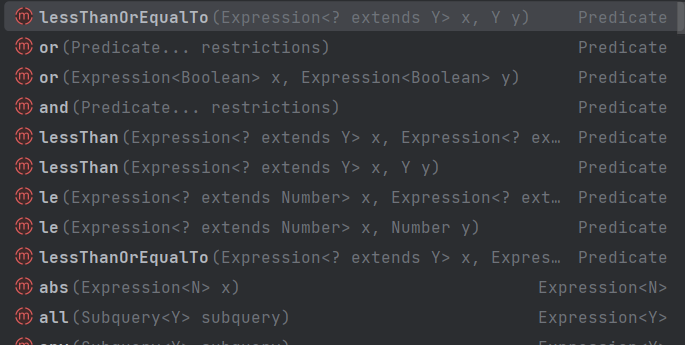

## 서론

---

나는 Kerdy 프로젝트에서 행사 목록을 조회하는 API를 맡았는데, 여기엔 행사를 특정 기준에 따라 필터링하는 작업도 포함되어 있다.

팀원들에게 코드 리뷰를 받는 과정에서 table에서 모든 엔티티를 불러온 뒤 자바 코드로 필터링을 하기보다 동적 쿼리로 필터링된 엔티티만 불러오는 것은 어떻겠냐는 코멘트를 받았다.

그래서 존재만 알고 있던 Specification이라는 친구를 활용해서 동적 쿼리를 만들어보았고, 그 과정을 정리해보았다.

### API 기능 소개

Kerdy의 행사 목록에서 필터링을 하는 기준은 다음의 4가지가 있다.

- **category** : 행사의 유형. 컨퍼런스(CONFERENCE)와 대회(COMPETITION)가 있다.(필수)
- **tags** : 행사의 태그. 행사와 태그는 다대다 관계이기 때문에 중간 테이블인 event_tag로 매핑되어 있으며, 필터링 시 복수 선택이 가능하다.(옵션)
- **start_date&end_date** : 필터링하려는 기간으로 시작일과 끝일을 지정해줄 수 있다. 지정해준 기간과 행사의 기간이 겹치는 경우 필터링 조건에 부합한다.(옵션)
- **statuses** : 행사의 진행 상황. 진행 예정(UPCOMING), 진행 중(IN_PROGRESS), 마감(ENDED) 세 종류가 있으며, 복수 선택이 가능하다.(옵션)

### 코드 소개

기존 코드는 다음과 같았다.

```java
	@Transactional(readOnly = true)
  public List<EventResponse> findEvents(final EventType category, final LocalDate nowDate,
final String startDate, final String endDate,
      final List<String> tagNames, final List<EventStatus> statuses) {
    List<Event> events = eventRepository.findEventsByType(category);

    if (isExistTagNames(tagNames)) {
      events = filterByTags(events, tagNames);
    }
    if (isExistFilterDate(startDate, endDate)) {
events = filterByPeriod(events, startDate, endDate);
    }
    final EnumMap<EventStatus, List<Event>> eventsForEventStatus
        = groupByEventStatus(nowDate, events);

    return filterByStatuses(nowDate, statuses, eventsForEventStatus);
  }

  private boolean isExistTagNames(final List<String> tagNames) {
    return tagNames != null;
  }

  private List<Event> filterByTags(final List<Event> events, final List<String> tagNames) {
    final List<Tag> tags = tagRepository.findByNameIn(tagNames);
    validateTags(tagNames, tags);

    return events.stream()
        .filter(event -> event.getTags()
            .stream()
            .map(EventTag::getTag)
            .anyMatch(tags::contains)
        )
        .collect(toList());
  }

  private void validateTags(final List<String> tagNames, final List<Tag> tags) {
    if (tags.size() != tagNames.size()) {
      throw new TagException(NOT_FOUND_TAG);
    }
  }

  private boolean isExistFilterDate(final String startDate, final String endDate) {
    return startDate != null || endDate != null;
  }

  private List<Event> filterByPeriod(final List<Event> events, final String startDate,
      final String endDate) {
    LocalDate filterStart = validateStartDate(startDate);
    LocalDate filterEnd = validateEndDate(endDate);
    validateEndDateAfterDateStart(filterStart, filterEnd);

    return events.stream()
        .filter(event -> isOverlapToMonth(filterStart, filterEnd,
            event.getStartDate().toLocalDate(), event.getEndDate().toLocalDate())
        )
        .collect(toList());
  }

  private LocalDate validateStartDate(final String date) {
    try {
      if (date == null) {
        return LocalDate.MIN;
      }
      return LocalDate.parse(date);
    } catch (DateTimeParseException exception) {
      throw new EventException(EventExceptionType.INVALID_DATE_FORMAT);
    }
  }

  private LocalDate validateEndDate(final String date) {
    try {
      if (date == null) {
        return LocalDate.MAX;
      }
      return LocalDate.parse(date);
    } catch (DateTimeParseException exception) {
      throw new EventException(EventExceptionType.INVALID_DATE_FORMAT);
    }
  }

  private void validateEndDateAfterDateStart(LocalDate startDate, LocalDate endDate) {
    if (endDate.isBefore(startDate)) {
      throw new EventException(EventExceptionType.START_DATE_AFTER_END_DATE);
    }
  }

  private boolean isOverlapToMonth(final LocalDate startDate, final LocalDate endDate,
      final LocalDate eventStart, final LocalDate eventEnd) {
    return
        (isBeforeOrEquals(eventStart, endDate) && isBeforeOrEquals(startDate, eventEnd))
            || (isBeforeOrEquals(startDate, eventStart) && isBeforeOrEquals(eventStart, endDate))
            || (isBeforeOrEquals(startDate, eventEnd) && isBeforeOrEquals(eventEnd, endDate));
  }

  private boolean isBeforeOrEquals(final LocalDate criteria, final LocalDate comparison) {
    return criteria.isBefore(comparison) || criteria.isEqual(comparison);
  }
  private EnumMap<EventStatus, List<Event>> groupByEventStatus(final LocalDate nowDate,
      final List<Event> events) {
    return events.stream()
        .sorted(comparing(Event::getStartDate))
        .collect(
            groupingBy(event -> event.calculateEventStatus(nowDate),
                () -> new EnumMap<>(EventStatus.class), toList())
        );
  }

  private List<EventResponse> filterByStatuses(LocalDate today,
      final List<EventStatus> statuses,
      final EnumMap<EventStatus, List<Event>> eventsForEventStatus) {
    if (isExistStatusName(statuses)) {
      return filterEventResponseByStatuses(today, statuses, eventsForEventStatus);
    }
    return EventResponse.mergeEventResponses(today, eventsForEventStatus);
  }

  private boolean isExistStatusName(final List<EventStatus> statuses) {
    return statuses != null;
  }

  private List<EventResponse> filterEventResponseByStatuses(final LocalDate today,
      final List<EventStatus> statuses,
      final EnumMap<EventStatus, List<Event>> eventsForEventStatus) {
    return eventsForEventStatus.entrySet()
        .stream()
        .filter(entry -> statuses.contains(entry.getKey()))
        .map(entry -> EventResponse.makeEventResponsesByStatus(today, entry.getKey(),
            entry.getValue()))
        .reduce(new ArrayList<>(), (combinedEvents, eventsToAdd) -> {
          combinedEvents.addAll(eventsToAdd);
          return combinedEvents;
        });
  }
```

어어엄청 길다는 걸 한 눈에 봐도 알 수 있다.

가독성을 조금이나마 높이기 위해 유효성을 검증하는 메서드만 제거해보겠다.

```java
	@Transactional(readOnly = true)
  public List<EventResponse> findEvents(final EventType category, final LocalDate nowDate,
final String startDate, final String endDate,
      final List<String> tagNames, final List<EventStatus> statuses) {
    List<Event> events = eventRepository.findEventsByType(category);

    if (isExistTagNames(tagNames)) {
      events = filterByTags(events, tagNames);
    }
    if (isExistFilterDate(startDate, endDate)) {
events = filterByPeriod(events, startDate, endDate);
    }
    final EnumMap<EventStatus, List<Event>> eventsForEventStatus
        = groupByEventStatus(nowDate, events);

    return filterByStatuses(nowDate, statuses, eventsForEventStatus);
  }

  private boolean isExistTagNames(final List<String> tagNames) {
    return tagNames != null;
  }

  private List<Event> filterByTags(final List<Event> events, final List<String> tagNames) {
    final List<Tag> tags = tagRepository.findByNameIn(tagNames);
    validateTags(tagNames, tags);

    return events.stream()
        .filter(event -> event.getTags()
            .stream()
            .map(EventTag::getTag)
            .anyMatch(tags::contains)
        )
        .collect(toList());
  }

  private List<Event> filterByPeriod(final List<Event> events, final String startDate,
      final String endDate) {
    LocalDate filterStart = validateStartDate(startDate);
    LocalDate filterEnd = validateEndDate(endDate);
    validateEndDateAfterDateStart(filterStart, filterEnd);

    return events.stream()
        .filter(event -> isOverlapToMonth(filterStart, filterEnd,
            event.getStartDate().toLocalDate(), event.getEndDate().toLocalDate())
        )
        .collect(toList());
  }

  private boolean isOverlapToMonth(final LocalDate startDate, final LocalDate endDate,
      final LocalDate eventStart, final LocalDate eventEnd) {
    return
        (isBeforeOrEquals(eventStart, endDate) && isBeforeOrEquals(startDate, eventEnd))
            || (isBeforeOrEquals(startDate, eventStart) && isBeforeOrEquals(eventStart, endDate))
            || (isBeforeOrEquals(startDate, eventEnd) && isBeforeOrEquals(eventEnd, endDate));
  }

  private List<EventResponse> filterByStatuses(LocalDate today,
      final List<EventStatus> statuses,
      final EnumMap<EventStatus, List<Event>> eventsForEventStatus) {
    if (isExistStatusName(statuses)) {
      return filterEventResponseByStatuses(today, statuses, eventsForEventStatus);
    }
    return EventResponse.mergeEventResponses(today, eventsForEventStatus);
  }

  private List<EventResponse> filterEventResponseByStatuses(final LocalDate today,
      final List<EventStatus> statuses,
      final EnumMap<EventStatus, List<Event>> eventsForEventStatus) {
    return eventsForEventStatus.entrySet()
        .stream()
        .filter(entry -> statuses.contains(entry.getKey()))
        .map(entry -> EventResponse.makeEventResponsesByStatus(today, entry.getKey(),
            entry.getValue()))
        .reduce(new ArrayList<>(), (combinedEvents, eventsToAdd) -> {
          combinedEvents.addAll(eventsToAdd);
          return combinedEvents;
        });
  }
```

그래도 길다...
카테고리는 필수 조건이라서 처음에 필터링을 해서 엔티티를 불러오지만, 태그와 기간, 진행 상황은 상황에 따라 필터링을 할 수도 있고, 하지 않을 수도 있기 때문에 일일이 조건을 체크하고 필터링해주어야 한다.
필터링 로직 자체도 꽤 길다.

이 중에서 Status는 Table 컬럼으로 저장되어 있는 값이 아니라 일일이 계산해서 얻어내야 하는 값이기 때문에, 동적 쿼리로 처리하기에 한계가 있어 원래 코드를 그대로 유지하는 걸로 하겠다.

## Specification

---

사실 처음 동적 쿼리로 변경하는 작업을 시작할 때, Specification을 사용할지 JPQL을 사용할지 QueryDsl을 사용할지 고민을 했었다.

JPQL은 필터링 시 3개 조건이 옵션으로 들어오기 때문에 유연한 대처가 어려울 것이라 생각해서 보류하였다.

QueryDsl은 외부 라이브러리이기 때문에 별도의 의존성 설치가 필요해서, 팀을 설득하고 도입하기까지 시간이 걸릴 것 같다는 생각이 들어 보류했고, 이전에 Specification을 근로 활동 중에 얼핏 들은 적이 있어 궁금하기도 했던지라 Specification을 선택하게 되었다.

Specification이란 JPA Criteria를 기반으로 JPA 조회 쿼리의 명세를 작성하는 기능을 제공하는 인터페이스이다.

Jpa Criteria는 동적 쿼리를 사용하기 위한 JPA 라이브러리로, JPQL처럼 엔티티 조회를 기본으로 하고, 컴파일 시점에 에러를 확인할 수 있다는 특징이 있다.

JPQL은 문자열을 사용해 쿼리를 정의하는 반면 Criteria는 **자바 객체 인스턴스**로 쿼리를 정의한다.

### 1. JpaSpecificationExecutor 상속하기

Specification으로 동적 쿼리를 작성하기 위해 가장 먼저 해야 할 일은 레파지토리가 JpaSpecificationExecutor를 상속하도록 하는 것이다.

```java
@Repository
public interface EventRepository extends JpaRepository<Event, Long>,
    JpaSpecificationExecutor<Event> {
  ...
}
```

이렇게 하면 Specification을 인자로 받는 findAll() 메서드를 사용할 수 있다.

`List<T> findAll(@Nullable Specification<T> spec);`

### 사용법 예제

그 다음 사용법을 소개하기 위해 간단한 예시를 들겠다.

먼저 Specification 인터페이스는 다음과 같이 구현되어 있다.

```java
public interface Specification<T> {
  Predicate toPredicate(Root<T> root, CriteriaQuery query, CriteriaBuilder cb);
}
```

Specification 명세를 정의하고 조건 쿼리를 생성하기 위해서는 Specification 인터페이스의 `toPredicate()` 메소드를 구현해주어야 한다.

```java
public static Specification<Event> equalEventName(String conferenceA) {
        return new Specification<Event>() {
            @Override
            public Predicate toPredicate(Root<Event> root, CriteriaQuery<?> query, CriteriaBuilder criteriaBuilder) {
                return criteriaBuilder.equal(root.get("name"), conferenceA);
            }
        };
    }
```

Event 엔티티의 name 필드가 conferenceA의 값과 일치하는 조건을 나타내며, 쿼리로 표현하면 `WHERE name = ?` 와 같다.(`?`에는 conferenceA의 값이 들어간다.)

CriteriaBuilder 인터페이스는 equal 외에도 다양한 조건 매핑 메서드를 제공한다.



`and`, `or`은 여러 조건을 결합할 때 사용하고, `like`, `lessThen`, `not`, `between` 등과 같은 비교 조건, `desc`, `asc`와 같은 정렬, `count`, `min`, `max`, `sum`과 같은 집합 함수 등을 쿼리 조건으로 사용할 수 있다.

이렇게 해서 작성한 조건은 다음과 같이 사용할 수 있다.

```java
Specification<Event> spec = Specification.where(equalEventName("인프콘 2023"))
																.and(betweenCreatedDatetime("2023-08-01", "2023-08-31"));
eventRepository.findAll(spec);
```

- **1~2라인** - Event 엔티티의 name 값이 “인프콘 2023”이고(and), 생성 일자가 startDatetime과 endDateTime 사이에 있는 엔티티들을 조회하는 쿼리의 명세를 정의한다.
  쿼리로 표현하면 다음과 같다.
  `WHERE name=’인프콘 2023’ AND created_datetime BETWEEN ‘2023-08-01’ AND ‘2023-08-31’`
- **3라인** - 앞서 정의한 명세를 사용해 엔티티 목록을 조회한다. 이 때 호출하는 findAll() 메서드는 앞서 언급했던 Specification을 인자로 받는 findAll() 메서드이다.

이처럼 specification.where() 뒤에 and, or을 체이닝해서 여러 개의 조건을 결합해줄 수 있다.

여기까지가 간단한 사용법 예시였고, 이제 내가 작성한 프로젝트 코드에 대한 소개로 넘어가겠다.

### 2. EventSpecification 클래스 작성

Specification 조건을 정의하는 로직을 Service 코드와 분리하기 위해 Specification 인터페이스의 구현체를 정의해둘 클래스를 별도로 작성했다.

event의 repository 패키지에 **EventSpecification**이라는 이름으로 추가해주었으며, 내용은 다음과 같다.

```java
public class EventSpecification {

  public static Specification<Event> filterByCategory(final EventType category) {
    return (root, query, criteriaBuilder) -> criteriaBuilder.equal(root.get("type"), category);
  }

  public static Specification<Event> filterByTags(final List<String> tags) {
    return (root, query, criteriaBuilder) -> {
      query.distinct(true);
      Join<Event, Tag> joinedTags = root
          .join("tags", JoinType.INNER)
          .join("tag", JoinType.INNER);
      return criteriaBuilder.and(joinedTags.get("name").in(tags));
    };
  }

  public static Specification<Event> filterByPeriod(final LocalDateTime startDate,
      final LocalDateTime endDate) {
    return (root, query, criteriaBuilder) ->
        criteriaBuilder.or(
            criteriaBuilder.between(root.get("startDate"), startDate, endDate),
            criteriaBuilder.between(root.get("endDate"), startDate, endDate),
            criteriaBuilder.and(
                criteriaBuilder.lessThanOrEqualTo(root.get("startDate"), endDate),
                criteriaBuilder.greaterThanOrEqualTo(root.get("endDate"), startDate))
        );
  }
}
```

총 3개의 Specification 구현체를 만들어주었는데, 하나씩 살펴보겠다.

- filterByCategory

  ```java
  public static Specification<Event> filterByCategory(final EventType category) {
      return (root, query, criteriaBuilder) -> criteriaBuilder.equal(root.get("type"), category);
  }

  ```

  간단하게 행사의 카테고리를 필터링하는 조건이다.

  `WHERE type = {category}`

- filterByTags

  ```java
  public static Specification<Event> filterByTags(final List<String> tags) {
      return (root, query, criteriaBuilder) -> {
  	      query.distinct(true);
  	      Join<Event, Tag> joinedTags = root
  	          .join("tags", JoinType.INNER)
  	          .join("tag", JoinType.INNER);
  	      return criteriaBuilder.and(joinedTags.get("name").in(tags));
      };
    }
  ```

  태그 목록을 받아 필터링하는 조건이다.
  참고로 Event가 가지고 있는 tags 필드의 타입은 List< EventTag >이고, EventTag가 가지고 있는 tag 필드의 타입은 Tag이다.

  `SELECT distinct(*) FROM Event JOIN Event.tags et JOIN et.tag t WHERE t in (?, ?, ?, … )`
    <aside>

  ⚠️ 실제로 나가는 쿼리의 형식과 조금 다르지만 이해를 위해 JPQL 방식대로 작성했다.

    </aside>

- filterByPeriod

  ```java
  public static Specification<Event> filterByPeriod(final LocalDateTime startDate,
        final LocalDateTime endDate) {
      return (root, query, criteriaBuilder) ->
          criteriaBuilder.or(
              criteriaBuilder.between(root.get("startDate"), startDate, endDate),
              criteriaBuilder.between(root.get("endDate"), startDate, endDate),
              criteriaBuilder.and(
                  criteriaBuilder.lessThanOrEqualTo(root.get("startDate"), endDate),
                  criteriaBuilder.greaterThanOrEqualTo(root.get("endDate"), startDate))
          );
  	  }
  }
  ```

  기간 정보를 받아 필터링하는 조건이다.
  행사 기간과 입력받은 기간 내 겹치는 구간이 있을 경우, 해당 행사를 필터링한다.

  `WHERE (start_date BETWEEN :startDate AND endDate) OR (end_date BETWEEN :startDate AND endDate) OR (start_date <= :endDate AND :startDate <= end_date)`

### 3. Specification 사용하기

이렇게 해서 Specification이 적용된 코드는 다음과 같다.

동적 쿼리를 통해 DB로부터 행사 카테고리, 태그 목록, 기간에 따라 필터링한 엔티티를 조회할 수 있게 되었다.

```java
@Transactional(readOnly = true)
  public List<EventResponse> findEvents(final EventType category,
      final LocalDate nowDate, final String startDate, final String endDate,
      final List<String> tagNames, final List<EventStatus> statuses) {
    Specification<Event> spec = Specification.where(filterByCategory(category));

    if (isExistTagNames(tagNames)) {
      validateTags(tagNames);
      spec = spec.and(filterByTags(tagNames));
    }

    if (isExistFilterDate(startDate, endDate)) {
      LocalDateTime startDateTime = validateStartDate(startDate);
      LocalDateTime endDateTime = validateEndDate(endDate);
      validateEndDateAfterDateStart(startDateTime, endDateTime);
      spec = spec.and(EventSpecification.filterByPeriod(startDateTime, endDateTime));
    }
    List<Event> events = eventRepository.findAll(spec);
    final EnumMap<EventStatus, List<Event>> eventsForEventStatus
        = groupByEventStatus(nowDate, events);

    return filterByStatuses(nowDate, statuses, eventsForEventStatus);
  }
```

유효성 검증 메서드는 모두 생략하였다.

필터링 로직이 사라져 코드 상으로도 꽤 양이 줄어든 것을 확인할 수 있다.

만약 모든 필터링 조건 값이 들어온다면 로직은 다음과 같이 실행될 것이다.

```java
Specification<Event> spec = Specification.where(filterByCategory(category));
spec = spec.and(filterByTags(tagNames));
spec = spec.and(EventSpecification.filterByPeriod(startDate, endDate));
List<Event> events = eventRepository.findAll(spec);

// +)status에 따른 그룹핑 & 필터링
```

## 참고 자료

---

[[Spring Boot ] JPA Specification 이용하여 쿼리 조건 다루기](https://groti.tistory.com/49)

[JPA with Springboot, 조건 조회, Specification, Predicate, CriteriaBuilder](https://aljjabaegi.tistory.com/564)

[[Spring] JPA Specification 사용하여 다중 조건 검색 구현하기 (criteria API)](https://velog.io/@kihongsi/Spring-JPA-Specification-사용하여-다중-조건-검색-구현하기-criteria-API)
