<aside>

💡 김영한님의 저서 『자바 ORM 표준 JPA 프로그래밍』을 읽으며 공부한 내용을 바탕으로 작성된 게시글입니다.

</aside>

## 객체의 상속관계 매핑

---

관계형 데이터베이스에는 상속이라는 개념이 없다.

대신 상속과 유사한 **슈퍼 타입 서브타입 관계**라는 모델링 기법이 있다.

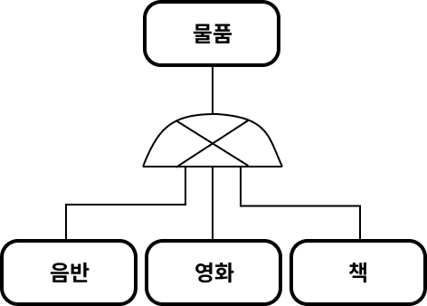

슈퍼타입 & 서브타입 논리 모델을 실제 테이블로 구현하는 방법은 크게 3가지가 있다.

- 각각의 테이블로 변환(**조인 전략**)
- 통합 테이블로 변환(**단일 테이블 전략**)
- 서브타입 테이블로 변환(**구현 클래스 별 테이블 전략**)

### 조인 전략

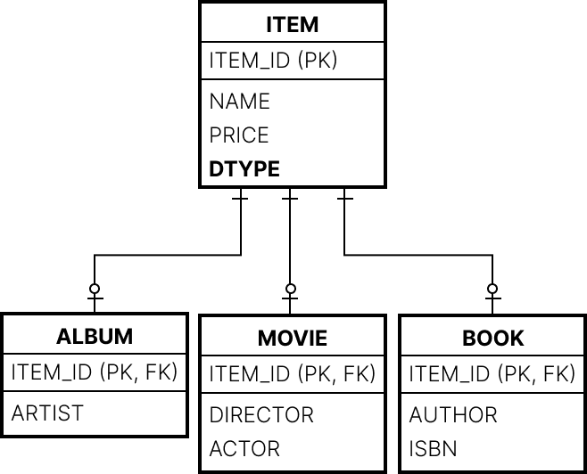

**엔티티 각각을 모두 테이블로 만들고 자식 테이블이 부모 테이블의 기본 키를 받아 기본키+외래키로 사용하는 전략.**

⇒조회할 때 조인을 사용하기 때문에 조인 전략이라고 한다.

<aside>

⚠️ 객체는 타입으로 구분할 수 있지만 테이블은 타입의 개념이 없으므로 타입을 구분할 수 있는 컬럼을 별도로 추가해주어야 한다.

</aside>

```java
@Entity
@Inheritance(strategy = InheritanceType.JOINED)  // 1
@DIscriminatorColumn(name = "DTYPE")  // 2
public abstract class Item {
		@Id @GeneratedValue
		@Column(name = "ITEM_ID")
		private Long id;

		private String name;
		private int price;
		...
}

@Entity
@DiscriminatorValue("A")
public class Album extends Item {
		private String artist;
		...
}

@Entity
@DiscriminatorValue("M")  // 3
public class Movie extends Item {
		private String director;
		private String actor;
		...
}

```

1. 슈퍼타입 & 서브타입 논리모델을 구현할 때, 부모 클래스에 `@Inheritance` 어노테이션으로 매핑 전략을 설정해 주어야 한다.

   매핑 전략으로 InheritanceType.JOINED을 설정해준다.

2. 부모 클래스에 정의한 구분 컬럼을 @DIscriminatorColumn 어노테이션을 통해 지정해줄 수 있다.
3. 엔티티를 저장할 때 `@DiscriminatorValue(”M”)` 어노테이션을 통해 구분 컬럼의 값을 지정할 수 있다.

기본적으로 자식 테이블들은 부모 테이블의 ID 컬럼명을 그대로 사용하는데, 이 컬럼명을 변경하고 싶은 경우 다음과 같이 `@PrimaryKeyJoinColumn`을 사용하면 된다.

```java
@Entity
@DiscriminatorValue("B")
@PrimaryKeyJoinColumn(name = "BOOK_ID")  // ID 재정의
public class Book extends Item {
		private String author;
		private String isbn;
		...
}
```

- 장점
  - 테이블이 **정규화**된다.
  - 외래키 참조 **무결성 제약 조건**을 활용할 수 있다.
  - **저장공간**을 효율적으로 사용한다.
- 단점
  - 조회할 때 조인이 많이 사용되기 때문에 **성능이 저하**될 수 있다.
  - 조회 쿼리가 복잡하다.
  - 데이터를 등록할 INSERT SQL문을 두 번 실행해야 한다.(부모 테이블 한 번, 자식 테이블 한 번)
- 특징
  - 하이버네이트 및 일부 JPA 구현체는 구분 컬럼 없이도 동작한다.
  - 관련 어노테이션 - `@PrimaryKeyJoinColumn`, `@DiscriminatorColumn`,`@DiscrimiinatorValue`

### 단일 테이블 전략


테이블을 하나만 사용하며, 구분 컬럼(DTYPE)으로 어떤 자식 데이터가 저장되었는지를 구분하는 전략.

```java
@Entity
@Inheritance(strategy = InheritanceType.SINGLE_TABLE)
@DiscriminatorColumn(name = "DTYPE")
public abstract class Item {
		@Id @GeneratedValue
		@Column(name = "ITEM_ID")
		private Long id;

		private String name;
		private int price;
		...
}

@Entity
@DiscriminatorValue("A")
public class Album extends Item { ... }

@Entity
@DiscriminatorValue("M")
public class Movie extends Item { ... }

@Entity
@DiscriminatorValue("B")
public class Book extends Item { ... }
```

`@Inheritance`의 매핑 전략을 InheritanceType.SINGLE_TABLE으로 설정하면 된다.

- 장점
  - 조인을 사용하지 않아 조회 성능이 빠르다.
  - 조회 쿼리가 단순하다.
- 단점
  - 자식 엔티티가 매핑한 컬럼은 모두 nullable해야 한다는 제약이 있다.
  - 단일 테이블에 모든 것을 저장하기 때문에 테이블이 커질 수 있고, 이로 인한 조회 성능 저하가 발생할 수 있다.
- 특징
  - 구분 컬럼을 꼭 사용해야 함.(`@DiscriminatorColumn`을 꼭 설정해야 한다.)
  - `@DiscriminatorValue`를 설정하지 않을 시 엔티티의 이름을 기본 값으로 사용한다.

### 구현 클래스 별 테이블 전략

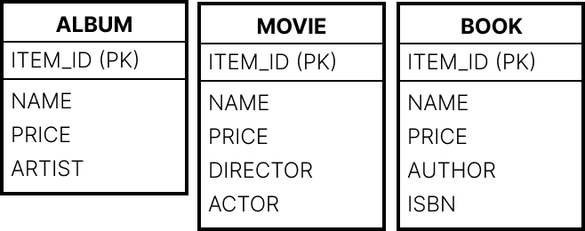

자식 엔티티마다 테이블을 만들고 각 테이블에 필요한 컬럼이 모두 있는 전략.

```java
@Entity
@Inheritance(strategy = InheritanceType.TABLE_PER_CLASS)
public abstract class Item {
		@Id @GeneratedValue
		@Column(name = "ITEM_ID")
		private Long id;

		private String name;
		private int price;
		...
}

@Entity
public class Album extends Item { ... }

@Entity
public class Movie extends Item { ... }

@Entity
public class Book extends Item { ... }
```

`@Inheritance`의 매핑 전략을 InheritanceType.TABLE_PER_CLASS로 설정하면 된다.

- 장점
  - 서브 타입을 구분해서 처리할 때 효과적이다.
  - not null 제약 조건을 사용할 수 있다.
- 단점
  - 여러 자식 테이블을 함께 조회할 때 UNION을 사용해야 하기 때문에 성능이 느리다.
  - 자식 테이블을 통합해서 쿼리하기 어렵다.
- 특징
  - 구분 컬럼을 사용하지 않는다.

<aside>

⚠️ DB 설계자와 ORM 전문가 둘 다 추천하지 않는 전략.

</aside>

## @MappedSuperclass

---

앞서 다룬 상속 관계 매핑은 부모 클래스/자식 클래스를 모두 DB 테이블에 매핑했는데, 부모 클래스를 테이블과 매핑하지 않고 자식 클래스에게 매핑 정보만 사용하고 싶을 경우 `@MappedSuperclass`를 사용하면 된다.

일종의 추상 클래스와 비슷한 개념으로 보면 된다.

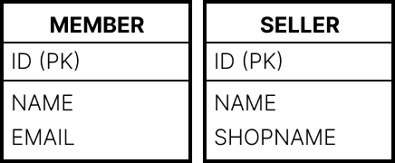

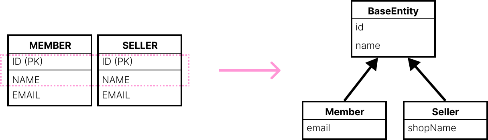

두 공통 속성을 부모 클래스로 모으고 객체 상속관계로 만들면 다음과 같이 코드를 작성할 수 있다.

```java
@MappedSuperclass
public abstract class BaseEntity {
		@Id @GeneratedValue
		private Long id;
		private String name;
		...
}

@Entity
public class Member extends BaseEntity {
		// ID 상속
		// NAME 상속
		private String email;
		...
}

@Entity
public class Seller extends BaseEntity {
		// ID 상속
		// NAME 상속
		private String shopName;
		...
}
```

- 부모 클래스로부터 물려받은 매핑 정보를 재정의할 땐 `@AttributeOverride`를 사용하면 된다.(둘 이상을 재정의할 땐`@AttributeOverrides`)
  ```java
  @Entity
  @AttributeOverride(name = "id", column = @Column(name = "MEMBER_ID"))
  public clas Member extends BaseEntity { ... }
  ```
  부모에게 상속 받은 id 속성의 컬럼명을 MEMBER_ID로 재정의했다.
- 연관관계를 재정의할 땐 `@AssociationOverrides` 또는 `@AssociationOverride`를 사용하면 된다.
- `@MappedSuperclass`로 정의한 공통 부모 클래스는 직접 생성해서 사용하는 경우가 없으므로 추상 클래스로 만드는 것이 권장된다.

## 복합 키와 식별 관계 매핑

---

### 식별 관계 & 비식별 관계

둘은 외래 키가 기본키에 포함되는지 여부에 따라 구분된다.

- **식별 관계**
  - 부모 테이블의 기본 키를 자식 테이블이 기본 키 겸 외래 키로 사용하는 관계.
    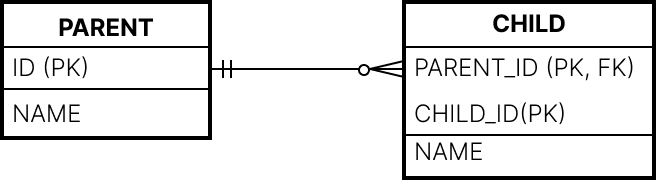
  - 부모 테이블의 키가 자신의 기본 키에 포함되기 때문에, 부모 테이블에 데이터가 존재해야 자식 테이블에 데이터를 입력할 수 없다.
    ⇒ 부모 테이블에 자식 테이블이 종속된다.
  - 👍 장점
    - 요구사항이 변경되지 않는 상황에서 **데이터 정합성**을 보장할 수 있다.
    - 기본 키 인덱스를 활용하기 좋다.
  - 👎 단점
    - DB 설계 관점
      - 부모 테이블을 상속할 수록 기본키 컬럼이 점점 늘어나기 때문에 쿼리가 복잡해지고 기본 키 인덱스가 불필요하게 늘어날 수 있다.
      - 요구사항이 변경되었을 때 구조를 변경하기 어렵다.
    - 객체 관계 매핑의 관점
      - JPA에서 복합 키를 정의하기 위해선 별도의 복합 키 클래스를 만들어야 한다.
- **비식별 관계**
  - 부모 테이블의 기본 키를 자식 테이블의 외래 키로만 사용하는 관계
    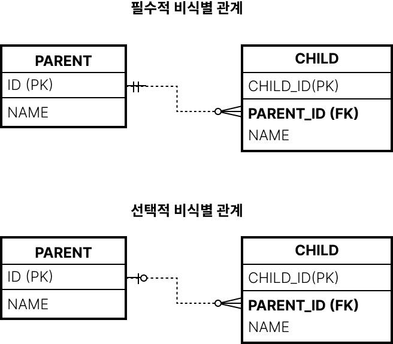
  - 외래키에 NULL을 허용하는지 여부에 따라 2가지로 나뉜다.
    - **필수적 비식별 관계** : 외래 키에 NULL을 허용하지 않기 때문에 연관 관계를 필수적으로 맺어야 한다. 조인할 때 내부 조인을 사용해야 한다.
    - **선택적 비식별 관계** : 외래 키에 NULL을 허용하기 때문에 연관 관계를 맺을지 여부를 선택할 수 있다. 조인할 때 외부 조인을 사용해야 한다.
  - 👍 장점
    - Long 타입의 대리 키를 기본 키로 사용하면, 대리 키는 비즈니스와 아무 관련이 없기 때문에 비즈니스가 변경되어도 유연한 대처가 가능하다.
  - 👎 단점
    - 데이터 정합성을 지키기 위해서 별도의 비즈니스 로직이 필요하다.
    - 데이터 무결성을 보장하지 않는다.

주로 비식별 관계를 사용하고 필요한 곳에만 식별 관계를 사용하는 추세.

선택적 비식별 관계보다는 필수적 비식별 관계를 사용하는 것이 권장된다

### 복합키: 비식별 관계 매핑

JPA에서 둘 이상의 식별자를 사용하려면 별도의 식별자 클래스가 필요하다.

JPA는 영속성 컨텍스트에 엔티티를 보관할 때 엔티티의 식별자를 키로 사용한다. 식별자를 구분하기 위해 equals()와 hashCode()를 사용해서 동등성 비교를 한다.

식별자 필드가 2개 이상이면 별도의 식별자 클래스를 만들고 그곳에 equals()와 hashCode()를 구현해야 한다.

JPA에서 복합키 구현을 위해 지원하는 방법은 @IdClass와 @EmbeddedId 2가지가 있는데, @IdClass는 관계형 DB, @EmbeddedId는 객체 지향에 가까운 방법이다.

- **@IdClass**
  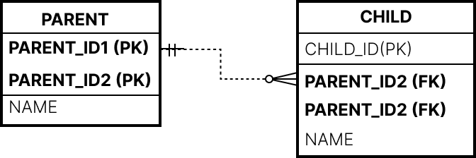
  PARENT 테이블의 복합키를 매핑하는 식별자 클래스는 다음과 같다.

  ```java
  public class ParentId implements Serializable {
  		private String id1;
  		private String id2;

  		public ParentId(){}
  		public ParentId(String id1, String id2){ ... }

  		@Override
  		public boolean equals(Object o) { ... }
  		@Override
  		public int hashCode() { ... }
  }
  ```

  식별자 클래스가 만족해야 하는 조건은 다음과 같다.

  - Serializable 인터페이스를 구현해야 한다.
  - equals, hashCode를 구현해야 한다.
  - 기본 생성자가 있어야 한다.
  - public 클래스여야 한다.

- **@EmbeddedId**

  - Parent 엔티티에서 식별자 클래스를 직접 사용하고 @EmbeddedId 어노테이션을 사용하면 된다.

  ```java
  @Embeddable
  public class ParentId implements Serializable {
  		@Column(name = "PARENT_ID1")
  		private String id1;
  		@Column(name = "PARENT_ID2")
  		private String id2;

  		//equals()와 hashCode() 구현
  		...
  }
  ```

  식별자 클래스가 만족해야 하는 조건은 다음과 같다.

  - @Embeddable 어노테이션을 붙여주어야 한다.
  - Serializable 인터페이스를 구현해야 한다.
  - equals, hashCode를 구현해야 한다.
  - 기본 생성자가 있어야 한다.
  - public 클래스여야 한다.

- **@IdClass와 @EmbeddedId 비교**
  - @EmbeddedId는 좀 더 객체지향적이고 중복이 없지만 특정 상황에 JPQL이 조금 더 길어질 수 있다.

<aside>

⚠️ 복합 키에는 @GenerateValue를 사용할 수 없다.

</aside>

### 복합키: 식별 관계 매핑

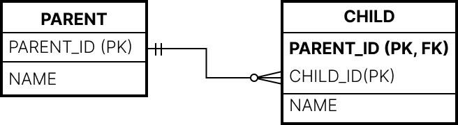

위와 같은 식별 관계에서, 자식 테이블은 부모 테이블을 포함해 복합키를 구성해야 하기 때문에 @IdClass 또는 @EmbeddedId를 사용해서 식별자를 매핑해야 한다.

- @IdClass와 식별관계

  - 식별 관계는 기본키와 외래키를 같이 매핑해야 하기 때문에, 식별자를 매핑하는 @Id와 연관관계를 매핑하는 @ManyToOne을 같이 사용하면 된다.

  ```java
  @Entity
  @IdClass(ChildId.class)
  public class Child {

  		@Id
  		@ManyToOne
  		@JoinColumn(name = "PARENT_ID")
  		public Parent parent;
  		...
  }

  public class ChildId implements Serializable {
  		private String parent;
  		private String childId;
  		...
  }
  ```

- @EmbeddedId와 식별관계

  - @EmbeddedId로 식별 관계를 구성할 때는 식별관계로 사용할 연관관계의 속성에 @MapsId를 사용해야 한다.

    ```java
    @Entity
    public class Child {

    		@EmbeddedId
    		private ChildId id;

    		@MapsId("parentId")
    		@ManyToOne
    		@JoinColumn(name = "PARENT_ID")
    		public Parent parent;
    		...
    }

    @Embeddable
    public class ChildId implements Serializable {
    		private String parentId;
    		@Column(name = "CHILD_ID")
    		private String id;
    		...
    }
    ```

  - @MapsId는 외래키와 매핑한 연관관계를 기본키에도 매핑하겠다는 의미이다.
  - @MapsId의 속성 값은 @EmbeddedId를 사용한 식별자 클래스의 기본키 필드를 지정하면 된다.

### 비식별 관계로 구현


```java
@Entity
public class Child {

		@Id
		@GeneratedValue
		@Column(name = "CHILD_ID")
		private Long id;

		@ManyToOne
		@JoinColumn(name = "PARENT_ID")
		public Parent parent;
		...
}
```

복합키가 없기 때문에 복합키 클래스를 만들지 않아도 된다.

### 일대일 식별 관계

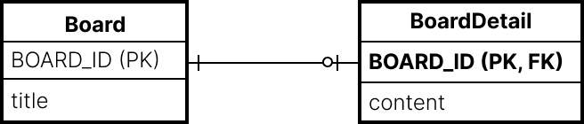

자식 테이블의 기본 키 값으로 부모 테이블의 기본 키 값만 사용한다.(복합키X)

따라서 다음과 같이 엔티티를 작성할 수 있다.

```java
@Entity
public class Board {
		@Id @GeneragedValue
		@Column(name = "BOARD_ID")
		private Long id;

		private String title;
		@OneToOne(mappedBy = "board")
		private BoardDetail boardDetail;
}

@Entity
public class BoardDetail
		@Id
		private Long boardId;

		@MapsId
		@OneToOne
		@JoinColumn(name = "BOARD_ID")
		private Board board;

		private String content;
}
```

BoardDetail처럼 식별자가 단순히 컬럼 하나인 경우 @MapsId를 사용하고 속성 값을 비워두면 된다.

이 때 @MapsId는 @Id를 사용해 식별자로 지정한 BoardDetail.boardId와 매핑된다.

## 조인 테이블

---

DB 테이블의 연관관계를 설계하는 방법은 조인 컬럼을 사용하는 방법과 조인 테이블을 사용하는 방법 2가지이다.

- 조인 컬럼 사용 - 외래 키 컬럼을 사용해서 관리
  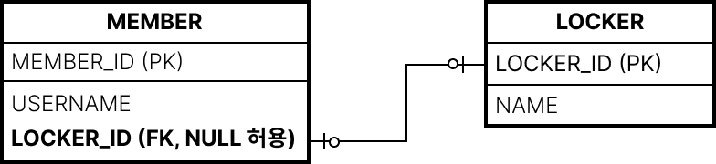
- 조인 테이블 사용 - 조인 테이블이 두 테이블의 외래키를 가지고 연관관계를 관리한다.
  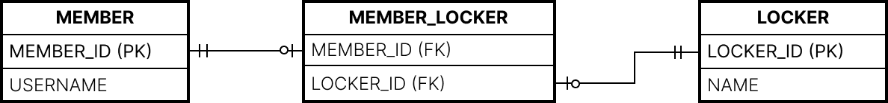
  - 단점. 테이블을 하나 추가해야 하기 떄문에 관리해야 하는 테이블이 늘어난다. 때문에 가능한 조인 컬럼을 사용하는 것이 좋다.
  - 객체와 테이블을 매핑할 때, 조인 컬럼은 @JoinColumn, 조인 테이블은 @JoinTable로 매핑한다.
  - 조인 테이블은 주로 다대다 관계를 일대다-다대일 관계로 풀어내기 위해 사용한다.
- **일대일 조인 테이블 & 일대다 조인 테이블은 익숙하니 Skip**
- **다대다 조인 테이블**

  - 다대다 관계를 만들기 위해서는 조인 테이블의 두 컬럼을 합해서 하나의 복합 유니크 제약 조건을 걸어야 한다.

  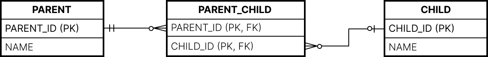

  ```java
  @Entity
  public class Parent {

  	@Id @GeneratedValue
  	@Column (name = "PARENT_ID")
  	private Long id;
  	private String name;
  	@ManyToMany
  	@JoinTable(name = "PARENT_CHILD",
  			joinColumns = @JoinColumn(name = "PARENT_ID"),
  			inverseJoinColumns = @JoinColumn(name = "CHILD_ID")
  	)
  	private List<Child> child = new ArrayList<Child>();
  	...
  }

  @Entity
  public class Child {
  	@Id @GeneratedValue
  	@Column(name = "CHILD_ID")
  	private Long id;
  	private String name;
  	...
  }
  ```

    <aside>

  ⚠️ 조인 테이블에 컬럼을 추가하면 @JoinTable 전략을 사용할 수 없다. 대신 새로운 엔티티를 만들어서 조인테이블과 매핑해야 한다.

    </aside>

## 엔티티 하나에 여러 테이블 매핑

**잘 사용하지는 않지만** @SecondaryTable을 사용하면 한 엔티티에 여러 테이블을 매핑할 수 있다.

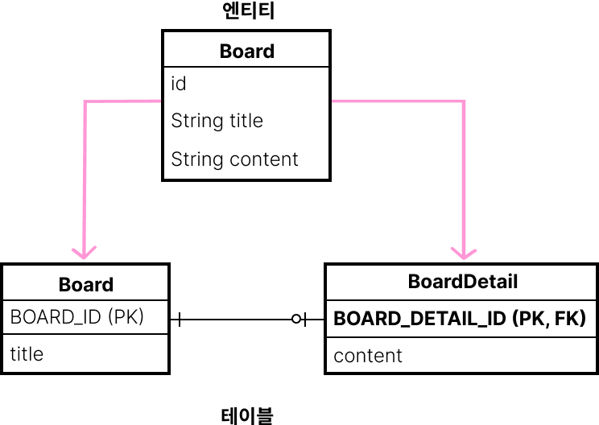

```java
@Entity
@Table
@SecondaryTable(name = "BOARD_DETAIL",
		pkJoinColumn = @PrimaryKeyJoinColumn(name = "BOARD_DETAIL_ID"))
public class Board {
		@Id @GeneratedValue
		@Column(name = "BOARD_ID")
		private Long id;

		private String title;

		@Column(table = "BOARD_DETAIL")
		private String content;
...
}
```

- @SecondaryTable 속성은 다음과 같다.
  - @SecondaryTable.name: 매핑할 다른 테이블의 이름.
  - @SecondaryTable.pkJoinColumns: 매핑할 다른 테이블의 기본 키 컬럼 속성.

더 많은 테이블을 매핑하려면 @SecondaryTables를 사용하면 된다.

```java
@SecondaryTables({
		@SecondaryTable(name = "BOARD_DETAIL"),
		@SecondaryTable(name = "BOARD_FILE")
})
```

@SecondaryTable을 사용해서 두 테이블을 하나의 엔티티에 매핑하는 것보다 테이블당 엔티티를 각각 만들어 일대일 매핑하는 것이 권장된다.

엔티티를 조회할 때마다 두 테이블을 조회하기 때문에 최적화하기 어렵다.

## 참고 자료

---

[[Database] 식별관계와 비 식별관계](https://deveric.tistory.com/108)
