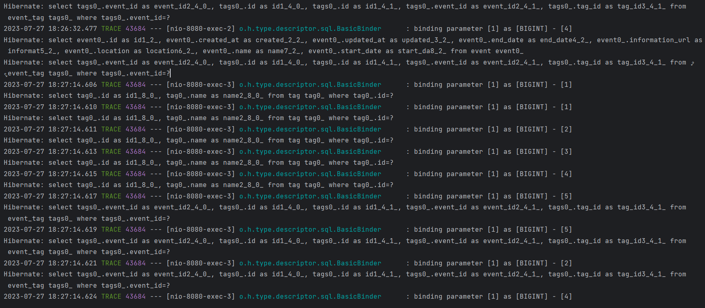
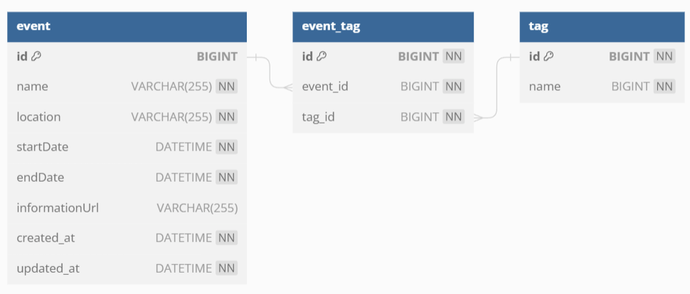
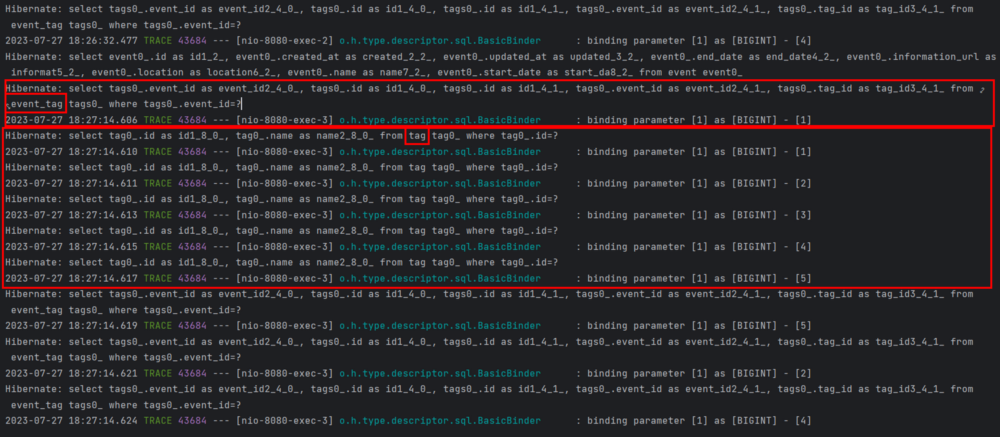
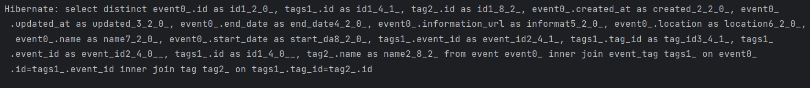

## 개요

---

프로젝트에서 구현한 기능들을 확인하다가, 특정 API들이 호출될 때마다 많은 조회 쿼리가 발생하는 현상이 발생했다.



다른 팀원의 설명을 통해 이것이 N+1 문제고, Event와 Tag 테이블의 연관관계로 인해 발생하는 문제라는 것을 알게 되었다.

## N+1 문제

---

: 연관 관계가 설정된 엔티티를 조회할 때 조회된 데이터 개수만큼 **연관관계의 조회 쿼리**가 추가로 발생하여 데이터를 읽어오는 현상

일대다 관계의 A와 B가 있고 A 인스턴스가 N개 있다고 할 때, 각 A가 참조하는 B를 조회할 때마다 1번의 쿼리가 실행되어 총 **N번**의 쿼리가 실행되고 A들을 조회할 때 **한 번**의 쿼리가 실행된다고 하여 N+1 문제라고 칭한다.

이해를 위해 프로젝트의 코드를 일부 발췌해왔다.

현재 문제가 된 테이블의 설계는 다음과 같다.



행사(event)와 태그(tag)는 **다대다** 관계로, 이 관계를 매핑하기 위해 연관 테이블 event_tag을 만들었다.

JPA 상에서는 다음과 같이 Event는 List<EventTag>를 필드로 가지고 있고, EventTag는 Event와 Tag를 가지고 있다.

방향성은 Event는 EventTag를 경유해서 Tag에 접근할 수 있지만 Tag는 Event에 접근할 수 없는 구조이다.

```java
public class Event extends BaseEntity {

  @Id
  @GeneratedValue(strategy = GenerationType.IDENTITY)
  private Long id;
  ...
  @OneToMany(mappedBy = "event")
  private List<EventTag> tags = new ArrayList<>();
```

```java
public class EventTag {

  @Id
  @GeneratedValue(strategy = GenerationType.IDENTITY)
  private Long id;
  @ManyToOne(fetch = FetchType.LAZY)
  @JoinColumn(name = "event_id", nullable = false)
  private Event event;
  @ManyToOne(fetch = FetchType.LAZY)
  @JoinColumn(name = "tag_id", nullable = false)
  private Tag tag;
```

```java
public class Tag {

  @Id
  @GeneratedValue(strategy = GenerationType.IDENTITY)
  private Long id;
  @Column(nullable = false)
  private String name;
```

한 행사 객체에 대해 다음과 같은 로직이 실행된다고 하자. 실제 로직은 이렇지 않지만 포스팅을 위해 단순화 하였다.

```java
List<Event> events=eventRepository.findAll();

for(int i=0;i<events.length();i++){
		event.getTags()
				.stream()
		    .map(tag -> tag.getTag().getName())
		    .collect(Collectors.toList()), status.getValue());
		  }
		...
}
```

`event.getTags()`를 통해 EventTags에 접근하고, 그 다음 `tag.getTag`를 통해 EventTag가 가진 Tag에 접근한다. 엔티티의 로딩 전략은 Lazy이기 때문에 각 메서드를 호출할 때마다(=참조 객체가 필요해졌을 때) 조회 쿼리가 나가게 된다.

다음과 같이 id가 1인 Event 객체가 id가 1~5인 5개의 Tag 객체 리스트를 가지고 있다고 하자.

```json
{
    "id": 1,
    "name": "인프콘 2023",
    "startDate": "2023:06:01:12:00:00",
    "endDate": "2023:09:01:12:00:00",
    "tags": [
      "백엔드",
      "프론트엔드",
      "안드로이드",
      "IOS",
      "AI"
    ],
    "status": "진행 중"
  },
...
```

이 event에 대해 `event.getTags()`를 호출하면 다음 쿼리가 실행되어 5개의 EventTag 객체를 얻어온다.

```sql
select * from event_tag where event_tag.event_id=1
```

이렇게 얻은 각 EventTag에 대해 `tag.getTag()`를 호출할 때마다 다음의 쿼리가 실행되어 총 5개의 쿼리가 실행된다.

```sql
select * from tag where tag.id=?
```

이렇게 event 하나를 완전히 조회하는 데 총 6번의 쿼리가 실행되었다.



로직이 복잡해서 그렇지, 이미지의 다른 쿼리도 같은 이유로 호출되는 쿼리들이다.

이 문제를 해결하기 위한 방법은 Fetch Join을 사용하는 것이다.

## Fetch Join

---

: DB에서 데이터를 가져올 때 처음부터 연관된 데이터까지 같이 가져오는 방법.(SQL의 JOIN문이 결합됨)

- 엔티티에 직접 적용할 수 있는 글로벌 로딩 전략보다 우선시된다.

<aside>

💡 **글로벌 로딩 전략**

```java
@OneToMany(fetch = FetchType.LAZY)
```

</aside>

앞의 상황을 봤을 때, Event를 불러올 때 EventTag도 불러오고, EventTag를 불러올 때 Tag도 함께 불러오면 해결되는 문제이기 때문에, EventRepository에 다음과 같은 메서드를 구현한다.

`@Query` 어노테이션을 사용해서 **“join fetch 엔티티.연관관계\_엔티티”** 구문을 만들어주면 된다.

```java
public interface EventRepository extends JpaRepository<Event, Long>{
		@Query("select distinct e from Event e join fetch e.tags tags join fetch tags.tag")
		List<Event> findAllFetchJoin();
}
```

<aside>

⚠️ 이 때 쿼리문에는 조인 관계에서 중복을 제거하기 위해 distinct 절이 무조건 있어야 한다.

</aside>

```java
private List<Event> filterEventsByTag(final String tagName) {
    ...
    return eventRepository.findAllFetchJoin();
  }
```

이렇게 event.findAll()을 Fetch Join을 적용한 `findAllFetchJoin()`으로 대체하고 다시 API를 호출하면 쿼리 로그는 다음과 같이 출력된다.



API 호출 한 번에 10번의 쿼리가 실행되던 것과 달리 단 한번의 쿼리만 실행되는 것을 확인할 수 있다.

## Fetch Join의 한계

---

- 컬렉션에 fetch 조인을 사용하게 되면 페이징이 불가하다.
- 일대다, 다대다 관계에서 fetch 조인을 사용하면 데이터가 뻥튀기될 수 있다.⇒데이터 정합성을 보장하기 어려워진다.

### 방안

- 일대다 관계를 다대일 관계로 방향을 변경한다.
- fetch join을 대신 `@BetchSize` 어노테이션을 사용한다.

## 참고 자료

---

[fetch 조인 일 대 다 관게 - 인프런 | 질문 & 답변](https://www.inflearn.com/questions/34797/fetch-조인-일-대-다-관게)

[JPA 다대다를 일대다, 다대일로 풀어서 구현할 때 조회기능 구현](https://yelimkim98.tistory.com/33)

[JPA N+1 문제 해결 방법 및 실무 적용 팁 - 삽질중인 개발자](https://programmer93.tistory.com/83)
