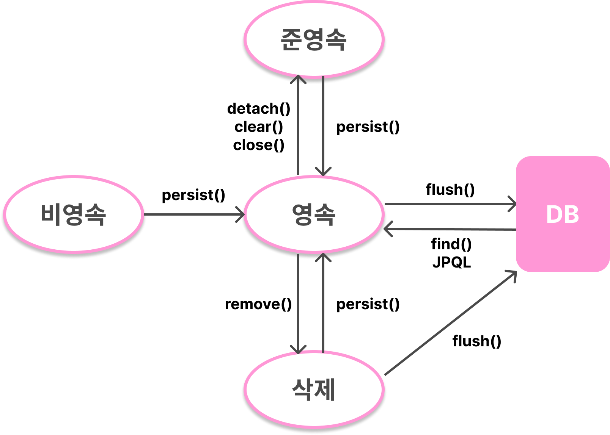
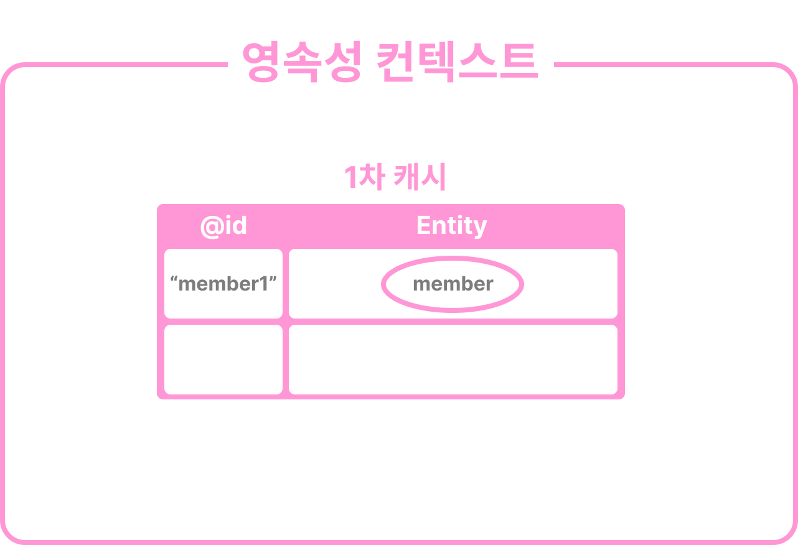
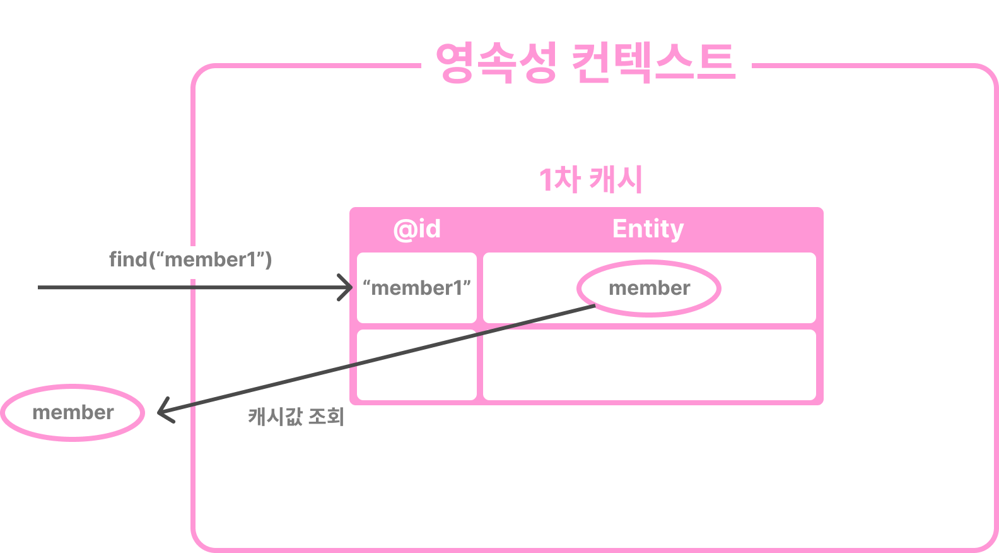
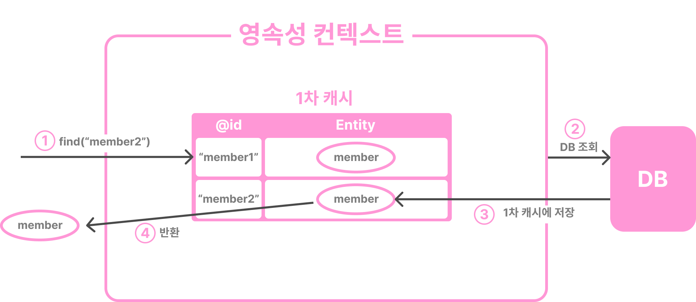
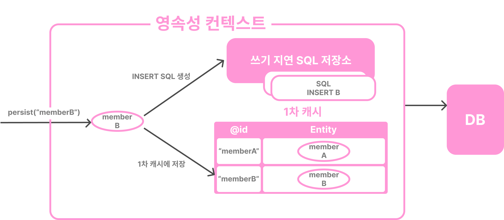
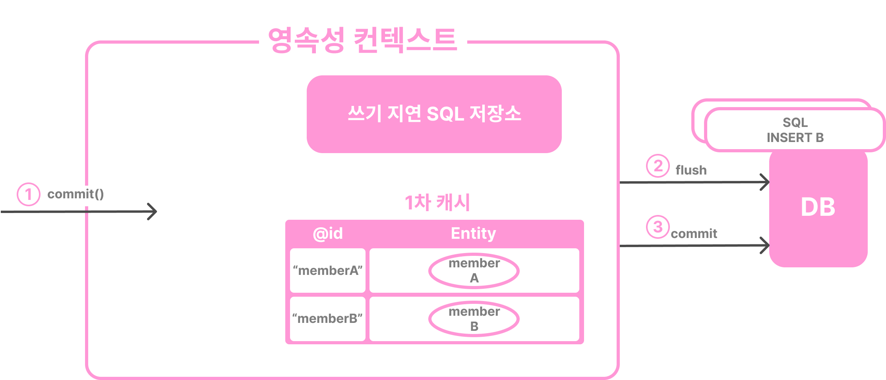
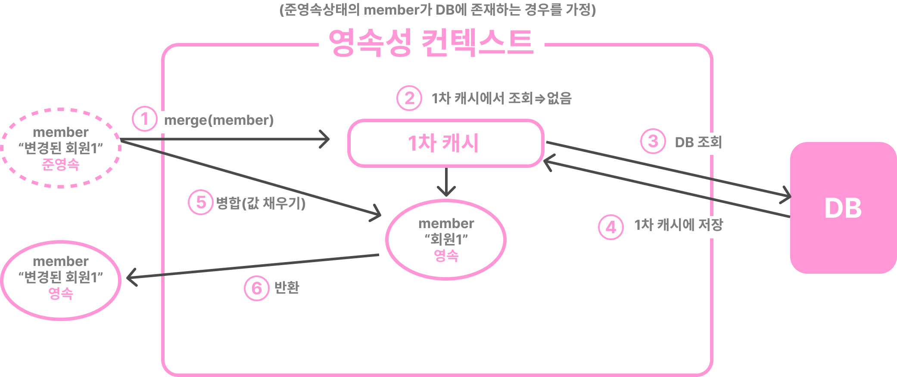
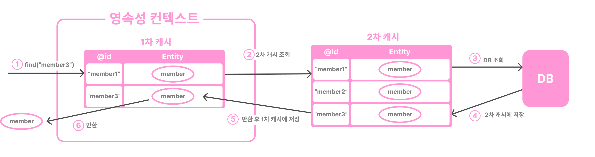
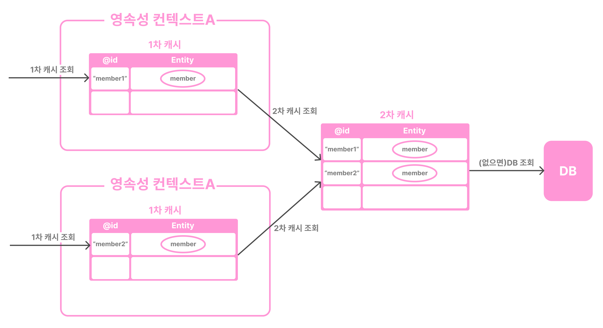

<aside>

💡 김영한님의 저서 『자바 ORM 표준 JPA 프로그래밍』을 읽으며 공부한 내용을 바탕으로 작성된 게시글입니다.

</aside>

## 영속성 컨텍스트

---

엔티티를 **영구 저장**하는 환경.

엔티티는 **엔티티 매니저**에 의해 영속성 컨텍스트에 보관되고 관리된다.

<aside>

💡 엔티티 매니저는 엔티티 매니저 팩토리에서 생성된다.

엔티티 매니저가 만들어질 때 그 내부에 영속성 컨텍스트도 함께 만들어진다.

이 영속성 컨텍스트는 엔티티 매니저를 통해 접근할 수 있다.

</aside>

### 엔티티의 생명주기

4가지 상태가 존재.

- **비영속** - 영속성 컨텍스트와 전혀 관계가 없는 상태
- **영속** - 영속성 컨텍스트에 저장된 상태
- **준영속** - 영속성 컨텍스트에 저장되었다가 분리된 상태
- **삭제** - 삭제된 상태



```java
Member member=new Mmeber(); // ---비영속 상태
em.persist(member); // 비영속 -> 영속
em.detach(member); // 영속 -> 준영속
em.remove(member); //준영속 -> 삭제
```

처음 생성한 시점 - 비영속 상태. 영속성 컨텍스트, DB와 아무런 관련이 없음.

엔티티 매니저를 통해 영속성 컨텍스트에 저장한 시점 - 영속 상태. 영속성 컨텍스트가 관리하는 상태.

영속성 컨텍스트를 닫거나, 영속성 컨텍스트를 초기화한 시점 - 준영속 상태

엔티티를 영속성 컨텍스트에서 삭제한 시점 - 삭제 상태. 영속성 컨텍스트와 데이터베이스에서 삭제한 상태

### 특징

- **식별자 값**
  영속성 컨텍스트는 엔티티를 식별자 값으로 구분하기 때문에, 영속 상태의 엔티티는 식별자 값이 반드시 있어야 한다.
- **DB 저장**
  트랜잭션을 커밋하는 순간 영속성 컨텍스트에 새로 저장된 엔티티를 DB에 반영한다. ⇒ **flush**
- **장점**
  - 1차 캐시
  - 동일성 보장
  - 트랜잭션을 지원하는 쓰기 지연
  - 변경 감지
  - 지연 로딩

### 1. 엔티티 조회

1차 캐시 : 영속성 컨텍스트가 가진 내부 캐시(메모리).

영속 상태의 엔티티는 모두 이 곳에 저장됨.

```java
Member member = new Member("member1", "회원1");
em.persist(member);    // member 엔티티를 영속화
```



1차 캐시의 키는 식별자 값(=DB의 기본 키)

```java
Member member = em.find(Member.class, "member1");
```

1차 캐시에서 엔티티를 찾고, 없으면 DB에서 조회한다.

1. 1차 캐시에서 조회하는 경우

   

2. DB에서 조회하는 경우

   DB에서 조회하고 엔티티를 생성한 후 1차 캐시에 저장하고 **영속 상태의 엔티티**를 반환한다.

   

- 동일성 보장

  ```java
  Member a = em.find(Member.class, "member1");
  Member b = em.find(Member.class, "member1");
  ```

  두 엔티티는 같은 키 값으로 1차 캐시에 존재하는 동일한 인스턴스를 조회한 것이기 때문에, `a == b`이다.

    <aside>

  💡 이러한 성질로 인해 JPA는 DB의 반복 가능한 읽기(REPEATABLE READ) 등급의 격리 수준을 애플리케이션 차원에서 제공한다.

    </aside>


### 2. 엔티티 등록

```java
em.persist(memberA);
em.persist(memberB);
...
transaction.commit();
```

엔티티 매니저는 트랜잭션이 유지되는 동안 내부 쿼리 저장소에 INSERT SQL을 모아두고, 트랜잭션이 커밋될 때 모아둔 쿼리를 DB에 보낸다.

⇒ **쓰기 지연**



트랜잭션을 커밋하면 엔티티 매니저는 영속성 컨텍스트를 flush하고 실제 DB의 트랜잭션을 커밋한다.

**flush** : 영속성 컨텍스트의 변경 내용을 데이터베이스에 동기화하는 작업.



### 3. 엔티티 수정

JPA로 엔티티를 수정할 때는 **영속 상태**에 있는 엔티티의 데이터만 변경해주면 된다.

⇒ **변경 감지(dirth checking)** 기능 때문.

- JPA는 엔티티를 영속성 컨텍스트에 보관할 때 최초 상태를 복사해서 저장해둔다.(=스냅샷)

- 트랜잭션을 커밋할 때 일어나는 동작은 다음과 같다.

  1. flush하는 시점에 **스냅샷과 엔티티를 비교**해서 변경된 엔티티를 찾는다.
  2. 변경된 엔티티가 있으면 수정 쿼리를 생성하고 쓰기 지연 SQL 저장소에 보낸다.
  3. 쓰기 지연 저장소의 SQL을 데이터베이스에 보낸 후 DB 트랜잭션을 커밋한다.

- JPA의 기본 전략은 수정 쿼리 생성 시 엔티티의 모든 필드를 업데이트한다.
  - 장점
    - 수정쿼리의 양식이 항상 같기 때문에 애플리케이션 로딩 시점에 수정 쿼리를 미리 생성해두고 재사용할 수 있다.
    - 동일한 쿼리를 보내면 DB는 이미 한 번 파싱되었던 쿼리를 재사용할 수 있다.
  - 단점
    - DB에 보내는 데이터의 전송량이 증가한다.
- 엔티티의 필드가 너무 많거나 저장되는 내용이 너무 클 경우 수정된 데이터만 사용해서 동적으로 UPDATE SQL을 생성하는 전략을 선택할 수 있다.

  (방법은 `@DynamicUpdate`를 사용하면 된다.)

    <aside>

  💡 `@DynamicInsert`를 사용해서 동적으로 INSERT SQL을 생성할 수도 있다.

    </aside>


### 4. 엔티티 삭제

엔티티를 삭제하면 영속성 컨텍스트에서는 즉시 제거되지만, 삭제 쿼리는 쓰기 지연 SQL 저장소에 등록되고, flush()될 시점이 되어서야 실제 DB에 삭제 쿼리가 전달된다.

```java
Member memberA = em.find(Member.class, "memberA");
em.remove(memberA);
```

## Flush

---

영속성 컨텍스트의 변경 내용을 데이터베이스에 반영하는 작업.

Flush가 실행될 때 일어나는 동작은 다음의 2가지이다.

1. 변경 감지가 동작하여 영속성 컨텍스트에 있는 모든 엔티티를 스냅샷과 비교한 후 수정된 엔티티를 찾고, 수정 쿼리를 만들어 쓰기 지연 SQL 저장소에 등록한다.
2. 쓰기 지연 SQL 저장소의 쿼리를 데이터베이스에 전송한다.(등록, 수정, 삭제 쿼리)

- 영속성 컨텍스트를 flush하는 방법
  - em.flush()를 직접 호출
  - 트랜잭션 커밋
  - JPQL 쿼리 실행
    - 이유 : JPQL은 SQL로 변환되어 DB에서 즉시 쿼리를 반영해야 하는데, 만일 그 전에 영속성 컨텍스트에 추가/수정/삭제된 엔티티가 있으면 원하는 쿼리 결과를 얻을 수 없기 때문에, 쿼리를 실행하기 직전에 영속성 컨텍스트를 플러시해서 변경 내용을 DB에 반영한다.
    - find()는 영속성 컨텍스트의 식별자를 기준으로 조회하기 때문에 플러시를 실행할 필요가 없다.
- Flush 모드 옵션
  - FlushModeType.AUTO - 커밋/쿼리를 실행할 때 flush(기본값)
  - FlushModeType.COMMIT - 커밋할 때만 flush

<aside>

💡 Flush는 영속성 컨텍스트의 변경 내용을 DB에 동기화하는 것이기 때문에, Flush를 했다고 해서 영속성 컨텍스트의 엔티티가 지워지는 것은 아니다.

</aside>

## 준영속

---

영속성 컨텍스트가 관리하는 영속 상태의 엔티티가 **영속성 컨텍스트에서 분리**된 상태.

준영속 상태의 엔티티는 영속성 컨텍스트가 제공하는 기능을 사용할 수 없다.

- 영속→준영속 전환 방법
  1. em.detach(entity) - 특정 엔티티를 준영속 상태로 전환
  2. em.clear() - 영속성 컨텍스트 초기화
  3. em.close() - 영속성 컨텍스트 종료

### detach()

```java
member.persist(member); // 비영속 -> 영속
member.detach(member); // 영속 -> 준영속
```

이 메서드를 호출하는 순간 1차 캐시부터 쓰기 지연 SQL 저장소까지 해당 엔티티를 관리하기 위한 **모든 정보가 제거**된다.

### clear()

```java
em.clear();
```

영속성 컨텍스트를 제거하고 새로 만든 것과 같다.

### close()

```java
em.close();
```

영속성 컨텍스트 종료.

### 특징

- 거의 비영속 상태에 가깝다.
- 식별자 값을 가지고 있다.
  - 한 번 영속 상태였으므로 식별자 값을 가지고 있는 상태이다.
- 지연 로딩을 할 수 없다.
  - 더 이상 영속성 컨텍스트에 의해 관리되지 않기 때문에 지연 로딩 시 문제 발생

### 병합 - merge()

준영속 상태의 엔티티를 다시 영속 상태로 변경한다.

준영속 상태의 엔티티를 받고 그 정보로 새로운 영속 상태의 엔티티를 반환한다.

```java
Member mergeMember = em.merge(member);
```



<aside>

💡 병합 기능은 **비영속 엔티티**도 영속 상태로 만들 수 있다.

만일 DB에서도 엔티티를 발견하지 못할 경우, 새로운 엔티티를 생성해서 병합한다.

⇒ save or update

</aside>

## +) 2차 캐시(=공유 캐시)

---

**애플리케이션에서 공유하는 캐시**. 트랜잭션 범위에서 동작하는 1차 캐시와 달리 애플리케이션 범위에서 동작한다. 즉, 애플리케이션이 종료할 때까지 유지된다.

엔티티 매니저가 데이터를 조회할 때 1차 캐시에서 찾고 없으면 2차 캐시에서 찾고, 2차 캐시에도 없으면 DB를 조회한다.



1차 캐시보다 DB 조회 횟수를 획기적으로 줄일 수 있다.

- 1차 캐시와의 차이점
  - 동시성을 극대화하기 위해 캐시한 객체의 **복사본**을 만들어 반환한다.
    ⇒ 여러 곳에서 같은 객체를 동시에 수정할 경우 동시성 문제가 발생할 수 있기 때문.
  - 영속성 컨텍스트가 다르면 다른 객체로 본다.(동일성 보장x)



<aside>

💡 **2차 캐시를 활성화하는 방법**

Entity 객체 위에 @Cacheable 어노테이션을 붙이고 application.yml에 다음 설정을 추가해주면 2차 캐시를 활성화할 수 있다.

```yaml
spring:
	jpa:
		properties:
			hibernate:
				cache:
					use_second_level_cache: true

```

```java
@Entity
@Cacheable
public class Team {
	@Id @GeneratedValue
	private Long id;
	...
}
```

다음 설정을 추가해 캐시 모드를 All로 설정해주면 엔티티에 @Cacheable을 붙이지 않고도 2차 캐시를 사용할 수 있게 할 수 있다.

```java
spring:
	jpa:
		properties:
			javax:
				persistence:
					sharedCache.mode: All
```

| 캐시 모드         | 설명                                                         |
| ----------------- | ------------------------------------------------------------ |
| ALL               | 모든 엔티티를 캐시합니다.                                    |
| NONE              | 캐시를 사용하지 않습니다.                                    |
| ENABLE_SELECTIVE  | Cacheable(true)로 설정된 엔티티만 캐시를 적용합니다.         |
| DISABLE_SELECTIVE | 모든 엔티티를 캐시하는데 Cacheable(false)만 캐시하지 습니다. |
| UNSPECIFIED       | JPA 구현체가 정의한 설정을 따릅니다.                         |

</aside>

## 참고 자료

---

[[JPA] 2차 캐시](https://junghyungil.tistory.com/203)
