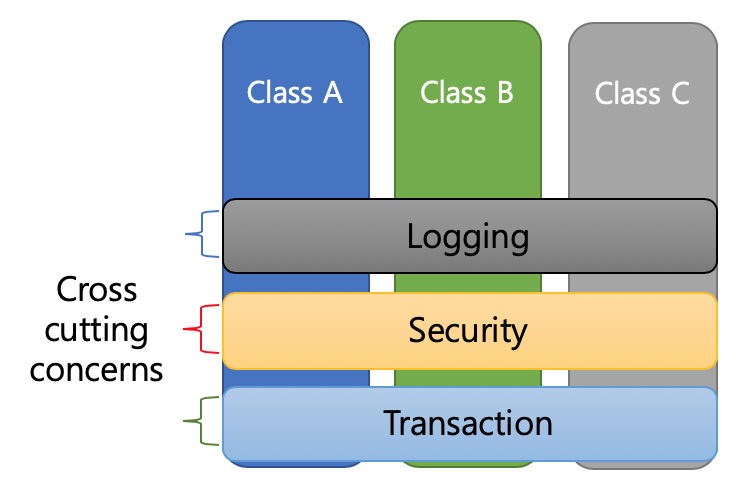
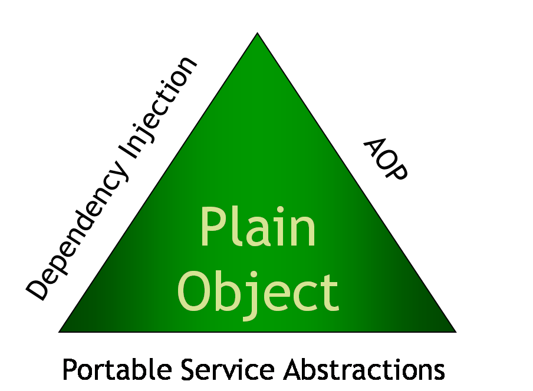
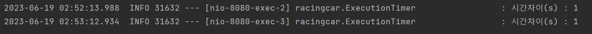

## AOP란?

---

AOP란 Aspect Oriented Programmig(**관점 지향 프로그래밍**)의 약자로, 프로그램의 로직을 핵심적인 관점과 부가적인 관점으로 나누고 그 관점을 기준으로 각각 모듈화하는 프로그래밍 패러다임을 의미한다.

여기서 모듈화는 어떤 **공통된** 로직이나 기능을 하나의 단위로 묶는 것을 뜻한다.

여기서 핵심적인 관점은 우리가 실제로 적용하고자 하는 핵심 비즈니스 로직을 의미하며, **종단 관심사**라고 한다.

부가적인 관점은 핵심 로직을 행하기 위해 필요한 부수적인 로직으로 **횡단 관심사**(Crosscutting Concerns)라고 하고 예시로는 DB 연결, 로깅, 파일 입출력 등이 있다. 이런 횡단 관심사는 소스 코드 상에서 여러 파일에서 공통적으로 사용되었다.



이와 같이 프로그램 로직을 ‘관점’이라 표현하고 모듈화하여 **부가적인 로직**을 핵심적인 비즈니스 로직에서 **분리하고 재사용**하자는 것이 AOP의 취지이다.

### AOP의 필요성

기존에 횡단 관심사는 코드로서 **여러 파일에 분산**되고 **종단 관심사들에 얽혀있기** 때문에 이를 이해하고 유지보수하기가 어려웠다.

로깅을 예로 든다면, 로깅에 변경사항이 생길 경우 로깅 기능을 사용하는 모든 모듈을 수정해야 했기 때문에 유지보수성이 낮았다.

AOP는 프로그래머가 이런 횡단 관심사를 Aspect라는 독립적인 모듈로 표현할 수 있게 함으로서 문제를 해결할 수 있게 하였다.

### AOP의 장점

- 어플리케이션 전체에 흩어진 공통 기능이 하나의 장소에서 관리될 수 있다.
- 각각의 모듈들이 본인의 목적에만 충실하면 되고 그 외의 사항들은 신경쓰지 않아도 된다.

### AOP의 주요 개념

- **Aspect(관점)** : 여러 곳에서 사용되는 공통 부분 코드를 모듈화한 것.
  - 부가 기능을 정의한 **Advice**와 Advice를 어디에 적용할지를 결정하는 **Pointcut**을 함께 지니고 있다.
- **Target** : 부가 기능을 부여할 대상(class, method).
- **Advice** : 실질적인 부가 기능을 담은 구현체로, Aspect가 무엇을 언제 할지를 정의한다.
  - Target 객체에 종속되지 않기 때문에 부가 기능에만 집중할 수 있다.
- **JoinPoint** : Advice가 Target에 적용되는 위치를 말한다. 다른 AOP 프레임워크와는 달리 Spring에서 메소드 JoinPoint만 제공된다.
- **Pointcut** : Advice를 적용할 JoinPoint를 선별하는 기능을 정의한 모듈. 즉 부가 기능이 적용될 대상(메서드)을 정하는 방법을 의미한다.
- **Proxy** : 클라이언트와 타겟 사이에 존재하며 부가 기능을 제공하는 객체. DI를 통해 타겟 객체 대신 클라이언트에게 주입되며 클라이언트의 메소드 호출을 대신 받고 타겟에게 위임하는데, 이 과정에서 부가 기능을 수행한다.

## Spring AOP

---

### Spring의 3대 핵심 개념

Spring의 3대 특징 DI(의존성 주입), PSA(서비스 추상화), AOP(관점 지향 프로그래밍)에 포함되며, DI가 애플리케이션 모듈들 간 결합도를 낮춘다고 하면 AOP는 애플리케이션의 공통적인 부가 기능을 모듈화하여 독립적으로 관리할 수 있게 하는 것이라 요약할 수 있다.



### AOP 어노테이션

- `@Component` : 스프링 컨테이너에 Spring Bean임을 알려 스프링 컨테이너가 해당 객체를 생성하게 한다.
- `@Aspect` : 스프링 컨테이너에 AOP 담당 객체임을 알린다.
- `@Pointcut` : AOP 기능을 어디에 적용시킬지 지점을 설정한다.
- `@Around` : 횡단 관심사항의 대상을 지정하고 적용 시점을 지정한다.(Pointcut, Advice)
  ```c
  @Around("within(bit.your.prj.controller.*)")
  ```
  - 횡단 관심사항 적용 대상 지정(execution, within, bean)
  - 타겟 메서드의 Aspect 실행 시점을 지정하는 어노테이션들
    - `@Around` (메소드 실행 전후) : 어드바이스가 타겟 메소드를 감싸서 타겟 메소드 호출 전과 후에 어드바이스 기능을 수행
    - `@Before` (이전) : 어드바이스 타겟 메소드가 호출되기 전에 어드바이스 기능을 수행
    - `@After` (이후) : 타겟 메소드의 결과에 관계없이(성공, 예외 관계없이) 타겟 메소드가 완료되면 어드바이스 기능을 수행
    - `@AfterReturning` (정상적 반환 이후)타겟 메소드가 성공적으로 결과값을 반환 후에 어드바이스 기능을 수행
    - `@AfterThrowing` (예외 발생 이후) 타겟 메소드가 수행 중 예외를 던지게 되면 어드바이스 기능을 수행

## 실전 예제 - 로직 실행시간 측정

---

### 의존성 추가

스프링 AOP 기능을 사용하기 위해선 먼저 `build.gradle` 파일에서 의존성을 추가해주어야 한다.

```c
implementation 'org.springframework.boot:spring-boot-starter-aop'
```

### 기존 코드

이제 핵심 로직에 로직의 실행 시간을 측정하는 코드를 추가해보자.

예시 코드로 우테코에서 만들었던 자동차 경주 미션 코드를 가져왔다.

```java
Logger logger = LoggerFactory.getLogger(ExecutionTimer.class);

@PostMapping("/plays")
public ResponseEntity run(@RequestBody RacingRequest dto) {
    long beforeTime = System.currentTimeMillis();       // 코드 실행 전의 시간 받아오기

    Cars cars = new Cars(dto.getNames(), RandomNumberGenerator.makeInstance());
    Trial trial = Trial.of(Converter.convertStringToInt(dto.getCount()));
    Cars movedCars = racingService.run(cars, trial);
    RacingResultResponse response = new RacingResultResponse(movedCars.getWinnerNames(),
        movedCars.getCarDtos());

    long afterTime = System.currentTimeMillis();        // 코드 실행 후의 시간 받아오기
    long secDiffTime = (afterTime - beforeTime) / 1000; // 두 시간의 차 계산 후 초(s) 단위로 변환
    logger.info("시간차이(s) : {}", secDiffTime);   // 콘솔에 실행시간 출력

    return ResponseEntity.ok().body(response);
}

@GetMapping("/plays")
public ResponseEntity run() {
    long beforeTime = System.currentTimeMillis();       // 코드 실행 전의 시간 받아오기

    List<RacingResultResponse> response = racingService.loadHistory();

    long afterTime = System.currentTimeMillis();        // 코드 실행 후의 시간 받아오기
    long secDiffTime = (afterTime - beforeTime) / 1000; // 두 시간의 차 계산 후 초(s) 단위로 변환
    logger.info("시간차이(s) : {}", secDiffTime);   // 콘솔에 실행시간 출력
    return ResponseEntity.ok().body(response);
}
```

보이는 것과 같이 각 메서드의 핵심 로직의 전/후에 공통적인 코드가 삽입된 것을 확인할 수 있다.

### JoinPoint로 사용할 마킹용 어노테이션 작성

이제 이 공통된 로직을 횡단 관심사로서 모듈화해보자.

먼저 해당 로직이 사용될 Target을 설정해주어야 한다. Target 지정을 위한 어노테이션을 다음과 같이 만든다.

```java
@Target({ElementType.METHOD, ElementType.ANNOTATION_TYPE})
@Retention(RetentionPolicy.RUNTIME)
public @interface ExeTimer{
}
```

이제 어노테이션 `@ExeTimer`가 붙은 메서드에 대해 AOP가 수행되게 할 것이다.

### AOP 클래스 작성

먼저 클래스에 `@Aspect` 메서드를 붙여준다.

그리고 `@PointCut` 어노테이션을 사용해 모든 JoinPoint에서 적용될 JoinPoint를 지정한다. 여기서 `@annotation`을 사용해 앞서 작성한 마킹용 어노테이션의 path를 지정해준다.

우리가 추가하고자 하는 실행시간 측정 기능은 메서드 실행 전/후로 실행 시간을 측정하는데, 한 개의 변수를 메서드 실행 전/후로 공유해야 하기 때문에 `@Around`어노테이션을 사용한다.

```java
@Aspect
@Component
public class ExecutionTimer {
		Logger logger = LoggerFactory.getLogger(ExecutionTimer.class);

		// 조인 포인트를 @ExeTimer 어노테이션으로 설정
    @Pointcut("@annotation(com.aop.annotation.ExeTimer)")
    private void timer(){};

    @Around("timer()")
    public void AssumeExecutionTime(ProceedingJoinPoint joinPoint) throws Throwable{
        long beforeTime = System.currentTimeMillis();

        joinPoint.proceed();    //조인 포인트의 메서드 실행

        long afterTime = System.currentTimeMillis();
        long secDiffTime = (afterTime - beforeTime) / 1000;
				logger.info("시간차이(s) : {}", secDiffTime);
    }
}
```

### 핵심 로직에 적용하기

이제 실행 시간을 측정할 메서드에 `@ExeTimer` 어노테이션을 붙여준다.

```java
@ExeTimer
@PostMapping("/plays")
public ResponseEntity run(@RequestBody RacingRequest dto) {
    Cars cars = new Cars(dto.getNames(), RandomNumberGenerator.makeInstance());
    Trial trial = Trial.of(Converter.convertStringToInt(dto.getCount()));
    Cars movedCars = racingService.run(cars, trial);
    RacingResultResponse response = new RacingResultResponse(movedCars.getWinnerNames(),
        movedCars.getCarDtos());

    return ResponseEntity.ok().body(response);
}

@ExeTimer
@GetMapping("/plays")
public ResponseEntity run() throws InterruptedException {
    List<RacingResultResponse> response = racingService.loadHistory();
    Thread.sleep(1000); // DB 접근시 1초가 걸린다고 가정
    return ResponseEntity.ok().body(response);
}
```

테스트해보면 정상적으로 결과가 출력되는 모습을 확인할 수 있다.



## 참고 자료

---

[[Spring] 스프링 AOP (Spring AOP) 총정리 : 개념, 프록시 기반 AOP, @AOP](https://engkimbs.tistory.com/746)

[AOP란 무엇인가](https://rma7.tistory.com/70)

[[Spring AOP] 간단한 AOP 적용 예제 (메서드 실행시간 측정)](https://velog.io/@dhk22/Spring-AOP-간단한-AOP-적용-예제-메서드-실행시간-측정)
