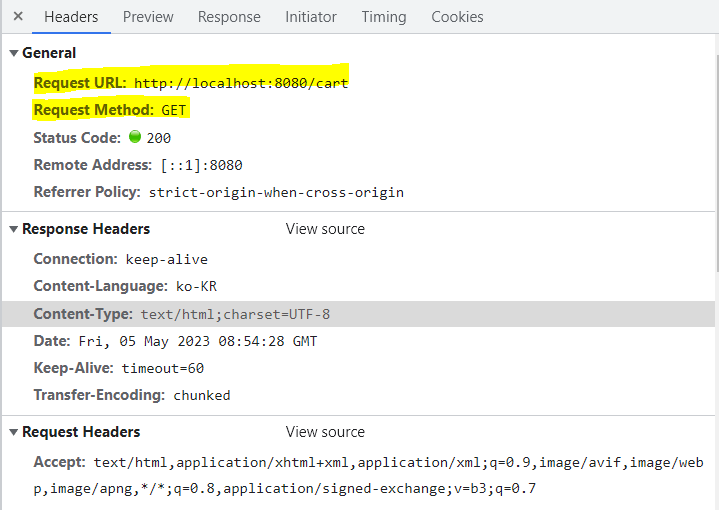
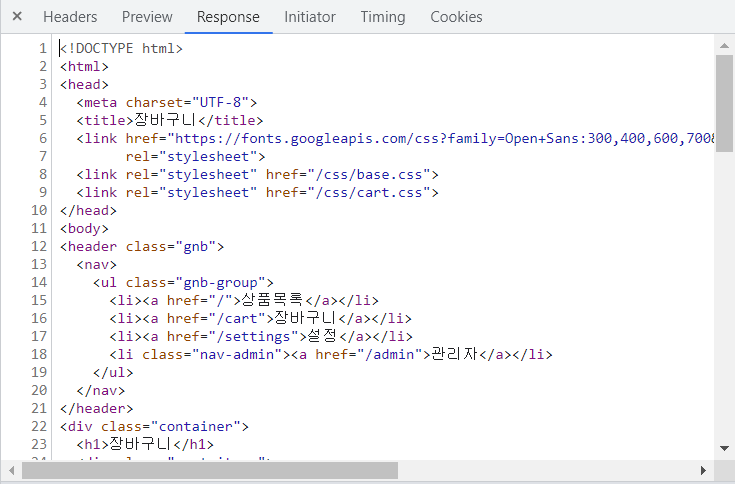
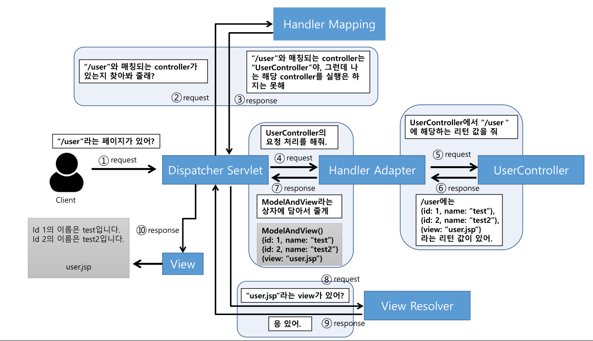
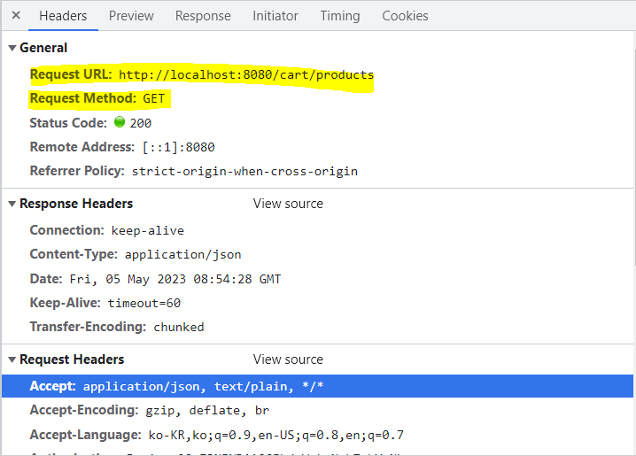
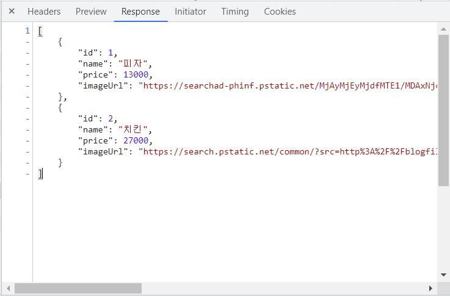

MVC 모델에서 **Controller**는 주로 사용자의 요청을 처리하고 난 후에 View에 객체를 넘겨주는 중간 제어자 역할을 한다.

Spring에서 Controller를 쓰기 위해 사용하는 어노테이션에는 `@Controller`와 `@RestController`가 있다.

## @Controller 어노테이션

---

`@Controller`는 일반적으로 (필요하다면)Model 객체를 만들어 데이터를 담고 **View를 반환**한다.

### 예제 코드

```java
@Controller
public class PageController {
		...
		@GetMapping("/cart")
    public String loadCart() {
        return "cart";
    }
		...
}
```

- **코드 설명** : 위 코드의 경우 `/cart`로 GET 요청이 들어왔을 때 `cart.html` 파일을 찾아 반환한다.
- Request(요청) 정보
  
- Response(응답) : HTML(View) 반환
  

### Controller - View



@Controller가 View를 반환하기 위해 **View Resolver**가 사용되며, ViewResolver 설정에 맞게 View를 찾아 렌더링을 한다.

## @RestController

---

`@RestController`는 객체만을 반환하고, 객체 데이터는 JSON 또는 XML 형식으로 HTTP 응답에 담아 전송한다.

### 예제 코드

```java
public class ProductResponse {

    private final Long id;
    private final String name;
    private final Integer price;
    private final String imageUrl;
		...
}
```

```java
@RestController
@RequestMapping("/cart")
public class CartController {
    ...
    @GetMapping("/products")
    public ResponseEntity<List<ProductResponse>> getProducts(Member member) {
        List<ProductResponse> cart = ProductResponse.from(cartService.loadCartProducts(member));

        return ResponseEntity.ok().body(cart);
    }
		...
}
```

- **코드 설명** : 위 코드의 경우 `/cart/products`으로 GET 요청이 들어왔을 때 `[ { id : 1, name : "피자", price : 13000, imageUrl :"https://..." }, … ]` 형식의 JSON 데이터를 반환한다.
- Request(요청) 정보
  
- Response(응답) 정보 : JSON 데이터
  

### Controller - Data


Client가 URI 형식으로 웹 서비스에 요청을 보내면, Mapping되는 Handler와 그 Type을 찾는 **DispatcherServlet**이 요청을 가로챈다.

RestController가 해당 요청을 처리하고 데이터를 반환한다.

<aside>
💡 @Controller에 @ResponseBody를 사용하면 @RestController와 동일한 동작을 수행할 수 있다.(@RestController=@Controller+@ResponseBody)

- 아래 두 코드는 Spring MVC에서 동일한 동작을 한다.

```java
@Controller
@ResponseBody
public class MVCController {
	business logic...
}
```

```java
@RestController
public class RestFulController {
	business logic...
}
```

</aside>

## 참고 자료

---

[[Spring] @Controller 란](https://sevendays.tistory.com/42)

[[Spring] @Controller와 @RestController의 차이점 알아보기](https://dev-coco.tistory.com/84)
