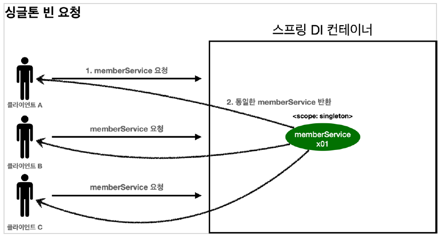
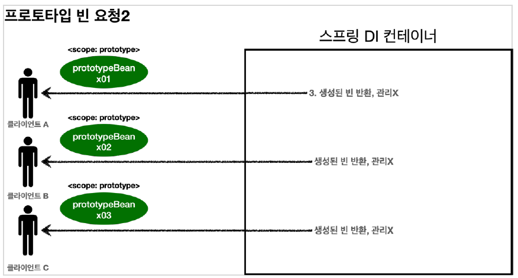
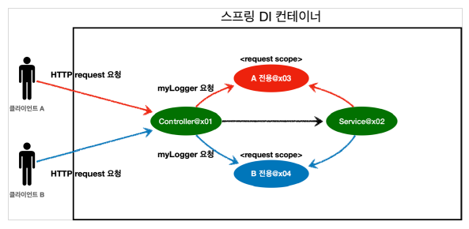
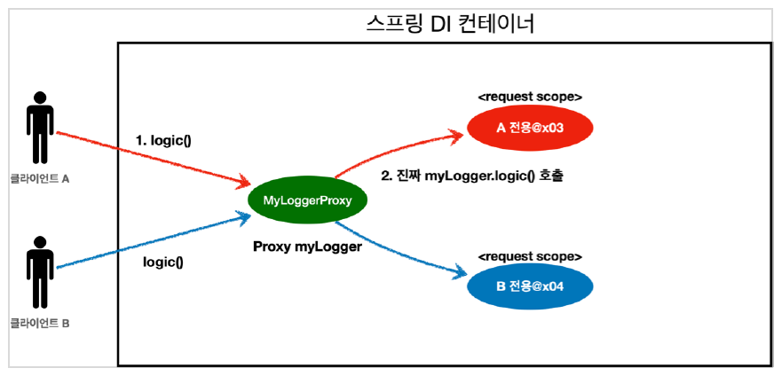

## 스프링 빈(Spring Bean) 이란?

Spring IoC 컨테이너가 관리하는 자바 객체

[IoC 컨테이너 포스트](https://amaran-th.github.io/Spring/[Spring]%20IoC%20Container/)에서 살펴봤듯, 기존의 자바 프로그래밍에서는 Class를 생성하고 new를 입력하여 **원하는 객체를 직접 생성**한 후 사용했다.

반면 Spring에서는 직접 new를 이용하여 생성한 객체가 아니라 **Spring에 의해 관리당하는 자바 객체**를 사용한다. 여기서 말하는 자바 객체가 바로 Bean이다.

Spring Framework에서는 Spring Bean을 얻기 위해 Application.Context.getBean()과 같은 메소드를 사용해 **Spring에서 직접 자바 객체를 얻어서** 사용한다.

⚠️new 연산자로 생성하는 객체는 Bean이 아니다.

<aside>
💡 Spring에서 Bean은 보통 Singleton으로 존재한다.

`Singleton(싱글톤)` : 어떤 클래스가’최초 한 번만 메모리를 할당하고(static) 그 메모리에 객체를 만들어 사용하는 디자인패턴

</aside>

## Spring Bean을 Spring IoC Container에 등록하는 방법

1. 자바 어노테이션을 사용하는 방법

   <aside>
   💡 자바 어노테이션 :  자바 소스코드에 추가하여 사용할 수 있는 메타 데이터의 일종.

   </aside>

   `@Component` 어노테이션을 사용하여 Bean을 등록할 수 있다.

   ```java
   @Component
   public class LineDao {
   		...
   }
   ```

2. Bean Configuration File에 직접 Bean을 등록하는 방법

   `@Configuration`과 `@Bean` 어노테이션을 이용해 Bean을 등록할 수 있다.

   아래 예제와 같이 `@Configuration`을 이용해 Spring 프로젝트에서 Configuration 역할을 하는 클래스를 지정해줄 수 있다.

   해당 클래스 하위에 Bean으로 등록하고자 하는 클래스에 `@Bean` 어노테이션을 사용해줌으로써 Bean을 등록해줄 수 있다.

   ```java
   @Configuration
   static class LifeCycleConfig{
   		@Bean
       public NetworkClient networkClient() {
           NetworkClient networkClient = new NetworkClient();
           networkClient.setUrl("https://hong.com");
           return networkClient;
       }
   }
   ```

   NetworkClient가 Bean으로 등록된다.

## Bean Scope

: Bean이 존재할 수 있는 범위를 의미한다.

스프링은 다음과 같은 다양한 Bean Scope를 지원한다.

| Type                           | Scope                 | Description                                                                                                           |
| ------------------------------ | --------------------- | --------------------------------------------------------------------------------------------------------------------- |
| 일반 Spring Application        | 싱글톤(Singleton)     | 기본 스코프, 스프링 컨테이너의 시작과 종료까지 유지되는 가장 넓은 범위의 스코프이다.                                  |
|                                | 프로토타입(Prototype) | 스프링 컨테이너는 프로토타입 빈의 생성과 의존관계 주입까지만 관여하고 더는 관리하지 않는 매우 짧은 범위의 스코프이다. |
| Spring MVC Web Application(웹) | request               | 웹 요청이 들어오고 나갈 때까지 유지되는 스코프                                                                        |
|                                | session               | 웹 세션이 생성되고 종료될 때까지 유지되는 스코프                                                                      |
|                                | application           | 웹의 서블릿 컨텍스트와 같은 범위로 유지되는 스코프                                                                    |

> 싱글톤 스코프



Spring을 통해서 Bean을 주입받으면 주입받은 Bean은 언제나 **동일한 객체**라는 가정하에서 개발한다.

```java
@Scope("singleton")
static class SingletonBean {
}
```

> 프로토타입 스코프



프로토타입 스코프의 Bean을 조회하면 스프링 컨테이너는 항상 새로운 인스턴스를 생성해서 반환한다.

싱글톤 Bean은 컨테이너 생성 시점에 같이 생성되고 초기화되는 반면, 프로토타입의 Bean은 Spring 컨테이너에서 Bean을 조회할 때 생성/초기화된다.

⚠️스프링 컨테이너는 클라이언트에게 프로토타입 Bean을 반환한 이후 해당 Bean을 관리하지 않는다.

⇒`@PreDestroy`와 같은 종료 콜백 메서드가 호출되지 않는다.

```java
@Scope("prototype")
static class PrototypeBean {
}
```

> 웹 스코프



웹 스코프는 웹 환경에서만 동작한다. 프로토타입과 달리 Spring이 해당 스코프의 종료시점까지 관리한다.⇒종료 메서드가 호출된다.

- `request` : HTTP 요청 하나가 들어오고 나갈 때까지 유지되는 스코프. HTTP 요청마다 별도의 Bean 인스턴스가 생성되고 관리된다.
- `sesseion` : HTTP Session과 동일한 생명주기를 가지는 스코프
- `application` : 서블릿 컨텍스트(ServletContext)와 동일한 생명주기를 가지는 스코프
- `websocket` : 웹 소켓과 동일한 생명주기를 가지는 스코프

Spring Bean 등록 시 웹 스코프를 그대로 주입받으면 오류가 발생한다.

싱글톤 Bean은 스프링 컨테이너 생성 시 함께 생성되어서 라이프 사이클을 같이 하지만, 웹 스코프(여기서는 request 스코프)의 경우 HTTP 요청이 올 때 새로 생성되고 응답하면 사라지기 때문에, 싱글톤 Bean이 생성되는 시점에는 아직 생성되지 않았다.

따라서 의존관계 주입이 불가능하다.

이를 프록시를 사용해서 해결할 수 있다.

```java
@Component
@Scope(value = "request", proxyMode = ScopedProxyMode.TARGET_ClASS)
public class MyLogger {
}
```

이렇게 하면 MyLogger의 가짜 프록시 클래스를 만들어두고, HTTP request와 상관없이 **가짜 프록시 클래스를 다른 빈에 미리 주입**해둘 수 있다.



가짜 프록시 객체는 요청이 오면 그 때 내부에서 진짜 Bean을 요청하는 위임 로직이 들어있다.

- 가짜 프록시 객체는 내부에 진짜 MyLogger를 찾는 방법을 알고 있다.
- 클라이언트가 myLogger.logic()을 호출하면 사실은 가짜 프록시 객체의 메서드를 호출한 것이다.
- 가짜 프록시 객체는 request 스코프의 진짜 myLogger.logic()을 호출한다.
- 가짜 프록시 객체는 원본 클래스를 상속받아서 만들어졌기 때문에 이 객체를 사용하는 클라이언트 입장에서는 원본인지 아닌지도 모르게 동일하게 사용할 수 있다.(다형성)

## 로드맵 질문

---

1. **빈의 스코프는 무엇인가?**

   빈이 생성되고 존재하고 적용되는 범위.

2. **모든 객체를 스프링 빈으로 등록해도 괜찮나? 안된다면 특정 객체만 빈으로 등록해야 하는 이유는 무엇인가?**

   Bean 객체가 많아지면 애플리케이션 시작 시간이 늦어지고 메모리 사용량이 늘어난다.⇒애플리케이션 성능에 영향을 미칠 수 있다.

   Bean을 등록한다는 것은 Spring의 LifeCycle을 따라간다는 것이기 때문에 Proxy 객체로 덮인 상태가 된다. 때문에 일반 객체로 생성하는 것에 비해 메모리 오버헤드가 발생할 수 있다.

3. **빈으로 등록하는 것과 스태틱 메서드를 사용하는 것 중 어떤 방법을 선호하는가? 구분하는 기준은 무엇인가?**

   호출되는 method가 static이 아닌 경우, 객체를 new를 사용해서 새로 만든 후 class.method로 호출해야 한다. 여기서 스프링의 IoC 개념이 무너진다.

   static으로 만들게 되면 heap이 아닌 class(method) 영역에 상주시키게 되므로 메모리 면에서 더 빠를 수도 있다.

   하지만 해당 메소드가 호출될 때마다 객체가 새로 생성되므로 객체에 대한 생성과 소멸을 직접 관리해야 한다.

## 참고 자료

---

[[Spring] Bean 정리](https://velog.io/@gillog/Spring-Bean-정리)

[[Spring] 빈 스코프(Bean Scope)란? Dependency Lookup(DL)이란?](https://code-lab1.tistory.com/186)

[String Bean vs Static method 언제 어느걸 사용해야할까?](https://toryfren.tistory.com/45)
