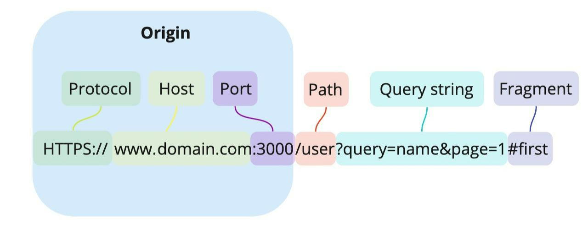
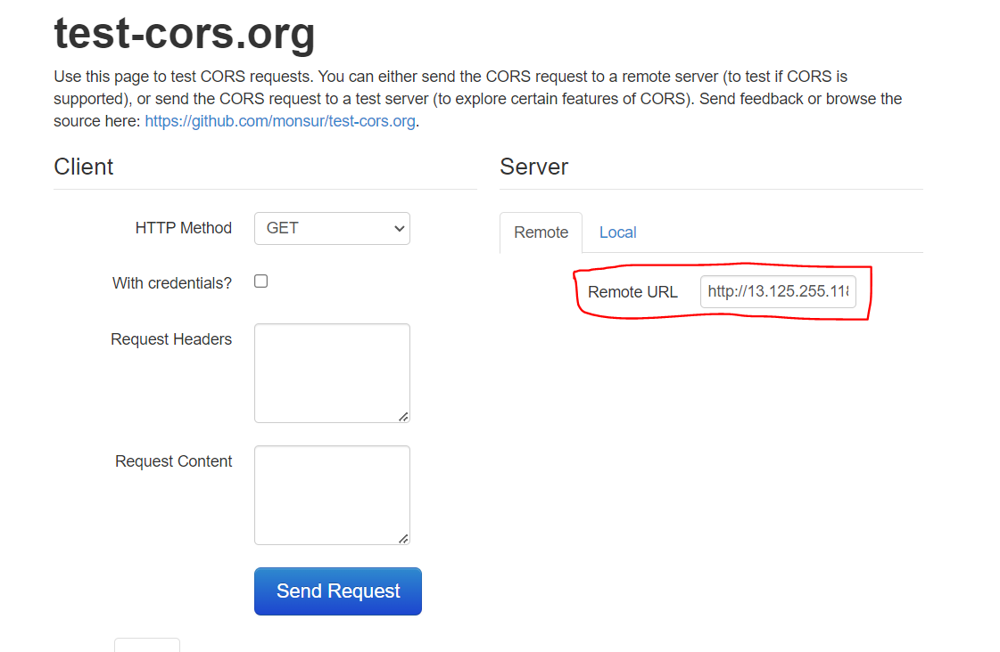
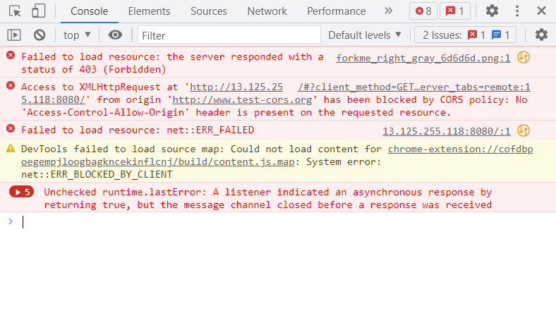

## CORS 개념 이해하기

CORS(Cross-Origin Resource Sharing)란 다른 출처의 자원을 공유할 수 있도록 설정하는 권한 체제를 의미한다.

### Origin이란?

이해를 위해 Origin의 개념부터 짚어보겠다.

Origin은 Origin URL을 의미하는데, 웹 사이트의 URL은 다음과 같은 구성을 가지고 있다.



즉, Origin이란 **Protocol, Host, Post를 모두 합친 URL**을 의미한다.

브라우저 상에서, Origin이 같은(Same-Origin) 리소스는 서로 공유할 수 있다.

⇒이를 `Same-Origin 정책`이라고 한다.

반면 Origin이 다른 (Cross-Origin) 리소스는 상호작용이 불가능하다.

⇒이를 `Cross-Origin 정책`이라고 한다.

만일 CORS에 대해 적절히 설정해주지 않으면 리소스 공유에 제약이 생길 수 있다.

- ``, `<video>`, `<script>`, `<link>` 태그 등은 기본적으로 **Cross-Origin 정책**을 지원하기 때문에 다른 사이트의 리소스를 불러오는 것(=접근하는 것)이 가능하다.
- 그러나 `XMLHttpRequest`, `Fetch API` 스크립트 등 HTTP 요청을 보내는 플러그인의 경우 **Same-Origin 정책**을 따른다.

### CORS(Cross-Origin Resource Sharing)란?

교차 출처 리소스 공유, 즉 CORS는 **다른 Origin의 리소스 공유에 대한 허용/비허용 정책**이다.

1. 클라이언트는 HTTP 요청 헤더에 Origin을 담아 서버에 요청을 보낸다.
2. 서버는 응답 헤더에 `Access-Controll-Allow-Origin`을 담아 클라이언트로 전달한다.
   - 이 속성에 들어가는 데이터는 **이 리소스에 접근하는 것이 허용된 Origin URL**이다.
3. 브라우저는 클라이언트가 보낸 Origin과 서버가 보낸 `Access-Control-Allow-Origin`을 비교하고, 만일 클라이언트의 Origin이 유효하지 않다면 CORS 에러를 발생시키고 응답을 버린다.

이처럼 CORS는 **브라우저의 정책**이지만, 서버 차원에서 해당 제약을 제어해줄 수 있다.

💡 CORS 에러를 테스트할 수 있는 웹사이트 : [test-cors.org](https://www.test-cors.org/)



Remote URL에 서버 url을 입력하고 `Send Request`를 클릭하여 요청을 보내면 다음과 같이 CORS 에러가 발생한다.



## Spring에서 CORS 해결하기

Spring에서 CORS 에러를 해결하는 방법은 여러가지가 있지만, 개인적으로 `@Configuration` 클래스에서 설정해주는 것이 가장 편리했기 때문에 해당 방법에 대해서만 작성했다.

`@Configuration` 파일에서 addCorsMappings 메서드를 오버라이딩 해줌으로써 CORS 설정을 해줄 수 있다.

- `addMapping("**")` 메서드를 사용하여 모든 URL 패턴에 대한 요청을 허용할 수 있다.
- `allowedMethods("*")` 메서드를 사용하여 모든 유형의 HTTP 메소드(기본은 GET, POST, HEAD만 허용된다) 요청을 허용할 수 있다.
- `allowedOrgins("*")` 메서드를 사용하여 모든 Origin URL로부터의 요청을 허용할 수 있다.

  - `allowedOrigins("http://localhost:3000", "http://localhost:3030")`와 같이 특정 Origin URL로부터의 요청만 허용해줄 수도 있다.

- 관련 게시글

  - [[Spring] Response Header에 접근할 수 없는 문제 해결하기](https://amaran-th.github.io/Spring/[Spring]%20Response%20Header%EC%97%90%20%EC%A0%91%EA%B7%BC%ED%95%A0%20%EC%88%98%20%EC%97%86%EB%8A%94%20%EB%AC%B8%EC%A0%9C%20%ED%95%B4%EA%B2%B0%ED%95%98%EA%B8%B0/)

```java
@Configuration
public class WebMvcConfig implements WebMvcConfigurer {
    private final MemberDao memberDao;

    public WebMvcConfig(MemberDao memberDao) {
        this.memberDao = memberDao;
    }

    @Override
    public void addArgumentResolvers(List<HandlerMethodArgumentResolver> resolvers) {
        resolvers.add(new MemberArgumentResolver(memberDao));
    }

    @Override
    public void addCorsMappings(CorsRegistry registry){
        registry.addMapping("/**")
                .allowedMethods("*");
    }
}
```

## 참고 자료

[🌐 악명 높은 CORS 개념 & 해결법 - 정리 끝판왕 👏](https://inpa.tistory.com/entry/WEB-📚-CORS-💯-정리-해결-방법-👏)

[[Spring Boot] CORS 를 해결하는 3가지 방법 (Filter, @CrossOrigin, WebMvcConfigurer)](https://wonit.tistory.com/572)
