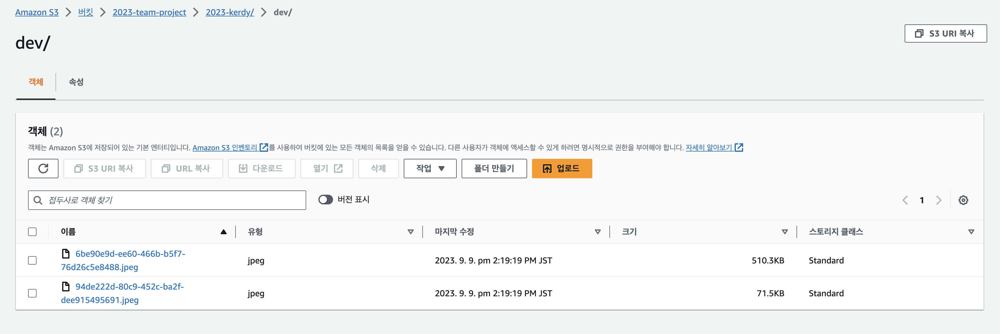

Kerdy 서비스를 구현하면서 새로운 기능이 추가/개선됨에 따라 이미지를 저장하고 관리할 필요가 생겼다. 그래서 이번에 S3와 CloudFront를 셋팅하고, S3 버킷에 이미지를 저장하고 삭제하는 기능을 구현했다.


프로젝트에 할당된 S3는 기본적으로 private으로 설정되어 있었기 때문에, 우리는 S3에 접근할 수 있는 CloudFront 배포를 만들고 외부에서 S3의 자원에 접근할 때 CloudFront를 경유하도록 해야 했다.

S3 & CloudFront 셋팅 과정에서 팀에서 이미지 저장/삭제 작업을 백엔드에서 처리하느냐, 안드로이드에서 처리하느냐를 고민했었는데, 우리 팀의 경우 관리자 페이지를 만들기 위해 웹 프론트엔드 환경을 추가로 구성했기 때문에 만약 프론트 단에서 이미지를 저장/삭제하게 한다면 안드로이드와 웹 프론트 둘 다에서 처리 작업을 해야 했다. 여기에 2배의 시간 소요가 있을 것이라 생각해 백엔드에서 이미지 관리를 책임지게 하기로 했다.

흐름은 다음과 같다.


프론트엔드&안드로이드에서 MultiPartFile 형식으로 이미지 파일을 넘겨주면, 백엔드에서 해당 파일을 S3에 업로드하고, 이미지 파일의 이름을 DB에 저장한다.

이후 프론트엔드&안드로이드는 이미지에 대한 정보를 이미지 파일의 이름으로 얻게 되고, CloudFront의 배포 도메인에 해당 이미지 파일의 이름을 결합한 URL을 실제 리소스에 활용한다.

### CloudFront란

: 정적/동적 웹 컨텐츠에 대한 캐싱 기능을 지원하는 웹 CDN 서비스

캐싱을 지원하기 때문에 S3에 직접 접근하지 않고 컨텐츠를 가져올 수도 있어 비용을 절약할 수 있다.

CloudFront를 S3에 연동시키면 외부 사용자는 CloudFront의 배포 도메인 이름을 통해 S3 버킷에 접근할 수 있다.


인스턴스 설정이 모두 완료되었다고 가정하고, S3에 접근해 이미지를 관리하는 Spring 코드를 작성해보자.

## 코드 작성

---

### S3 API 사용을 위한 cloud 라이브러리 설치

- build.gradle
    
    ```java
    implementation 'org.springframework.cloud:spring-cloud-starter-aws:2.2.6.RELEASE’
    ```
    

### Config 파일 작성

일반적으로 S3에 접근할 권한이 있는 IAM을 생성하고, 해당 IAM 계정의 Access Key 및 Secret Key를 통해 S3에 연동할 수 있도록 설정파일을 작성한다.

- AwsS3Config
    
    ```java
    @Configuration
    public class AwsS3Config {
    
        @Value("${cloud.aws.credentials.access-key}")
        private String accessKey;
    
        @Value("${cloud.aws.credentials.secret-key}")
        private String secretKey;
    
        @Value("${cloud.aws.region.static}")
        private String region;
    
        @Bean
        public AmazonS3Client amazonS3Client() {
            BasicAWSCredentials awsCreds = new BasicAWSCredentials(accessKey, secretKey);
            return (AmazonS3Client) AmazonS3ClientBuilder.standard()
                    .withRegion(region)
                    .withCredentials(new AWSStaticCredentialsProvider(awsCreds))
                    .build();
        }
    }
    ```
    
- application.yml
    
    ```yaml
    cloud:
      aws:
        credentials:
          access-key: "IAM 계정의 Access Key"
          secret-key: "IAM 계정의 Secret Key"
        region:
          static: "리전"
        s3:
          bucket: "S3 버킷의 이름"
        stack:
          auto: false
    ```
    
    - **credentials**: IAM 계정의 access, secret key를 적는다.
    - **bucket**: 생성한 S3 버킷의 이름을 적는다.
    - **region**: 리전 정보를 적는다. 서울의 경우 `ap-northeast-2`이다.
    - **stack**: EC2에 Spring Cloud 프로젝트를 실행시키면 기본적으로 CloudFormation 구성을 시작하는데, 설정한 CloudFormationd이 없으면 프로젝트를 실행할 수 없기 때문에 해당 설정을 사용하지 않겠다는 뜻이다.(이게 없으면 에러가 발생한다.)

하지만 우테코에서 진행한 프로젝트의 경우, **별도의 권한 인증 없이도 EC2 인스턴스가 직접 S3에 접근할 수 있도록 설정이 되어있기 때문에** 다음과 같이 처리해주면 된다.

- AwsS3Config
    
    ```java
    @Configuration
    public class AwsS3Config {
      
      @Value("${cloud.aws.region.static}")
      private String region;
      
      @Bean
      public AmazonS3Client amazonS3Client() {
        return (AmazonS3Client) AmazonS3ClientBuilder.standard()
            .withRegion(region)
            .build();
      }
    }
    ```
    
- application.yml
    
    ```yaml
    cloud:
      aws:
        credentials:
          instance-profile: true
        region:
          static: "리전"
        s3:
          bucket: "S3 버킷의 이름"
        stack:
          auto: false
    ```
    
    - **credentials**: instance-profile을 true로 설정해주면 EC2 인스턴스는 자신의 프로필 자격 증명을 사용해 AWS 리소스(S3)에 연결을 시도한다.

+) application.yml

```yaml
spring:
  servlet:
    multipart:
      max-file-size: 10MB
      max-request-size: 10MB
```

기본적으로 multipart를 통해 보낼 수 있는 최대 파일의 크기(max-file-size)와 최대 요청용량(max-request-size)은 1MB인데, 넉넉하게 10MB로 설정해준다.

### ImageService 구현

여러 개의 이미지를 추가/삭제하는 서비스 기능을 구현해보자.

```java
@Service
@RequiredArgsConstructor
public class ImageService {
  
  public static final String EXTENSION_DELIMITER = ".";
  private static List<String> ALLOWED_FILE_EXTENSIONS = List.of(".jpg", ".png", ".jpeg");
  
  @Value("${cloud.aws.s3.bucket}")
  private String bucket;
  
  private final AmazonS3 amazonS3;
  
  public List<String> uploadImages(final List<MultipartFile> multipartFiles) {
    List<String> fileNameList = new ArrayList<>();
    
    multipartFiles.forEach(file -> {
      final String fileExtension = extractFileExtension(file);
      
      String newFileName = UUID.randomUUID().toString().concat(fileExtension); // 파일명 난수화
      ObjectMetadata objectMetadata = new ObjectMetadata();
      objectMetadata.setContentLength(file.getSize());
      objectMetadata.setContentType(file.getContentType());
      
      try (InputStream inputStream = file.getInputStream()) {
        amazonS3.putObject(new PutObjectRequest(bucket, newFileName, inputStream, objectMetadata)
            .withCannedAcl(CannedAccessControlList.PublicRead));    //public read 권한으로 업로드
      } catch (IOException e) {
        throw new ImageException(ImageExceptionType.FAIL_UPLOAD_IMAGE);
      }
      fileNameList.add(newFileName);
    });
    
    return fileNameList;
  }
  
  private String extractFileExtension(MultipartFile file) {
    final String originalFileName = file.getOriginalFilename();
    final int extensionIndex = Objects.requireNonNull(originalFileName)
        .lastIndexOf(EXTENSION_DELIMITER);
    if (extensionIndex == -1 || !ALLOWED_FILE_EXTENSIONS.contains(
        originalFileName.substring(extensionIndex))) {
      throw new ImageException(ImageExceptionType.INVALID_FILE_FORMAT);
    }
    return originalFileName.substring(extensionIndex);
  }
  
  public void deleteImages(final List<String> fileNames) {
    fileNames.forEach((fileName) ->
        amazonS3.deleteObject(new DeleteObjectRequest(bucket, fileName)));
  }
}
```

조금씩 쪼개서 설명을 해보겠다.

```java
public List<String> uploadImages(final List<MultipartFile> multipartFiles) {
    List<String> fileNameList = new ArrayList<>();
    
    multipartFiles.forEach(file -> {
      final String fileExtension = extractFileExtension(file);    // 1
      
      String newFileName = UUID.randomUUID().toString().concat(fileExtension); // 2
      
			ObjectMetadata objectMetadata = new ObjectMetadata();    // 3
      objectMetadata.setContentLength(file.getSize());    // 3-1
      objectMetadata.setContentType(file.getContentType());    // 3-2
      
      try (InputStream inputStream = file.getInputStream()) {
        amazonS3.putObject(new PutObjectRequest(bucket, newFileName, inputStream, objectMetadata));    // 4
      } catch (IOException e) {
        throw new ImageException(ImageExceptionType.FAIL_UPLOAD_IMAGE);
      }
      fileNameList.add(newFileName);
    });
    
    return fileNameList;
}
```

1. 파일의 확장자(ex : ”.png”)를 추출해온다.
    
    ```java
    private String extractFileExtension(MultipartFile file) {
        final String originalFileName = file.getOriginalFilename();
        final int extensionIndex = Objects.requireNonNull(originalFileName)
            .lastIndexOf(EXTENSION_DELIMITER);
        if (extensionIndex == -1 || !ALLOWED_FILE_EXTENSIONS.contains(
            originalFileName.substring(extensionIndex))) {
          throw new ImageException(ImageExceptionType.INVALID_FILE_FORMAT);
        }
        return originalFileName.substring(extensionIndex);
    }
    ```
    
    확장자가 존재하지 않거나 확장자가 jpg, png, jpeg에 해당되지 않는 경우 예외처리를 해주었다.
    
2. 보통의 이미지 name은 중복된 이름이 생길 가능성이 높기 때문에 S3에 업로드하기 전 파일 명을 UUID.randomUUID()를 사용해 랜덤한 문자열로 다시 할당해준다.
3. 업로드하려는 파일의 형식(content length, type 등)을 지정해주는 객체이다.
    
    3-1. metadata로 content length를 설정하지 않으면 S3에 업로드는 되지만 다음과 같은 에러 로그가 발생한다고 한다.
    
    `[io-8443-exec-65] c.amazonaws.services.s3.AmazonS3Client : No content length specified for stream data.`
    
    3-2. metadata로 content type을 설정해주지 않으면 S3에 올라갈 때 contentType이 `jpg`, `png` 이런 식으로 설정되는데, 이런 type의 파일은 url로 접속할 때 무조건 다운로드가 된다고 한다. `image/jpg`와 같이 설정해주면 이미지를 url로 조회할 수 있다.
    
4. 실제로 이미지를 S3에 업로드하는 코드이다. 버킷의 이름, 파일 명, 입력 스트림 객체 등이 파라미터로 들어간다.

### API(컨트롤러) 작성하기

실제로는 다른 API에서 이미지 서비스 기능을 호출해서 사용할 것이기 때문에 만들어줄 필요가 없지만, 테스트를 위해 이미지를 S3에 업로드/삭제하는 API를 만들어주었다.

```java
@RestController
@RequiredArgsConstructor
public class ImageTestController {
  
  private final ImageService imageService;
  
  @PostMapping("/files")
  public ResponseEntity<List<String>> uploadImages(
      @RequestPart List<MultipartFile> multipartFile) {
    return ResponseEntity.ok(imageService.uploadImages(multipartFile));
  }
  
  @DeleteMapping("/files")
  public ResponseEntity<Void> deleteImages(@RequestParam List<String> fileNames) {
    imageService.deleteImages(fileNames);
    return null;
  }
}
```

## 테스트

---

포스트맨을 사용해 이미지가 잘 업로드되는지 확인해보자.




정상적으로 업로드가 되는 것을 확인할 수 있다!

## 참고 자료

---

[[AWS] S3를 Spring에서 사용하기 - 이미지 업로드](https://doing7.tistory.com/45)

[[SpringBoot] SpringBoot를 이용한 AWS S3에 여러 파일 업로드 및 삭제 구현하기](https://earth-95.tistory.com/117)

[[AWS] Spring boot 에서 AWS S3 로 이미지 저장하기](https://my-codinglog.tistory.com/36)

[[SpringBoot] S3와 CloudFront를 이용한 사진 업로드 구현하기](https://velog.io/@jodawooooon/SpringBoot-S3와-CloudFront를-이용한-사진-업로드-구현하기)