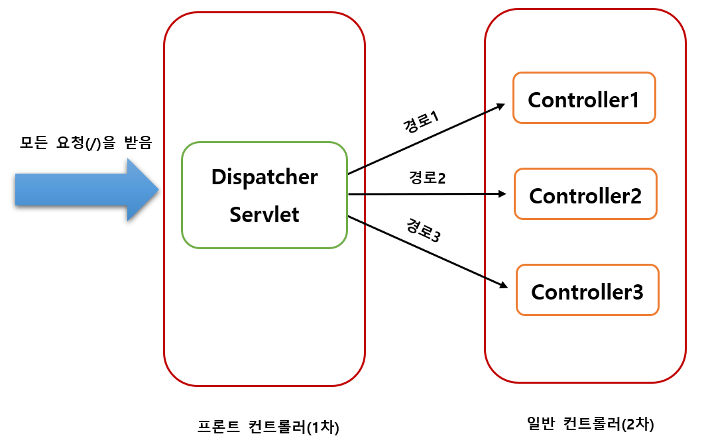
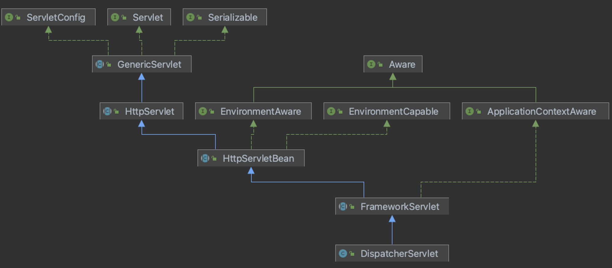
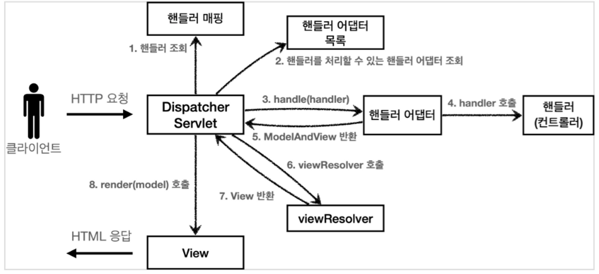

## Dispatcher-Servlet(디스패처 서블릿)

---

### 정의

<aside>
💡 디스패처 서블릿은 HTTP 프로토콜로 들어오는 모든 요청을 가장 <b>먼저</b> 받아 적합한 컨트롤러에 위임해주는 <b>프론트 컨트롤러(Front Controller)</b>이다.

</aside>

클라이언트가 요청을 보내면, Tomcat과 같은 서블릿 컨테이너가 요청을 받게 되는데, 이 모든 요청은 프론트 컨트롤러인 디스패처 서블릿이 가장 먼저 받게 된다.(모든 경로(urlPatterns=”/”)에 대해 매핑됨)

디스패처 서블릿은 모든 요청에 대해 **공통적으로** 처리해야 할 작업을 수행하고, 해당 요청을 처리해야 하는 컨트롤러를 찾아 다음 작업을 **위임**한다.

- dispatch는 사전적으로 ‘보내다’라는 뜻을 가지고 있다. 다른 컨트롤러로 요청을 전달하기 때문에 이런 이름이 붙은 것이라고 이해하면 된다.
- **Front Controller**란 서블릿 컨테이너의 제일 앞에서 서버로 들어오는 클라이언트의 **모든 요청을 받아서 처리해주는 컨트롤러**로써, MVC 구조에서 함께 사용되는 디자인 패턴이다.



### 장점

과거에는 모든 서블릿을 **URL 매핑해주기 위해 web.xml 파일에 일일이 등록**해주어야 했지만, Dispatcher Servlet이 등장하면서 애플리케이션으로 들어오는 모든 요청을 핸들링해주고 공통 작업을 처리해주면서 더 편리하게 이용할 수 있게 되었다.

이제는 우리가 컨트롤러를 구현해두기만 하면 **디스패처 서블릿이 알아서 적합한 컨트롤러로 위임**해주는 구조가 되었다.

### 정적 자원(Static Resources)의 처리

Dispatcher Servlet이 요청을 Controller로 넘겨주는 방식은 효율적이지만, 모든 요청을 처리하다보니 이미지나 HTML/CSS/JavaScript와 같은 정적 파일에 대한 요청까지 모두 가로채는 까닭에 정적 자원을 불러오지 못하는 상황도 발생한다.

이에 대한 해결책은 크게 2가지 가있다.

1. 정적 자원 요청과 애플리케이션 요청을 분리한다.

   - 예시

     `/app`의 URL로 접근하면 Dispatcher Servlet이 담당한다.
     `/resources`의 URL로 접근하면 Dispatcher Servlet이 컨트롤할 수 없으므로 담당하지 않는다.(바로 controller로 전달)

   - 단점
     - 코드가 지저분해진다.
     - 모든 요청에 대해 url을 붙여주어야 하기 때문에 직관성이 떨어진다.

2. 애플리케이션 요청을 탐색하고 없으면 정적 자원 요청으로 처리

   Dispatcher Servlet이 요청을 처리할 컨트롤러를 먼저 찾고, 요청에 대한 컨트롤러를 찾을 수 없는 경우 2차적으로 설정된 자원(Resource) 경로를 탐색하여자원을 탐색한다.

   - 장점
     - 확장성 있는 설계가 가능하다.

## 실제 코드로 알아보기

---

### DispatcherServlet의 동작 흐름



- DispatcherServlet 역시 HttpServlet을 상속하는 클래스이다.
  - 서블릿이 호출되면 HttpServlet이 제공하는 `service()` 메서드가 호출된다.
  - `service()`는 FrameworkServlet에서 오버라이드되기 때문에, 기본적으로 FrameworkServlet에서 구현된 로직이 실행된다.
  - `FrameworkServlet.service()`를 시작으로 여러 메서드가 실행되며, `DispatcherServlet.doDispatch()`가 호출된다.
- `doDispatch()` 메서드 분석(이해를 위해 원래 코드를 단순화 시킨 것)

  ```java
  protected void doDispatch(HttpServletRequest request,
                                HttpServletResponse response) throws Exception {

      HttpServletRequest processedRequest = request;
      HandlerExecutionChain mappedHandler = null;
      ModelAndView mv = null;

      // 1. 핸들러 조회
      mappedHandler = getHandler(processedRequest);
      if (mappedHandler == null) {
          noHandlerFound(processedRequest, response);
          return;
      }
      //2.핸들러 어댑터 조회-핸들러를 처리할 수 있는 어댑터
      HandlerAdapter ha = getHandlerAdapter(mappedHandler.getHandler());
      /**
       * 3. 핸들러 어댑터 실행
       * -> 4. 핸들러 어댑터를 통해 핸들러 실행
       * -> 5. ModelAndView 반환 mv = ha.handle(processedRequest, response, mappedHandler.getHandler());
       */
  		mv = ha.handle(processedRequest, response, mappedHandler.getHandler());

      processDispatchResult(processedRequest, response, mappedHandler, mv, dispatchException);
  }

  private void processDispatchResult(HttpServletRequest request,
                                     HttpServletResponse response,
                                     HandlerExecutionChain mappedHandler,
                                     ModelAndView mv, Exception exception) throws Exception {
      // 뷰 렌더링 호출
      render(mv, request, response);
  }

  protected void render(ModelAndView mv, HttpServletRequest request,
                        HttpServletResponse response) throws Exception {
      View view;
      String viewName = mv.getViewName(); //6. 뷰 리졸버를 통해서 뷰 찾기,7.View 반환
      view = resolveViewName(viewName, mv.getModelInternal(), locale, request);
      // 8. 뷰 렌더링
      view.render(mv.getModelInternal(), request, response);
  }
  ```

  - `mappedHandler = get Handler(processedRequest)`
    - 요청에 맞는 적절한 핸들러를 찾는다.(핸들러 조회)
  - `noHandlerFound(processedRequest, response)`
    - 적절한 핸들러를 찾지 못한 경우 404 에러 코드를 반환한다.
  - `HandlerAdapter ha = getHandlerAdapter(mappedHandler.getHandler())`
    - 찾은 핸들러를 처리할 수 있는 핸들러 어댑터를 찾는다. 만약 찾지 못할 경우 ServletException이 발생한다.(핸들러 어댑터 조회)
  - `mv = ha.handle(processedRequest, response, mappedHandler.getHandler())`
    - 찾은 핸들러 어댑터를 이용해 **로직을 수행**한다.(핸들러 어댑터&핸들러 실행)
    - 결과로 ModelAndView를 받아오고 mv에 저장한다.
  - `processDispatchResult(processedRequest, response, mappedHandler, mv, dispatchException)`
    - 앞서 얻은 ModelAndView 객체를 뷰 리졸버로 넘긴다.(viewResolver 호출)
    - 뷰 리졸버는 뷰 객체를 반환한다(View 반환)
    - 뷰를 통해 뷰를 렌더링한다.(렌더링)
    - 실제 코드는 더 복잡하다!
      

### 인터페이스를 구현하여 Dispatcher Servlet 동작 제어하기

Dispatcher Servlet의 코드를 직접 수정하지 않고 **Dispatcher Servlet이 의존하는 인터페이스를 구현**함으로써 커스텀 컨트롤러를 만드는 것이 가능하다.

- 주요 인터페이스 목록
  - 핸들러 매핑 : `org.springframework.web.servlet.HandlerMapping`
  - 핸들러 어댑터 : `org.springframework.web.servlet.HandlerAdapter`
  - 뷰 리졸버 : `org.springframework.web.servlet.ViewResolver`
  - 뷰 : `org.springframework.web.servlet.View`

이 과정에 대해서는 추후 Spring MVC 포스팅에서 다루겠다.

## 참고 자료

---

[[Spring] Dispatcher-Servlet(디스패처 서블릿)이란? 디스패처 서블릿의 개념과 동작 과정](https://mangkyu.tistory.com/18)

[스프링 MVC - 구조 이해](https://catsbi.oopy.io/f52511f3-1455-4a01-b8b7-f10875895d5b)
