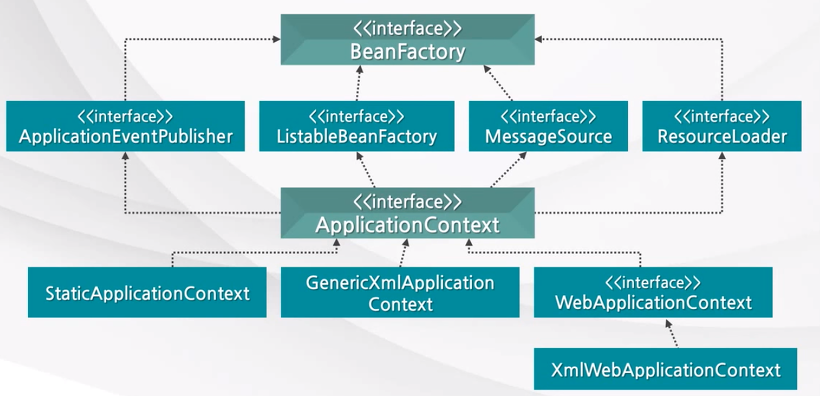

## 정의

---

### Container(컨테이너)란?

- 스프링을 사용할 때 다루고자 하는 객체를 담는 공간을 컨테이너라고 한다.
- 컨테이너는 객체의 생명주기를 관리하고 생성된 객체들에게 추가적인 기능을 제공한다.

### 소프트 웨어 전략 : IoC(Inversion of Control, 제어의 역전)

: 개발자가 아니라 라이브러리(프레임워크)가 프로그램의 흐름 제어에 대한 주체가 소프트웨어 디자인 패턴.

전통적인 프로그래밍에서 개발자가 작성한 프로그램이 외부 라이브러리의 코드를 호출하는 식의 흐름을 이용한다. 반면 IoC가 적용된 구조에서는 외부 라이브러리의 코드가 프로그래머가 작성한 코드를 호출한다.

💡대부분의 프레임워크에서 사용하고 있는 방법으로, 개발자는 **필요한 부분을 개발해서 끼워넣는 방식**으로 개발을 하게 된다.

이렇게 조립된 코드의 최종 호출은 개발자에 의해 제어되는 것이 아니라 **프레임워크 내부에서 결정된 대로** 이루어지게 되는데, 이것을 기존 패러다임에서 벗어났다고 하여 “**제어의 역전**”이라고 표현한다.

- 목적(장점)
  - 작업을 구현하는 방식과 작업을 수행하는 것 자체를 분리한다.
  - 모듈을 제작할 때 모듈과 외부 프로그램의 결합에 대해 고민할 필요 없이 모듈의 목적에 집중할 수 있다.
  - 모듈을 바꾸어도 다른 시스템에 부작용을 일으키지 않는다.

### IoC Container

스프링에서 IoC(제어의 역전)라 함은 쉽게 말해 객체(Bean)의 생성과 의존관계에 대한 관리(control)를 사용자가 직접 하는 것이 아닌 스프링 컨테이너가 책임지는 구조를 의미한다.

즉 IoC Container란 스프링에서 객체를 생성하고 의존성을 관리하는 컨테이너를 의미한다.

이해를 돕기 위해 스프링과 자바의 객체 생성 및 실행 순서를 비교하면 다음과 같다.

- 자바
  객체 생성⇒의존성 객체 **생성(클래스 내부에서 생성)** ⇒의존성 객체 메소드 호출
  ```java
  자바에서는 사용자가 작성한 코드에 따라 객체를 생성하고 의존관계를 주입한다.
  ```
- 스프링
  객체 생성⇒의존성 객체 **주입(제어권을 스프링에 위임하여 스프링이 만들어놓은 객체를 주입하게 한다)** ⇒의존성 객체 메소드 호출
  ```java
  스프링에서는 사용자가 별도의 어노테이션만 선언해주면 스프링의 IoC 컨테이너가 알아서 객체(Bean)를 생성하고 의존관계를 주입해준다.
  ```

### DL(Dependency Lookup)과 DI(Dependency Injection)

스프링은 IoC를 구현하기 위해서 DL(Dependency Lookup)과 DI(Dependency Injection) 두 가지 전략을 사용하고 있는데, 개념은 다음과 같다.

- DL : 저장소에 저장되어 있는 객체(Bean)에 접근하기 위해 컨테이너가 제공하는 API를 이용해 Bean을 조회(색인)하는 것.
- DI(의존성 주입) : 각 클래스 간의 의존관계를 빈 설정(Bean Definition) 정보를 바탕으로 컨테이너가 자동으로 연결해주는 것
  - Setter Injection
  - Constructor Injection
  - Method Injection

⚠️DL 사용 시 컨테이너 종속이 증가하기 때문에 주로 DI를 사용한다.

## DI Container

---

객체의 생성과 객체 사이의 의존관계, 즉 제어(control)를 DI 관점에서 볼 때 IoC Container를 **DI Container**로 부르기도 한다.

Spring의 DI Container는 스프링 객체(Bean)을 관리하므로 `BeanFactory`라고 부르며, 스프링 프레임워크에서 동일 명칭의 인터페이스로 정의되어 있다.

BeanFactor에 여러가지 컨테이너 기능을 추가한 것을 `ApplicationContext`라고 한다.

### BeanFactory

: IoC Container의 기본이 되는 인터페이스로, Bean을 관리하는 역할을 한다.

- Bean을 등록/생성/조회/반환한다.
- 보통은 BeanFactory를 바로 사용하지 않고(인터페이스라서) 구현체인 ApplicationContext를 사용한다.
- getBean() 메서드가 정의되어 있다.

### ApplicationContext

: BeanFactory를 구현하고 있는 클래스로, BeanFactory에 비해 더 많은 기능을 제공하고 있다.

💡Spring의 DI Container 구조



## IoC Container의 생명주기(Lifecycle)

---

### Bean 객체의 생명주기

`스프링 빈 생성→의존관계 주입→초기화→소멸`로 구성된다.

여기서 빈을 초기화/소멸시킬 때 사용되는 콜백(콜백함수)을 알아보자.

- InitializingBean, DisposableBean 인터페이스를 사용한 방법
  - afterPropertiesSet() : 스프링 빈 초기화
  - destroy() : 스프링 빈 소멸
  ```java
  public class NetworkClient implements InitializingBean, DisposableBean {
      private String url;

      public NetworkClient() {
          System.out.println("생성자 호출 url = " + url);
      }

      public void setUrl(String url) {
          this.url = url;
      }
      //서비스 시작시 호출
      public void connect() {
          System.out.println("connect = " + url);
      }
      public void call(String msg) {
          System.out.println("call : " + url + "message = " + msg);
      }
      //서비스 종료시 호출
      public void disconnect() {
          System.out.println("close = " + url);
      }

      @Override
      public void afterPropertiesSet() throws Exception {
          System.out.println("NetworkClient.afterPropertiesSet");
          connect();
          call("초기화 연결 메세지");
      }

      @Override
      public void destroy() throws Exception {
          System.out.println("NetworkClient.destroy");
          disconnect();
      }
  }
  ```
  ⚠️ 스프링 전용 인터페이스이기 때문에 외부 라이브러리에서는 사용할 수 없다.
- `@Configuration`을 붙인 설정 정보에 초기화/소멸 콜백함수를 지정하는 방법
  ```java
  @Configuration
  static class LifeCycleConfig{
  		@Bean(initMethod = "init", destroyMethod="close")
      public NetworkClient networkClient() {
          NetworkClient networkClient = new NetworkClient();
          networkClient.setUrl("https://hong.com");
          return networkClient;
      }
  }
  ```
  ```java
  public class NetworkClient{
      private String url;

      public NetworkClient() {
          System.out.println("생성자 호출 url = " + url);
      }
      public void setUrl(String url) {
          this.url = url;
      }
      //서비스 시작시 호출
      public void connect() {
          System.out.println("connect = " + url);
      }
      public void call(String msg) {
          System.out.println("call : " + url + "message = " + msg);
      }
      //서비스 종료시 호출
      public void disconnect() {
          System.out.println("close = " + url);
      }
      public void init() throws Exception {
          System.out.println("NetworkClient.init");
          connect();
          call("초기화 연결 메세지");
      }
      public void close() throws Exception {
          System.out.println("NetworkClient.close");
          disconnect();
      }
  }
  ```
  콜백 함수의 이름을 자유롭게 지정할 수 있고, 스프링 설정 정보를 사용하는 방법이므로 외부 라이브러리에서도 사용 가능하다.
- @PostConstruct, @PreDestroy 어노테이션 사용하기
  ```java
  @Configuration
  static class LifeCycleConfig{
  		@Bean(initMethod = "init", destroyMethod="close")
      public NetworkClient networkClient() {
          NetworkClient networkClient = new NetworkClient();
          networkClient.setUrl("https://hong.com");
          return networkClient;
      }
  }
  ```
  ```java
  public class NetworkClient{
      private String url;

      //...

      @PostConstruct
      public void init() throws Exception {
          System.out.println("NetworkClient.init");
          connect();
          call("초기화 연결 메세지");
      }

      @PreDestroy
      public void close() throws Exception {
          System.out.println("NetworkClient.close");
          disconnect();
      }
  }
  ```
  어노테이션 하나만 붙이면 되기 때문에 편리하다.

### IoC 컨테이너의 생명주기

크게 `생성→빈 설정→사용→소멸`로 구성된다.

아래와 같이 스프링 컨테이너에 대한 라이프사이클 메서드를 사용할 수 있다.

```java
AnnotationConfigApplicationContext ac = new AnnotationConfigApplicationContext();
	ac.register();//빈 추가로 등록
	ac.referesh();//등록하기 위한 갱신
	ac.close();//소멸 메서드, 이때 빈도 같이 소멸
```

- 앞 목차에서 작성한 NetworkClient 빈 객체를 사용하는 예제 코드
  ```java
  public class BeanLifeCycleTest {
      @Test
      public void lifeCycleTest(){
          ConfigurableApplicationContext ac = new AnnotationConfigApplicationContext(LifeCycleConfig.class);
          NetworkClient networkClient = ac.getBean(NetworkClient.class);
          ac.close();
      }

      @Configuration
      static class LifeCycleConfig{
          @Bean(initMethod = "init", destroyMethod="close")
  		    public NetworkClient networkClient() {
  		        NetworkClient networkClient = new NetworkClient();
  		        networkClient.setUrl("https://hong.com");
  		        return networkClient;
  		    }
      }
  }
  ```
  lifeCycleTest() 메서드의 첫 라인에서 ApplicationContext 클래스 생성자의 매개변수로 LifeCycleConfig 클래스를 넣어줌으로써 ac 객체는 NetworkClient 빈 객체를 얻었다.

## 결론

<aside>
💡 스프링의 IoC 컨테이너는 객체의 생성과 의존성을 제어한다. 즉 제어의 흐름을 사용자가 컨트롤하는 것이 아니라 스프링(프레임워크)에게 맡겨 작업을 처리하는 방식을 IoC라고 하며, 그것을 구현하고 있는 기술이 IoC 컨테이너이다.

</aside>

## 🔗참고 게시글

[[Spring] IoC(Inversion of Control : 제어의 역전)컨테이너란?](https://choicode.tistory.com/31)

[IoC 컨테이너와 DI(Dependency Injection)](https://dog-developers.tistory.com/12)

[<Spring> 스프링 핵심원리 이해 8 - 스프링 컨테이너와 빈 생명주기 콜백](https://hongchangsub.com/springcore8/)
