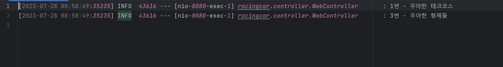
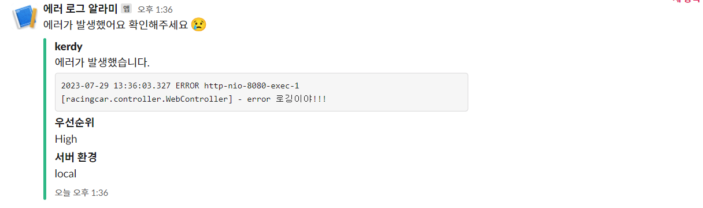

`ConsoleAppender`, `RollingFileAppender`, `LevelFilter`, `ThresholdFilter`

이들은 logback에서 기본적으로 제공해주고 있는 구현 클래스들이다.

Appender와 Filter 인터페이스(추상 클래스)를 직접 구현하여 Logger가 우리가 원하는 동작을 수행하게끔 커스텀을 할 수 있다.

## 커스텀 Filter - 특정 단어 감지하기

**Filter** 추상 클래스를 상속하고 **decide()** 메서드를 구현함으로서 커스텀 필터를 구현할 수 있다.

“우아한”이라는 단어가 포함된 로그만 필터링해주는 필터를 만들어보자.

```java
public class WordFilter extends Filter<ILoggingEvent> {

  @Override
  public FilterReply decide(ILoggingEvent event) {
    if (event.getMessage().contains("우아한")) {
      return FilterReply.ACCEPT;
    } else {
      return FilterReply.DENY;
    }
  }
}
```

이렇게 구현한 필터 클래스를 appender에 포함시키고

```xml
<appender name="FILE" class="ch.qos.logback.core.rolling.RollingFileAppender">
		<filter class="racingcar.WordFilter" />
		...
</appender>

<logger name="racingcar" level="INFO">
    <appender-ref ref="FILE" />
</logger>
```

다음 로그들을 출력하면

```java
@GetMapping
public void log(){
    log.info("1번 - 우아한 테크코스");
    log.info("2번 - 10분 테코톡");
    log.info("3번 - 우아한 형제들");
    log.info("4번 - 프롤로그 로드맵");
}
```

이렇게 “우아한”이라는 단어가 포함된 1번, 3번 로그만 출력되는 것을 확인할 수 있다.



## Appender 커스텀 - 슬랙에 알람 보내기

**AppenderBase\<ILoggingEvent\>** 라는 추상 클래스를 상속받고 `appender()` 메서드를 구현함으로써 커스텀 Appender를 만들 수 있다.

**Error 레벨**의 로그가 찍힐 때마다 슬랙에 알람이 오도록 설정해보겠다.

이를 위해선 사전 작업으로 알람을 받을 **슬랙 채널의 웹 훅 URL**이 필요하다.

<aside>

💡 이 URL을 발급 받는 과정은 제가 예전에 작성했던 [블로그 포스트](https://amaran-th.github.io/%EC%9D%B8%ED%94%84%EB%9D%BC/[CICD]%20Github%20Actions%EC%99%80%20%EC%8A%AC%EB%9E%99%20%EC%95%8C%EB%9E%8C%20%EC%97%B0%EB%8F%99%ED%95%98%EA%B8%B0/)에 참조되어 있으니 확인 바란다.

</aside>

````java
public class SlackAppender extends AppenderBase<ILoggingEvent> {
    @Override
    protected void append(final ILoggingEvent eventObject) {
        final var restTemplate = new RestTemplate();
        final var url = "[발급 받은 슬랙 훅 URL]";
        final Map<String, Object> body = createSlackErrorBody(eventObject);
        restTemplate.postForEntity(url, body, String.class);
    }

    private Map<String, Object> createSlackErrorBody(final ILoggingEvent eventObject) {
        final String message = createMessage(eventObject);
        return Map.of(
                "attachments", List.of(
                        Map.of(
                                "fallback", "요청을 실패했어요 :cry:",
                                "color", "#2eb886",
                                "pretext", "에러가 발생했어요 확인해주세요 :cry:",
                                "author_name", "car-ffeine",
                                "text", message,
                                "fields", List.of(
                                        Map.of(
                                                "title", "우선순위",
                                                "value", "High",
                                                "short", false
                                        ),
                                        Map.of(
                                                "title", "서버 환경",
                                                "value", "local",
                                                "short", false
                                        )
                                ),
                                "ts", eventObject.getTimeStamp()
                        )
                )
        );
    }

    private String createMessage(final ILoggingEvent eventObject) {
        final String baseMessage = "에러가 발생했습니다.\n";
        final String pattern = baseMessage + "```%s %s %s [%s] - %s```";
        final SimpleDateFormat simpleDateFormat = new SimpleDateFormat("yyyy-MM-dd HH:mm:ss.SSS");
        return String.format(pattern,
                simpleDateFormat.format(eventObject.getTimeStamp()),
                eventObject.getLevel(),
                eventObject.getThreadName(),
                eventObject.getLoggerName(),
                eventObject.getFormattedMessage());
    }
}
````

xml 파일에서는 구현한 Appender 클래스를 추가해준다.

```xml
<appender name="SLACK_APPENDER" class="racingcar.SlackAppender">
  </appender>
```

Slack에 알람을 보내는 로깅 작업이 비동기적으로 실행되도록 하려면 다음과 같이 **AsyncAppender** 내부에서 커스텀 Appender를 참조하게 하면 된다.

```xml
<appender name="ASYNC_SLACK_APPENDER" class="ch.qos.logback.classic.AsyncAppender">
    <filter class="ch.qos.logback.classic.filter.ThresholdFilter">
        <level>ERROR</level>
    </filter>
    <appender-ref ref="SLACK_APPENDER"/>
</appender>
```

추가한 xml 파일 전문은 다음과 같다.

```xml
<appender name="SLACK_APPENDER" class="racingcar.SlackAppender">
  </appender>

  <appender name="ASYNC_SLACK_APPENDER" class="ch.qos.logback.classic.AsyncAppender">
    <filter class="ch.qos.logback.classic.filter.ThresholdFilter">
      <level>ERROR</level>
    </filter>
    <appender-ref ref="SLACK_APPENDER"/>
  </appender>
...
<logger name="racingcar" level="INFO">
    <appender-ref ref="ASYNC_SLACK_APPENDER" />
  </logger>
```

Error 레벨의 로그를 발생시키면 연동시킨 슬랙 채널에 다음과 같이 알람이 오는 것을 확인할 수 있다.



## 참고 자료

---

[스프링에서 발생한 에러 로그를 슬랙으로 모니터링하는 방법](https://be-student.tistory.com/90)
[Github Actions와 슬랙 알람 연동하기](https://amaran-th.github.io/%EC%9D%B8%ED%94%84%EB%9D%BC/[CICD]%20Github%20Actions%EC%99%80%20%EC%8A%AC%EB%9E%99%20%EC%95%8C%EB%9E%8C%20%EC%97%B0%EB%8F%99%ED%95%98%EA%B8%B0/)
[[Spring] Logback으로 로깅(Logging)하기](<https://amaran-th.github.io/Spring/%5BSpring%5D%20Logback%EC%9C%BC%EB%A1%9C%20%EB%A1%9C%EA%B9%85(Logging)%ED%95%98%EA%B8%B0/>)
