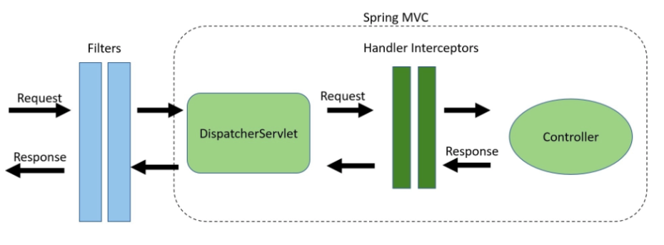

<aside>
💡 nextstep의 학습테스트 자료를 사용하였습니다.

[https://github.com/next-step/spring-learning-test/tree/mvc-config](https://github.com/next-step/spring-learning-test/tree/mvc-config)

</aside>

configuration 파일 설정해서 다음 3가지 미션 해결하기

1. view controller 설정

   : “/” 요청 시 hello.html 페이지 응답하기(@GetMapping을 사용하지 않고)

2. interceptor 설정

   : “/admin/\*\*” 요청 시 LoginInterceptor가 동작하게 하기

3. Argument Resolver 설정

   AuthenticationPrincipalArgumentResolver 등록하기

## Spring MVC

---

Java Configuration 클래스를 통해 Spring MVC 지원을 활성화하려면 `@Configuration` 클래스에 `@EnableWebMvc` 주석을 추가해야 한다.

```java
@EnableWebMvc
@Configuration
public class WebMvcConfiguration {
		//...
}
```

이렇게 하면 Controller 및 매핑 등록, 형식 변환기, 유효성 검사 지원, 예외 처리와 같은 MVC 프로젝트에 필요한 **기본 지원이 설정**된다.

`WebMvcConfigurer` 인터페이스를 구현하는 식으로 사용자 정의 Configuration을 만들면 훨씬 편리하다.

```java
@Configuration
public class WebMvcConfiguration implements WebMvcConfigurer {
		...
}
```

## View Controllers 설정

---

### 미션 - “/” 요청 시 hello.html 페이지 응답하기

```java
@Configuration
public class WebMvcConfiguration implements WebMvcConfigurer {
		...
    @Override
    public void addViewControllers(ViewControllerRegistry registry) {
        registry.addViewController("/").setViewName("hello");
    }
		...
}
```

위 코드를 xml 파일로 작성한다면 다음과 같다.

```xml
<mvc:view-controller path="/" view-name="home"/>
```

<aside>
⚠️ 만약 @Configuration에서 처리한 url에 대해 View Controller에서 @RequestMapping을 통해 처리하려 한다면 오류가 발생한다.

</aside>

### ViewControllerRegistry

ViewControllerRegistry를 사용하면 URL과 View 이름 사이에 직접 매핑을 생성하는 View Controller를 등록할 수 있다.

이렇게 하면 둘 사이에 별도의 Controller 핸들러가 필요하지 않다.

## Interceptor 설정

---

### 미션 - `/admin/**` 요청 시 LoginInterceptor가 동작하게 하기

```java
@Configuration
public class WebMvcConfiguration implements WebMvcConfigurer {
		...
		@Override
    public void addInterceptors(InterceptorRegistry registry) {
        registry.addInterceptor(new LoginInterceptor()).addPathPatterns("/admin/**");
    }
		...
}
```

```xml
<mvc:interceptors>
    <bean class="org.springframework.web.servlet.i18n.LocaleChangeInterceptor"/>
    <mvc:interceptor>
        <mvc:mapping path="/admin/**"/>
        <bean class="nextstep.helloworld.mvcconfig.ui.LoginInterceptor"/>
    </mvc:interceptor>
</mvc:interceptors>
```

### Interceptor란

Intercept란 사전적으로 **가로채다**라는 의미를 가지고 있다.

이 뜻과 같이 사용자가 서버로 요청을 보낼 때, 요청이 컨트롤러에 도달하기 전에 **Request 객체를 낚아채서** 개발자가 원하는 작업을 수행할 수 있도록 하는 것을 **Interceptor**(인터셉터)라고 한다.



- **이미지에 대한 보충 설명**
  - Request 요청이 컨트롤러로 도달하는 과정
    `HTTP 요청`→`WAS`→`Filter`→`서블릿`→`Interceptor`→`Controller`
  - `Filter` - **서블릿**이 제공
  - `Interceptor` - **스프링 MVC**가 제공

### Interceptor의 활용

- Interceptor는 이를테면 로그인 체크, 권한 체크와 같은 **검증/필터링 기능**을 수행하게 할 수 있다.
- 매 컨트롤러에서 요청을 검증하는 작업을 Interceptor 동작으로 분리함으로써 **코드중복을 줄일 수 있다.**
- 인터셉터는 **url을 기준으로 적용**할 수 있기 때문에 코드 누락에 대한 걱정을 덜 수 있다.

### Interceptor 구현하기

Spring의 Interceptor는 `HandlerInterceptorAdapter` 클래스를 확장하거나 `HandlerInterceptor` 인터페이스를 구현하는 클래스이다.

<aside>
💡 HandlerInterceptor에는 세 가지 주요 메서드가 포함되어 있다.

- prehandle() : 실제 핸들러 실행 전에 호출된다.

- postHandle() : 핸들러가 실행된 후 호출된다.

- afterCompletion() : 요청 처리가 완료되고 뷰가 생성된 후 호출된다.

**\*핸들러** : 컨트롤러에서 @RequestMapping 등으로 매핑되는 HTTP 요청 처리 메서드

</aside>

```java
public interface HandlerInterceptor {

		default boolean preHandle(HttpServletRequest request, HttpServletResponse response, Object handler)
			throws Exception {
				return true;
		}

		default void postHandle(HttpServletRequest request, HttpServletResponse response, Object handler,
			@Nullable ModelAndView modelAndView) throws Exception {
		}

		default void afterCompletion(HttpServletRequest request, HttpServletResponse response, Object handler,
			@Nullable Exception ex) throws Exception {
		}
}
```

이벤트 발생 시 콜백 함수를 실행시키는 이벤트 리스너처럼 사용할 수 있다.

<br>

학습 테스트 자료에서 제공하고 있는 LoginInterceptor 클래스는 다음과 같이 구현되어 있다.

`HandlerInterceptorAdapter`를 확장하고 있고, `preHandle()` 메서드를 오버라이딩하고 있다.

```java
public class LoginInterceptor extends HandlerInterceptorAdapter {
    @Override
    public boolean preHandle(HttpServletRequest request, HttpServletResponse response, Object handler) throws Exception {
        String accessToken = request.getHeader("Authorization");
        if (accessToken == null) {
            throw new AuthorizationException();
        }

        return super.preHandle(request, response, handler);
    }
}
```

이렇게 Interceptor 클래스를 구현해준 뒤, 앞에서 한 대로 `@Configuration` 클래스(혹은 xml 설정파일)에서 Interceptor 클래스를 Bean으로 등록하고 Interceptor를 적용할 url을 작성해주면 된다.

```java
@Configuration
public class WebMvcConfiguration implements WebMvcConfigurer {
		...
		@Override
    public void addInterceptors(InterceptorRegistry registry) {
        registry.addInterceptor(new LoginInterceptor()).addPathPatterns("/admin/**");
    }
		...
}
```

## Argument Resolver 설정

---

### 미션 - AuthenticationPrincipalArgumentResolver 등록하기

```java
@Configuration
public class WebMvcConfiguration implements WebMvcConfigurer {
		...
		@Override
    public void addArgumentResolvers(List<HandlerMethodArgumentResolver> resolvers) {
        resolvers.add(new AuthenticationPrincipalArgumentResolver());
    }
}
```

### Argument Resolver란?

Argument Resolver를 사용하면 컨트롤러 메서드의 파라미터 중 특정 조건에 맞는 파라미터가 있을 때 요청에 들어온 값을 이용해 원하는 객체를 만들어 바인딩(파싱)해줄 수 있다.

요청에 들어있는 데이터를 추출해 필요한 데이터 객체로 파싱한다.

Argument Resolver 클래스는 인터페이스 `HandlerMethodArgumentResolver`를 구현해야 한다.

<aside>
💡 HandlerMethodArgumentResolver는 다음 2 가지의 추상 메서드를 가지고 있다.

- supportsParameter() : 주어진 메소드의 파라미터가 이 Argument Resolver에서 지원하는 타입인지 검사한다. 지원한다면 true 를, 그렇지 않다면 false 를 반환한다.

- resolveArgument() : 이 메소드의 반환값이 대상이 되는 메소드의 파라미터에 바인딩된다.

</aside>

### 사용자 정의 Argument Resolver 만들기

다음과 같이 Resolver를 거친 매개변수를 나타낼 어노테이션 `@Version`을 커스텀한다.

```java
@Target(ElementType.PARAMETER)
@Retention(RetentionPolicy.RUNTIME)
public @interface AuthenticationPrincipal {
    boolean required() default true;
}
```

이후 인터페이스 `HandlerMethodArgumentResolver`를 구현하여 커스텀 Argument Resolver를 만든다.

```java
public class AuthenticationPrincipalArgumentResolver implements HandlerMethodArgumentResolver {

    @Override
    public boolean supportsParameter(MethodParameter parameter) {
        return parameter.hasParameterAnnotation(AuthenticationPrincipal.class);
    }

    @Override
    public Object resolveArgument(MethodParameter parameter, ModelAndViewContainer mavContainer, NativeWebRequest webRequest, WebDataBinderFactory binderFactory) {
        return new LoginMember(1L, "email", 120);
    }
}
```

마지막으로 @Configuration 클래스에 Resolver를 추가해준다.

```java
@Configuration
public class WebMvcConfiguration implements WebMvcConfigurer {
		...
		@Override
    public void addArgumentResolvers(List<HandlerMethodArgumentResolver> resolvers) {
        resolvers.add(new AuthenticationPrincipalArgumentResolver());
    }
}
```

이렇게 하면 컨트롤러에서 다음과 같이 사용할 수 있다.

```java
@RestController
public class MvcConfigController {
		@GetMapping("/members/me")
    public ResponseEntity<LoginMember> findMemberOfMine(@AuthenticationPrincipal LoginMember loginMember) {
        return ResponseEntity.ok().body(loginMember);
    }
		...
}
```

### Interceptor와 Argument Resolver 비교

둘은 요청이 컨트롤러에 도달하기 전에 Request를 처리한다는 점에서 유사한 역할을 수행한다.

다만 Interceptor는 실제 **컨트롤러가 실행되기 전**에 요청을 가로채며, **특정 객체를 반환할 수 없다**(void).

반면 ArgumentResolver는 어떠한 요청이 **컨트롤러에 들어온 직후** 수행되며 요청 객체를 **가공해서 필요한 객체로 변환**할 수 있다.

## 참고 자료

---

[Web on Servlet Stack](https://docs.spring.io/spring-framework/docs/current/reference/html/web.html#mvc-config-view-controller)

[[Spring] 스프링 인터셉터(Interceptor)란 ?](https://popo015.tistory.com/115)

[[Spring Boot] 인터셉터 / Interceptor / 로그인 여부 체크하기](https://velog.io/@seulki412/Spring-Boot-인터셉터-Interceptor-로그인-여부-체크하기)

[[Spring] Filter, Interceptor, Argument Resolver란?](https://steady-coding.tistory.com/601)
