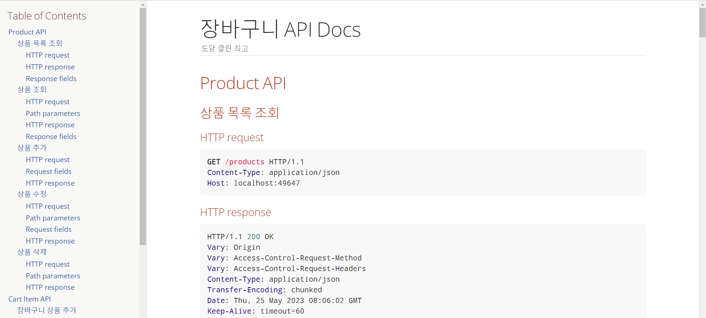
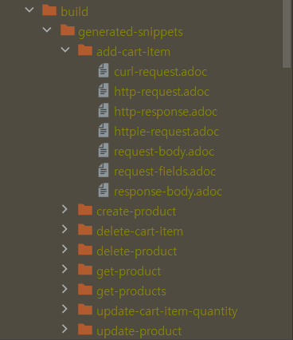
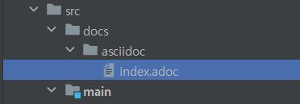
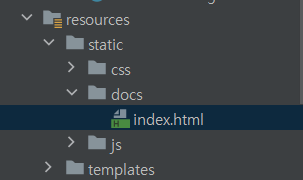
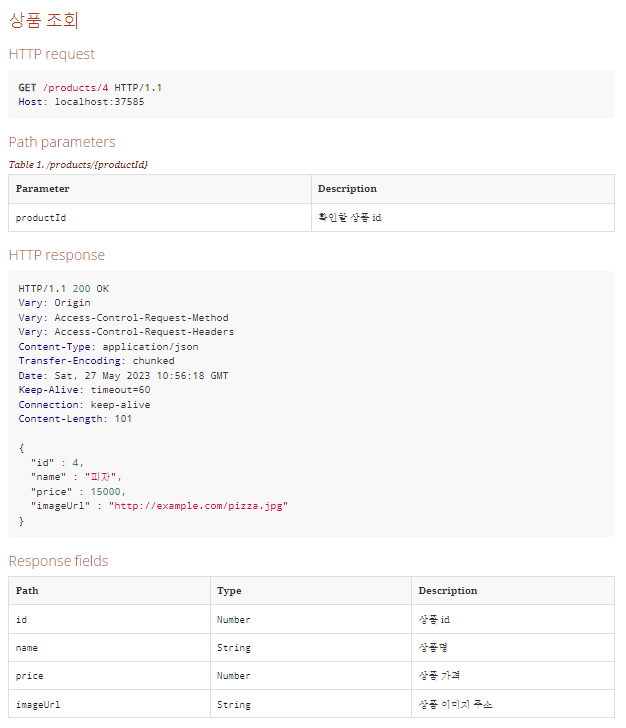
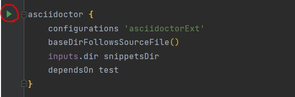
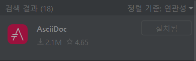
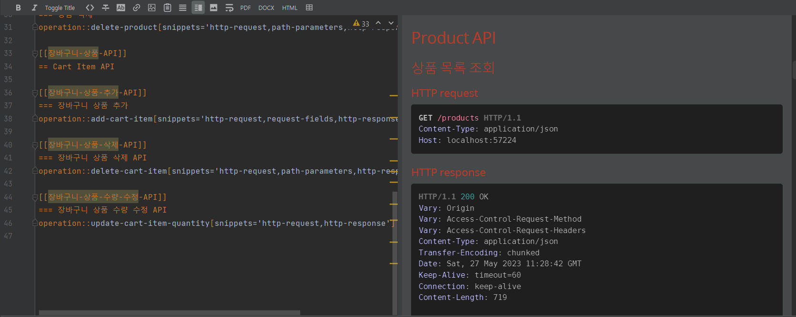
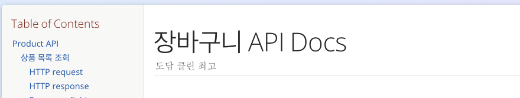
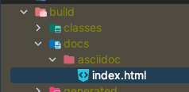

## REST Docs 소개

---

: Spring으로 만들어진 RESTful 서비스의 문서화를 도와주는 도구이다.

- Test 기반으로 Asciidoc 스니펫을 생성하고 이를 조합하여 Asciidoctor 문서를 생성한다.
- API 문서 생성을 위해서는 Test를 반드시 작성해야 한다.
- API 문서를 만들기 용이하다!

프로젝트 경험이 많다면 가끔 이렇게 생긴 API 문서를 본 적이 있을텐데, 이게 바로 RestDocs로 만든 API 문서다.



### 장단점

- **장점** : 문서화 과정이 프로덕션 코드에 영향을 끼치지 않는다.
- **단점** : 다른 툴에 비해 비교적으로 적용하기 어렵고 API 동작 테스트가 어렵다.

### 타 문서화 도구와의 비교

- Swegger
  - 특징
    - API를 테스트할 수 있는 화면을 제공한다.
    - 적용하기 쉽다.
  - 단점
    - **프로덕션 코드에 어노테이션을 추가해야 한다.**
    - 프로덕션 코드와 동기화가 되지 않을 수 있다.
- Postman
  - 간단하다.
  - **외부 서비스를 사용해야 한다는 단점이 있다**

## REST Docs 찍먹해보기

---

먼저 REST Docs를 적용한 프로젝트에 추가된 요소를 보겠다.



위 파일들은 API 명세의 내용이 되는 각 API의 요청/응답에 대한 테스트 데이터를 담고 있다.



앞의 파일들을 한 데 모아 볼 수 있게 만든 문서 파일이다.



위 파일은 {서버 url}/docs/index.md로 접속하면 렌더링되는 view 파일이다.

다음은 문서화를 위해 사용된 도구들이다.

- gradle
- JUnit 5
- Rest Assured
- AsciiDoc

  - AsciiDoc 대신 마크다운을 사용할 수도 있지만, 의존성 문제와 성능 면에서 불편한 점이 많다고 하여 우리 팀에서는 사용하지 않았다.

    [Spring Rest Docs를 Markdown으로 작성하기](https://jojoldu.tistory.com/289)

### 빌드 파일(build.gradle) 구성

이해를 돕기 위해 RESTDocs의 문서화 과정을 간단히 요약하면 다음과 같다.

> 테스트의 실행 결과가 Asciidoc 스니펫으로 산출된다.
>
> ⇒아스키 닥터(asciidoctor) 플러그인이 해당 스니펫을 HTML 문서로 렌더링한다.
>
> ⇒해당 HTML 파일이 API 명세 페이지가 된다.

```jsx
plugins {
	id "org.asciidoctor.jvm.convert" version "3.3.2" // AsciiDoc 파일을 변환하고 Build 폴더에 복사하기 위해 Asciidoctor 플러그인 적용
}

configurations {    // Asciidoctor를 확장하는 asciidoctorExt에 대한 종속성 구성을 선언한다.
	asciidoctorExt
}

dependencies {
  // asciidoctorExt에 spring-restdocs-assciidoctor 의존성을 추가한다.
	// 이 종속성이 있어야 build/generated-snippets에 생긴 스니펫 조각(.adoc)들을 프로젝트 내의 .adoc 파일에서 읽어들이고 html 파일로 변환할 수 있게해준다.(operation 블록 매크로 사용 가능)
  // 이렇게 하면 우리 프로젝트의 `.adoc` 파일에서 사용될 속성이 build/generated-snippets 밑에 생성된 Snippet를 가리키도록 자동으로 정의됨.
	asciidoctorExt 'org.springframework.restdocs:spring-restdocs-asciidoctor'
	testImplementation 'org.springframework.restdocs:spring-restdocs-restassured' // RestAssured를 사용하기 위한 의존성 추가
}

ext { // 변수를 선언하는 것이라고 보면 됨
  // 스니펫 파일들이 생성될 디렉토리를 정의한다.
	snippetsDir = file('build/generated-snippets')
}

test { // snippetsDir를 test task의 출력으로 설정한다.=>test 결과물(스니펫)들이 build/generated-snippets 경로에 생성된다.
	outputs.dir snippetsDir
	useJUnitPlatform()
}

asciidoctor { // asciidoctor task(gradle)을 정의한다.
	configurations 'asciidoctorExt' // 앞서 작성한 asciidoctorExt 설정을 사용하도록 함.
	baseDirFollowsSourceFile() // 특정 .adoc에 다른 adoc 파일을 가져와서(include) 사용하고 싶을 경우 경로를 baseDir로 맞춰주는 설정이다.
													     // 개별 adoc으로 운영한다면 필요 없는 옵션이다.
	inputs.dir snippetsDir // snippetsDir 를 asciidoctor task의 input으로 지정한다.(스니펫을 불러들일 경로)
	dependsOn test // 문서 생성 전 테스트가 실행되도록 test에 종속성 설정
}

asciidoctor.doFirst { //asciidoctor을 처음 시작할 때 실행되는 task
    delete file('src/main/resources/static/docs') // static/docs 폴더 비우기
}

// gradle task 정의
// asccidoctor 작업 이후 생성된 HTML 파일(index.html)을 static/docs로 copy한다.
task copyDocument(type: Copy) {
    dependsOn asciidoctor // asciidoctor 테스크 이후에 실행되도록 설정함.

    from file("build/docs/asciidoc")   // build/asciidoc/에 존재하는 html 파일을 src/main/resources/static/docs 경로로 복사한다.
    into file("src/main/resources/static/docs") // 우리 버전관리 시스템에 포함시킬거니까 여기로 복사.
}

build {
    dependsOn copyDocument // copyDocument 테스크 이후에 실행되도록 설정함.
}

bootJar {    // 빌드 후 생성된 문서(html)를 jar 파일에 패키징한다.
	dependsOn copyDocument // 빌드 전 문서가 copyDocument task가 먼저 실행되도록 한다.
	from ("${asciidoctor.outputDir}/html5") { // 생성된 문서를 스프링 어플리케이션에서 보여주기 위해 static/docs 경로에 복사한다.
		into 'static/docs'
	}
}
```

위와 같이 설정해주면 `./gradlew build` 실행 시 **test→asciidoctor→copyDocument→build** 순으로 task가 실행된다.

### API 테스트 작성하기

<aside>
💡 JUnit5를 기준으로 작성하였다.

</aside>

다음과 같이 `RestDocumentExtension`과 `SpringExtension`을 테스트 클래스에 적용하고,

```java
@ExtendWith({RestDocumentationExtension.class, SpringExtension.class})
public class JUnit5ExampleTests {
```

`@BeforeEach` 어노테이션을 사용해 매 테스트마다 RequestSpecification 객체를 초기화시킨다.

```java
private RequestSpecification spec; //테스트에서 사용할 명세 스펙

		@BeforeEach
		void setUp(RestDocumentationContextProvider restDocumentation) {
			this.spec = new RequestSpecBuilder()
          .addFilter(documentationConfiguration(restDocumentation))
					.build();
		}
```

```java
@ExtendWith({RestDocumentationExtension.class, SpringExtension.class})
public class JUnit5ExampleTests {

    private RequestSpecification spec; //테스트에서 사용할 명세 스펙

		@BeforeEach
		void setUp(RestDocumentationContextProvider restDocumentation) {
			this.spec = new RequestSpecBuilder()
          .addFilter(documentationConfiguration(restDocumentation))
					.build();
		}
		...
}
```

그리고 아래와 같이 필드 테이블을 만들고자 한다면



다음과 같이 Restassured documentation Filter를 직접 만들어 테스트에 넣어주어야 한다.

```jsx
// get product
RestDocumentationFilter restDocumentationFilter = document(
						"get-product",    // identifier로, adoc 파일을 저장할 디렉토리의 이름이 된다.
		        pathParameters(
		            parameterWithName("productId").description("확인할 상품 id")
            ),
            responseFields(
                fieldWithPath("id").description("상품 id"),
                fieldWithPath("name").description("상품명"),
                fieldWithPath("price").description("상품 가격"),
                fieldWithPath("imageUrl").description("상품 이미지 주소")
            )
        );

RequestSpecification given =given(this.spec).filter(restDocumentationFilter);

var responseProduct = given.when()
    .get("/products/{productId}", productId)
    .then()
    .statusCode(HttpStatus.OK.value())
    .extract()
    .jsonPath()
    .getObject(".", ProductResponse.class);
...
```

이렇게 테스트 코드에 documentation 필터가 할 일을 정의해준 뒤 asciidoctor를 실행하면, 아래와 같이 api 명세에 대한 문서들이 생성된다.




<aside>
💡 IntelliJ 플러그인 `AsciiDoc`이 설치되어 있다면 다음과 같이 adoc 파일을 미리보기할 수 있다.





</aside>

### 스니펫(.adoc) 파일들을 하나로 합치기

이제 이 문서들을 `/docs/index.html` 파일에서 확인할 수 있게 만들어야 한다.

index.html 파일을 만들어보자.

1. `src/docs/asciidoc/index.adoc` 파일을 생성한다.


1. index.html 파일의 기본 뼈대를 작성한다.

   API 문서 페이지의 기본 뼈대가 되는 코드는 다음과 같다.

   ```jsx
   = 장바구니 API Docs // 제목
   도담 클린 최고 // 부제목
   :doctype: book
   :icons: font
   :source-highlighter: highlightjs
   :toc: left // Table of Contents(목차의 위치)
   :toclevels: 3 // 목차 레벨
   :sectlinks:
   ```

   

2. index.html 파일에 각 API 명세를 추가한다.

   원하는 API의 디렉터리 명(generated-snippets에 생성된)과 원하는 문서(ex. http-request)를 작성해주면 된다.

   ```jsx
   [[Product-API]]
   == Product API

   [[상품-목록-조회-API]]
   === 상품 목록 조회
   operation::get-products[snippets='http-request,http-response,response-fields']

   [[상품-조회-API]]
   === 상품 조회
   operation::get-product[snippets='http-request,path-parameters,http-response,response-fields']

   [[상품-추가-API]]
   === 상품 추가
   operation::create-product[snippets='http-request,request-fields,http-response']
   ```

   <aside>
   💡 operation은 폴더 내의 모든 snippet을 꺼내준다.

   operation을 사용하지 않으면 include로 파일을 일일이 넣어주어야 한다.

   ```jsx
   include::{snippets}/post-create/http-request.adoc[]
   ```

   </aside>

프로젝트를 다시 한 번 빌드하면 gradle.build에 정의한 대로 **test→asciidoctor→bootJar** 순으로 task가 실행된다.

그럼 앞서 작성했던 `src/docs/asciidoc/index.adoc` 파일이 `build/docs/asciidoc/index.html` 파일로 변환되어 저장된다.



그리고 gradle.build에서 작성한 다음 코드로 인해 해당 html 파일은 jar 파일의`src/main/resources/static/docs`로 복사된다.

```jsx
task copyDocument(type: Copy) {
    dependsOn asciidoctor

    from file("build/docs/asciidoc")
    into file("src/main/resources/static/docs")
}
```


### 결과

이제 서버를 실행시키고 `http://localhost:8080/docs/index.html` 경로로 접속하면 다음과 같이 문서가 잘 나오는 것을 확인할 수 있다.


## 참고 자료

---

[API 문서 자동화 - Spring REST Docs 팔아보겠습니다](https://tecoble.techcourse.co.kr/post/2020-08-18-spring-rest-docs/)

[Spring REST Docs 기본 설정과 API 문서 만들어보기](https://velog.io/@dae-hwa/Spring-REST-Docs-기본-설정과-API-문서-만들어보기)

[Spring REST Docs를 사용한 API 문서 자동화](https://hudi.blog/spring-rest-docs/)

우테코 크루 로지의 노션 정리본(가장 많이 참고함!!짱짱~)
