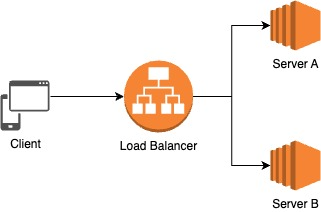
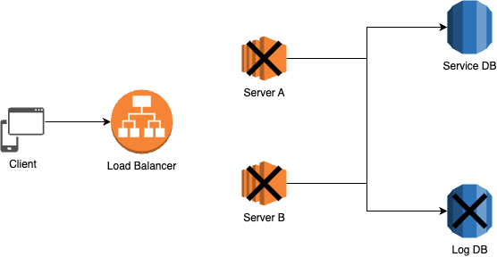

## Health Checking란?

서버가 정상적으로 서비스를 제공할 수 있는 상태인지 확인하는 것을 의미한다.

Health는 서버 그 자체의 실행 여부일 수도 있고, 서버에 포함된 다양한 기능(DB와 같은 외부 커넥션)들의 작동 여부를 포함한다.

이해를 돕기 위해 예시를 들어보겠다.

서비스의 고가용성\*(HA, High Availability), 고성능을 위한 부하 분산 등의 이유로 우리는 서버를 분리하고(이중화) 어떤 서버로 요청을 보낼지 라우팅 역할을 하는 로드 밸런서를 둔다.

아래와 같이 A, B 2개의 서버와 로드 밸런서 1개가 있다고 가정하자.



만약 A, B 서버 중 한 대가 서비스 불가 상태라면 어떻게 해야할까?

당연하지만, 장애가 생긴 서버에 요청을 보내서는 안된다.

때문에 로드 밸런서는 각 **서버의 헬스 체크 API를 호출하여 각 서버가 현재 서비스 가능한 상태인지 주기적으로 점검**한다.

헬스 체크를 통해 서버에 문제가 발견되면 로드밸런서는 해당 서버에 요청을 보내지 않는다.

정상적으로 서비스가 가능한 서버에만 트래픽을 보낼 수 있게 하여 서버의 고가용성을 확보할 수 있다.

<br>

**\*고가용성** : 시스템이 오랜 기간동안 지속적으로 장애 없이 정상 운영될 수 있는 특성.

## Actuator 라이브러리의 Health Check 메커니즘

---

Spring Boot Actuator 라이브러리를 사용하면 애플리케이션 서비스에 대해 헬스 체크를 할 수 있다.

코드 상으로 분석해보았을 때, `HealthEndpointSupport` 클래스에 구현되어 있는 `getCompositeHealth` 메서드에서는 여러 `HealthIndicator`가 수집한 Status를 토대로 서비스의 Status를 판단한다.

- Health Status는 다음과 같은 종류가 있다.
  - `UP` : 외부 시스템이 작동 중이고 접근 가능하다.
  - `DOWN` : 외부 시스템이 작동하지 않거나 접근할 수 없다.
  - `UNKNOWN` : 외부 시스템의 상태가 분명하지 않다.
  - `OUT_OF_SERVICE` : 외부 시스템에 접근할 수 있지만, 현재는 사용할 수 없다.

만약 `DOWN`을 반환한 HealthIndicator가 하나라도 존재할 경우 서비스의 상태가 `DOWN`이 되며 503 상태코드를 반환한다.

### 발생할 수 있는 문제 상황

이러한 Health Check 메커니즘으로 인해 문제 상황이 발생할 수 있다.



위와 같은 상황을 가정해보자.

1. `RoutingDataSourceHealthContributor`에 의해 DB에 대한 여러 DataSource의 헬스를 체크한다.
2. `DataSourceHealthIndicator`가 Service DB의 상태를 체크하면 `UP`이 반환된다.
3. `DataSourceHealthIndicator`가 Log DB의 상태를 체크하면 `DOWN`이 반환된다.
4. `DOWN`을 반환한 HealthIndicator가 존재하기 때문에 서비스의 상태는 `DOWN(503)`이 된다.
5. 서버 A, B의 상태가 모두 `DOWN`으로 판단되었기 때문에 로드밸런서는 서버로 트래픽을 보내지 않는다.

Service DB에는 문제가 없음에도 불구하고 클라이언트의 요청은 처리되지 않고 장애가 발생한다.

<br>

이런 문제를 해결하는 방법은 여러가지가 있다.

- Spring Boot Actuator를 사용하지 않고 직접 헬스 체크 API를 구현할 수 있다.
- HealthIndicator 중에 헬스 체크에 영향을 끼치지 않길 희망하는 것을 비활성화 시킨다.(ex : RDB의 경우, `management.health.db.enabled: false` (기본 값은 true))
- 문제가 되는 HealthIndicator 빈을 직접 생성해서 자동 구성의 동작을 오버라이딩한다.

## Actuator 라이브러리 사용해보기

---

### Spring Boot Actuator란?

Spring Boot에서 제공하는 production-ready 기능들을 제공하는 모듈

Spring Boot Actuator가 제공하는 기능으로 프로덕션 환경에서 돌아가는 애플리케이션을 모니터링하고 관리할 수 있다.

### 의존성 설치

```jsx
dependencies {
    implementation 'org.springframework.boot:spring-boot-starter-actuator'
}
```

### EndPoint 설정

`application.properties(.yml)` 설정파일에서 다른 기능이 노출되는 것을 방지하기 위해 아래와 같이 default 설정들을 false로 설정하여 모든 기본 기능을 false로 설정하고 원하는 기능만 `management.endpoint.{기능}.enable = true`로 설정한다.

```jsx
management.endpoints.enabled-by-default=false
management.endpoint.health.enabled=true
```

Endpoints를 노출시키기 위해 아래와 같이 설정을 추가한다.

```jsx
management.endpoints.web.exposure.include = health
```

각 endpoint에 대해 enabled(활성화) 설정을 하고 exposed(노출)되어야 사용할 수 있는 상태가 된다.

Actuator는 Health Check 기능을 제공하는 health 외에도 info, loggers, metrics, mappings 등 다양한 엔드 포인트를 제공한다.

### 추가 설정

만약 서버의 Health 상태의 상세 내역을 보려면 속성 정보를 변경해 주어야 한다.

항상 상세 내역을 볼 수 있게 하기 위해서 `management.endpoint.health.show-details` 속성을 always로 설정해준다.(기본은 never)

### 직접 사용해보기

설정 파일에서 위와 같이 설정을 추가해준 뒤 `/actuator/health`로 접근하면 아래와 같이 헬스 체킹 결과를 응답으로 받을 수 있다.

```jsx
GET /actuator/health HTTP/1.1
```

```jsx
{
    "status": "UP",
    "components": {
        "db": {
            "status": "UP",
            "details": {
                "database": "H2",
                "validationQuery": "isValid()"
            }
        },
        "diskSpace": {
            "status": "UP",
            "details": {
                "total": 8141348864,
                "free": 3209129984,
                "threshold": 10485760,
                "exists": true
            }
        },
        "ping": {
            "status": "UP"
        }
    }
}
```

## 참고 자료

---

[3. 엔드포인트 구성 — spring-boot-actuator documentation](http://forward.nhnent.com/hands-on-labs/java.spring-boot-actuator/03-configuration.html)

[Spring Boot Actuator의 헬스체크 살펴보기](https://toss.tech/article/how-to-work-health-check-in-spring-boot-actuator)

우테코 크루 에코가 정리해준 자료(갓에코)
