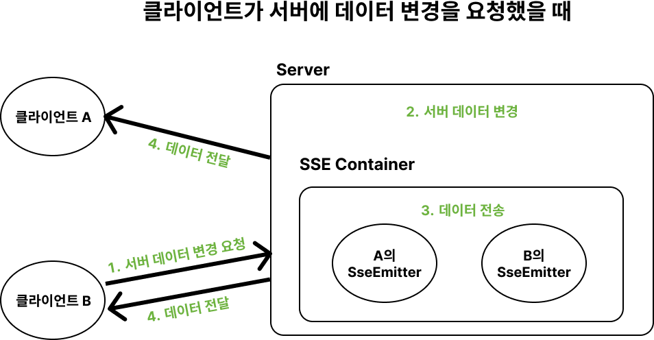
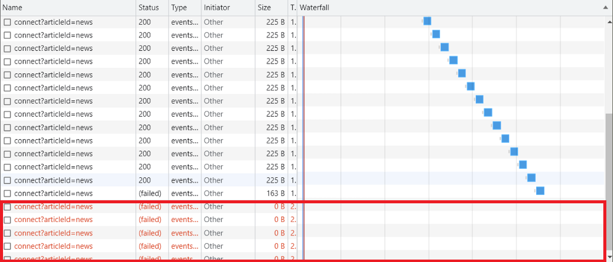

<aside>

💡 유스콘 2023 연사 김태훈님의 **“모두의 Server-Sent Events”** 세션을 듣고 정리한 게시글입니다.

</aside>

# 이론

---

HTTP 프로토콜의 주요 특징은 **비연결성**이다.

서버가 데이터를 전송하고 싶어도, 서버는 특정 클라이언트와 지속적으로 연결이 되어있지 않기 때문에, 실시간 댓글, 실시간 알림, 실시간 주식 가격 등 실시간 으로 동작하는 기능을 구현할 때는 SSE와 같은 기술을 사용해야 한다.

## 대표적인 실시간 통신 기능 구현 방법

---

웹 소켓, 폴링, 긴 폴링, 서비스 워커, SSE

### 1. Polling

: 클라이언트가 주기적으로 서버에 요청을 보내는 방식


- 장점
  - 구현이 단순하다.
- 단점
  - 계속 요청을 해야 한다는 점에서 리소스 낭비 발생
- 결론
  - 요청하는 데 부담이 적고, 요청 주기를 넉넉하게 잡아도 될 정도로 실시간성이 중요하지 않고, 데이터 갱신이 특정한 주기를 갖는 서비스에 적합하다.

### 2. Long Polling


: Polling에 비해 유지 시간을 조금 더 길게 갖는다.

요청을 보내고 서버에서 변경이 일어날때까지 대기한다.

- 장점
  - Connection이 연결된 동안 이벤트 발생을 실시간으로 감지할 수 잇다.
  - 지속적으로 요청을 보내지 않으므로 부담이 덜하다.
- 단점
  - 유지 시간을 짧게 설정한다면 Polling과 차이가 없다.
  - 지속적으로 연결되어 있기 때문에 다수의 클라이언트에게 동시에 이벤트가 발생할 경우 순간적 부담이 급증한다.
- 결론
  - 실시간 전달이 중요한데 상태가 빈번하게 갱신되진 않을 때 적합하다.

### 3. WebSocket(웹 소켓)


: **양방향**으로 데이터를 주고받을 수 있다.

최초 접속은 HTTP 요청을 통한 handshakiing으로 이루어짐.

- 장점
  - HTTP와 달리 지속적으로 Connection을 지속하기 때문에 연결에 드는 불필요한 비용을 제거할 수 있다.
  - 용량이 큰 HTTP 헤더를 최초 접속 시에만 보내기 때문에 리소스를 절약할 수 있다.
  - 웹 소켓 포트에 접속해있는 모든 클라이언트에 이벤트 방식으로 응답할 수 있다.

### 4. Server-Sent-Events(SSE)


: Client가 서버와 한 번 연결을 맺고 나면 Server에서 이벤트가 발생할 때마다 데이터를 전송받는 **단방향** 통신 방식

- 장점
  - HTTP 프로토콜만으로 사용할 수 있어 구현이 용이하다.
  - 접속에 문제가 있는 경우 자동으로 재연결을 시도한다.
- 단점
  - 클라이언트가 접속을 close해도 서버에서 감지하기가 어렵다.

### SSE의 통신 과정

1. **Client 측 - SSE Subscribe 요청**

   클라이언트가 서버의 이벤트를 구독하기 위한 요청을 전송

   이벤트의 mediaType은 text/event-stream이 표준 스펙으로 정해져있음.

2. **Server 측 - Subscription에 대한 응답**

   Response의 mediaType은 text/event-stream.

   서버는 동적으로 생성된 컨텐츠를 스트리밍하기 때문에 본문의 크기를 미리 알 수 없으므로 Transfer-Encoding 헤더 값을 chunked로 설정해야 한다.

3. **Server 측 - 이벤트 생성 및 전송**

   자신을 구독하고 있는 클라이언트에게 비동기적으로 데이터를 전송할 수 있다.

   \*데이터는 utf-8로 인코딩된 텍스트 데이터만 가능

   각각의 이벤트는 한 개 이상의 name:value로 구성된다.

### Spring에서 제공하는 SSE 서포팅 기술

- SseEmitter

# 실습

---

https://github.com/Bue-von-hon/SSE-samples

전체적인 흐름은 다음과 같은 순서로 진행된다.

1. 클라이언트에서 **SSE 연결 요청**을 보낸다.
2. 서버에서 클라이언트와 매핑되는 SSE 통신 객체(SseEmitter)를 만든다.
3. 서버에서 이벤트가 발생하면 해당 객체를 통해 **클라이언트로 데이터를 전송**한다.




### 1. SSE 연결(Connect)

위와 같은 요청에 매핑되는 Controller 메서드를 작성하면 다음과 같다.

```java
@GetMapping(value="/connect", produces=MediaType.TEXT_EVENT_STREAM_VALUE)
public ResponseEntity<SseEmitter> connect(@RequestParam("articleId") String articleId){
    SseEmitter emitter = commentService.connect(articleId);
    return ResponseEntity.ok(emitter);
}
```

위와 같이 Controller 메세지를 작성하면, 다음과 같은 포맷의 요청/응답에 매핑이 된다.

- 요청
  ```java
  GET /connect?articleId=news HTTP/1.1
  Accept: text/event-stream
  Cache-Control: no-cache
  ```
- 응답
  ```java
  HTTP/1.1 200
  Content-Type: text/event-stream;charset=UTF-8
  Transfer-Encoding: chunked
  ```

```java
@Service
public class CommentService {
    private HashMap<String, Set<SseEmitter>> container = new HashMap<>();

    public SseEmitter connect(final String articleId) {
        SseEmitter sseEmitter = new SseEmitter(300_000L); // (1)

        final SseEventBuilder sseEventBuilder = SseEmitter.event()    // (2)
            .name("connect")
            .data("connected!")
            .reconnectTime(3000L);

        sendEvent(sseEmitter, sseEventBuilder);    // (3)

        Set<SseEmitter> sseEmitters = container.getOrDefault(articleId, new HashSet<>());    // (4)
        sseEmitters.add(sseEmitter);
        container.put(articleId,sseEmitters);
				sseEmitter.onCompletion(() -> {    // (5)
            sseEmitters.remove(sseEmitter);
        });
        return sseEmitter;
    }

    private static void sendEvent(final SseEmitter sseEmitter,
        final SseEventBuilder sseEventBuilder) {
        try {
            sseEmitter.send(sseEventBuilder);
        } catch (IOException e) {
            sseEmitter.complete();
        }
    }
```

**(1) 새로운 SseEmitter 객체를 생성한다.** 생성자 파라미터로 만료 시간을 설정할 수 있다.

여기서는 임의로 5분(30만초)으로 설정해주었다. 이 만료시간이 지나면 브라우저에서 자동으로 서버에 **재연결 요청**을 보내게 된다.

이 때, 만료 시간을 너무 길게 설정하면 서버에서 불필요한 커넥션을 관리해주어야 하기 때문에 오버헤드가 발생하고, 너무 짧으면 재연결 요청이 잦아진다.

때문에 상황에 따라 적절한 시간을 설정해주는 것이 좋다.

이 때 Emitter를 생성하고 만료 시간까지 아무런 데이터도 보내지 않을 경우, 재연결 요청시 `503 Service Unavailable` 에러가 발생할 수 있다. 때문에 처음 SSE 연결 직후 더미 데이터(이벤트)를 emitter에 전송해주는 것이 안전하다.

**(2) 전송할 더미 이벤트의 스펙을 작성한다.**

재연결 시간은 3초로 설정해주었는데, 이렇게 설정해주면 클라이언트에서 연결이 끊기고 3초마다 재연결을 시도한다.

<aside>

💡 **SseEmitter 만료 시간(timeout)과 재연결 시간(reconnect)의 차이**

---

만료시간을 1초, 재연결 시간을 0.5초로 설정해주고 연결을 시도해보자.

보이는 것처럼 1초마다 연결이 끊겼다가 재연결되는 것을 볼 수 있다.


이 상태에서 어플리케이션을 종료하면,



이렇게 0.5초마다 클라이언트가 재연결 요청을 보내게 된다.

</aside>

여기서 작성해준 이벤트의 이름(connect)은 클라이언트가 이벤트를 불러올 때 사용할 수 있다.

```jsx
sse.addEventListener("connect", function (e) {
  var receivedConnectData = e.data
  printLog("connect event data: ", receivedConnectData)
})
```

**(3) 작성한 더미 이벤트를 생성된 emitter에 전송**

이 때 호출되는 sendEvent() 메서드를 보자.

```java
private static void sendEvent(final SseEmitter sseEmitter,
    final SseEventBuilder sseEventBuilder) {
    try {
        sseEmitter.send(sseEventBuilder);
    } catch (IOException e) {
				sseEmitter.complete();
		}
}
```

connection이 끊기거나 클라이언트와의 연결이 불안정할 경우 IO Exception이 발생할 수 있기 때문에 안정성을 위해 try-catch문으로 감싸주었다.

connection이 끊긴 경우, 즉 연결이 만료된 경우 명시적으로 SseEmitter를 만료시킨다.

**(4) article Id에 매핑된 emitter 컨테이너 생성**

**(5) SseEmitter가 만료될 경우 sseEmitters(컨테이너)에서 SseEmitter 객체 제거**

SseEmitter가 만료되면 브라우저에서 재연결 요청을 보내는데, 이 때 새로운 Emitter 객체를 다시 생성하기 때문에 기존의 Emitter 객체를 컨테이너에서 제거해주어야 한다.

<aside>

💡 이 때 유의해야 할 점은, onCompletion()에 정의한 콜백함수가 SseEmitter를 관리하는 다른 스레드에서 실행된다는 것이다.

때문에 thread-safe한 자료구조를 사용해야 하는데, 여기서는 임시 방편으로 Set 자료구조를 사용해서 SseEmitter가 중복으로 등록되지 않게 하였다.

</aside>

### 2. 데이터 변경

```java
@PostMapping("/comment")
public ResponseEntity<Void> sendComment(@RequestBody Comment comment, @RequestParam("articleId") String articleId) {
    commentService.sendComment(comment, articleId);
    return ResponseEntity.ok().build();
}
```

```java
public void sendComment(final Comment comment, final String articleId) {
    Set<SseEmitter> sseEmitters = container.getOrDefault(articleId, new HashSet<>());    // (1)

    final SseEventBuilder sseEventBuilder = SseEmitter.event()    // (2)
        .name("newComment")
        .data(comment)
        .reconnectTime(3000L);

    sseEmitters.stream().forEach(sseEmitter -> sendEvent(sseEmitter, sseEventBuilder));
}
```

**(1) RequestParam으로 전달받은 아티클과 연결된 Emitter들을 모두 가져온다.**

**(2) 가져온 Emitter들에게 댓글을 전송한다.**

정확히는 SSE 커넥션을 가지고 있는 클라이언트들에게 “*newComment”*라는 이벤트를 전송한다.

클라이언트 측에서는 다음과 같이 이벤트 리스너를 등록해두면 해당 이벤트를 가져올 수 있다.

```jsx
sse.addEventListener('newComment', function (e) {
      let receivedCommentData = JSON.parse(e.data);
      let commentsDiv = document.getElementById('comments');
      let commentDiv = document.createElement('div');
	    ... // 이벤트 처리
      printLog('새 댓글을 추가했습니다.');
    });
```

## 결과

---


탭을 2개 띄워두고, 각각에 대해 알림 요청 버튼을 클릭해 Connect를 맺는다.

그 후 하나의 탭에서 “안녕하세요”를 입력한 뒤 댓글을 저장하면


이렇게 두 탭 모두에 새로운 댓글이 추가된 것을 확인할 수 있다.

\*처음 댓글을 작성할 때 500 에러가 뜨지만 기능은 정상적으로 동작한다. 왜 이런 문제가 발생하는지는 잘 모르겠다…

# 참고 자료

---

[SSE란](https://velog.io/@alswn9938/SSE란)

[Spring에서 Server-Sent-Events 구현하기](https://tecoble.techcourse.co.kr/post/2022-10-11-server-sent-events/)
