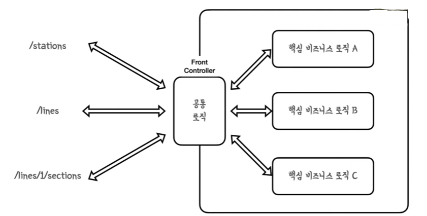

앞서 다른 게시글들에서 알아보았던 [Dispatcher Servlet](https://amaran-th.github.io/Spring/[Spring]%20Dispatcher%20Servlet/), [Argument Resolver, Interceptor](https://amaran-th.github.io/Spring/[Spring]%20MVC%20Configuration%20%ED%95%99%EC%8A%B5%ED%85%8C%EC%8A%A4%ED%8A%B8/#interceptor%EB%9E%80), [View Resolver](https://amaran-th.github.io/Spring/[Spring]%20View%20Resolver/)의 개념을 종합하여 Spring MVC 구조의 등장 배경과 동작 과정을 알아보자.

## Spring Web MVC 구조의 등장 배경

---

Spring 이전에 Servlet이 있었다. 서블릿에는 한 가지 문제점이 있었는데, 서블릿은 하나의 요청마다 하나의 서블릿이 1:1 매핑되는 구조이기 때문에 각 컨트롤러에서 공통으로 처리해야 하는 로직이 생기면 그만큼 **코드 중복**이 발생했다.

<aside>
💡 <b>Servlet이란?</b>
자바 진영에서 동적 데이터를 제공하기 위해 CGI를 기반으로 제작된 프로그램.

</aside>

### Front Controller의 등장


이 공통 로직을 하나의 컨트롤러에서 수행해주기 위해 **Front Controller**가 등장하게 되었다.



프론트 컨트롤러는 다음과 같은 일을 대신 처리해주게 된다.

- **클라이언트와 서버를 연결**한다.
- 각 요청에 맞는 **컨트롤러를 매핑**하여 정보를 보관한다.
- 요청이 들어오면 매핑 정보를 찾아 해당 **컨트롤러를 호출**한다.
- 전달할 **결과를 생성**한다.
- 결과를 **사용자에게 반환**한다.

### Front Controller 역할의 분리

여기서 Front Controller가 부담하는 책임이 많기 때문에, Front Controller의 수행 역할 별로 상황을 분리하게 되었다.


- 요청 핸들러 검색 ⇒ **Handler Mapping**
  - 요청을 처리할 컨트롤러(핸들러)를 찾는다.
- 뷰 검색&생성 ⇒ **View Resolver**
  - 핸들러가 프론트 컨트롤러로 반환한 View의 이름으로 원본 View의 URI를 알아낸 후 렌더링을 수행한다.

### Spring Web MVC로의 변화

이러한 구조가 Spring으로 그대로 계승된 것이 바로 **Spring Web MVC 구조**이다.


Front Controller가 **DispatcherServlet**라는 이름으로 변경되고, 컨트롤러의 핸들러를 요청하기 전에 **Handler Adapter**라는 중간 전처리 기능이 추가되었다.

## Spring Web MVC의 동작 과정

---

### 1. Dispatcher Servlet

Spring Context에서 **제일 먼저** 클라이언트의 요청을 받는다.

디스패처 서블릿은 요청 정보를 기반으로 **적합한 컨트롤러와 메소드를 찾아 요청을 위임하고,** 요청에 대한 응답을 다시 받아온다.

처음 요청을 받으면 요청을 위임할 컨트롤러(핸들러)를 찾기 위해 HandlerMapping에 매핑 정보(URL)를 전달한다.


### 2. Handler Mapping

request의 URL과 매칭되는 handler를 선택하고 다시 Dispatcher Servlet에 전달한다.

### 3. (다시) Disptacher Servlet

선택된 컨트롤러가 비즈니스 로직을 실행하도록 알맞은 HandlerAdapter에 요청을 위임한다.

### 4. Handler Adapter

- Interceptor가 이에 해당된다.

Dispatcher Servlet으로부터 전달받은 요청에 대한 **전처리**를 수행하고 요청을 컨트롤러로 전달한다.

### 4-2. Argument Resolver

Argument Resolver는 HandlerAdapter가 요청을 Controller로 전달할 때 그 사이에서 동작한다.


### 5. Controller

비즈니스 로직을 처리하고 반환값을 반환한다.

이 때 반환값은 응답 본문(ResponseEntity) 또는 (String으로 표현되는)View(의 이름)가 될 수 있다.

- ResponseEntity를 반환하는 경우
  - @ResponseBody를 사용하면 반환하는 자바 객체를 HTTP 응답 본문의 객체로 변환해준다.
    ```java
    @ResponseBody
    @GetMapping
    public ResponseEntity<List<LineResponse>> findAllLines() {
        return ResponseEntity.ok(lineService.findLineResponses());
    }
    ```
- View(의 이름)를 반환하는 경우(Default)
  ```java
  @GetMapping
  public String loadHome(Model model) {
      final List<ProductEntity> productEntities = mySQLProductDao.findAll();

      List<ProductResponse> products = ProductResponse.from(productEntities);

      model.addAttribute("products", products);
      return "index";
  }
  ```

### 6. (다시)Handler Adapter

핸들러 어댑터가 컨트롤러의 반환값을 후처리한다.

### 7. (다시x2)Dispatcher Servlet

- 응답 데이터가 Response Body인 경우 ⇒ 데이터를 Response Body에 담은 후 클라이언트로 반환한다.
- 응답 데이터가 View인 경우 ⇒ 응답 데이터를 View Resolver로 보낸다.

### 8. View Resolver

: Controller가 반환한 정보를 기반으로 적절한 View 객체를 찾아 반환한다.

전달받은 View의 정보(이름)에 미리 설정되어 있던 접두사/접미사를 결합해 원본 View의 URI를 알아낸 후 해당 View 객체를 찾아 반환한다.

### 9. (다시x3) Dispatcher Servlet

View Resolver로부터 전달받은 View 객체를 렌더링하여 클라이언트에게 반환한다.

## Spring Web MVC의 장점

---

웹 요청 시 필요한 객체를 DispatcherServlet이 자동으로 주입해주기 때문에, 개발자는 필요한 설정만 등록해주고 **비즈니스 로직에만 집중할 수 있다.**

## 참고 자료

---

[스프링 MVC - 구조 이해](https://catsbi.oopy.io/f52511f3-1455-4a01-b8b7-f10875895d5b)

[[10분 테코톡] 루키의 Servlet & Spring Web MVC](https://www.youtube.com/watch?v=h0rX720VWCg)
