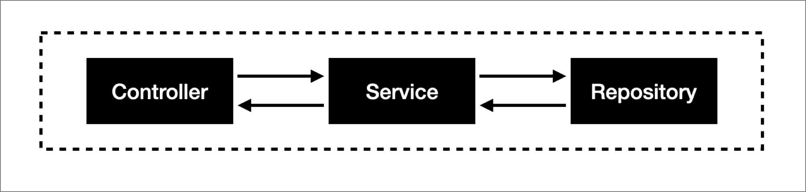
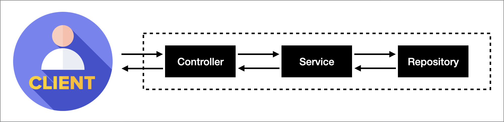

## 서론

---

테스트의 종류와, Spring에서 사용할 수 있는 테스트 지원 어노테이션에 대해 알아보았다.

## 테스트의 종류

---

### E2E 테스트(End To End Test)

: 테스트하고자 하는 **기능에서 필요로 하는 모든 컴포넌트**들이 올바르게 협업해서 최종적으로 원하는 결과를 내는지 확인하는 테스트.



위와 같이 아키텍쳐가 나누어진 서비스에서, E2E 검증을 위해 컨트롤러, 서비스, 레파지토리를 모두 사용한다고 하면 모든 컴포넌트들의 협업을 검증한 것이므로 E2E 테스트라고 부를 수 있다.

### 통합 테스트(Integration Test)

: 단위테스트보다 더 큰 동작을 달성하기 위해 **여러 모듈들을 모아** 이들이 의도대로 **협력**하는지 확인하는 테스트

- 개발자가 변경할 수 없는 부분(외부 라이브러리 등)까지 묶어 검증할 때 사용한다.
- DB에 접근하거나 전체 코드와 다양한 환경이 제대로 동작하는지 필요한 모든 작업을 수행할 수 있다.
- 통합 테스트가 응용 프로그램이 완전하게 작동하는 걸 무조건 증명하진 않는다.
- 장점

  - 단위 테스트에서 발견하기 어려운 버그(환경과 관련된 버그 등)를 찾을 수 있다.

    ex : 싱글 코어 CPU에서는 잘 실행되나 쿼드 코어 CPU에서는 잘 실행되지 않음

- 단점
  - 단위 테스트보다 더 많은 코드를 테스트하기 때문에 신뢰성이 떨어질 수 있다.
  - 어디서 에러가 발생했는지 확인하기 쉽지 않아 유지보수하기가 힘들다.

<aside>
💡 @SpringBootTest 어노테이션으로 통합 테스트를 작성할 수 있다.

</aside>

### 인수 테스트(Acceptance Test)

: **사용자**의 **시나리오**에 맞춰 수행하는 테스트

- 비즈니스 쪽에 초점을 둔다.
- 프로젝트에 참여하는 사람들(기획자, 클라이언트 대표, 개발자 등)이 토의해서 시나리오를 만들고, 개발자는 이에 의거해서 코드를 작성한다.
- 개발자가 직접 시나리오를 제작할 수도 있지만, **다른 의사소통 집단으로부터 시나리오를 받아(인수) 개발한다**는 의미가 크다.
- 시나리오에서 요구하는 것은 **누가, 어떤 목적으로, 무엇을 하는가**로 요약할 수 있다. 이는 주로 API를 통해 드러나기 때문에, 인수 테스트는 주로 **이 API를 확인**하는 방식으로 이뤄진다.
- 소프트웨어 인수를 목적으로 하는 테스트이다.(소프트웨어를 인수하기 전에 명세한 요구사항(인수 조건)대로 잘 동작하는지 검증이 필요함)
- 인수 테스트는 소프트웨어 내부 구조나 구현 방법을 고려하기보단 실제 사용자 관점에서 이루어지는 테스트이기 때문에, **블랙박스 테스트**이다.

<aside>
💡 RestAssured, MockMvc를 통해 인수 테스트를 작성할 수 있다.

</aside>



<aside>
❓ <b>E2E 테스트와 인수 테스트의 차이</b>

인수 테스트와 E2E 테스트는 거의 동일하지만, ‘클라이언트가 기대하는’이라는 명제가 붙으면 이는 인수 테스트라고 할 수 있다.

E2E 테스트는 기술적인 관점에서, 인수 테스트는 비즈니스적인 관점에서의 테스트라고 할 수 있다.

백엔드 개발에서는 사실상 같은 의미로 사용되기도 한다.

</aside>

### ➕ 슬라이스 테스트(Slice Test)

: 특정 **레이어**(Layer)를 타겟으로 하는 테스트

- 스프링에서는 레이어 별로 잘라 특정 레이어에 대해 Bean을 최소한으로 등록시켜 테스트하고자 하는 부분에 최대한 단위테스트를 지원하고 있다.
- `@SpringBootTest` 어노테이션을 사용할 경우(=통합 테스트) 단점
  - 모든 Bean을 로드하기 때문에 시간이 오래 걸리고 무겁다.
  - 테스트 단위가 크기 때문에 디버깅이 어렵다.
  - 외부 API 콜 같은 Rollback 처리가 안되는 테스트를 진행하기 어렵다.

<aside>

💡 @DataJpaTest, @WebMvcTest 등을 통해 슬라이스 테스트를 작성할 수 있다.

- 추가 : @WebMvcTest, @WebFluxTest, @DataJpaTest, @JsonTest, @RestClientTest

</aside>

### ➕ 단위 테스트(Unit Test)

: 응용 프로그램에서 테스트 가능한 **가장 작은** 소프트웨어를 실행하여 예상대로 동작하는지 확인하는 테스트

- 테스트 대상 단위의 크기를 작게 설정해서 단위 테스트를 최대한 간단하고 디버깅하기 쉽게 작성하는 것이 좋다.
- 소프트웨어 내부 구조나 구현 방법을 고려하여 개발자 관점에서 테스트하는 방법(화이트박스 테스트)

<aside>
💡 JUnit을 통해 인수 테스트를 작성할 수 있다.

</aside>

## 스프링을 사용한 테스트

---

### @SpringBootTest

: 통합 테스트를 제공하는 가장 기본적인 테스트 어노테이션.

어플리케이션이 실행될 때의 설정을 임의로 바꿀 수도 있고 여러 단위 테스트를 하나의 통합 테스트로 수행할 수도 있다.

- 컴포넌트 스캔 범위는 Bean 전체이다.(프로덕션 코드의 애플리케이션이 실행될 때 스캔되는 범위와 동일)
- 속성

  - classes : 해당 속성을 정의해주면 해당 클래스의 빈만 정의된다.
    ```java
    @SpringBootTest(classes = {SessionController.class, WebConfig.class})
    ```
  - webEnvironment

    - `WebEnvironment.MOCK`(default) : 실제 서블릿 컨테이너를 띄우지 않고 서블릿 컨테이너를 **mocking**한 것이 실행된다.

      <aside>
      💡 이 속성값을 사용할 때는 보통 MockMvc를 주입받아 테스트한다.

      </aside>

    - `WebEnvironment.RANDOM_PORT` : 스프링 부트의 내장 서버를 **랜덤 포트**로 띄운다.
    - `WebEnvironment.DEFINED_PORT` : 스프링 부트의 내장 서버를 **정의된 포트**로 띄운다.

      - 테스트를 위한 실제 서블릿 컨테이너를 띄운다.
      - `TestRestTemplate` 또는 `WebTestClient`를 주입받아 테스트한다.

      ```java

      @SpringBootTest(webEnvironment = SpringBootTest.WebEnvironment.RANDOM_PORT)
      public class WebtoonApiControllerTest {

            @LocalServerPort
            private int port;

            @Autowired
            private TestRestTemplate restTemplate;

            @Test
            // Do some test...

          }
      ```

- `WebEnvironment.NONE` : WebEnvironment.NONE으로 구동된다

<aside>
💡 내장 서버의 포트번호 설정을 Defined_port보다 Random_Port로 설정하는 이유?

- 포트번호를 고정할 경우 병렬 테스트를 진행할 때 **포트 충돌**이 일어날 수 있다.
- 프로덕션 코드와 테스트코드를 함께 실행 시킬 때 **포트 충돌**이 일어날 수 있다.
</aside>

<aside>
⚠️ @SpringBootTest 어노테이션을 여러 클래스에 선언하고 한 번에 실행시켜도 서버는 1개만 띄워진다.
별도의 설정이 없다면 처음 생성된 DB를 그대로 공유한다.

</aside>

### @WebMvcTest

: MVC를 위한 테스트

- 웹에서 테스트하기 힘든 컨트롤러를 테스트하기 적합하다.
- 웹 상에서 **요청과 응답**에 대해 테스트할 수 있다.
- Security, Filter까지 자동으로 테스트하고, 수동으로 추가/삭제 가능
- @SpringBootTest 어노테이션보다 가볍게 테스트할 수 있다.
- 다음과 같은 내용만 스캔하도록 제한한다.
  - `@Controller`, `@ControllerAdvice`, `@JsonComponent`, `Converter`, `GenericConverter`, `Filter`, `HandlerInterceptor`
  - 의존성이 끊기기 때문에 서비스와 같은 객체는 MockBean을 사용해서 만들어 사용해야 한다.
- **@MockBean**

  - `spring-boot-test` 패키지는 Mockito를 포함하고 있기 때문에 기존에 사용하던 방식대로 Mock 객체를 생성해서 테스트하는 방법도 있지만 spring-boot-test에서는 새로운 방법도 제공한다.
  - 기존에 사용되던 스프링 Bean이 아닌 Mock Bean을 주입한다.
  - 때문에 `@MockBean`으로 선언된 Bean을 주입받으면 Spring의 ApplicationContext는 Mock 객체를 주입한다.
  - 새롭게 @MockBean을 선언하면 Mock 객체를 Bean으로써 등록하지만, 만일 이미 같은 이름과 타입의 Mock Bean 객체가 등록되어 있다면 해당 Bean은 새로 선언한 Mock Bean으로 대체된다.

  ```java
  @SpringBootTest
  public class XXXControllerTest {

      @MockBean  // 외부 서비스 호출에 사용되는 RestTemplate Bean을 Mock
      private RestTemplate mockRT;

      @MockBean  // 외부 서비스 호출에 사용되는 Service Bean을 Mock
      private XXXService xXXService;

  }
  ```

### @DataJpaTest

: **Spring Data JPA**를 테스트하고자 할 때 사용한다.

- 해당 테스트는 기본적으로 in-memory embedded database를 생성하고 `@Entity` 클래스를 스캔한다.
- 일반적인 다른 컴포넌트들은 스캔하지 않는다. 따라서 특정 Bean의 의존성이 필요한 경우, 아래의 방법을 사용한다.
  - `@import`
  - `@DataJpaTest(includeFilters = @Filter(..))`
- `@DataJpaTest`는 `@Transactional` 어노테이션을 포함하고 있다.

  ⇒테스트가 완료되면 자동으로 롤백된다.

  - 만약 `@Transactional` 기능을 끄고 싶다면 다음과 같이 작성해줄 수 있다.

  ```java
  @DataJpaTest
  @Transactional(propagation = Propagation.NOT_SUPPORTED)
  class SomejpaTest {
      ...
  }
  ```

- `@DataJpaTest` 기능을 사용하면 `@Entity`를 스캔하고 repository를 설정하는 것 이외에도 테스트를 위한 **TestEntityManager**라는 Bean이 생성된다.

  - 이 Bean을 사용해 테스트에 이용한 데이터를 정의할 수 있다.

    persist : Repository객체에 데이터 추가

    ```java
    @DataJpaTest
    class SomejpaTest {

    		private CommentRepository commentRepository;

        @Autowired
        private TestEntityManager entityManager;

        @Test
        @DisplayName("게시글 아이디로 댓글 목록 삭제 테스트")
        void deleteAllByMissingPostIdTest() {
            // given
            LongStream.rangeClosed(1, 3).forEach(idx ->
                entityManager.persist(Comment.builder()
                    .missingPost(missingPost)
                    .content("내용")
                    .account(account)
                    .build()
                )
            );

            // when
            commentRepository.deleteAllByMissingPostId(missingPost.getId());
            List<Comment> comments = commentRepository.findAll();

            // then
            SoftAssertions.assertSoftly(softAssertions -> {
                    softAssertions.assertThat(comments).hasSize(3);
                    comments.forEach(foundComment -> softAssertions.assertThat(foundComment.isDeleted()).isTrue());
                }
            );
        }

    }
    ```

- 만약 테스트에 내장된 임베디드 데이터베이스가 아닌 실제 데이터베이스를 사용하고자 한다면 `@AutoConfigureTestDatabase` 어노테이션을 사용할 수 있다.
  ```java
  @DataJpaTest
  @AutoConfigureTestDatabase(replace = AutoConfigureTestDatabase.Replace.NONE)
  class SomejpaTest {
      ...
  }
  ```

### @JdbcTest

: Spring Data JDBC를 사용하지 않고 오직 **DataSource**만을 필요로 하는 테스트에서 사용한다.

- `@DataJdbcTest`와 마찬가지로 in-memory embeded database가 설정되어 테스트를 위한 jdbcTemplate를 생성한다.
- 일반적인 ConfigurationProperties와 `@Component Bean`들은 스캔되지 않는다.
- 기본적으로 @Transactional을 포함하고 있다.(@DataJpaTest에서와 동일)

### @DataJdbcTest

: @JdbcTest와 유사하지만 **Spring Data JDBC Repositories**를 사용하는 테스트에서 사용한다.

- in-memory database, JdbcTemplate, Spring Data JDBC repository들이 설정된다.
- 일반적인 ConfigurationProperties와 `@Component Bean`들은 스캔되지 않는다.
- 기본적으로 @Transactional을 포함하고 있다.(@DataJpaTest에서와 동일)

## 참고 자료

---

[단위 테스트 vs 통합 테스트 vs 인수 테스트](https://tecoble.techcourse.co.kr/post/2021-05-25-unit-test-vs-integration-test-vs-acceptance-test/)

[인수 테스트와 E2E 테스트 차이](https://hyeon9mak.github.io/acceptance-test-vs-e2e-test/)

[Spring Boot Slice Test](https://velog.io/@ljo_0920/Spring-Boot-slice-test)

[Spring Boot 테스트 애노테이션](https://catsbi.oopy.io/e2fa9884-eb59-4f79-8732-6e3e14e456fd)

[[level2. 웹 체스 미션] @JdbcTest, @DataJdbcTest, @JpaTest](https://pomo0703.tistory.com/100)

[[Spring/번역] 컨트롤러 테스트 가이드 in Spring Boot](https://dadadamarine.github.io/java/spring/2019/03/16/spring-boot-validation.html)

[phind 답변](https://www.phind.com/search?cache=818b4df7-5ee4-476f-9e90-747b5e3bb3bc)
