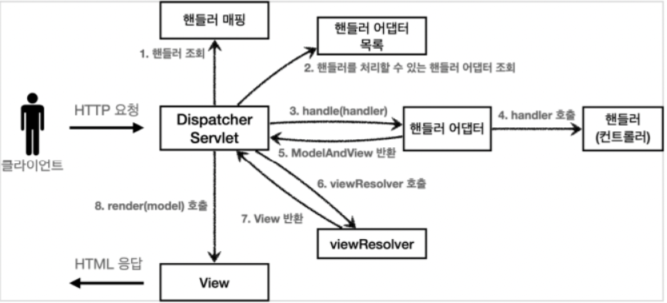

## 들어가기 전

---

### View란?

view는 모델이 가진 정보(데이터)를 **어떻게 표현**할지에 대한 로직을 가지고 있는 컴포넌트이다.

일반적인 View의 결과물은 브라우저에서 볼 수 있는 HTML 형식이고, 이 외에도 Excel, PDF, RSS 등 다양한 View 오브젝트가 존재한다.

- View는 View 인터페이스를 구현함으로서 생성한다.
  ```java
  public interface View{
      void render(Map<String, ?> model, HttpServletRequest request, HttpServletResponse resposne) throws Exception;
  }
  ```

### View Type

View Resolver를 통해 원하는 View 형식(View Type)으로 View를 전달해줄 수 있다.

- **Velocity** : 초기에 가장 인기를 끌던 템플릿. 유지보수가 잘 이루어지지 않아 지금은 deprecate됨.
- **FreeMarker** : Apache 프로젝트 템플릿 엔진. 템플릿 및 변경 데이터를 기반으로 텍스트 출력을 생성하는 Java 라이브러리
  
- **JsonView** : **API 형태**로 제공할 때 가장 많이 사용하는 View
- **JSP** : 국내에서 가장 많이 사용하는 표준 View(Spring boot에서는 별도의 설정을 해줘야 사용 가능하다.)
- **Thymeleaf** : 의존성 추가 시 별도 설정 없이 HTML 파일로 View를 만들어줄 수 있다. HTML이지만 JSP처럼 사용할 수 있다.(Spring에서 가장 밀어주고 있는 View)

### Spring에서 제공하는 View의 종류

- InternalResourceView

  - RequestDispatcher의 forward(), include()를 사용하는 뷰.

    ```java
    View view = new InternalResourceView("/WEB-INF/view/hello.jsp");

    return new ModelAndView(view, model);
    ```

- RedirectView

  - HttpServletResponse의 sendRedirect() 메서드를 호출해주는 기능을 가진 뷰이다.
  - 실제 View를 생성하지는 않고, URL만 만들어 다른 페이지로 리다이렉트하게 해주는 객체이다.
  - Model 정보가 있다면 URL 뒤에 파라미터로 추가된다.
    ```java
    // 뷰 사용시
    return new ModelAndView(new RedirectView("/main"));
    // 뷰 리졸버 사용시
    return new ModelAndView("redirect:/main");
    ```
    위와 같이 `redirect:` 접두어를 사용함으로써 View Resolver가 인식하게 할 수 있다.
      <aside>
      💡 redirect 경로는 절대경로(컨텍스트 패스, 서블릿 패스를 포함)여야 하는데, contextRelative 옵션을 true로 주면 컨텍스트 패스를 생략하고 작성할 수 있다.
      
      </aside>

- VelocityView
- FreeMarkerView
- …

## View Resolver란?

---

DispatcherServlet에 View 객체를 전달하는 방법은 크게 2가지가 있다.

1. 컨트롤러에서 직접 View 타입의 객체를 반환하는 방법
2. String 타입의 View 이름을 반환하는 방법\*

컨트롤러에서 매번 View를 생성하여 반환하는 것(첫 번째 방법)은 비효율적이기 때문에, 스프링에서는 이 작업을 적절히 분리하여 View Resolver가 View를 선택(매핑)하고 생성하게 하였다(두 번째 방법).

View Resolver가 수행하는 작업은 다음과 같다.

- 데이터 객체(Map, Model, ModelAndView 등이 될 수 있음)를 View 영역으로 전달하기 위해, 적절한 View 객체를 매핑한다.
- 좀 더 구체적으로 표현하자면, View Resolver는 컨트롤러(핸들러)가 반환한 **View 이름으로 그에 해당되는 View Component를 찾아 매핑한다.**
- 컨트롤러는 View의 논리적인 이름만을 반환한 뒤 역할을 종료하고, 이를 DispatcherServlet의 View Resolver가 받아 사용할 View 객체를 찾아 생성하는 작업을 수행한다.
- 스프링 MVC 구조에서의 동작 흐름
  - Handler Mapping, Handler Adapter를 통해 Controller의 Handler가 실행되면, Handler가 처리된 ModelAndView를 반환한다.
  - 이 ModelAndView를 알맞은 View 객체로 전달해주기 위해 **DispatherServlet이 View Resolver를 호출한다.**
- View Resolver는 `ViewResolver` 인터페이스를 구현해서 생성한다.
  ```java
  public interface ViewResolver{
      View resolveViewName(String viewName, Locale locale) throws Exception;
  }
  ```

### View Resolver 구현체의 종류

- InternalResourceViewResolver
  - JSP를 처리할 수 있는 View를 반환한다.
  - 미리 지정된 접두사, 접미사를 사용해 view 이름으로 컴포넌트의 URL을 완성해주기 때문에 핸들러 쪽에서 URL을 지정하기 편리하다.
  - xml 또는 java config로 설정할 수 있다.
  - 스프링 부트에서는 자동으로 등록된다.
- BeanNameViewResolver
  - Bean 이름으로 View를 찾아 반환한다.
  - 스프링 부트에서는 자동으로 등록된다.
- ResourceBundleViewResolver
  - ViewResolver의 구현체로 리소스 파일을 사용한다.
  - `views.properties` 파일을 기본 리소스 파일로 사용한다.
- VelocityViewResolver
- FreeMarkerViewResolver
- …

### View Resolver의 동작 예시



- MVC 모델에서 JSP는 View Component로서, View를 출력하는 역할을 담당한다.
- JSP를 실행할 땐 항상 페이지 컨트롤러를 통해 실행해야 한다.

  ```java
  @Controller
  @RequestMapping("/test")
  public class Controller {
      @GetMapping
  	  public String handler(Model model) {

  	    model.addAttribute("name", "민성");
  	    model.addAttribute("age", 28);

  	    return "/jsp/test.jsp";
  	  }
  }
  ```

  - 위 코드는 `{ name : “민성”, age: 28 }`이라는 데이터를 담은 view 객체를 반환하는 컨트롤러 핸들러 코드이다.
  - 웹 애플리케이션 디렉토리에서 `/jsp/test.jsp`라는 파일을 찾아 view 객체로 반환한다.

- View와 함께 전달할 데이터를 준비하는 일은 페이지 **컨트롤러(핸들러)**가 담당한다.
- 기본 ViewResolver는 반환 값으로 url(경로)을 받아 웹 애플리케이션 디렉토리에서 JSP를 찾는다.
- 기본 ViewResolver를 사용할 때 핸들러가 뷰 이름을 반환하지 않으면 오류가 발생한다.

<aside>
⚠️ View 이름을 반환할 땐 `@ResponseBody` 어노테이션을 붙이면 안된다.

</aside>

### InternalResourceViewResolver 사용하기

- XML 또는 Java Config(@Bean)으로 상세한 설정을 해줄 수 있다.

  - XML 파일로 설정하는 경우

  ```xml
  <bean id="viewResolver" class="org.springframework.web.servlet.view.InternalResourceViewResolver">
  		<property name="prefix" value="WEB-INF/view"/>
  		<property name="suffix" value="./jsp"/>
  </bean>
  ```

  - Java Config로 설정하는 경우

  ```java
  @Configuration
  @ComponentScan
  public class WebConfig{
  		@Bean
  		public ViewResolver viewResolver(){
  				InternalResourceViewResolver resolver = new InternalResourceViewResolver();
  				resolver.setPrefix("/WEB-INF/view");
  				resolver.setSuffix(".jsp");
  				return resolver;
  		}
  }
  ```

  위와 같이 view 파일의 경로와 확장자를 접두사(Prefix), 접미사(Suffix)로 설정해주면, 핸들러는 이름만 반환하면 된다.

  ```java
  @Controller
  public class HelloController {
  		@Autowired
  		HelloService helloService;

  		@GetMapping("/")
  		public String welcome() {
  			return "index";
  		}
  }
  ```

    <aside>
    💡 Spring Boot에서는 해당 설정이 <b>이미 되어 있기 때문</b>에 핸들러가 view의 완전한 경로를 반환하지 않아도 된다!
    
    </aside>

- 컨트롤러(핸들러)가 반환한 URL 앞, 뒤에 접두사와 접미사를 붙여 JSP 객체를 찾는다.
- 컨트롤러(핸들러)가 View 이름을 반환하지 않으면 RequestHandler의 URL을 View 이름으로 사용한다.

### 예시 코드

1. Map 사용

   ```java
   @Controller
   @RequestMapping("/test")
   public class Controller {

     @GetMapping
     public String handler(Map<String, Object> map) {

       map.put("name", "민성");
       map.put("age", 28);

       return "/jsp/test.jsp";
       ///WEB-INF/jsp2/jsp/test.jsp
     }
   }
   ```

   ```java
   @Controller
   @RequestMapping("/test")
   public class Controller {

     @GetMapping
     public Map<String, Object> handler() {

   		HashMap<String, Object> map = new HashMap<>();
       map.put("name", "민성");
       map.put("age", 28);

   		return map;
       ///WEB-INF/jsp2/test.jsp
     }
   }
   ```

2. Model 사용

   ```java
   @Controller
   @RequestMapping("/test")
   public class Controller {

     @GetMapping
     public void handler(Model model) {

       model.addAttribute("name", "민성");
       model.addAttribute("age", 28);
       ///WEB-INF/jsp2/jsp/test.jsp
     }
   }
   ```

3. ModelAndView 사용

   프론트 컨트롤러(Dispatcher Servlet)는 ModelAndView 객체에 보관되어 있는 값들을 ServletRequest 보관소로 옮기고, 설정된 View 이름을 ViewResolver로 넘긴다.

   View 이름을 지정하지 않으면 RequestHandler의 path를 ViewResolver에게 넘긴다.

   ```java
   @Controller
   @RequestMapping("/test")
   public class Controller01_2 {

     @GetMapping
     public ModelAndView handler4() {

       ModelAndView mv = new ModelAndView();
       mv.addObject("name", "민성3");
       mv.addObject("age", 28);
       mv.setViewName("/jsp/test.jsp");    //해당 코드가 없을 경우 /test

       return mv;
     }
   }
   ```

## 요약

---

요약하면, MVC 구조에서 View Resolver는 컨트롤러가 반환한 데이터를 담을 View 객체를 찾아 매핑하거나 생성해주는 컴포넌트이고, InternalResourceViewResolver의 경우 view 파일을 찾아 매핑하기 위한 접두사/접미사를 설정해줄 수 있다.

## 참고 자료

---

[🌇 Spring : ViewResolver](https://enjoydevelop.tistory.com/103)

[[Spring MVC] 스프링 MVC 뷰 리졸버(View Resolver)](https://ittrue.tistory.com/237)

[SpringMVC - Spring MVC 동작원리 - 5 (ViewResolver, DispatcherServlet 기본전략 등록 과정)](https://galid1.tistory.com/527)

[[spring] View, ViewResolver](https://joont92.github.io/spring/View-ViewResolver/)
