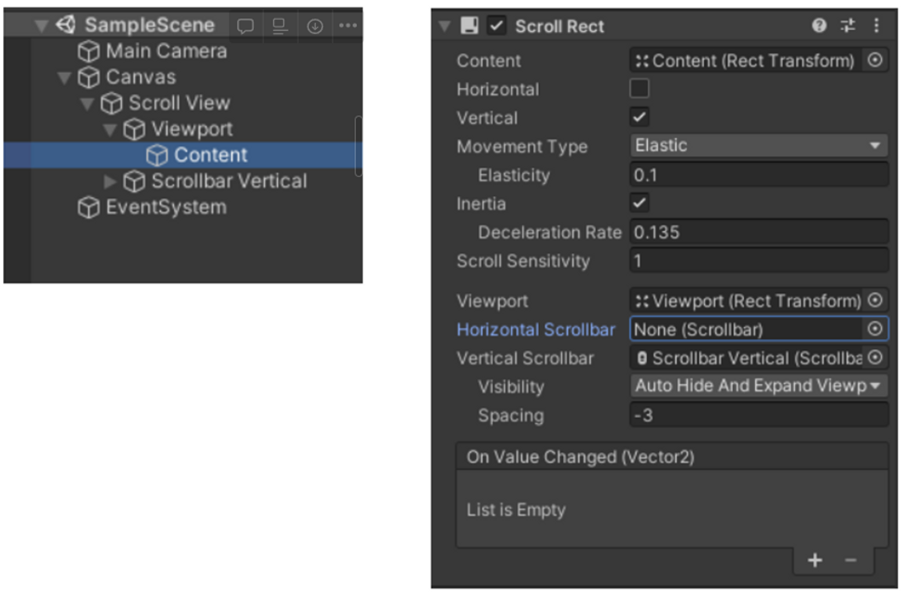

### 1. ScrollView UI 생성 및 설정

Hirearchy 창에서 **마우스 우클릭>UI>Scroll View**를 클릭하여 컴포넌트를 생성한다.

수직방향으로만 스크롤할 것이므로 **수평 scroll bar**는 삭제하고, Scroll View의 Scroll Rect 컴포넌트에서 **Horizontal**을 체크 해제한다.

<aside>
⭐<strong>Scroll Rect 컴포넌트의 속성</strong>



- Content 속성 : 스크롤될 UI 요소의 Rect Transform에 대한 참조
  - 모든 리스트 요소들은 참조된 Content의 자식이어야 한다.
- Movement Type : 스크롤 옵션
  - Elastic : 가장자리에서 스크롤될 때 약간의 탄성이 추가되어 튕기듯이 움직인다.(Elasticity : 탄성 정도)
  - Clamped : 가장자리에 딱 맞게 스크롤된다.
- Scroll Sensitivity : 스크롤 민감도
- Viewport : 리스트가 보여지는 사각 트랜스폼
  - 리스트들은 Viewport로 지정해준 객체의 Rect transform 영역 내에서만 보인다.
  </aside>

### 2. Content에 컴포넌트 추가 및 설정

ScrollView>Viewport>Content에 **_Vertical Layout Group_** 컴포넌트와 **_Content Size Fitter_** 컴포넌트를 추가한다.

- Vertical Layout Group : Content의 자식인 item들의 위치를 자동으로 조정해준다.
  - Padding : item 내부에 적용되는 간격
  - Spacing : Item들 사이의 간격
  - Control Child Size : 레이아웃 그룹(=Content 객체)이 item들의 너비/ 높이를 제어할지 여부.
    →나는 Scroll View의 너비와 item의 너비를 동일하게 설정하기 위해 체크하였다.
- Content Size Fitter
  - Vertical Fit : 높이를 제어한다.
    - Unconstrained : item에 기반하여 높이를 조정하지 않는다.
    - Preferred Size : item의 기본 높이에 기반하여 높이를 조정한다.
      → Vertical Fit을 **Preferred Size**로 설정(item들이 생성될 때마다 Content 객체의 크기가 자동으로 맞춰진다.)

### 3. 내부 item들을 생성하기 위한 스크립트 작성

\*Content의 자식 요소로 Instantiate를 수행한다.

```csharp
private void Init(){
	int yValue=0;
	for(int i=0;i<10;i++){
		item.Item(GetStudyData().result[0].level,
		GetStudyData().result[0].unit,
		GetStudyData().result[0].text_title);
		var index=Instantiate(item, new Vector3(0,yValue,0),Quaternion.identity);
		index.transform.SetParent(GameObject.Find("Content").transform);
		yValue-=200;
}
```

추가)

이렇게 만들었을 때, 게임을 시작했을 때 스크롤바의 시작위치가 처음이 아니라 중앙으로 설정되는 문제가 있었다.

<해결 방법>

Content의 **_Rect Transform_** 컴포넌트의 pivot pos Y를 1로 바꿔준다.(가로 스크롤을 사용하는 경우 pivot pos X를 바꿔주면 된다.

<nav> 참고 게시글

- [[Unity] ScrollView를 사용하여 List 만들기](https://kumgo1d.tistory.com/14)

- [[Unity3D] UGUI 스크롤뷰 리스트 아이템 동적 생성](https://www.youtube.com/watch?v=TnGqmHEoaFE)

- [[Unity]유니티 스크롤 리스트 뷰 만들기](https://textbox.tistory.com/entry/Unity%EC%9C%A0%EB%8B%88%ED%8B%B0-%EC%8A%A4%ED%81%AC%EB%A1%A4-%EB%A6%AC%EC%8A%A4%ED%8A%B8-%EB%B7%B0-%EB%A7%8C%EB%93%A4%EA%B8%B0)

- [[Unity] 유니티 스크롤뷰 > 뷰포트 > 콘텐트 에서 콘텐트의 스크롤 렉트의 시작 위치가 중앙으로 잡히는 버그 (scroll rect starting in the mddle)](https://ssscool.tistory.com/428)

</nav>
