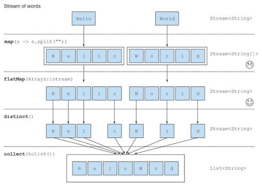

```
우테코 레벨1 6주차(3/13(월)~3/17(금))의 기술부채를 모아놓은 포스트입니다.
```

- 코드리뷰
  - 생성자에 별도로 로직이 들어가는 경우 의미를 담아 정적 팩토리 메서드를 사용하는 것도 좋다.

✅RDD(책임 주도 설계)

- 객체 지향 설계 기법 중 하나로,(**RDD**, 디자인 패턴, TDD) 객체 지향을 잘 구현하기 위한, 즉 협력을 위한 적합한 책임들을 선별하고 객체들에 위임해주기 위한 방법론.
- 말 그대로 객체의 책임을 중심으로 시스템을 구축하는 것으로, 시스템의 기능을 더 작은 규모의 책임으로 분할하고, 각 책임은 책임을 수행할 적절한 객체에게 할당한다. 객체가 스스로 처리할 수 없는 정보나 기능이 필요한 경우 적절한 객체를 찾아 필요한 작업을 **요청**하게 된다. 이런 요청 행위를 통해 결과적으로 객체들 간의 **협력관계**가 만들어진다고 볼 수 있다.
- 객체에게 중요한 것은 데이터가 아니라 외부에 제공하는 **행동**이다.
- RDD 시나리오
  - 시스템의 기능은 더 작은 책임으로 **분할**된다.
  - 책임을 적절히 수행할 객체에게 **할당**한다.
  - 객체가 수행하지 못할 경우 필요한 작업을 **요청**한다.
  - 요청된 작업을 수행하는 일은 위임받은 객체의 **책임으로 변환**된다.
  - 결과적으로 요청한 객체와 받은 객체의 **협력**이 만들어진다.

✅자동 자원 반환(try with resource)

[[java] Try-with-resource 문이란? 자동 자원반납.](https://cheershennah.tistory.com/180)

- 자바에서 외부 자원에 접근하는 경우, 외부 자원을 반드시 반납해주어야 한다.
  ```java
  param = new Object(); //자원할당
  param.work();
  param.close(); //자원 반납
  ```
  위와 같이 자원을 할당하면 그 자원은 도로 반납이 되어야 한다. 만약 위 동작 과정 중 예외가 발생하게 되면 close() 메소드가 실행되지 않아 자원을 반납하지 못하는 문제가 발생할 수 있다.
  그래서 일반적으로 try-catch문의 finally 블럭에서 close() 메서드를 수행한다.
- `Java1.7`부터 try with resource 문법이 추가되어, 훨씬 간결하게 자원 반납 문제를 해결할 수 있게 되었다.
  try의 () 블럭 내에서 자원 할당을 해주면 직접 close() 구문을 작성해주지 않아도 try블럭 내의 구문들이 정상적으로 실행되든 예외가 발생하든 자동으로close() 메소드가 호출된다.
  ```java
  try (FileInputStream fis = new FileInputStream("file.txt")){
   ...
  } catch(IOException e) {
   ...
  }
  ```
  finally 구문에 close() 메서드를 호출하는 것과의 차이점이라면, 예외가 발생한 경우 catch 구문으로 넘어가기 전에 close() 메서드가 호출된다는 점이다.
- 자원 할당이 여러 개인 경우 ;를 사용해서 여러 개를 구현할 수도 있고, 중첩 try문에서도 사용할 수 있다.
- 자동 자원 반납 기능을 사용하기 위해선 할당된 객체가**AutoCloseable 인터페이스**를 구현한 객체여야 한다.

✅connection을 끊어줘야 하는 이유(자원 반납)

- 락을 해제하기 위해 →lock은 최단 시간으로 잡는 것이 좋다.
- 가비지 컬렉터가 언제 돌지 모른다.
- **DB자원은 비싸다.**
  ⇒커넥션은 최대한 짧게 하는 게 좋음
  DB가 나오면, 객체지향을 포기하더라도 DB의 성능을 신경써야 할 때가 있다.
- 공유자원을 여러 군데에서 사용할 때 동기화 문제가 발생하는 것을 방지하기 위해 사용한다.

✅테스트코드 롤백 하는 법

- Spring을 사용하지 않은 순수 java의 경우, 어노테이션을 사용할 수 없고, connection의 설정을 바꿔주면 가능하다.

  ```java
  		private UserDao userDao;
  		private Connection connection;

      @BeforeEach
      void initialize() {
          try {
              connection = DataSource.getConnection();
              Objects.requireNonNull(connection).setAutoCommit(false);
              userDao = new UserDao(connection);
          } catch (SQLException e) {
              e.printStackTrace();
          }
      }
  ```

  DAO 객체가 Connection을 외부로부터 주입 받게 설계하고, 테스트 코드에서 DAO 메서드를 호출하기 전 `connection.setAutoCommit(false);` 메서드를 호출하여 쿼리문 실행 시 자동으로 commit되지 않게 설정한다.
  쿼리문 실행 후 검증이 완료되면 `connection.rollback()` 메서드를 호출하여 변경사항을 rollback한다.

✅test 코드 order 어노테이션

- 어떤 이유로 테스트 메서드들의 실행 순서를 설정해줘야 할 때, `@TestMethodOrder` 어노테이션을 사용할 수 있다.
- `@TestMethodOrder` 어노테이션의 value 파라미터로 정렬 타입을 넣어줘야 하는데, 정렬 타입에는 DisplayName, Order, Random이 올 수 있다.

  - MethodName.class : 테스트 메서드 이름에 따라 정렬한다.
  - MethodOrderer.DisplayName.class : `@DisplayName` 어노테이션으로 선언해준 테스트 메서드 이름에 따라 정렬한다.
  - MethodOrderer.OrderAnnotation.class : `@Order` 어노테이션으로 설정해준 테스트 메서드의 인덱스에 따라 정렬한다.

  ```java
  @TestMethodOrder(value = MethodOrderer.OrderAnnotation.class)
  public class OrderAnnotationTest {

      @Order(3)
      @Test
      void a_test() {
      }

      @Order(2)
      @Test
      void b_test() {
      }

      @Order(1)
      @Test
      void c_test() {
      }
  }
  ```

✅인터페이스의 디폴트 메서드

- 메서드의 접근 제어자 앞에 `default` 키워드를 추가해주면 인터페이스의 디폴트 메서드로서 구현이 가능하다.

  ```java
  public interfacre 인터페이스{

  ...
  default void printHello() {
      	System.out.println("Hello World");
      }
  }
  ```

✅assertThat().extracting()

- 클래스의 특정 필드 값을 추출하는 메서드

  ```java
  assertThat(객체).extracting("필드명")
                                 .contains("Boromir", "Gandalf", "Frodo", "Legolas")
                                 .doesNotContain("Sauron", "Elrond");
  ```

  인자가 하나인 경우 명확하게 타입을 지정해줄 수도 있다.

  ```java
  .extracting("name", String.class)...
  ```

  여러 개의 필드를 한 번에 검사하고 싶은 경우, 튜플을 사용하여 테스트할 수 있다.

  ```java
  import static org.assertj.core.api.Assertions.tuple;

  // extracting name, age and and race.name nested property
  assertThat(fellowshipOfTheRing).extracting("name", "age", "race.name")
                                 .contains(tuple("Boromir", 37, "Man"),
                                           tuple("Sam", 38, "Hobbit"),
                                           tuple("Legolas", 1000, "Elf"));
  ```

- 장점 : private로 선언한 필드 값을 getter를 만들지 않고 테스트할 수 있게 해준다.
- 단점 : 디버깅을 제공하지 않는다.

✅static을 사용하는 것이 객체지향에 어긋나는 이유

[static 과 객체지향적 관점](https://velog.io/@yyy96/static)

static은 전역 변수를 사용할 때 유용하다. 하지만 객체 지향 프로그래밍 원칙에 따르면, 한 객체가 지니고 있는 데이터들은 **외부에서 함부로 접근하거나 수정할 수 없어야** 한다.

static 변수는 객체 지향 프로그래밍 원칙 중 하나인 캡슐화 원칙에 위배된다..
✅view 메서드 네이밍에 대한 의견 : input이 의미적으로 다양한 방법의 입력을 포함할 수 있기 때문에(파일 입력 등), input보단 read를 쓰는 게 좋다.

🔼검증 후 실행하는 순서로 코드를 짜야 하는 이유

- 가독성을 위해(좀 더 알아봐야 할 듯)

✅flatMap

[.map()과 .flatMap()의 차이](https://kchanguk.tistory.com/56)

- **map()** : 단일 스트림의 원소를 매핑시킨 후 매핑시킨 값을 다시 스트림으로 변환
- **flatMap()** : Array나 Object로 감싸져 있는 모든 원소를 단일 원소 스트림으로 반환.
  - 중복된 스트림을 1차원으로 평면화
    
- 예시
  아래와 같이 문자열 리스트의 각 원소를 단일 문자로 분리해주고자 할때, flatMap을 사용하면 각각의 String 리스트를 별도의 stream으로 만드는 것이 아니라, String 리스트를 감싸고 있는 더 큰 스트림의 구성요소로 만들어줄 수 있다.
  ```java
  List<String[]> results = animals.stream().map(animal -> animal.split(""))
                                  .collect(Collectors.toList());
  ```
  ```java
  List<String> results = animals.stream().map(animal -> animal.split(""))
          .flatMap(Arrays::stream)
          .collect(Collectors.toList());
  ```
  ```java
  //map의 결과
  results=[["c", "a", "t"], ["d", "o", "g"]];
  //flatMap의 결과
  results = [c, a, t, d, o, g]
  ```

✅getClass가 바람직하지 않은 이유

[instanceOf, getClass() 를 통해 비교하면 안될까?](https://velog.io/@mohai2618/instanceOf-getClass-를-통해-비교하면-안될까)

- **캡슐화** 위배 : getClass() 또는 instanceOf() 메서드를 사용하는 것은 캡슐화 원칙에 어긋나기 때문에 객체지향적이지 못하다.

- **OCP(객체는 확장에 열려있고, 변화에는 닫혀있어야 함)** 위반

  만약 새로운 Piece 객체를 생성하게 되면 getClass() 또는 instanceOf() 메서드를 호출하던 메서드를 수정해야 하는 상황이 발생할 수 있다.

- **SRP(단일책임원칙)** 위반 : 객체는 하나의 책임만 가져야 하는데, 만약 isPawn() 메서드를 instanceOf()을 통해 구현하게 되면 Piece의 메서드가 모든 객체의 책임을 가져가게 된다.
