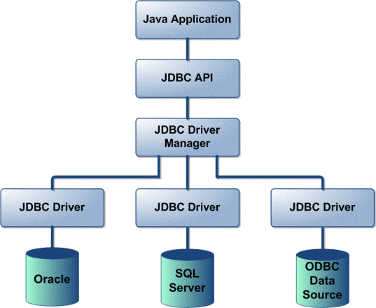

## JDBC와 DriverManager
JDBC는 Java 어플리케이션과 RDBMS를 연결해주는 **모듈**입니다.


JDBC는 JDBC API, JDBC Driver 2개의 레이어로 구성되는데,

JDBC API는 개발자가 사용하는 **API(인터페이스)** 이고, JDBC Driver는 **JDBC API의 구현체**로, 각각의 RDBMS 벤더가 작성하고 관리합니다.

<br/>

JDBC Driver Manager는 그 사이에서 RDBMS의 **Driver 목록을 관리하는 클래스**입니다.

애플리케이션은 필요한 경우 여러 JDBC Driver를 동시에 사용할 수 있는데요.

JDBC Driver별로 가지고 있는 고유한 URL을 JDBC DriverManager에 전달하면 사용하고자 하는 JDBC Driver를 지정해줄 수 있습니다.
```java
Class.forName(“com.mysql.jdbc.Driver”);
```
위 코드를 실행하면 MySQL의 JDBC Driver 클래스를 로딩하고, 그렇게 해서 생성된 객체가 JDBC DriverManager에 등록됩니다.
```java
final Connection = DriverManager.getConnection("jdbc:mysql://localhost:3306/test_db","root","1234");
```
위와 같이 JDBC DriverManager의 getConnection() 메서드를 호출하면, DriverManager에 등록된 JDBC Driver를 통해 Connection 객체를 얻을 수 있습니다.

이것이 DB Connection을 얻는 방법 중 하나입니다.

> **참고**
> 
> JDBC 4.0 이전에는 `Class.forName` 메서드를 사용해 JDBC 드라이버를 직접 등록해야 했는데, JDBC 4.0부터는 DriveManger가 적절한 JDBC 드라이버를 찾아준다.

## DataSource
데이터베이스 커넥션을 얻는 방법은 다양합니다.

앞서 설명한 것처럼 DriverManager로 신규 커넥션을 생성하거나, HikariCP와 같은 커넥션 풀을 통해 커넥션을 얻을 수도 있습니다.

<br/>

만약 JDBC DriverManager를 통해 커넥션을 획득하다가 커넥션 풀을 사용하도록 변경하려면 어떻게 해야 할까요? 의존 관계가 DriverManager에서 커넥션 풀로 변경되었으므로 애플리케이션 코드도 함께 수정해주어야 합니다.

DataSource는 이러한 불편을 해소하기 위해 커넥션을 얻는 방법을 추상화한 인터페이스입니다.


그림으로 표현하면 이와 같습니다.

따라서 개발자는 HikariCP, DBCP2 등의 구체적인 코드를 의존하지 않고, DataSource 인터페이스에만 의존하도록 애플리케이션 로직을 작성할 수 있습니다.


## 참고 자료
---
[JDBC와 DataSource](https://velog.io/@sangmin7648/JDBC)

[Java DriverManager 클래스](https://www.ibm.com/docs/ko/i/7.3?topic=connections-java-drivermanager-class)