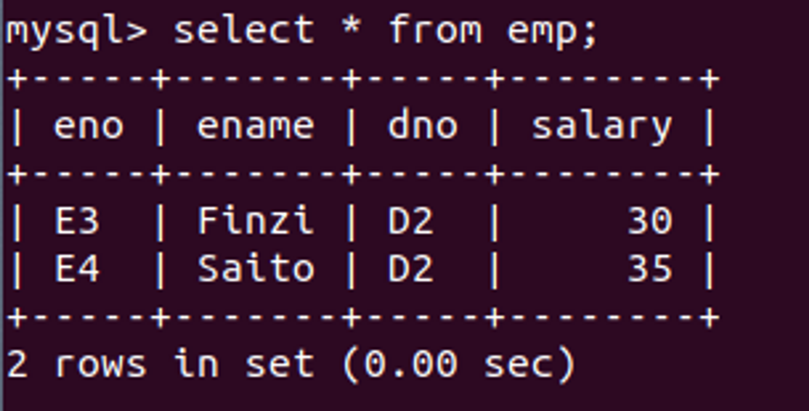
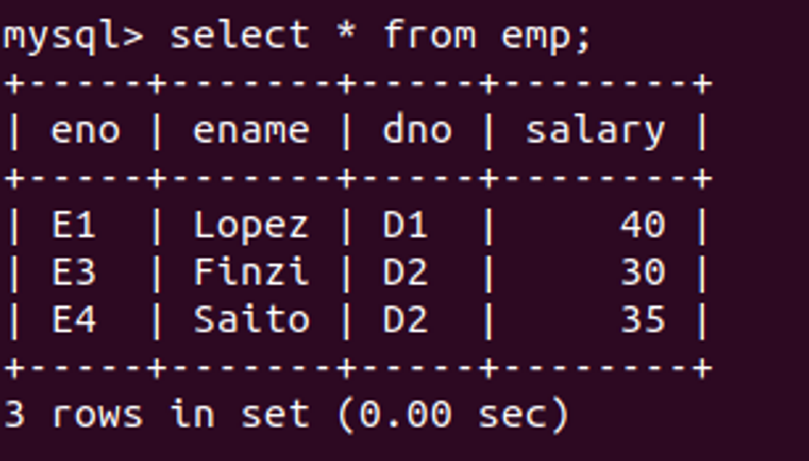
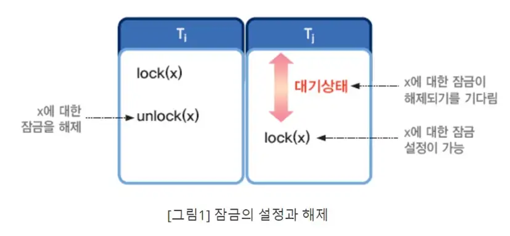
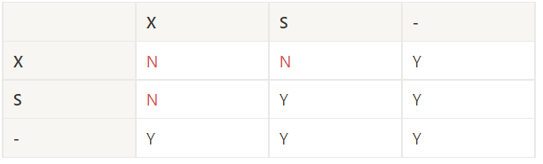
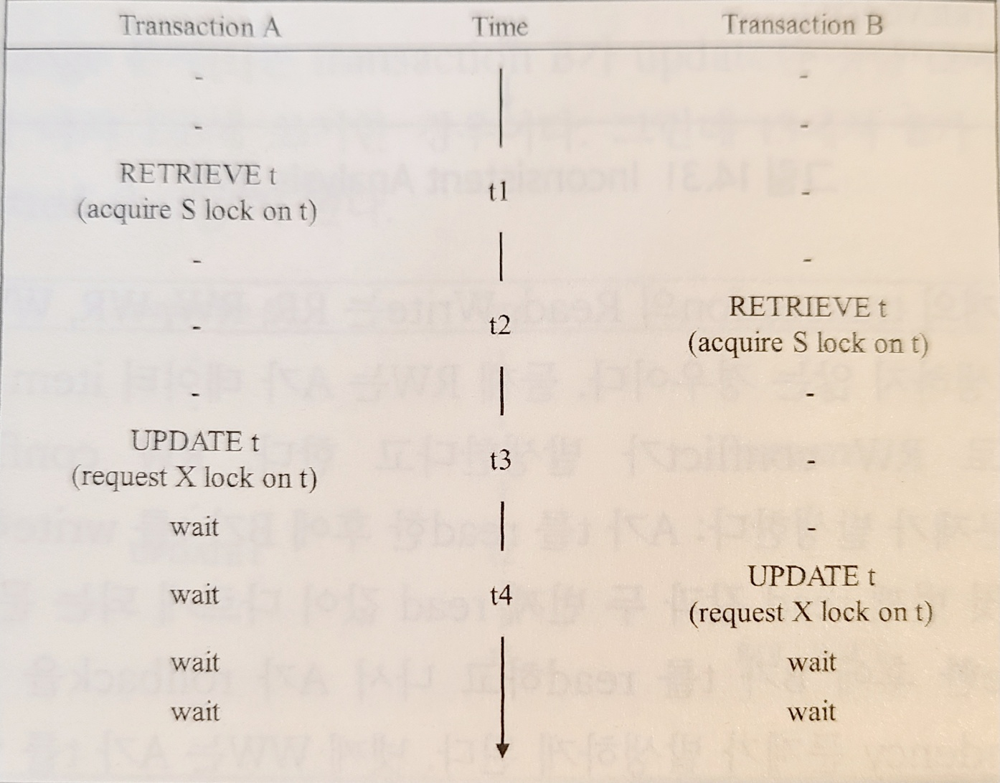
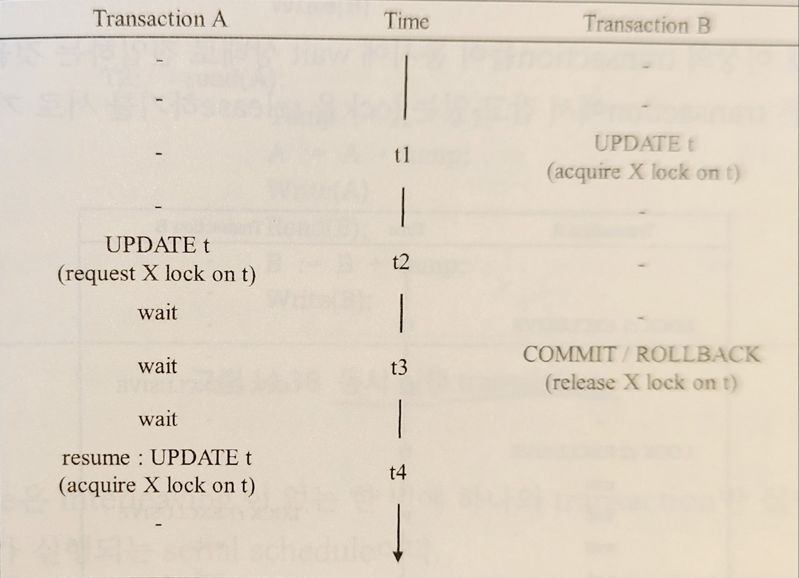
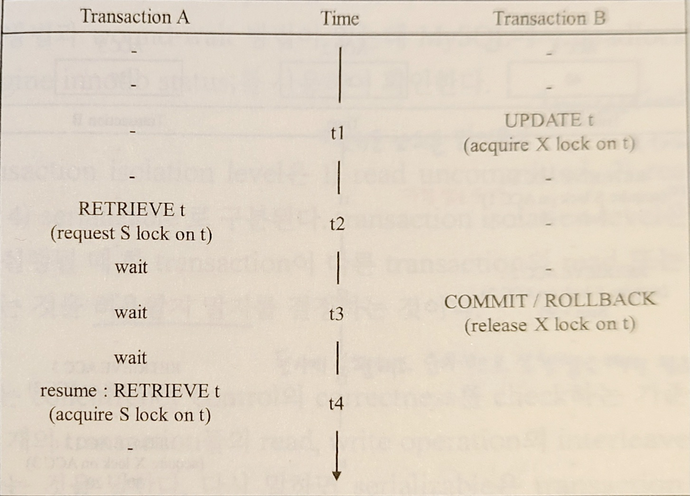
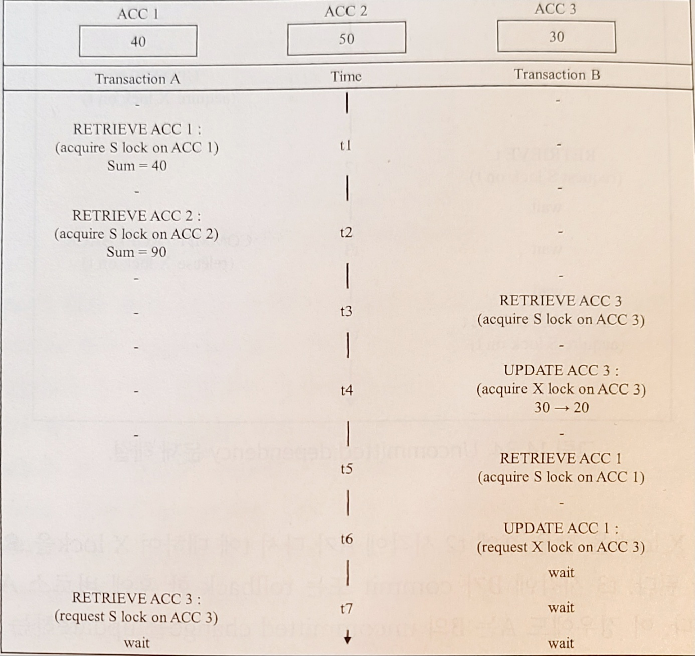

### Transaction(트랜잭션)

- 트랜잭션의 특성 ACID
  - **A**tomic : 트랜잭션에 포함된 SQL문들은 모두 실행되거나 하나도 실행되지 않은 상태여야 한다.
  - **C**onsistent(일관성) : SQl문에 의한 실행 결과에 대해 일관성이 유지되어야 한다.
    ex)계좌 A에서 B로 송금할 때, A에서 금액을 인출하는 트랜잭션만 수행되고 B에 대한 트랜잭션이 실행되지 않는다면 데이터 일관성이 지켜지지 않은 것이라고 할 수 있다.
  - **I**solation : 두 개 이상의 트랜잭션이 서로 간섭 없이 동시에 병행 실행(concurrent)할 수 있어야 함.
    ex) 두 트랜잭션이 동일한 테이블에 대해 연산을 수행할 때 두 트랜잭션 간 간섭 없이 동시에 실행될 수 있어야 한다.
  - **D**urable : 트랜잭션이 실행 종료되면 실행 결과는 데이터베이스에 영구적으로 저장되어야 한다.
- Commit과 Rollback

  - `BEGIN TRANSACTION` : 트랜잭션의 시작을 나타냄.
  - `END TRANSACTION` : 트랜잭션의 끝을 나타냄.
  - `COMMIT` : 트랜잭션의 변경사항을 적용한다.
  - `ROLLBACK` : 트랜잭션의 변경사항을 취소한다.

⭐트랜잭션을 Commit하기 전까지 트랜잭션의 변경사항은 실제 테이블에 적용되지 않는다.

⭐이미 Commit된 변경사항은 Rollback할 수 없다.

```sql
 BEGIN TRANSACTION
	update account A;
	update account B;
	IF everything worked fine
		THEN COMMIT;
	ELSE ROLLBACK;
	END IF
END TRANSACTION
```

- 터미널 상에서 transaction을 실행할 때

  - `start transaction;` : 트랜잭션을 시작한다.
  - `commit;` : 트랜잭션의 변경사항을 적용하고 트랜잭션을 종료한다.
    <aside>
    💡 //터미널 A에서

    mysql>start transaction;

    mysql>delete from emp where salary=40;

    mysql>select \* from emp;

    

    ***

    //터미널 B에서

    mysql>select \* from emp;

    

    </aside>

터미널 A의 트랜잭션을 commit하기 전까지 실제 테이블에 변경사항이 적용되지 않는다.

### Locking

Concurrency Control

- concurrency 문제 : 2개 이상의 트랜잭션이 동시에 같은 데이터에 접근할 때 발생할 수 있는 문제
  - lost update : update 내용이 덮어쓰기되는 것.
  - Uncommitted Dependency : 다른 트랜잭션에 의해 update된 내용을 읽었을 때 해당 트랜잭션이 취소(rollback)되면, 도중에 읽어왔던 데이터는 uncommitted value가 된다.
  - Uncommitted Change : 다른 트랜잭션에 의해 update된 내용에 기반하여 update를 수행했을 때 해당 트랜잭션이 취소(rollback)되면 자신이 했던 update 내용에 문제가 발생한다.
  - Inconsistent Analysis : 다른 트랜잭션의 update가 진행되는 도중에 일련의 데이터들을 읽었을 때 uncommitted change 값과 committed change 값을 같이 읽게 되는 경우
- 트랜잭션의 Read/Write 관계
  - RR : 상호 간섭이 발생하지 않는다.
  - RW : 트랜잭션 A가 item t를 읽고 트랜잭션 B가 t를 수정하는 경우
    → RW conflict 발생(unrepeatable read) : A가 처음 읽은 내용과 B의 수정 후 읽은 내용이 다르다.
  - WR : A가 t를 수정한 후에 B가 t를 읽은 뒤 A가 rollback을 하는 경우
    →uncommitted dependency 발생
  - WW : A가 t를 수정한 후에 다시 B가 t를 수정하는 경우
    →dirty read 발생
- Lock 동작 메커니즘
  : Lock은 일반적으로 Lock 연산과 Unlock 연산이 쓰인다. 한 트랜젝션에서 데이터 x를 lock하면, x를 다시 unlock할 때까지 다른 트랜잭션에서 x을 lock할 수 없다.
  
- Locking 종류
  - Exclusive lock(X lock) : 데이터 t에 대해 X lock을 설정한 트랜잭션은 t에 대해 **읽기**연산과 **쓰기**연산 모두 할 수 있다.
    - 데이터 t에 대해 여러 트랜잭션이 동시에 X lock을 설정할 수 없다.(하나의 데이터에 하나의 X lock)
    - 특정 트랜잭션이 t에 대해 X lock을 설정했을 때, 다른 트랜잭션들은 t에 대해 읽기와 쓰기 모두 불가하다.
  - Shared lock(S lock) : 데이터 t에 대해 S lock을 설정한 트랜잭션은 t에 대해 **읽기** 연산만 수행할 수 있다.
    - 데이터 t에 대해 여러 트랜잭션이 동시에 S lock을 설정할 수 있다.
    - 특정 트랜잭션이 t에 대해 S lock을 설정했을 때, 다른 트랜잭션들도 t에 대해 읽기 연산만 가능하다.
      다음은 두 트랜잭션이 특정 데이터에 대해 S lock, X lock을 사용할 때 동시 잠금이 가능한지에 대한 표이다.
      Y는 두 트랜잭션의 동시 실행이 가능한 경우, N은 wait해야 하는 경우이다.
      
      일반적으로 read 연산 실행 전 S lock을 실행하고, write 연산 실행 전에 X lock을 실행한다.

한 트랜잭션이 같은 데이터 t를 먼저 읽고 수정을 하게 되면 처음엔 S lock 상태였다가 X lock 상태로 전환된다.

livelock : A가 설정한 lock에 대해 B가 conflict을 일으키면 B는 wait 상태가 된다.

A가 설정한 lock을 해제할 때 다른 트랜잭션의 lock 요청이 들어오게 되면 B는 무한정으로 기다려야 한다.

→ 나중에 들어온 트랜잭션에 대해 계속 lock을 걸 수 있게 해주는 불공평한 waiting scheme 때문에 발생.

⇒모든 lock 요청이 first-com/first-serve 순서로 처리되도록 한다.



lost update 문제는 해결되었으나 wait 상태가 지속되는 deadlock이 발생한다.




데이터 t에 X lock이 걸려있는 상태에서 S lock을 요청하면 충돌이 발생하여 A의 읽기 명령이 대기상태가 되고, B가 Commit 또는 rollback되어 X lock이 풀린 후에 A의 읽기 명령이 다시 수행된다.⇒uncommitted dependency 문제 해결(A가 수정 명령을 보내도 마찬가지)



**deadlock** : 2개 이상의 트랜잭션들이 동시에 wait 상태가 되는 것

- 트랜잭션 isolation level(격리 수준)
  : 동시에 여러 개의 트랜잭션이 실행될 때 한 트랜잭션이 다른 트랜잭션이 사용하고 있는 데이터에 접근하는 것을 허용할지 말지에 대한 표준.

  - read uncommitted : 커밋되든 안되든 읽어온다.(가장 낮은 단계)
    ⇒dirty read 현상 발생
  - read committed : 커밋된 변경사항만 읽어온다.
    ⇒unrepeatable read 현상 발생.
  - repeatable read : 처음 읽었을 때와 나중에 읽었을 때의 결과가 같도록 제한한다.(snapshot을 사용함)
    - mysql에서 default로 설정된다.
      ⇒phantom read 현상 발생
  - serializable : 한 트랜잭션이 완료될 때까지 다른 트랜잭션은 그 영역에 해당되는 데이터에 대한 수정이 불가하다. serializable을 만족할 때, 두 트랜잭션 간 간섭이 없다.
    <aside>
    💡 show variables where variable_name=’tx_isolation’;

    ⇒현재 설정된 lock 상태를 확인하는 방법.

    </aside>

    <aside>
    💡 set session transaction isolation level [격리 수준];

    ⇒트랜잭션을 시작하기 전 격리 수준을 설정

    </aside>

- read uncommitted
  | terminal 1 | terminal 2 |
  | --------------------------------------------------------- | -------------------------------------------- |
  | `set session transaction isolation level read uncommitted;` | |
  | `start transaction;` | |
  | `select \* from stock;` | |
  | | `start transaction;` |
  | | `update stock set stockQty=88 where pno=’p2’;` |
  | | `insert into stock values(”p5”,”pike”,09);` |
  | `select \* from stock;`</br>⇒terminal 2의 update 결과가 반영됨. |
  | `insert into stock values(”p6”,”nut”,10);` | |
  | | `select \* from stock;`</br>⇒terminal 1의 update 결과가 반영되지 않음. |

  ⇒ terminal 1의 두 번째 select문에서 dirty read&non-repeatable read,&phantom read가 나타남.

- read committed
  | terminal 1 | terminal 2 |
  | ------------------------------------------------------- | ------------------------------------------------- |
  | `set session transaction isolation level read committed;` | |
  | `start transaction;` | |
  | `select \* from p;` | |
  | | `start transaction;` |
  | | `update p set weight=9999 where pname=”bolt”;` |
  | | `insert into p values(”p7”, “pike”, 12.34, “red”);` |
  | `select \* from p;` | |
  | | `commit;` |
  | `select \* from p;` | |

  terminal 1의 두 번째 select와 세 번째 select의 결과가 다른 non-repeatable read&phantom read가 발생.

- repeatable read
  | terminal 1 | terminal 2 |
  | -------------------------------------------------------- | ------------------------------------------------- |
  | `set session transaction isolation level repeatable read;` | |
  | `start transaction;` | |
  | `select \* from p;` | |
  | | `start transaction;` |
  | | `update p set weight=9999 where pname=”bolt”;` |
  | | `insert into p values(”p7”, “pike”, 12.34, “red”);` |
  | `select \* from p;` | |
  | | `commit;` |
  | `select \* from p;` | |

  terminal 1의 세 select 모두 같은 결과가 나타난다.

- serializable
  | terminal 1 | terminal 2 |
  | ----------------------------------------------------- | ----------------------------------------- |
  | `set session transaction isolation level serializable;` | |
  | `start transaction;` | |
  | `select \* from p;` <br/>⇒테이블 p에 S lock을 건다. | |
  | | `update p set weight=99 where color=”Red”;` |
  | | **\*_wait_\*** |
  | | **\*_timeout_\*** |
  | `select \* from s for update;`<br/>⇒테이블 s에 X lock을 건다. | |
  | | `select \* from s;` |
  | | `select \* from s for update;` |
  | | **\*_wait_\*** |

  - S lock과 X lock은 row-level lock이며, intention lock은 table-level lock이다.

    - `select … lock in share mode;`는 테이블에 IS lock을 걸고 row에 S lock을 건다.
    - `select … for update;`는 테이블에 IX lock을 걸고 row에 X lock을 건다. 다른 트랜잭션에서 배타적으로 읽거나 수정하기 위해 lock을 얻으려 할 때 대기상태가 된다.
      | terminal 1 | terminal 2 |
      | ----------------------------------------------------- | ------------------------------------ |
      | `set session transaction isolation level serializable;` | |
      | `start transaction;` | `start transaction;` |
      | `select \* from p for update;`<br/> ⇒테이블 p에 X lock을 건다. | |
      | | `select \* from s for update;` |
      | | **\*_wait_\*** |
      | | **\*_timeout_\*** |
      | | `select \* from s lock in share mode;` |
      | | **\*_wait_\*** |
      | | **\*_timeout_\*** |

      \*특정 unique index에 대해 …for update 구문을 사용하면 해당 레코드의 index에 X lock이 걸린다. 그렇지 않을 경우 테이블 전체를 스캔해야 하기 때문에 테이블의 모든 행에 대해 X lock이 걸리게 된다.

      | terminal 1                                                                                                                            | terminal 2                                                |
      | ------------------------------------------------------------------------------------------------------------------------------------- | --------------------------------------------------------- |
      | `set session transaction isolation level serializable;`                                                                               |                                                           |
      | `start transaction;`                                                                                                                  | `start transaction;`                                      |
      | `select \* from s where city=”London” for update`<br/>⇒city는 unique index가 아니기 때문에, 테이블 s의 모든 레코드에 X lock이 걸린다. |                                                           |
      |                                                                                                                                       | `select \* from s where city=”Busan” lock in share mode;` |
      |                                                                                                                                       | **\*_wait_\***                                            |
      |                                                                                                                                       | **\*_timeout_\***                                         |
      |                                                                                                                                       | `select \* from s where sno=”s7” for update;`             |
      |                                                                                                                                       | **\*_wait_\***                                            |
      |                                                                                                                                       | **\*_timeout_\***                                         |

* 추가 )

gap lock : index 값의 범위에 대해 lock을 건다.

| terminal 1                                                                                            | terminal 2                                            |
| ----------------------------------------------------------------------------------------------------- | ----------------------------------------------------- |
| `set session transaction isolation level serializable;`                                               |                                                       |
| `start transaction;`                                                                                  | `start transaction;`                                  |
| `select _ from s where sno between “s2” and “s6” for update`<br/>⇒index 값 범위에 대해 lock이 걸린다. |                                                       |
|                                                                                                       | `select _ from s where sno=”s5” lock in share mode;`  |
|                                                                                                       | **\*_wait_\***                                        |
|                                                                                                       | **\*_timeout_\***                                     |
|                                                                                                       | `select \* from s where sno=”s7” lock in share mode;` |

<nav> 참고 게시글

- [동시성 제어 기법 - 잠금(Locking) 기법](https://medium.com/pocs/%EB%8F%99%EC%8B%9C%EC%84%B1-%EC%A0%9C%EC%96%B4-%EA%B8%B0%EB%B2%95-%EC%9E%A0%EA%B8%88-locking-%EA%B8%B0%EB%B2%95-319bd0e6a68a)

- [Select 쿼리는 S락이 아니다. (X락과 S락의 차이)](https://velog.io/@soongjamm/Select-%EC%BF%BC%EB%A6%AC%EB%8A%94-S%EB%9D%BD%EC%9D%B4-%EC%95%84%EB%8B%88%EB%8B%A4.-X%EB%9D%BD%EA%B3%BC-S%EB%9D%BD%EC%9D%98-%EC%B0%A8%EC%9D%B4)

</nav>
