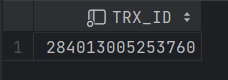
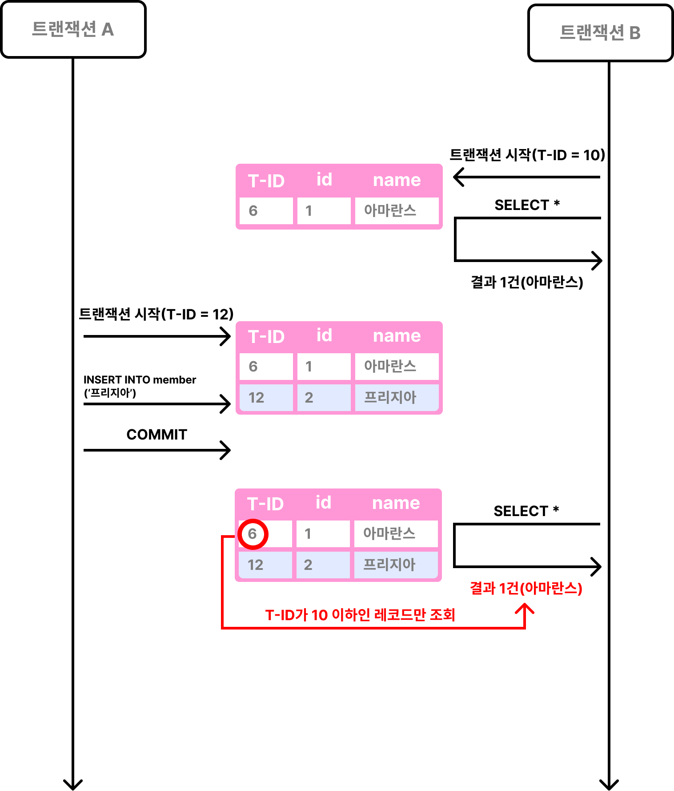
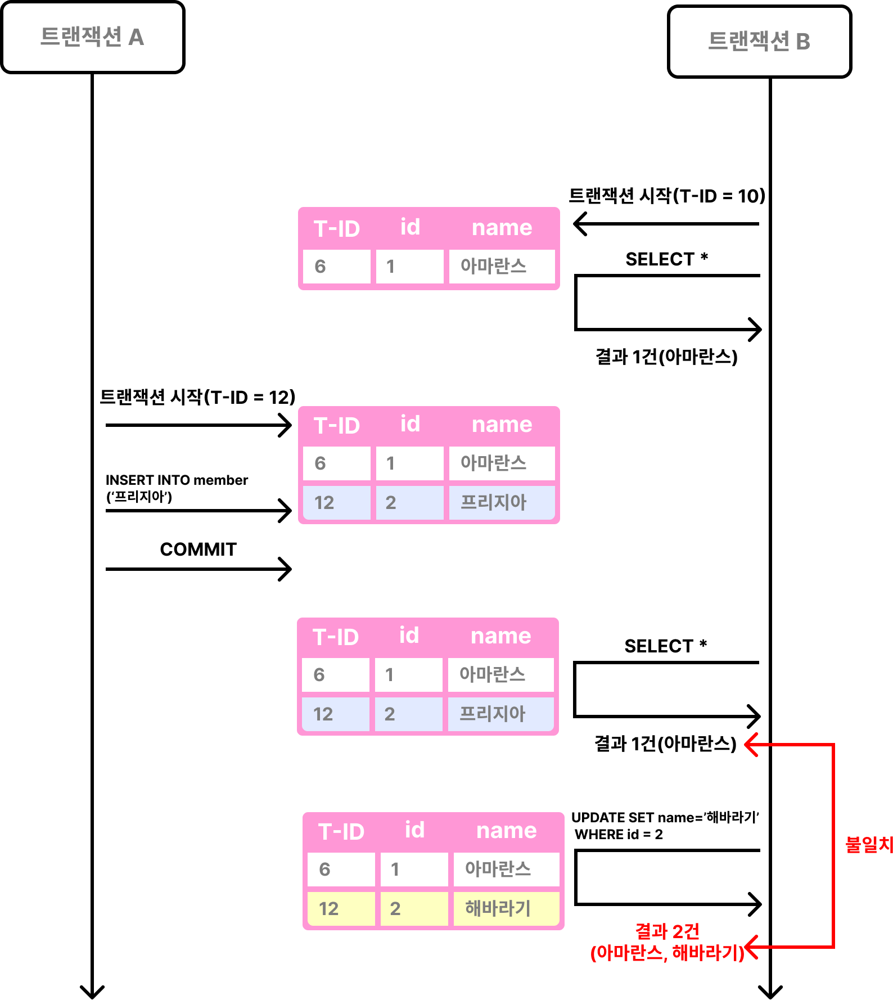
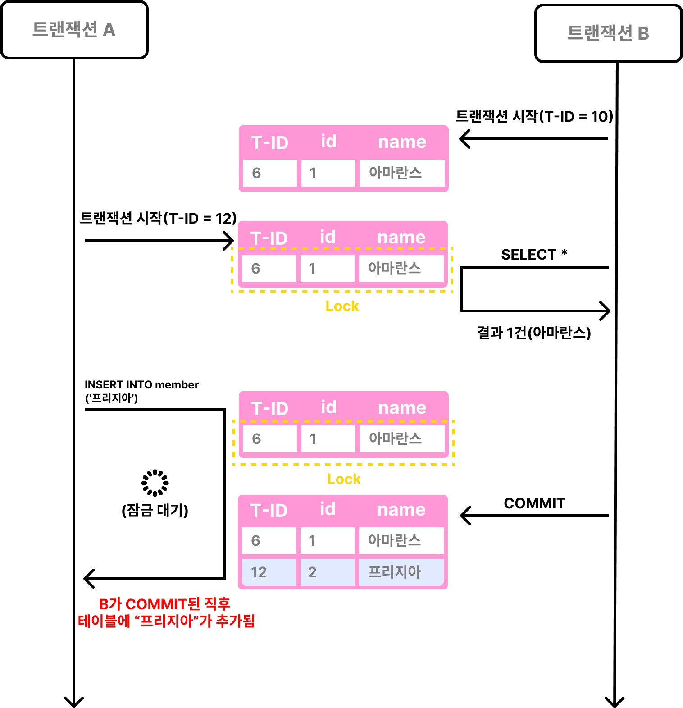
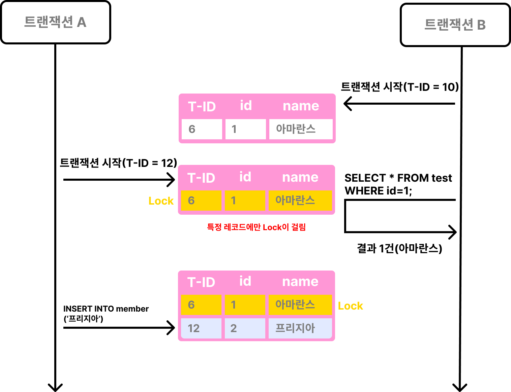

[트랜잭션 격리 수준과 Locking에 대한 이전 게시글](https://amaran-th.github.io/%EB%8D%B0%EC%9D%B4%ED%84%B0%EB%B2%A0%EC%9D%B4%EC%8A%A4/Transaction%EA%B3%BC%20Locking/)

## 격리 수준

---

: **동시에 여러 개의 트랜잭션이 처리될 때** 성능과 안정성, 일관성 및 결과 재현성 간의 균형을 미세 조정하는 설정

다르게 말하면, 격리 수준이란 트랜잭션이 동시에 수행될 때 다른 트랜잭션에서 변경하거나 조회하는 데이터를 어디까지 볼 수 있도록 허용할 것인지에 대한 설정이라고 할 수 있다.

데이터베이스의 격리 수준은 크게 `Read Uncommitted`, `Read Committed`, `Repeatable Read`, `Serializable` 4가지로 분류된다.

각 격리 수준별로 발생하는 **읽기 부정합**의 종류가 다르다.

<aside>

💡 **읽기 부정합이란?**

---

어떤 데이터들이 값이 서로 일치하는 특성을 데이터 정합성이라고 한다.

즉 읽기 부정합이란, 같은 데이터를 읽었을 때 데이터의 값이 달라지는 현상이라고 할 수 있다.

</aside>

| 읽기 부정합 \ 격리 레벨 | read uncommitted | read committed | repeatable read | serializable |
| --- | --- | --- | --- | --- |
| dirty read | O |  |  |  |
| non-repeatable read | O | O |  |  |
| phantom read | O | O | O(InnoDB에서는 X) |  |

MySQL의 InnoDB에서는 `Repeatable Read`, 오라클 DBMS에서는 `Read Committed`를 기본 격리수준으로 설정되어 있다.

다른 RDBMS와 달리, MySQL에서는 MVCC라는 기술을 사용해 락을 걸지 않고 읽기 부정합 문제를 해결한다. MVCC는 Read Committed와 Repeatable Read에 적용된다.

뒤에서 다시 언급되니 기억해두자.

## ✨ Read Uncommitted

---

: 트랜잭션의 변경 내용을 커밋/롤백 여부와 상관 없이 다른 트랜잭션에서도 조회할 수 있는 격리수준.

### 💥 Dirty Read

: 트랜잭션에서 커밋되지 않은 변경 사항을 다른 트랜잭션에서 조회되는 현상이다.

## ✨ Read Committed

---

: 다른 트랜잭션에서 커밋이 되지 않은 데이터는 조회되지 않는다.

MySQL에서는 레코드 조회 시 **언두 로그**를 읽어 이전 상태를 읽어온다. 여기에서 MVCC 개념이 적용된다.

<aside>

💡 **MVCC(다중 버전 동시성 제어)**

---

MySQL에서는 레코드 변경이 일어나면, 변경 전의 레코드를 **언두 공간에 백업**해둔다. 이러한 메커니즘으로 인해 동일한 레코드에 대해 메모리와 언두 공간 두 버전의 데이터가 존재하게 되는데, 이렇게 하나의 데이터에 대해 여러 버전의 데이터를 동시에 가지고 있는 것을 MVCC라고 한다.

MVCC를 통해 우리는 특정 시점에서의 테이블 데이터를 불러올 수 있다.

Read Committed 격리 수준의 트랜잭션에서 특정 레코드를 조회하면 해당 레코드 트랜잭션 번호를 참고해 자신보다 먼저 실행된 트랜잭션의 데이터만을 조회한다.

만약 테이블에 자신보다 높은 트랜잭션 번호를 가진 데이터가 존재한다면 언두 공간의 데이터를 탐색한다.

때문에 어떤 트랜잭션에서 읽은 레코드가 다른 트랜잭션에 의해 수정되더라도, 기존 트랜잭션 내에서는 항상 동일한 결과를 반환해줄 수 있다.

즉, Dirty Read 현상을 방지할 수 있다.

</aside>

하지만 **다른 트랜잭션에서 커밋이 된 데이터**는 조회할 수 있기 때문에, Non-Repeatable Read 현상이 발생할 수 있다.

### 💥 Non Repeatable Read

: 반복되지 않는 읽기. 즉 하나의 트랜잭션에서 동일한 값에 대한 조회 쿼리를 여러 번 수행 했을 때 조회되는 레코드의 값이 달라지는 현상이다.

## ✨ Repeatable Read

---

: 다른 트랜잭션의 Commit 여부와 관계 없이 동일 트랜잭션 내에서는 항상 언두 로그의 데이터를 반환하여 동일한 데이터 조회를 보장한다. 쉽게 말해 트랜잭션이 시작되기 전에 커밋된 내용에 대해서만 조회할 수 있는 격리수준이다.

원래라면 다른 트랜잭션이 커밋되는 순간 해당 트랜잭션의 언두 로그는 삭제되지만, Repeatable Read에서는 커밋된 트랜잭션보다 먼저 시작된 트랜잭션이 아직 실행중이라면 해당 언두 로그를 삭제하지 않고 유지한다.

그렇게 해서 실행중인 트랜잭션은 항상 해당 트랜잭션이 시작된 시점의 데이터를 읽게 된다.

즉, Non-Repeatable Read 현상이 발생하지 않는다.

- **Case1** : B 시작 → A 시작→A에서 데이터 추가 후 커밋→B에서 데이터 조회→데이터가 있음.

    ```sql
    -- 트랜잭션 A
    START TRANSACTION; -- 3
    INSERT INTO test VALUES (2, '프리지아'); -- 4
    COMMIT; -- 5
    ```
    
    ```sql
    -- 트랜잭션 B
    -- 트랜잭션 격리 레벨 설정하기
    SET TRANSACTION ISOLATION LEVEL READ UNCOMMITTED;
    SET TRANSACTION ISOLATION LEVEL READ COMMITTED;
    SET TRANSACTION ISOLATION LEVEL REPEATABLE READ; -- 1
    SET TRANSACTION ISOLATION LEVEL SERIALIZABLE;
    
    START TRANSACTION; -- 2
    SELECT * FROM test; -- 6
    ROLLBACK;
    ```
    
    <aside>

    ❓ 앞서 다루었던 MVCC의 메커니즘에 따르면, ‘A가 B보다 늦게 시작한 트랜잭션이니 A의 변경사항이 B에서 보이면 안되는 것이 아닌가?’하는 생각이 들 수 있다.
    
    이런 결과를 보이는 이유는 트랜잭션이 트랜잭션 번호를 할당받는 시점이 트랜잭션을 시작한 시점이 아니라 **최초로 레코드에 접근(조회, 삽입 등)한 시점**이기 때문이다.
    
    ```java
    START TRANSACTION;
    SELECT TRX_ID FROM INFORMATION_SCHEMA.INNODB_TRX
    	WHERE TRX_MYSQL_THREAD_ID = CONNECTION_ID(); --- 1
    SELECT * FROM test;
    SELECT TRX_ID FROM INFORMATION_SCHEMA.INNODB_TRX
    	WHERE TRX_MYSQL_THREAD_ID = CONNECTION_ID(); --- 2
    COMMIT; -- 5
    ```
    
    1) test 테이블의 레코드를 조회하기 전의 트랜잭션 번호
    
    
    
    2) test 테이블의 레코드를 조회한 후의 트랜잭션 번호
    
    
    
    </aside>
    

- **Case2** : B 시작 → A 시작 → **B에서 데이터 조회** → A에서 데이터 추가 후 커밋 → B에서 데이터 조회 → 데이터가 없음.
    
    
    ```sql
    -- 트랜잭션 A
    START TRANSACTION; -- 3
    INSERT INTO test VALUES (2, '프리지아'); -- 5
    COMMIT; -- 6
    ```
    
    ```sql
    -- 트랜잭션 B
    -- 트랜잭션 격리 레벨 설정하기
    SET TRANSACTION ISOLATION LEVEL READ UNCOMMITTED;
    SET TRANSACTION ISOLATION LEVEL READ COMMITTED;
    SET TRANSACTION ISOLATION LEVEL REPEATABLE READ; -- 1
    SET TRANSACTION ISOLATION LEVEL SERIALIZABLE;
    
    START TRANSACTION; -- 2
    SELECT * FROM test; -- 4, 7
    ROLLBACK;
    ```
    
    
    
    트랜잭션 A의 작업 상황과 관계없이 트랜잭션 B에서는 처음 조회한 테이블의 레코드가 그대로 유지되는 것을 볼 수 있다.
    

### 💥 Phantom Read

: 하나의 트랜잭션에서 동일한 값에 대한 조회 쿼리를 여러번 수행 했을 때 존재했던 레코드가 사라지거나 없었던 레코드가 생기는 현상

일반적인 DB에서는 Repeatable Read에서 특정 트랜잭션에 레코드를 조회하고 있을 때 다른 트랜잭션이 레코드를 생성/삭제한 뒤 커밋이 되면, 기존 트랜잭션에서 데이터를 조회할 때 해당 커밋 내용이 반영된다.

즉, 동일한 조회 쿼리를 실행했을 때 보이던 데이터가 사라지거나 없었던 데이터가 새로 생기는 Phantom Read 현상이 발생한다.

### InnoDB의 Repeatable Read에서는 Phantom Read가 발생하지 않는다?

InnoDB에서는 MVCC에 의해 데이터의 생성/삭제도 언두 로그로 유지되기 때문에, 데이터를 조회한 후 일어난 데이터 생성/삭제로 인한 변경 사항 역시 조회 쿼리 결과에 반영되지 않는다.

즉, 일반적인 경우 Phantom Read가 발생하지 않는다고 할 수 있다.

하지만 InnoDB에서도 Phantom Read가 발생하는 한 가지 예외 상황이 있다. `SELECT … FOR UPDATE`를 사용해 데이터를 조회하는 경우인데, 이 때 InnoDB는 변경 쿼리와 함께 레코드에 exclusive lock(배타 락)을 건다.

이 쿼리는 **언두 로그를 사용하지 않고** 실제 테이블에서 레코드를 조회하기 때문에, 다른 트랜잭션에서 추가한 레코드도 함께 조회된다.

`SELECT … FOR UPDATE`가 언두 로그를 사용하지 않는 이유는, 언두 영역에는 락을 걸 수 없어서 어쩔 수 없이 기존 데이터에 락을 걸고 조회하기 때문이다. 

테이블 자체에 락이 걸려 있지 않기 때문에, 새로운 레코드가 추가되는 것 자체를 막을 수는 없다.

### Phantom Read 예제

- **Case 1**: B 시작 → A 시작 → A에서 “프리지아” 데이터 추가 후 커밋 → B에서 **모든** 데이터 조회 ⇒ “프리지아” 데이터는 조회되지 않음
    
    → B에서 “프리지아” 데이터를 “해바라기”로 UPDATE ⇒ 쿼리가 정상적으로 실행
    
    *Update 시 `SELECT … FOR UPDATE`와 마찬가지로 레코드에 exclusive lock이 걸린다.
    
    → B에서 모든 데이터 조회 ⇒ “해바라기” 데이터가 조회됨
    

```sql
-- 트랜잭션 A
START TRANSACTION; -- 3
INSERT INTO test VALUES (2, '프리지아'); -- 5
COMMIT; -- 6
```

```sql
-- 트랜잭션 B
-- 트랜잭션 격리 레벨 설정하기
SET TRANSACTION ISOLATION LEVEL READ UNCOMMITTED;
SET TRANSACTION ISOLATION LEVEL READ COMMITTED;
SET TRANSACTION ISOLATION LEVEL REPEATABLE READ; -- 1
SET TRANSACTION ISOLATION LEVEL SERIALIZABLE;

START TRANSACTION; -- 2
SELECT * FROM test; -- 4, 7, 9
UPDATE test SET name = '해바라기' WHERE id = 2; -- 8
ROLLBACK;
```



요약하면,  MySQL의 **Repeatable Read** 수준에서 단순 읽기만 할 때는 MVCC로 인해 Phantom Read가 발생하지 않지만, 잠금을 사용하는 쿼리를 사용할 경우 PhantomRead가 발생할 수 있다.

## ✨ **Serializable**

---

트랜잭션을 직렬화한다. 이말인 즉슨 트랜잭션을 순차적으로 진행시킨다는 의미로, 읽기 작업 시에도 대상 레코드에 **공유 잠금**을 설정함으로써 먼저 레코드를 조회한 트랜잭션이 끝나기 전에 동일한 레코드를 조회하는 다른 트랜잭션이 커밋되지 못하게 한다.

트랜잭션이 실행되는 동안 테이블/레코드에 잠금을 걸기 때문에 동시 처리 성능이 저하될 수 있다.

### Serializable도 MVCC로 동작할까?

한가지 중요한 사실은, MySQL에서 Serializable은 Repeatable Read와 달리 **MVCC로 동작하지 않는다**는 것이다.

Serializable은 Lock을 사용해서 읽기 부정합을 해소하는데, 이는 MVCC의 목적과 상충된다.

<aside>

💡 MVCC의 기본 목적은 Read Lock을 사용하지 않음으로써 서로 다른 트랜잭션들이 서로를 Block하지 않도록 하는 것이기 때문.

</aside>

### 읽기 부정합의 해결

상술한 예제에서는 트랜잭션 B가 테이블의 레코드를 조회한 상태에서, 트랜잭션 A가 대상 테이블에 대해 INSERT 쿼리를 실행하면 트랜잭션 B가 커밋/롤백되기 전까지 대기 상태에 들어간다. 이렇게 해서 Phantom Read 현상을 방지할 수 있다. 

Serializable 역시 Repeatable Read와 마찬가지로 한 번 읽은 데이터를 다시 조회했을 때 값이 변하지 않는다.(Non-Repeatable Read 현상이 발생하지 않음)

- **Case1** : B 시작 → A 시작 → A에서 데이터 추가 후 커밋 → B에서 데이터 조회→ A에서 추가된 데이터가 있음
    
    
    ```sql
    -- 트랜잭션 A
    START TRANSACTION; -- 3
    INSERT INTO test VALUES (2, '프리지아'); -- 4
    COMMIT; -- 5
    ```
    
    ```sql
    -- 트랜잭션 B
    -- 트랜잭션 격리 레벨 설정하기
    SET TRANSACTION ISOLATION LEVEL READ UNCOMMITTED;
    SET TRANSACTION ISOLATION LEVEL READ COMMITTED;
    SET TRANSACTION ISOLATION LEVEL REPEATABLE READ;
    SET TRANSACTION ISOLATION LEVEL SERIALIZABLE; -- 1
    
    START TRANSACTION; -- 2
    SELECT * FROM test; -- 6
    ROLLBACK;
    ```
    
    *처음 테이블을 조회한 시점에 트랜잭션 번호가 부여되기 때문에, B보다 A의 트랜잭션 번호가 더 작다.
    
    *처음 테이블을 조회한 시점에 테이블에 레코드 잠금이 걸린다.
    
- **Case2** : B 시작 → A 시작 → B에서 데이터 조회 → A에서 데이터 추가 ⇒ 대기상태
    
    InnoDB는 테이블 레코드가 아닌 **인덱스**에 잠금을 걸기 때문에, B에서 레코드를 조회할 때 Full Table Scan으로 레코드를 조회하거나 인덱스가 아닌 컬럼으로 레코드를 조회할 경우 공유 잠금은 테이블에 존재하는 레코드 전체에 걸리게 된다.
    
    이 상태에서 A에서 새 레코드를 추가하게 되면 대기 상태로 들어가게 된다.
    
    ```sql
    -- 트랜잭션 A
    START TRANSACTION; -- 3
    INSERT INTO test VALUES (2, '프리지아'); -- 5
    COMMIT;
    ```
    
    ```sql
    -- 트랜잭션 B
    -- 트랜잭션 격리 레벨 설정하기
    SET TRANSACTION ISOLATION LEVEL READ UNCOMMITTED;
    SET TRANSACTION ISOLATION LEVEL READ COMMITTED;
    SET TRANSACTION ISOLATION LEVEL REPEATABLE READ;
    SET TRANSACTION ISOLATION LEVEL SERIALIZABLE; -- 1
    
    START TRANSACTION; -- 2
    SELECT * FROM test; -- 4
    ROLLBACK;
    ```
    
    
    
    - **Case2*** : 만약 다음과 같이 인덱스가 설정된 primary key 컬럼으로 레코드를 조회하면, 해당 인덱스를 가진 레코드에만 공유 잠금이 걸리기 때문에 A에서 새 레코드를 추가할 수 있다.
        
        
        ```sql
        -- 트랜잭션 A
        START TRANSACTION; -- 3
        INSERT INTO test VALUES (2, '프리지아'); -- 5
        COMMIT;
        ```
        
        ```sql
        -- 트랜잭션 B
        -- 트랜잭션 격리 레벨 설정하기
        SET TRANSACTION ISOLATION LEVEL READ UNCOMMITTED;
        SET TRANSACTION ISOLATION LEVEL READ COMMITTED;
        SET TRANSACTION ISOLATION LEVEL REPEATABLE READ;
        SET TRANSACTION ISOLATION LEVEL SERIALIZABLE; -- 1
        
        START TRANSACTION; -- 2
        SELECT * FROM test where id=1; -- 4
        ROLLBACK;
        ```
        
        
        

## 참고 자료

---

[[MySQL] InnoDB 언두(Undo) 로그와 MVCC란 무엇일까?](https://devlog-wjdrbs96.tistory.com/368)

[[MySQL] 트랜잭션의 격리 수준(Isolation Level)에 대해 쉽고 완벽하게 이해하기](https://mangkyu.tistory.com/299)

[[MySQL] MySQL 동시성 처리(2) - 트랜잭션의 고립성 보장을 위한 격리 수준과 MVCC](https://chanos.tistory.com/entry/MySQL-MySQL-동시성-처리2-트랜잭션의-고립성-보장을-위한-격리-수준과-MVCC)

[6. 트랜잭션 격리 수준 (with InnoDB)](https://yelimkim98.tistory.com/57)

[잠금에 관한 고찰(2) - 격리 수준(Transaction Isolation Level)에 대하여](https://kuaaan.tistory.com/98)

[[MySQL] 스토리지 엔진 수준의 락의 종류(레코드 락, 갭 락, 넥스트 키 락, 자동 증가 락)](https://mangkyu.tistory.com/298)