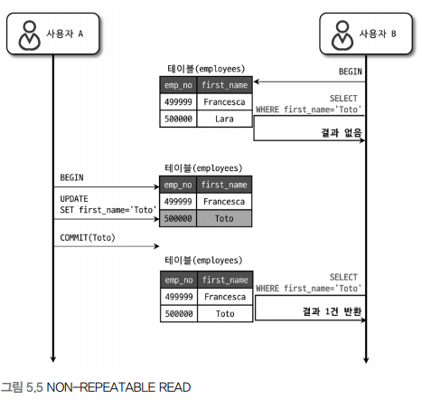

## 서론

---

트랜잭션은 기존 게시글 [트랜잭션&Locking](https://amaran-th.github.io/%EB%8D%B0%EC%9D%B4%ED%84%B0%EB%B2%A0%EC%9D%B4%EC%8A%A4/Transaction%EA%B3%BC%20Locking/)에서 한 번 다뤄본 적이 있는데, 이 글에서는 Real MySQL 스터디를 통해 알게 된 내용을 조금 더 보충해서 설명하려고 한다.

## 트랜잭션

---

> 기본적으로 InnoDB 스토리지 엔진은 트랜잭션을 지원하고, 나머지 MyISAM과 MEMORY는 트랜잭션을 지원하지 않는다.

### MySQL에서의 트랜잭션

트랜잭션의 핵심은 하나의 논리적인 작업 Set에 하나의 쿼리가 있든 두 개 이상의 쿼리가 있든 관계없이 논리적인 작업 Set 자체가 **100% 적용되거나,** **아무것도 적용되지 않아야** 한다는 것이다.

이러한 트랜잭션의 성질을 원자성이라고 한다.

<aside>

**트랜잭션의 특성 ACID**

- **A**tomic(원자성) : 트랜잭션에 포함된 SQL문들은 모두 실행되거나 하나도 실행되지 않은 상태여야 한다.
- **C**onsistent(일관성) : SQl문에 의한 실행 결과에 대해 일관성이 유지되어야 한다.

  ex) 계좌 A에서 B로 송금할 때, A에서 금액을 인출하는 트랜잭션만 수행되고 B에 대한 트랜잭션이 실행되지 않는다면 데이터 일관성이 지켜지지 않은 것이라고 할 수 있다.

- **I**solation(격리) : 두 개 이상의 트랜잭션이 서로 간섭 없이 동시에 병행 실행(concurrent)할 수 있어야 함.

  ex) 두 트랜잭션이 동일한 테이블에 대해 연산을 수행할 때 두 트랜잭션 간 간섭 없이 동시에 실행될 수 있어야 한다.

- **D**urable : 트랜잭션이 실행 종료되면 실행 결과는 데이터베이스에 영구적으로 저장되어야 한다.

</aside>

**트랜잭션이 적용된 예시 )**

다음과 같이 InnoDB 테이블 tab_innodb와 MyISAM 테이블 tab_myisam을 만든 후 레코드를 각각 1개씩 저장해주었다.

```sql
CREATE TABLE tab_innodb (fdpk INT NOT NULL, PRIMARY KEY (fdpk) ) ENGINE=INNODB;
INSERT INTO tab_innodb (fdpk) VALUES (3);

CREATE TABLE tab_myisam (fdpk INT NOT NULL, PRIMARY KEY (fdpk) ) ENGINE=MyISAM;
INSERT INTO tab_myisam (fdpk) VALUES (3);
```

이후 AUTO-COMMIT 모드에서 각 테이블에 레코드 1, 2, 3을 삽입하는 쿼리문을 실행해본다.

```sql
SET autocommit=ON;

INSERT INTO tab_innodb (fdpk) VALUES (1), (2), (3);
INSERT INTO tab_myisam (fdpk) VALUES (1), (2), (3);
```

두 쿼리문 모두 Primary Key 중복으로 다음과 같은 오류 메세지가 출력되며 쿼리가 실패하지만, 결과는 다르다.

```sql
ERROR 1062 (23000): Duplicate entry '3' for key 'PRIMARY'
```

| tab_innodb의 경우  | tab_myisam의 경우  |
| ------------------ | ------------------ |
|  |  |

InnoDB는 트랜잭션의 원칙에 따라 테이블의 레코드를 INSERT 문장을 실행하기 전 상태로 복구시켰다.

반면 MyISAM 테이블은 쿼리 실행 중 오류가 발생했음에도 ‘1’, ‘2’가 INSERT된 상태로 남아있다. 이러한 현상을 **부분 업데이트\(Partial Update\)** 라고 한다.

이러한 현상은 테이블 데이터의 정합성을 맞추기 어렵게 만들기 때문에, 트랜잭션을 적극 활용해서 예방하는 것이 좋다.

### 주의사항

DBMS의 커넥션과 마찬가지로 트랜잭션은 **꼭 필요한 최소한의 코드에만 적용**하는 것이 좋다.

⇒코드에서 트랜잭션의 범위를 최소화하라는 의미.

**예시 )**

1. 처리 시작

   ⇒데이터베이스 커넥션 생성

   ⇒트랜잭션 시작

2. 사용자의 로그인 여부 확인
3. 사용자의 글쓰기 내용의 오류 여부 확인
4. 첨부로 업로드된 파일 확인 및 저장

- 데이터베이스 커넥션은 개수가 제한적이기 때문에, 각 단위 프로그램이 커넥션을 소유하는 시간이 길어질수록 DBMS 처리 효율이 떨어진다. 때문에 **프로그램 코드가 데이터베이스 커넥션을 가지고 있는 범위와 트랜잭션이 활성화되어 있는 프로그램의 범위를 최소화**해야 한다.
- 메일 전송, FTP 파일 전송 또는 네트워크를 통한 원격 서버와의 통신 등의 **네트워크 작업은 트랜잭션 외부에서 수행**하는 것이 좋다.
  - 네트워크 작업 중 문제가 발생할 경우 웹 서버 뿐만 아니라 DBMS서버까지 위험해질 수 있기 때문
- 관련된 DBMS 작업만 같은 트랜잭션으로 묶어주고, 관련이 없는 DBMS 작업들은 별도의 트랜잭션으로 분리해주는 것이 좋다.
- 단순 조회의 경우 별도로 트랜잭션을 사용하지 않아도 무방하다.

위 사항들은 권장사항일 뿐, 트랜잭션 설계엔 정답이 없으며 구현하고자 하는 업무의 특성에 따라 크게 달라질 수 있다.

## MySQL의 격리 수준

---

트랜잭션의 격리 수준(isolation level)이란 여러 트랜잭션이 동시에 처리될 때 특정 트랜잭션이 다른 트랙잭션에서 변경/조회하는 데이터를 볼수 있게 허용할지를 결정하는 것으로, 크게 `READ UNCOMMITTED`, `READ COMMITTED`, `REPEATABLE READ`, `SERIALIZABLE`의 4가지로 나뉜다.

이 4개의 격리 수준에서 뒤로 갈수록 각 트랜잭션 간의 **격리(고립) 정도가 높아지고** **동시 처리 성능도 떨어진다**.

DB의 격리 수준과 함께 다루어지는 3가지 부정합의 문제가 있는데, 이를 표로 정리하면 다음과 같다.


오라클 같은 DBMS에서는 주로 `READ COMMITTED` 수준을 많이 사용하고, MySQL에서는 `REPEATABLE READ`를 주로 사용한다.

<aside>

⚠️ 여기서 설명하는 모든 SQL 예제는 모두 AUTOCOMMIT이 `off`인 상태에서만 테스트할 수 있다.

</aside>

### READ UNCOMMITTED

각 트랜잭션에서의 변경 내용을 COMMIT/ROLlBACK 여부와 상관없이 다른 트랜잭션에서 볼 수 있다.


사용자 A가 새로운 사원을 INSERT할 때, A가 해당 **변경사항을 COMMIT하지 않아도 사용자 B는 해당 사원을 조회할 수 있다**.

이처럼 어떤 트랜잭션에서 처리한 작업이 완료되지 않았음에도 다른 트랜잭션에서 볼 수 있는 현상을 **Dirty read(더티 리드)** 라고 한다.

### READ COMMITTED

COMMIT이 완료된 데이터만 다른 트랜잭션에서 조회할 수 있다.


사용자 A가 특정 사원의 이름을 ‘Lara’에서 ‘Toto’로 UPDATE하는데, 이 때 ‘Lara’라는 값은 언두 영역으로 백업된다. 이 변경사항이 COMMIT되지 않은 상황에서 사용자 B가 사원을 조회하면 **언두 영역에 백업된 ‘Lara’라는 값**을 사원의 이름으로 불러온다.

이 격리수준에서는 `NON-REPEATABLE READ`라는 부정합 문제가 발생한다.

<aside>

💡 **REPEATABLE READ**

---

하나의 트랜잭션 내에서 같은 SELECT 쿼리를 실행하면 항상 같은 결과를 가져와야 한다는 정합성

</aside>



이처럼 사용자 A가 도중에 변경사항을 커밋하면, 커밋하기 전/후에 데이터를 조회한 사용자 B는 같은 쿼리를 실행했음에도 다른 데이터를 조회하게 된다.

### REPEATABLE READ

`NON-REPEATABLE READ` 문제를 해결한 격리수준이다.

모든 InnoDB의 트랜잭션은 고유한 트랜잭션 번호(순차적으로 증가하는 값)를 가지는데, 언두 영역에 백업된 모든 레코드는 변경을 발생시킨 트랜잭션의 번호를 포함하고 있다.(TRX-ID)


위 예시에서 사용자 A의 트랜잭션 번호는 12, B의 트랜잭션 번호는 10이다. 사용자 B가 10번 트랜잭션 안에서 실행한 SELECT 쿼리는 트랜잭션 번호가 10보다 작은 트랜잭션 번호에서 변경한 값만 보게 된다.

이 격리 수준에서도 `PHANTOM READ`라는 부정합 문제가 발생한다.


다른 트랜잭션에서 수행한 변경 작업에 의해 레코드가 보였다 안 보였다 하는 현상을 `PHANTOM READ`라고 한다.

SELECT … FOR UPDATE 쿼리는 SELECT하는 레코드에 쓰기 잠금을 거는데, **언두 레코드에는 잠금을 걸 수가 없기 때문**에 언두 영역의 변경 전 데이터가 아니라 현재 레코드의 값을 가져오게 된다.

### SERIALIZABLE

가장 단순하면서도 엄격한 격리 수준이다. 동시 처리 성능이 가장 떨어진다.

`SERIALIZABLE` 격리수준에서는 읽기 작업 시 공유 잠금(읽기 잠금)을 획득하기 때문에 다른 트랜잭션에서 해당 레코드를 변경할 수 없게 된다.

때문에 `PHANTOM READ`가 발생하지 않는다.

하지만 InnoDB 스토리지 엔진에서는 **갭 락**과 **넥스트 키 락** 때문에 `REPEATABLE READ` 격리 수준에서도 `PHANTOM READ`가 발생하지 않기 때문에 굳이 SERIALIZABLE 격리 수준을 사용하지 않아도 된다.

## 참고 자료

---

Real MySQL 8.0 1권의 4장 - 트랜잭션과 잠금
