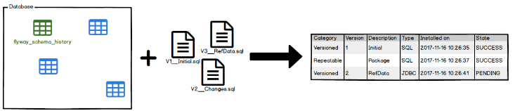
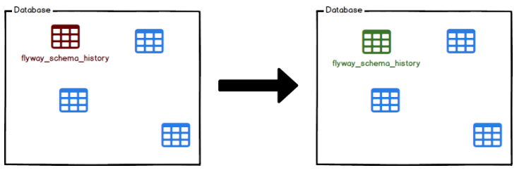

## 개요

---

Flyway란 **오픈소스 데이터베이스 마이그레이션 툴**로, 데이터베이스의 변경사항을 추적하고 업데이트/롤백을 보다 쉽게 할 수 있게 해주는 버전 관리 툴이다.

### DB 마이그레이션(=DB 변경 관리)이 필요한 이유

1. 여러 작업자 간 **동일한** 데이터베이스 환경을 구성하기 위해(DB 동기화)
2. DB 스키마에 문제가 발생했을 때 **롤백**을 통해 효율적으로 해결할 수 있다.
3. Entity 클래스 변화에 DB 스키마가 바로 반영되므로 실수로 인한 데이터 손실을 예방할 수 있다.


개발 프로젝트를 진행하다 보면 위와 같이 데이터베이스가 여러 환경에서 존재하게 되는데, 이 중 한 데이터베이스 스키마에 변경 사항이 생겼을 때 그 변경 사항을 다른 모든 데이터베이스에 동기화하는 것은 매우 번거롭고, 실수가 많이 일어나는 작업이다. 물론 롤백 작업도 어렵다.

이러한 과정을 편리하게 해주는 형상 관리 툴이 바로 flyway이다.(DB 계의 Github이라고 보면 된다.)

[공식문서](https://flywaydb.org/documentation/)

### 마이그레이션 파일 형식

마이그레이션 파일은 SQL 또는 JAVA로 작성할 수 있다.

마이그레이션 파일명은 다음 5가지 요소로 구성된다.


- **`Prefix`** - V, U, R 중 하나를 입력하게 된다.
  - V는 Version, U는 Undo, R은 Repeatable.
- **`Version`** - 버전 정보. (정수, 소수, 날짜 등이 올 수 있다.)
- `**Seperator**` - \_\_(언더바 2개)
- `**Description**` - 추가되는 설명(space 대신 \_(언더바)를 사용)
- `**Suffix**` - 파일 확장자.

## Flyway의 핵심 명령어 7가지

---

Flyway 커맨드 프로그램을 설치하는 경우, 다음의 7가지 명령어를 통해 DB의 버전을 관리할 수 있다.

### Migrate

기존 버전과 새로운 버전을 비교하여 DB 마이그레이션을 수행한다.


### Clean

구성된 스키마를 완전히 삭제한다.


- 모든 개체(테이블, 뷰, 프로시저 등)가 삭제된다.
- **운영단계에서는 사용하면 안된다.**

### Info

모든 DB 마이그레이션에 대한 세부 정보 & 상태 정보를 보여준다.



- 카테고리, 버전, 설명, 설치 날짜, 성공 여부 등을 확인할 수 있다.

### Validate

사용 가능한 DB 마이그레이션에 대한 유효성을 검사한다.


- 스키마를 안정적으로 재생성할 수 없게 하는 우발적인 변경사항을 감지하기 위해 필요하다.

### Undo

가장 최근에 적용된 DB 마이그레이션을 취소한다.


- 유료 버전에서만 사용 가능

### BaseLine

baseline version까지의 모든 DB 마이그레이션을 제외하고 그 이후의 마이그레이션만 적용한다.


- 오래되고 관련이 없는 많은 스크립트를 처리하지 않아도 되므로 오버헤드를 줄일 수 있다.

### Repair

스키마 기록 테이블(history 테이블)을 복구한다.



- 스키마 기록 테이블의 문제를 해결하는 수단으로 사용된다.

## flyway 동작 과정

---

flyway는 실행 시 flyway_schema_history 테이블을 찾고, 없을 경우 flyway_schema_history 테이블을 생성한다.

이 테이블은 **데이터베이스의 상태를 추적**하는 데 사용된다.

그 후 flyway는 마이그레이션 파일을 스캔한다. 마이그레이션은 버전 번호를 기준으로 정렬되며 순차적으로 적용된다.

각 마이그레이션이 적용될 때마다 flyway_schema_history 테이블도 함께 업데이트된다.

<div>

| installed_rank | version | description                    | type | script                                     | checksum    | installed_by | installed_on        | execution_time | success |
| -------------- | ------- | ------------------------------ | ---- | ------------------------------------------ | ----------- | ------------ | ------------------- | -------------- | ------- |
| 1              | 1.1     | create initial scheme squashed | SQL  | V1.1\_\_create_initial_scheme_squashed.sql | -1257456120 | root         | 2023-07-14 16:33:19 | 660            | 1       |
| 2              | 2       | create table keyword reference | SQL  | V2\_\_create_table_keyword_reference.sql   | 1218254833  | root         | 2023-07-14 16:33:19 | 30             | 1       |

</div>

이렇게 메타 데이터와 초기 상태가 설정된다.

history 테이블이 이미 셋팅되어 있을 때, 새 마이그레이션을 적용할 때도 같은 과정으로 파일 스캔 & history 테이블 업데이트가 일어난다.

DDL 또는 DML에 관계없이, DB를 변경할 때마다 현재 버전보다 높은 버전 번호로 새 마이그레이션 파일을 생성하면 flyway가 알아서 처리해준다.

## 실습(feat. Spring Boot)

---

### 초기 설정

flyway를 사용하기 위해서는 몇 가지 초기 설정이 필요하다.

- build.gradle에 의존성 추가
  ```sql
  implementation 'org.flywaydb:flyway-core:6.4.2'
  implementation 'org.flywaydb:flywaydb:flyway-mysql'    // MariaDB 10.6v 이상인 경우 필수
  ```
- application.yml 설정
  ```yaml
  spring:
    flyway:
      baseline-on-migrate: true
      locations: classpath:db/migration/prod
      enabled: true
  		baseline-version: 0
  ```
  - `baseline-on-migrate` : 베이스라인을 기준으로 시작할지 여부
  - `locations` : 버전 파일들의 위치. 디폴트는 main/java/resources/db/migration
  - `enabled` : flyway 버전 검사 및 새로운 버전의 sql 실행 여부를 결정
  - `baseline-versions` : v1부터 읽음(default 값은 1, v2부터 읽음)

버전 변경이 필요한 경우, 필요한 스키마&데이터 처리 쿼리를 sql 파일로 작성하여 `locations`로 설정해준 디렉토리에 저장해야 한다.

그 후 애플리케이션을 실행하고 테이블을 확인하면, 새로 히스토리 테이블이 생성되는 것을 확인할 수 있다.

<aside>

⚠️ flyway는 버전 관리 sql 파일이 flyway로 등록된 순간을 기준으로 DB 버전 관리를 하게 되기 때문에 등록된 스크립트를 수정/삭제하면 안된다.

</aside>

### 기존 데이터나 마이그레이션 이력이 존재하는 경우

앞의 과정은 DB에 아무런 데이터가 없을 때를 상정한 동작 예제였는데, 만약 기존 데이터나 마이그레이션 이력이 존재하는 경우 조금 다르게 접근해야 한다.

- 기존 테이블 정보와 데이터가 존재하는 경우

  1. application.yml에 다음과 같은 설정을 추가한다.

     ```yaml
     spring:
       # ... 생략

       flyway:
         enabled: true
         baseline-on-migrate: true
         url: jdbc:mysql://localhost:3306/flyway?serverTimezone=UTC&characterEncoding=UTF-8
         user: 아이디
         password: 패스워드
     ```

  2. 버전 파일 경로(`locations`로 설정해준 경로)에 V1 마이그레이션 스크립트를 작성한다.(중요)

     테이블과 데이터만 존재하더라도 스크립트는 꼭 필요하다.

     이 때 스크립트 내용은 비어있어도 된다. 파일만 있으면 ok.

- history 테이블까지 있는 경우

  1. application.yml에 다음과 같은 설정을 추가해준다.

     ```yaml
     spring:
       # ... 생략

       flyway:
         enabled: true
         baseline-on-migrate: false
         url: jdbc:mysql://localhost:3306/flyway?serverTimezone=UTC&characterEncoding=UTF-8
         user: 아이디
         password: 패스워드
     ```

     테이블/데이터만 존재하는 경우에서의 설정과 차이점은 baseline-on-migrate 옵션이 false라는 것이다.

  2-1. 마이그레이션 스크립트가 남아있지 않은 경우

  히스토리 테이블에 기록된 최신 내역보다 더 높은 버전으로 빈 스크립트를 추가한다.
  예) 가장 최신 버전이 4라면 V5로 시작하는 스크립트를 작성해야 한다.

  2-2. 마이그레이션 스크립트가 남아있는 경우

  버전 파일 경로에 기존 히스토리 내역과 일치하는 스크립트를 그대로 추가한다.

설정과 마이그레이션 파일 작성이 완료된 후 어플리케이션을 실행하면, 해당 **마이그레이션이 실제 테이블에 적용**된다.

## 참고 자료

---

[달록의 데이터베이스 마이그레이션을 위한 Flyway 적용기](https://hudi.blog/dallog-flyway/)

[Flyway란 무엇일까? (이론 편)](https://velog.io/@choidongkuen/Flyway란-무엇일까)

[Spring - Flyway 적용하기](https://backtony.github.io/spring/2021-10-22-spring-db-1/)

[Migrate - Flyway - Product Documentation](https://documentation.red-gate.com/fd/migrate-184127460.html)

[Flyway](https://tecoble.techcourse.co.kr/post/2021-10-23-flyway/)
