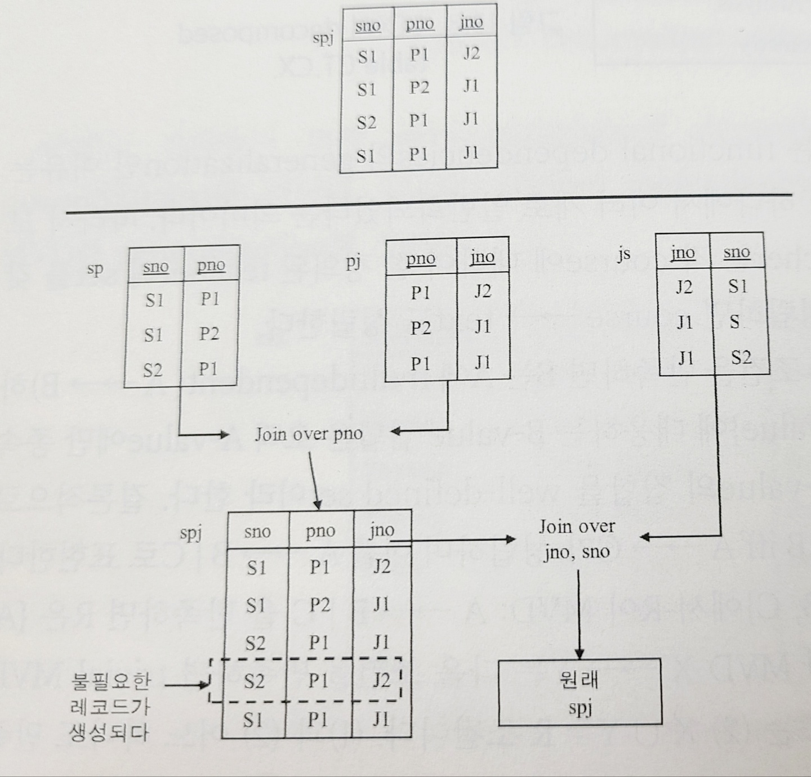
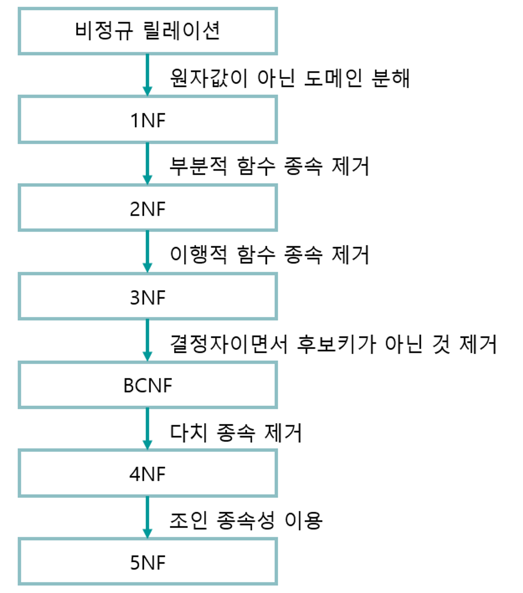

### 4NF

**MVD(multivalued dependency)** : relation R에서 속성 A가 속성 B의 값 하나를 결정하는 것이 아니라 여러 개의 값, 즉 값의 집합을 결정할 때, 속성 A와 B를 A→>B로 표현하고 MVD 관계라고 한다.

+) MVD X→>y가 있을 때 다음 조건 중 하나를 만족할 경우 trivial MVD라고 한다.(↔non-trivial MVD)

1. Y가 X의 subset이다.
2. X U Y=R이다.

- hctx
  
  정규화되지 않은 테이블
- ctx
  
  1NF로 정규화된 테이블

위와 같이 수업/교사/교재 테이블이 있다고 할 때, 주어진 조건은 다음과 같다.

<aside>

- Course→>Teacher

- Course→>Texts

- Teachers와 Texts는 서로 함수 독립 관계이다.
</aside>

정규화된 테이블 ctx에 대해, key는 {c, t, x} 전체이며 함수 종속 관계가 없다. 때문에 테이블 ctx는 1NF를 비롯해 2NF, 3NF와 BCNF 모두 만족한다.

- insert anomaly

새로 부임한 교사 White가 Math 과목을 담당한다고 하자. 그럼 ctx 테이블에는 다음 3개의 tuple이 추가되어야 한다. 즉, 교사 1명의 추가로 해당 수업의 교재 수만큼의 tuple의 추가가 요구된다.
| Course | Teachers | Texts |
| ------ | -------- | --------------- |
| … | … | … |
| Math | White | Basic Mechanics |
| Math | White | Vector Analysis |
| Math | White | Trigonometry |

이런 문제가 발생하는 이유는 Course가 MVD 관계인 Teacher, Texts가 서로 독립 관계이기 때문이다. 때문에 다음과 같이 테이블을 CT, CX로 분할하여 문제를 해결할 수 있다.

이로써 테이블 CT, CX는 1NF부터 4NF까지를 모두 만족하게 된다.

- 결론

**relation R에서 A와 B에 대해 nontrivial MVD인 A→>B를 만족하는 B가 존재할 때, B를 제외한 R의 모든 속성들이 A와 함수 종속 관계일 때, R은 4NF라고 한다.**

### 5NF

**JD(Join Dependency)** : 아래 이미지를 보면, 처음 ternary relationship 테이블인 spj를 3개의 binary relationship 테이블로 분할하고 다시 join했을 때, 처음의 테이블에 없었던 튜플{S2, P1, J2}가 추가된 것을 확인할 수 있다. 이처럼 테이블 R(A, B, C, ….Z)을 분할한 테이블 AB, BC, …, ZA을 다시 join하여 얻어진 테이블을 R’이라고 했을 때, R≠R’인 경우 R을 (분할할 수 없는)**atomic relation**라며 이러한 문제를 **decomposition anomaly**라고 한다.

반대로 R=R’일 경우 JD(join dependency)라고 한다. 즉 JD를 만족하는 테이블은 더 분할할 수 있다.

5NF의 정의는 주어진 relation R에서 **모든 JD가 후보키를 통해서만 성립해야 한다**는 것이다. 다시 말하면 분할된 relation이 후보키를 포함하고 있어야 한다는 것인데, 위 예시의 spj의 후보키는 {sno, pno, jno}이고 spj에서 sp, pj, sj는 후보키를 포함하고 있지 않기 때문에 5NF를 만족하지 않는다.

- 5NF를 만족하는 예 :

테이블 sn(sno, sname, status, city)이 있을 때, 후보키는 sno, sname이다.

FD : `sno→sname` , `sname→sno` , `sno→city` , `sno→status`

sn을 {sno, sname}, {sno, status, city}로 분할하고 다시 join했을 때 JD를 만족하기 때문에 5NF라고 할 수 있다.

+)sn은 {sname, status, city}, {sname, sno}의 경우도 JD를 만족한다.

⇒후보키로 분할한 것은 nonloss-decompose(손실없는 분할)이 가능하다.

- 결론

**relation R에 존재하는 모든 JD(Join Dependency)가 relation R의 후보키를 통해서만 성립한다.**

지금까지 포스팅한 정규화 과정을 요약하면 다음과 같다.

- 이미지 출처 :

[정규화 (1NF, 2NF, 3NF, BCNF, 4NF, 5NF)](https://velog.io/@wisdom-one/%EC%A0%95%EA%B7%9C%ED%99%94Normalization)
