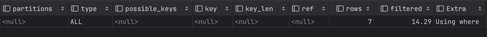

<aside>
💡 Real MySQLl 8.0 1권의 8. 인덱스 파트를 읽으며 중요하다고 생각한 내용을 정리했습니다.

</aside>

- 인덱스 키 값에 변형이 가해진 후 비교되는 경우 절대 B-Tree의 빠른 검색 기능을 사용할 수 없다.
    - 함수/연산을 수행한 결과로 정렬/검색하는 작업은 B-Tree의 장점을 이용할 수 없다.
- InnoDB테이블에서 지원하는 레코드 잠금/넥스트 키 락은 검색을 수행한 인덱스를 잠근 후 테이블의 레코드를 잠그는 방식으로 구현되어 있기 때문에, UPDATE, DELETE 문장이 실행될 때 테이블에 적절하게 사용할 수 있는 인덱스가 없으면 불필요하게 많은 레코드를 잠글 수 있다.
- 선택도(모든 인덱스 키 값 가운데 유니크한 값의 수)가 높을 수록 검색 대상이 줄어들어 검색이 빠르게 처리된다.
    - 인덱스 키 값 중 중복된 값이 많아질수록 선택도가 떨어진다.
- 레코드의 건 수가 전체 테이블 레코드의 20~25%를 넘어서면 인덱스를 이용하지 않고 테이블을 모두 직접 읽어서 필요한 레코드만 가려내는 방식으로 처리하는 것이 더 효율적이다.
- 커버링 인덱스로 처리되는 쿼리는 디스크의 레코드를 읽지 않아도 되기 때문에 성능이 매우 빨라진다.
    
    <aside>
    
    💡 **커버링 인덱스**
    
    ---
    
    : 쿼리를 충족하는 데 필요한 모든 데이터를 가진 인덱스
    
    MySQL의 경우, 인덱스 안에 있는 데이터를 사용할 수 있는데, 이를 잘 활용하면 실제 메모리에 저장된 데이터(테이블)에 접근하지 않고도 데이터를 얻어올 수 있다.
    
    쿼리문에서 SELECT / WHERE / GROUP BY / ORDER BY 등에 활용되는 모든 컬럼이 인덱스의 구성 요소인 경우, 해당 인덱스를 커버링 인덱스라고 한다.
    
    쉽게 말해서 **인덱스에 존재하는 컬럼 값으로만 쿼리를 완성**하는 것을 의미한다.
    
    커버링 인덱스를 잘 사용하면 대용량 데이터 처리에서의 조회 성능을 상당히 높일 수 있다.
    
    조회 쿼리가 커버링 인덱스를 사용했는지 여부는 `EXPLAIN` 키워드를 통해 실행계획을 확인함으로써 알 수 있다.
    
    실행 계획의 `extra` 컬럼에 `Using index`가 포함되어 있는 경우, 이는 커버링 인덱스를 활용한 것이다.
    
    예제 )
    
    1. Select + Where 조합
    
    test 데이터를 만들고, email에 대해 인덱스를 만들어준다.
    
    ```sql
    create table test (
        id bigint primary key auto_increment,
        name varchar(20) not null,
        email varchar(20) not null,
        age int not null
    );
    
    create index `idx_test_email` ON `test` (email);
    ```
    
    테이블에 다음과 같이 데이터를 입력한다.
    
    
    
    where절에 email을 사용한 경우:
    
    ```sql
    explain
    select email
    from test
    where email = 'ddd@ddd';
    ```
    
    
    
    where절에 name을 사용한 경우:
    
    ```sql
    explain
    select name
    from test
    where name = '수국';
    ```
    
    
    
    1. Where + Group By 조합
    
    Group By의 경우, 아래와 같은 조합에서 인덱스가 적용된다.
    
    - 인덱스 컬럼과 Group By에 명시하는 컬럼의 순서가 동일할 것.
    - 인덱스 컬럼 중 뒤에 있는 컬럼은 Group By에 명시하지 않을 것.
    - 인덱스 컬럼 중 앞에 있는 컬럼은 Group By에 명시할 것.
    - 인덱스에 없는 컬럼을 Group By에 명시하지 않을 것.
    
    ```sql
    --- 인덱스가 (a, b, c)인 경우
    
    GROUP BY b              --- 인덱스 적용 X
    GROUP BY b, a           --- 인덱스 적용 X
    GROUP BY a, c, b        --- 인덱스 적용 X
    
    GROUP BY a              --- 인덱스 적용 O
    GROUP BY a, b           --- 인덱스 적용 O
    GROUP BY a, b, c        --- 인덱스 적용 O
    
    GROUP BY b, c           --- 인덱스 적용 X
    
    GROUP BY a, b, c, d     --- 인덱스 적용 X
    ```
    
    ```sql
    create index `idx_test_name_id_email` ON `test` (name, id, email);
    
    explain
    select id, name, email
    from test
    where name like '아%'
    group by id, email;
    ```
    
    
    
    [커버링 인덱스](https://tecoble.techcourse.co.kr/post/2021-10-12-covering-index/)
    
    </aside>
    
- 쿼리의 조건절에 사용된 컬럼이 인덱스의 첫 번째 컬럼이 아닌 경우 인덱스 풀 스캔 방식이 사용된다.
    - 인덱스 풀 스캔 방식은 인덱스 레인지 스캔보다 느리지만 테이블 풀 스캔보다는 효율적이다.
    - **쿼리가 인덱스에 명시된 컬럼만으로 조건을 처리**할 수 있는 경우 이 방식이 사용된다.
- 비교 조건을 사용할 때, 인덱스의 컬럼 순서도 처리 효율에 영향을 줄 수 있다.
    - `dept_no=’d002’ AND emp_no>10144`라는 비교 구문이 있을 때, IndexA(emp_no, dept_no)보다 IndexB(dept_no, emp_no)를 사용하는 것이 효율이 더 좋다.
- B-Tree 인덱스를 사용할 수 없는 조건에는 크게 다음과 같이 존재한다.
    - Not Equal로 비교된 경우
    - LIKE ‘%??’와 같이 문자열 패턴이 비교된 경우
        - B-tree 인덱스는 왼쪽 기준 정렬 기반의 인덱스이기 때문에 ‘%mer’와 같이 왼쪽 부분이 고정되지 않은 조건절에서는 인덱스를 활용할 수 없다.
    - stored 함수나 다른 연산자로 인덱스 컬럼이 변형된 후 비교된 경우
    - 데이터 타입이 서로 다른 비교(인덱스 컬럼의 타입을 변환하는 과정이 필요)
    - 문자열 데이터 타입의 콜레이션이 다른 경우)
- 다중 컬럼으로 만들어진 B-Tree 인덱스의 사용
    - IndexC(column_1, column_2, column_3, …, column_n)와 같은 인덱스가 있을 때
    - Column_1 컬럼에 대한 조건이 없거나, 비교조건이 인덱스 사용 불가 조건 중 하나인 경우 작업범위 결정 조건으로 인덱스를 사용할 수 없다.
    - Column_1~Column_i-1 컬럼까지 동등 비교 형태(=, in)로 비교하고 나머지 컬럼에 대해 동등 비교, 크다/작다 형태, LIKE로 좌측 일치 패턴(’아마%’) 조건을 사용하는 경우 작업 범위 결정 조건으로 인덱스를 사용할 수 있다.

[MySQL 성능 최적화 찍먹해보기!](https://velog.io/@maketheworldwise/MySQL-성능-최적화-찍먹해보기)