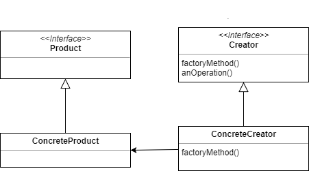

Factory Method - 하위 클래스에서 인스턴스 작성하기

가상 생성자(Virtual Constructor) 패턴이라고도 하며, 디자인 패턴 중 **생성** 패턴에 속하는 패턴이다.

## 정의

---

<br/>

> 객체를 생성하는 인터페이스는 미리 정의하되, 인스턴스를 만들 클래스의 결정은 서브클래스 쪽에서 내리는 패턴. 팩토리 메서드 패턴에서는 클래스의 인스턴스를 만드는 시점을 서브 클래스로 미룬다.
>
> -GoF의 디자인 패턴(407p)

- 추상 클래스는 인스턴스를 가질 수 없기 때문에, 추상 클래스밖에 모르는 프레임워크는 클래스의 인스턴스화 작업을 수행할 수 없다.

  인스턴스를 만드는 방법을 상위 클래스가 결정하지만 구체적인 클래스 이름까지는 결정하지 않는다. 구체적인 내용은 모두 하위 클래스 측에서 수행한다.

  `Factory Method 패턴`에서 인스턴스를 생성할 때 `Template Method 패턴`을 활용한다.

  팩토리 메서드 패턴은 추상 클래스의 서브 클래스 중 어느 것을 생성해야 하는 지에 대한 정보를 캡슐화하고 프레임워크로부터 분리해준다.

- 예제 코드 - 템플릿 메소드 패턴을 적용한 Factory 클래스
  ```java
  public abstract class Factory {
  	public final Product create(String owner){
  		Product p=createProduct(owner);
  		registerProduct(p);
  		return p;
  	}
  	protected abstract Product createProduct(String owner);
  	protected abstract void registerProduct(Product product);
  }
  ```

## Factory Method 패턴의 구성요소

---



**Product(제품)**

: 이 패턴에서 생성되는 인스턴스가 가져야 할 인터페이스(API)를 결정하는 **추상 클래스**.

**Creator(작성자)**

: **Product** **역할을 생성**하는 **추상 클래스**. 구체적인 내용은 위 클래스의 ConcreteCreator 역할이 결정한다. Creator 역할은 실제로 생성하는 ConcreteProduct 역할에 대한 정보를 가지고 있지 않고, 알고 있는 건 Product의 역할과 **인스턴스를 생성하는 메소드**를 호출하면 Product가 생성된다는 사실 뿐이다.

new 키워드를 사용해 실제 인스턴스를 생성하는 대신 **인스턴스 생성을 위한 메소드를 호출**해서 구체적인 클래스 이름에 의한 속박에서 **상위 클래스를 자유롭게 만든다**.

**ConcreteProduct(구체적인 제품)**

: 구체적인 제품을 결정하는 **구현 클래스**.

**ConcreteCreator(구체적인 작성자)**

: 구체적인 제품을 만드는 클래스를 결정하는 **구현 클래스**.

## Factory Method 패턴의 특징

---

### 의존성

Product 클래스나 Creator 클래스 안에는 구체적인 클래스의 이름이 없다. 때문에 새로운 구현 클래스를 추가해도 추상클래스들의 내용을 수정할 필요가 없다.

⇒OCP 원칙을 지킬 수 있다.

⇒추상 클래스에 해당하는 Product와 Creator(책에서는 framework로 묶어서 표현하였음)는 구현 클래스인 ConcreteProduct, ConcreteCreator(책에서는 idcard로 묶어서 표현하였음)에 **의존하지 않는다.**

### 인스턴스 생성 메소드를 구현하는 방법

1. **추상 메소드**

   추상 메소드로 구현할 경우 하위 클래스는 반드시 이 메소드를 구현해야 한다.

```java
abstract class Factory{
	public abstract Product createProduct(String name);
	...
}
```

2. **디폴트 구현을 준비한다.**

   디폴트로 구현된 메서드를 준비해두고 하위 클래스에서 구현하지 않았을 때 사용하면 된다.

   단, 이 경우 Product 클래스에 대해 직접 new를 이용하고 있기 때문에 Product 클래스를 추상 클래스로 둘 수 없다.

   ```java
   class Factory{
   	public Product createProduct(String name){
   		return new Product(name);
   	}
   	...
   }
   ```

3. **에러를 이용한다.**

   디폴트의 구현 내용을 에러로 처리해두면 하위 클래스에서 구현하지 않았을 경우 에러가 발생한다.

   ⇒에러를 발생시켜 구현되고 있지 않은 것을 알려준다.

   ```java
   class Factory{
   	public Product createProduct(String name){
   		throw new FactoryMethodRuntimeException();
   	}
   	...
   }
   ```

### 패턴 이용과 개발자 간의 의사소통

일반적으로 디자인 패턴을 사용해서 어떤 클래스를 설계할 때 그 클래스를 보수하는 사람에게 설계자가 의도한 디자인 패턴이 무엇인지를 전달할 필요가 있다. 프로그램의 주석이나 개발 문서 안에 실제로 사용되고 있는 디자인 패턴의 명칭과 의도를 기술해놓는 것도 좋은 방법이다.

- 활용성
  - 어떤 클래스가 자신이 생성해야 하는 객체의 클래스를 예측할 수 없을 때.
  - 생성할 객체를 기술하는 책임을 자신의 서브클래스가 지정했으면 할 때
  - 객체 생성의 책임을 몇 개의 보조 서브 클래스 중 하나에게 위임하고 어떤 서브클래스가 위임자인지에 대한 정보를 국소화시키고 싶을 때
- 관련 패턴
  - Template Method 패턴 : Factory Method 패턴은 Template Method 패턴의 전형적인 응용 방법 중 하나이다. 객체를 생성하는 Factory Method가 Template Method로 되어있다.
  - Singleton 패턴 : Creator 역할(또는 ConcreteCreator 역할)을 수행하는 클래스는 대부분 Singleton 패턴으로 만들 수 있다. 프로그램 안에서 인스턴스가 복수로 존재해야 하는 경우는 거의 없기 때문이다.
  - Composite 패턴 : Product 역할(또는 ConcreteProduct) 역할에 Composite 패턴을 적용할 수도 있다.
  - Iterator 패턴 : Iterator 패턴에서 iterator 메소드가 Iterator의 인스턴스를 작성할 때 Factory Method 패턴이 사용되는 경우가 있다.

<nav>

참고 도서

- Java 언어로 배우는 디자인 패턴 입문(83p)

</nav>
