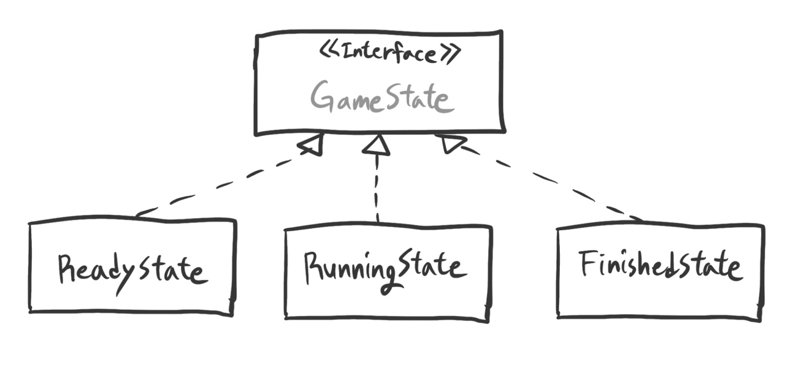

<nav>

목차

- 정의
- State Pattern 패턴의 구성요소
- State Pattern 패턴의 특징

</nav>

State - 상태를 클래스로 표현하기

상태 표현 객체(Object for State)라고도 하며, 디자인 패턴 중 **행동** 패턴에 속하는 패턴이다.

## 정의

---

<br/>

> 객체의 내부 상태에 따라 스스로 행동을 변경할 수 있게끔 허가하는 패턴으로, 이렇게 하면 객체는 마치 자신의 클래스를 바꾸는 것처럼 보입니다.
>
> -GoF의 디자인 패턴(395p)

객체 지향 프로그래밍에서는 프로그램 할 대상을 ‘클래스’로 표현한다. 어떤 것을 클래스로 표현할지는 설계를 하는 사람이 생각해야 하는데, State 패턴에서는 ‘상태’를 클래스로 표현한다.

상태를 클래스로 표현하면 클래스를 교체함으로써 ‘상태의 변화’를 표현할 수 있고, 새로운 상태를 추가해야 할 때 프로그램해야 하는 대상이 명확해진다. 또한 해당 클래스 안의 메소드에는 상태 검사를 위한 if문이 등장하지 않는다.

- 예제 코드 - **상태 패턴을 적용하지 않은 유사코드**
  ```java
  경비 시스템의 클래스{
  	금고 사용 시에 호출되는 메소드(){
  		if(주간){
  			경비센터에 이용 기록
  		} else if (야간){
  			경비 센터에 비상사태 통보
  		}
  	}
  	비상벨 사용시에 호출되는 메소드(){
  		경비 센터에 비상벨 통보
  	}
  	일반 통화시에 호출되는 메소드(){
  		if(주간){
  			경비센터의 호출
  		}else if(야간){
  			경비센터의 자동 응답기 호출
  		}
  	}
  ```
- 예제 코드 - **상태 패턴을 적용한 유사코드**
  ```java
  주간 상태를 표현하는 클래스{
  	금고 사용시에 호출되는 메소드(){
  		경비 센터에 이용 기록
  	}
  	비상벨 사용시에 호출되는 메소드(){
  		경비 센터에 비상벨 통보
  	}
  	일반 통화시에 호출되는 메소드(){
  		경비 센터의 호출
  	}
  }
  야간 상태를 표현하는 클래스{
  	금고 사용시에 호출되는 메소드(){
  		경비 센터에 이용 기록
  	}
  	비상벨 사용시에 호출되는 메소드(){
  		경비 센터에 비상벨 통보
  	}
  	일반 통화시에 호출되는 메소드(){
  		경비 센터의 호출
  	}
  }
  ```

## State 패턴의 구성요소

---


**Context(상황, 전후관계, 문맥)**

: 현재의 상태를 나타내는 ConcreteState 역할을 가지며 State 패턴의 이용자에게 필요한 API를 결정한다.상태 관리 클래스.

❓상태 전환이란? 현재의 상태를 나타내고 있는 필드에 상태를 나타내는 클래스의 인스턴스를 대입하는 것.

**State(상태)**

: 상태를 나타내고, 상태가 변할 때마다 다른 동작을 하는 인터페이스를 결정한다. 상태 의존 메소드의 집합이다.

**ConcreteState(구체적인 상태)**

: 구체적인 각각의 상태를 표현한다. State 역할로 결정되는 인터페이스(API)를 구체적으로 구현한다.

일반적으로 상태를 나타내는 클래스는 한 개씩 인스턴스를 만든다고 가정한다.(Singleton)

### 활용 예시(feat. 체스 미션)

: 체스 게임에서 게임의 진행 상태에 따라 컨트롤러의 동작이 달라지는데, 여기에 상태 패턴을 적용해보았다.



- GameState 인터페이스

  ```java
  public interface GameState {

      void startGame(Runnable runnable);    //ReadyState 외의 상태에서는 예외처리
      void movePiece(Runnable runnable);    //RunningState 외의 상태에서는 예외처리
      void finishGame(Runnable runnable);   //RunningState외의 상태에서는 예외처리

      boolean isFinished();    //FinishedState상태에서만 false 반환
  }
  ```

- ReadyState 클래스(구현체)

  ```java
  public class ReadyState implements GameState {

      public static final GameState STATE = new ReadyState();

      public void startGame(Runnable runnable){
          runnable.run();
      }
      public void movePiece(Runnable runnable){
          throw new IllegalArgumentException("입력된 명령어가 올바르지 않습니다.");
      }
      public void finishGame(Runnable runnable){
          throw new IllegalArgumentException("입력된 명령어가 올바르지 않습니다.");
      }
      public boolean isFinished(){
          return false;
      }
  }
  ```

특정 Command를 입력 받거나, 일련의 상황이 발생한 경우(King이 공격당한 경우)에만 상태가 변경된다.

```java
public class ChessGame {

    private final ChessBoard chessBoard;
    private GameState state;
		...
		public void startGame() {
        state.startGame(()->{
            state = RunningState.STATE;
        });
    }
		...

		if (chessBoard.isKingDead()) {    //코드의 일부
				state = FinishedState.STATE;
		}
```

GameState를 ChessGame의 인스턴스 변수로 넣어주었다. ChessGame에 정의된 startGame() 등의 메서드는 ChessController에서 호출되는 구조다.

위 코드의 startGame() 메서드를 보면 GameState의 메서드 startGame()의 인자로 람다식을 넣어주는데, startGame()의 경우 현재 state가 **_ReadyState_**가 아닌 경우 예외가 발생하므로, ChessGame의 state가 **_ReadyState_**일 때만 해당 로직을 실행할 수 있도록 강제할 수 있다.

상태 패턴을 사용하면 상태에 대해 일일이 조건문을 작성할 필요 없이, **다형성을 이용해 상태에 따른 동작을 처리**할 수 있다.

## State 패턴의 특징

---

### 상태 전환은 누가 관리해야 하는가?

1. 상태 전환을 **상태에 의존**한 동작으로 간주하고 있는 경우,

   **장점** : ‘다른 상태로 전환하는 것은 언제인가’라는 정보가 하나의 클래스 내에 정리되어 있다.

   **단점** : 하나의 ConcreteState 역할이 다른 ConcreteState 역할을 알아야한다. 즉, 상태 전환을 ConcreteState에 맡길 경우 클래스 사이의 의존관계가 깊어진다.

2. 상태 전환을 Context 클래스에 맡길 경우,

   **장점** : ConcreteState 간의 독립성이 높아져 프로그램 전체의 예측이 좋아지는 경우가 있다.

   **단점** : Context 역할이 모든 ConcreteState 역할을 알아야 한다.

   ⭐여기에 Mediator 패턴을 적용할 수도 있다.

### 새로운 상태를 추가하는 것은 간단하다.

새로운 상태를 추가하고 싶을 때, State 인터페이스를 구현한 ConcreteState 클래스를 만들어 필요한 메소드를 구현하기만 하면 된다.

단, 상태 전환의 부분은 다른 ConcreteState 역할과의 접점이 되므로 주의해서 코딩해야 한다.

그리고 완성된 State 패턴에 새로운 상태 의존의 처리를 추가하는 것(즉, State 인터페이스에 새로운 메소드를 추가하는 것)은 어렵다. 모든 ConcreteState 역할에 처리를 추가하는 일이 되기 때문이다.

### 상태에 따른 행동을 국소화하고, 서로 다른 상태에 대한 행동을 별도의 객체로 관리한다.

상태 패턴을 사용하면 임의의 한 상태에 관련된 모든 행동을 하나의 객체로 모을 수 있다.

상태 패턴은 상태에 따른 행동을 여러 클래스에 나누어 정의하므로, 클래스의 개수가 많아질 수 있고, 단일 클래스보다 컴팩트한 것은 아니지만, 상태가 많을 때는 상태가 흩어지는 편이 대체적으로 더 낫다.

상태 패턴을 사용하지 않을 경우, 내부 상태를 저장해 둘 변수를 선언하고 Context의 연산이 그 데이터를 명시적으로 점검해야한다. 이를 위해 상태에 따라 if-else(또는 switch)문이 필요하고, 각 연산마다 상태 별 처리 방법이 다르다면 동일한 if문이 여러 연산에 걸쳐 반복적으로 나오게 되고, 새로운 상태가 추가될 때마다 여러 연산을 변경하게 된다.

상태 패턴은 이런 상태 별 거대한 코드를 구조화하는 데 도움이 된다.

### 상태 전이를 명확하게 만든다.

일반적으로 현재의 상태를 나타내는 변수는 단 하나이므로, 시스템의 상태를 확실하게 결정하므로 자기모순에 빠지지 않을 수 있다.

### 상태 객체는 공유될 수 있다.

상태는 단지 타입으로만 표현되므로, State 객체는 인스턴스 변수 없이 여러 Context 클래스의 인스턴스로도 객체를 공유할 수 있다. 이렇게 상태가 공유될 때, 공유된 객체는 실질적으로 (행동만 있는)FlyWeight 객체라고 할 수 있다.

<br/>

- 활용성
  - 객체의 행동이 상태에 따라 달라질 수 있고, 객체의 상태에 따라서 런타임에 행동이 바뀌어야 할 때
  - 어떤 연산에 그 객체의 상태에 따라 달라지는 다중 분기 조건 처리가 너무 많이 들어있을 때, 객체의 상태를 표현하기 위해 상태를 하나 이상의 나열형 상수(enumerated constant)로 정의해야 한다. 동일한 조건 문장들을 하나 이상의 연산에 중복 정의해야 할 때도 잦다. 이때, 객체의 상태를 별도의 객체로 정의하면 다른 객체들과 상관없이 그 객체의 상태를 다양화시킬 수 있다.
- 관련 패턴
  - Flyweight 패턴 : 상태를 표시하는 클래스는 인스턴스를 갖지 않는다. 따라서 Flyweight 패턴을 사용해서 ConcreteState 역할을 복수의 Context 역할에서 공유할 수 있는 경우가 있다.(=상태 객체의 공유 시점과 공유 방법을 정의할 때 Flyweight 패턴을 이용한다.)
  - Singleton 패턴 : 상태 객체는 하나만 존재할 때가 많다. 상태를 나타내는 클래스는 인스턴스 필드(즉, 인스턴스의 상태)를 가지고 있지 않기 때문.

<nav>

참고 도서

- Java 언어로 배우는 디자인 패턴 입문(333p)

</nav>
