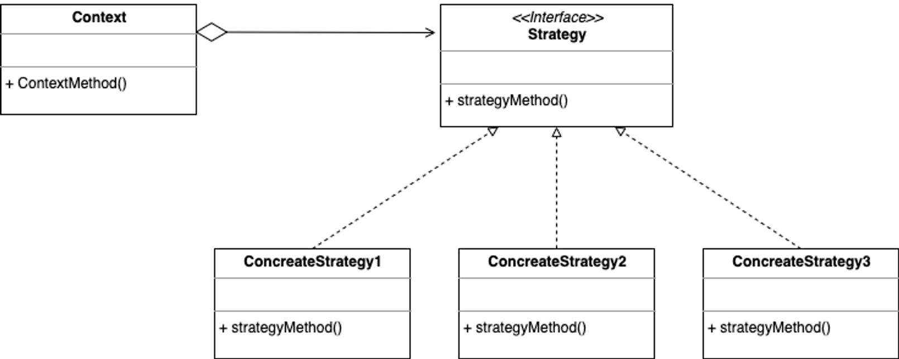

Strategy Pattern -알고리즘을 모두 바꾸기

전략 패턴은 정책(Policy) 패턴으로도 불리며, 디자인 패턴 중 **행동** 패턴에 속하는 패턴이다.

## 정의

---

> 동일 계열의 알고리즘군을 정의하고, 각 알고리즘을 캡슐화하며, 이들을 상호 교환이 가능하도록 만든다. 알고리즘을 사용하는 사용자와 상관없이 독립적으로 알고리즘을 다양하게 **변경할 수 있게** 한다. -GoF의 디자인 패턴(407p)

- 알고리즘을 구성하는 문장들이 사용자 코드와 합쳐져 있을 때는 새로운 알고리즘을 추가하거나 기존의 것을 다양화하기 어렵다.

**알고리즘**(=전략, 작전, 방책)을 빈틈없이 **교체**해서 같은 문제를 다른 방법으로도 쉽게 해결할 수 있게 도와주는 패턴.

## Strategy 패턴의 구성요소

---

**Strategy(전략)**

: 전략을 이용하기 위한 인터페이스

**ConcreteStrategy(구체적인 전략)**

: Strategy에 해당하는 Interface를 구현한 구현체 클래스.

**Context(문맥)**

: Strategy를 이용하는 역할. ConcreteStrategy 객체를 가지고 활용한다.

### Strategy 패턴의 장점

일반적으로 메소드 내부에 동화된 형태로 알고리즘을 구현하는 경우가 많은데, 전략 패턴에서는 알고리즘의 부분을 다른 부분과 의식적으로 **분리**해서 알고리즘의 인터페이스 부분만을 규정한다.

알고리즘을 개량할 때, Strategy(인터페이스)를 수정하지 않고 Concrete Strategy(구현 클래스)의 역할만을 수정하면 된다.

즉, **위임**이라는 느슨한 연결로 인해 **알고리즘을 교체하기 용이하다**는 장점이 있다.

 

프로그램 **실행 중에 전략을 바꾸는 것**도 가능하다.(동적인 교체)

예시 : 이를테면 메모리가 적은 환경에서는 <속도는 느리지만 메모리를 절약하는 전략>을 사용하고 메모리가 많은 환경에서는 <속도는 빠르지만 메모리를 많이 사용하는 전략>을 사용하는 것.

- 관련 패턴
  - Flyweight 패턴 : ConcreteStrategy 역할은 Flyweight 패턴을 사용해서 복수의 장소에서 공유할 수 있다.
  - Abstract Factory 패턴 : Strategy 패턴에서는 알고리즘을 모두 교체할 수 있다면, Abstract Factory 패턴에서는 구체적인 공장/부품/제품을 모두 교체할 수 있다.
  - State 패턴 : 둘 다 위임하는 곳을 교환하는 패턴이고 클래스 간의 관계도 비슷하지만 두 패턴의 목적은 다르다.
    - Strategy 패턴 : 알고리즘을 표현하는 클래스를 작성해서 그것을 ConcreteStrategy 역할의 클래스로 삼는다. 클래스를 교체할 수 있지만 필요하지 않으면 교체하지 않아도 된다.
    - State 패턴 : 상태를 표현하는 클래스를 작성해서 그것을 ConcreteStrategy 역할의 클래스로 삼는다. 상태가 변화할 때마다 위임하는 곳의 클래스가 반드시 교체된다.

<nav>

참고 도서

- Java 언어로 배우는 디자인 패턴 입문(177p)

</nav>
