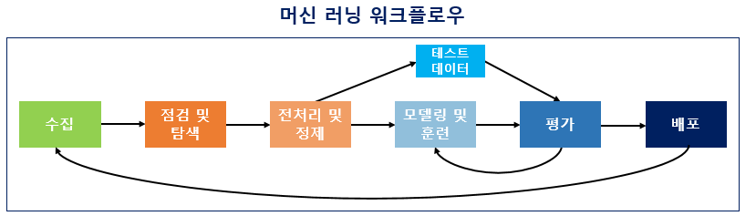
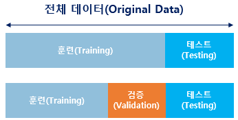

**1) 수집(Acquisition)**

- **코퍼스(corpus) :** 조사나 연구 목적에 의해서 특정 도메인으로부터 수집된 텍스트 집합
  ⭐파일 형식은 txt 파일, csv 파일, xml 파일 등 다양하며 그 출처도 음성 데이터, 웹 수집기를 통해 수집된 데이터, 영화 리뷰 등 다양하다.

**2) 점검 및 탐색(Inspection and exploration)**

=**탐색적 데이터 분석(Exploratory Data Analysis, EDA) 단계**

: 독립 변수, 종속 변수, 변수 유형, 변수의 데이터 타입 등을 점검하며 데이터의 특징과 내재하는 구조적 관계를 알아내는 과정.

⭐이 과정에서 시각화와 간단한 통계 테스트를 진행하기도 한다.

**3) 전처리 및 정제(Preprocessing and Cleaning)**

자연어 처리라면 토큰화, 정제, 정규화, 불용어 제거 등의 단계를 포함

**4) 모델링 및 훈련(Modeling and Training)**

- 모델링 단계 - 머신 러닝에 대한 코드를 작성하는 단계
- 훈련 단계 - 전처리가 완료 된 데이터를 머신 러닝 알고리즘을 통해 기계에게 학습(training)시키는 단계.

⭐데이터 중 일부는 테스트용으로 남겨두고 훈련용 데이터만 훈련에 사용한다.

⇒기계가 학습을 하고나서, 테스트용 데이터를 통해서 현재 성능이 얼마나 되는지를 측정할 수 있으며 과적합(overfitting) 상황을 막을 수 있다.

⭐검증용과 테스트용의 차이

- 검증용 데이터는 현재 모델의 성능. 즉, 기계가 훈련용 데이터로 얼마나 제대로 학습이 되었는지를 판단하는 용으로 사용되며 검증용 데이터를 사용하여 모델의 성능을 개선하는데 사용됨.
- 테스트용 데이터는 모델의 최종 성능을 평가하는 데이터로 모델의 성능을 개선하는 일에 사용되는 것이 아니라, 모델의 성능을 수치화하여 평가하기 위해 사용됨.

**5) 평가(Evaluation)**

: 테스트용 데이터로 성능을 평가하는 것.

⇒기계가 예측한 데이터가 테스트용 데이터의 실제 정답과 얼마나 가까운지를 측정

**6) 배포(Deployment)**

❗본 게시글은 [딥러닝을 이용한 자연어 처리 입문]을 참고하여 작성되었습니다.

[점프 투 파이썬](https://wikidocs.net/book/2155)
