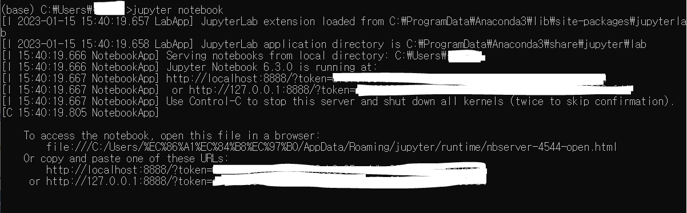

- Jupyter notebook 실행

anaconda prompt 실행 후 아래 명령 입력

```python
jupyter notebook
```



(개인정보 및 토큰 암호는 가렸다.)

이후 터미널에 뜨는 url에 접속하면 Jupyter Notebook을 실행할 수 있다.

❗본 게시글은 [딥러닝을 이용한 자연어 처리 입문]을 참고하여 작성되었습니다.

[점프 투 파이썬](https://wikidocs.net/book/2155)
