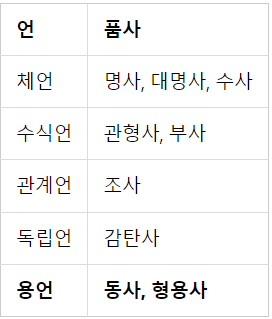

# 2-1. 토큰화

### 1. 단어 토큰화(Word Tokenization)

: 토큰의 기준을 단어(word)로 하는 경우, 단어 토큰화(word tokenization)라고 합니다.

### 2. **토큰화 중 생기는 선택의 순간**

- 영어권 언어에서 아포스트로피(')이 포함된 단어를 어떻게 토큰화 할 것인지.
  ⭐토큰화를 지원해주는 도구
  ```python
  from nltk.tokenize import word_tokenize
  from nltk.tokenize import WordPunctTokenizer
  from tensorflow.keras.preprocessing.text import text_to_word_sequence
  ```
  - `word_tokenize` : Don't를 Do와 n't로 분리하였으며, 반면 Jone's는 Jone과 's로 분리
  - `wordPunctTokenizer` : Don't를 Don과 '와 t로 분리하였으며, 이와 마찬가지로 Jone's를 Jone과 '와 s로 분리
  - `text_to_word_sequence`(케라스) : 모든 알파벳을 소문자로 바꾸면서 마침표나 컴마, 느낌표 등의 구두점을 제거합니다. 하지만 don't나 jone's와 같은 경우 아포스트로피는 보존

### 3. 토큰화에서 고려해야 할 사항

\***\*구두점이나 특수 문자를 단순 제외해서는 안 된다.\*\***

- 표준으로 쓰이고 있는 토큰화 방법 중 하나인 **Penn Treebank Tokenization**의 규칙
  **규칙 1.** 하이푼으로 구성된 단어는 하나로 유지한다.
  **규칙 2.** doesn't와 같이 아포스트로피로 '접어'가 함께하는 단어는 분리해준다.

```python
from nltk.tokenize import TreebankWordTokenizer

tokenizer = TreebankWordTokenizer()

text = "Starting a home-based restaurant may be an ideal. it doesn't have a food chain or restaurant of their own."
print('트리뱅크 워드토크나이저 :',tokenizer.tokenize(text))
```

<aside>
💡 트리뱅크 워드토크나이저 : ['Starting', 'a', '**home-based**', 'restaurant', 'may', 'be', 'an', 'ideal.', 'it', '**does**', "**n't**", 'have', 'a', 'food', 'chain', 'or', 'restaurant', 'of', 'their', 'own', '.']

</aside>

### 4. **문장 토큰화(Sentence Tokenization)**

: 갖고있는 코퍼스 내에서 문장 단위로 구분하는 작업으로 때로는 문장 분류(sentence segmentation)라고도 부릅니다.

- !나 ?는 문장의 구분을 위한 꽤 명확한 구분자(boundary) 역할을 하지만 마침표는 그렇지 않기 때문입니다. 마침표는 문장의 끝이 아니더라도 등장할 수 있습니다.
  EX1) IP **192.168.56.31** 서버에 들어가서 로그 파일 저장해서 aaa@gmail.com로 결과 좀 보내줘. 그 후 점심 먹으러 가자.
  EX2) Since I'm actively looking for **Ph.D.** students, I get the same question a dozen times every year.

NLTK에서는 영어 문장의 토큰화를 수행하는 `sent_tokenize`를 지원하고 있습니다. NLTK를 통해 문장 토큰화를 실습해보겠습니다.

```python
from nltk.tokenize import sent_tokenize

text = "His barber kept his word. But keeping such a huge secret to himself was driving him crazy. Finally, the barber went up a mountain and almost to the edge of a cliff. He dug a hole in the midst of some reeds. He looked about, to make sure no one was near."
print('문장 토큰화1 :',sent_tokenize(text))
```

<aside>
💡 문장 토큰화1 : ['His barber kept his word.', 'But keeping such a huge secret to himself was driving him crazy.', 'Finally, the barber went up a mountain and almost to the edge of a cliff.', 'He dug a hole in the midst of some reeds.', 'He looked about, to make sure no one was near.']

</aside>

```python
text = "I am actively looking for Ph.D. students. and you are a Ph.D student."
print('문장 토큰화2 :',sent_tokenize(text))
```

<aside>
💡 문장 토큰화2 : ['I am actively looking for Ph.D. students.', 'and you are a Ph.D student.']

</aside>

⭐한국어에 대한 문장 토큰화 도구 : KSS(Korean Sentence Splitter)

<aside>
 pip install kss

</aside>

예제)

```python
import kss

text = '딥 러닝 자연어 처리가 재미있기는 합니다. 그런데 문제는 영어보다 한국어로 할 때 너무 어렵습니다. 이제 해보면 알걸요?'
print('한국어 문장 토큰화 :',kss.split_sentences(text))
```

<aside>
💡 한국어 문장 토큰화 : ['딥 러닝 자연어 처리가 재미있기는 합니다.', '그런데 문제는 영어보다 한국어로 할 때 너무 어렵습니다.', '이제 해보면 알걸요?']

</aside>

### 5. **한국어에서의 토큰화의 어려움.**

1. **교착어의 특성(조사, 의존 형태소의 존재)**

   ⇒어절 토큰화가 아니라 형태소 토큰화를 수행해야 한다.

2. **한국어는 띄어쓰기가 영어보다 잘 지켜지지 않는다.**

### 6. **품사 태깅(Part-of-speech tagging)**

⭐단어는 표기는 같지만 품사에 따라서 단어의 의미가 달라지기도 함.

단어 토큰화 과정에서 각 단어가 어떤 품사로 쓰였는지를 구분해놓기도 하는데, 이 작업을 품사 태깅(part-of-speech tagging)이라고 합니다.

### **7. NLTK와 KoNLPy를 이용한 영어, 한국어 토큰화 실습**

`Penn Treebank POS Tags`라는 기준을 사용하여 품사를 태깅한다.

```python
from nltk.tokenize import word_tokenize
from nltk.tag import pos_tag

text = "I am actively looking for Ph.D. students. and you are a Ph.D. student."
tokenized_sentence = word_tokenize(text)

print('단어 토큰화 :',tokenized_sentence)
print('품사 태깅 :',pos_tag(tokenized_sentence))
```

<aside>
💡 단어 토큰화 : ['I', 'am', 'actively', 'looking', 'for', 'Ph.D.', 'students', '.', 'and', 'you', 'are', 'a', 'Ph.D.', 'student', '.']
품사 태깅 : [('I', 'PRP'), ('am', 'VBP'), ('actively', 'RB'), ('looking', 'VBG'), ('for', 'IN'), ('Ph.D.', 'NNP'), ('students', 'NNS'), ('.', '.'), ('and', 'CC'), ('you', 'PRP'), ('are', 'VBP'), ('a', 'DT'), ('Ph.D.', 'NNP'), ('student', 'NN'), ('.', '.')]

</aside>

⭐PRP는 인칭 대명사, VBP는 동사, RB는 부사, VBG는 현재부사, IN은 전치사, NNP는 고유 명사, NNS는 복수형 명사, CC는 접속사, DT는 관사를 의미

⭐한국어 자연어 처리를 위해서는 KoNLPy(코엔엘파이)라는 파이썬 패키지를 사용

- KoNLPy를 통해 사용할 수 있는 형태소 분석기
  : Okt(Open Korea Text), 메캅(Mecab), 코모란(Komoran), 한나눔(Hannanum), 꼬꼬마(Kkma)

```python
from konlpy.tag import Okt
from konlpy.tag import Kkma

okt = Okt()
kkma = Kkma()

print('OKT 형태소 분석 :',okt.morphs("열심히 코딩한 당신, 연휴에는 여행을 가봐요"))
print('OKT 품사 태깅 :',okt.pos("열심히 코딩한 당신, 연휴에는 여행을 가봐요"))
print('OKT 명사 추출 :',okt.nouns("열심히 코딩한 당신, 연휴에는 여행을 가봐요"))

print('꼬꼬마 형태소 분석 :',kkma.morphs("열심히 코딩한 당신, 연휴에는 여행을 가봐요"))
print('꼬꼬마 품사 태깅 :',kkma.pos("열심히 코딩한 당신, 연휴에는 여행을 가봐요"))
print('꼬꼬마 명사 추출 :',kkma.nouns("열심히 코딩한 당신, 연휴에는 여행을 가봐요"))
```

<aside>
💡 OKT 형태소 분석 : ['열심히', '코딩', '한', '당신', ',', '연휴', '에는', '여행', '을', '가봐요']
OKT 품사 태깅 : [('열심히', 'Adverb'), ('코딩', 'Noun'), ('한', 'Josa'), ('당신', 'Noun'), (',', 'Punctuation'), ('연휴', 'Noun'), ('에는', 'Josa'), ('여행', 'Noun'), ('을', 'Josa'), ('가봐요', 'Verb')]
OKT 명사 추출 : ['코딩', '당신', '연휴', '여행']
———————————————————————————————
꼬꼬마 형태소 분석 : ['열심히', '코딩', '하', 'ㄴ', '당신', ',', '연휴', '에', '는', '여행', '을', '가보', '아요']
꼬꼬마 품사 태깅 : [('열심히', 'MAG'), ('코딩', 'NNG'), ('하', 'XSV'), ('ㄴ', 'ETD'), ('당신', 'NP'), (',', 'SP'), ('연휴', 'NNG'), ('에', 'JKM'), ('는', 'JX'), ('여행', 'NNG'), ('을', 'JKO'), ('가보', 'VV'), ('아요', 'EFN')]
꼬꼬마 명사 추출 : ['코딩', '당신', '연휴', '여행']

</aside>

각 형태소 분석기는 성능과 결과가 다르게 나오기 때문에, 형태소 분석기의 선택은 사용하고자 하는 필요 용도에 어떤 형태소 분석기가 가장 적절한지를 판단하고 사용하면 됨.

---

# **2-2 정제(Cleaning) and 정규화(Normalization)**

코퍼스에서 용도에 맞게 토큰을 분류하는 작업을 토큰화(tokenization)라고 하고, 토큰화 작업 전/후에 텍스트 데이터를 용도에 맞게 정제(cleaning)하고 정규화(normalization)해야 한다.

- 정제(cleaning) : 갖고 있는 코퍼스로부터 노이즈 데이터를 제거한다.
- 정규화(normalization) : 표현 방법이 다른 단어들을 통합시켜서 같은 단어로 만들어준다.

### **1. 규칙에 기반한 표기가 다른 단어들의 통합**

ex )

USA와 US는 같은 의미를 가지므로 하나의 단어로 정규화할 수 있다.

uh-huh와 uhhuh는 형태는 다르지만 같은 의미를 가지고 있기 때문에 하나의 단어로 정규화할 수 있다.

⇒표기가 다른 단어들을 통합하는 어간 추출/표제어 추출에서 자세하게 다루도록 한다.

### **2. 대, 소문자 통합**

영어권 언어에서 대/소문자를 통합하여 단어의 개수를 줄일 수 있다.

주로 대문자를 소문자로 변환하는 소문자 변환 작업으로 이루어진다.

⭐예외)대문자와 소문자가 구분되어야 하는 경우

- 미국을 뜻하는 단어 ‘US’와 우리를 뜻하는 단어 ‘us’는 다른 단어로 구분되어야 한다.
- 회사 이름(General Motors)이나 사람 이름(Bush) 등의 고유명사 또한 대문자로 유지되어야 한다.

### 3. 불필요한 단어의 제거

정제 작업에서 제거해야하는 노이즈 데이터(noise data)는 자연어가 아니면서 아무 의미도 갖지 않는 글자(특수문자)와 목적에 맞지 않는 불필요한 단어들을 의미한다.

1. 불용어 제거⇒불용어 챕터에서 자세히 다룬다.
2. 등장 빈도가 적은 단어

   텍스트 데이터에서 너무 적게 등장하는 단어는 자연어 처리에 도움이 되지 않는 경우가 많다.

3. 길이가 짧은 단어

   영어권 언어에서 길이가 짧은 단어들은 대부분 불용어에 해당된다.

   ⭐한국어에서 길이가 짧은 단어를 제거하는 것이 유효하지 않는 이유

   - 영어 단어에 비해 한국어 단어의 평균 길이는 더 적다.(2~3글자)
   - 한국어 단어는 한자어가 많고, 한 글자만으로 이미 의미를 가지고 있는 경우가 많다.

   ```python
   import re
   text = "I was wondering if anyone out there could enlighten me on this car."

   # 길이가 1~2인 단어들을 정규 표현식을 이용하여 삭제
   shortword = re.compile(r'\W*\b\w{1,2}\b')
   print(shortword.sub('', text))
   ```

   > was wondering anyone out there could enlighten this car.

---

# **2-3 어간 추출(Stemming) and 표제어 추출(Lemmatization)**

다른 단어를 하나의 단어로 일반화시켜 문서 내의 단어 수를 줄이는 것.

자연어 처리에서 전처리의 지향점은 갖고있는 코퍼스로부터 복잡성을 줄이는 것.

### 1. **표제어 추출(Lemmatization)**

단어들이 다른 형태를 가지더라도 그 뿌리 단어(=표제어)를 찾아 단어의 개수를 줄인다.

표제어 추출은 어간 추출과 달리 **단어의 형태가 적절히 보존**되는 양상을 띤다.

ex )

서로 다른 스펠링을 가지는 am, are, is는 그들의 표제어인 be로 일반화할 수 있다.

- 표제어 추출 방법 - **형태학적 파싱**
  - 형태소 : 의미를 가진 가장 작은 단위, 어간과 접사로 분류할 수 있다.
    - 어간(stem) : 단어의 의미를 담고 있는 단어의 핵심 부분
    - 접사(affix) : 단어에 추가적인 의미를 주는 부분
      형태학적 파싱이란, 이 두 가지 구성요소를 분리하는 작업이다.
      ex) cats=cat(어간)+-s(접사)
- 실습
  NLTK는 표제어 추출을 위한 WordNetLemmatizer를 지원한다.

  ```python
  from nltk.stem import WordNetLemmatizer

  lemmatizer = WordNetLemmatizer()

  words = ['policy', 'doing', 'organization', 'have', 'going', 'love', 'lives', 'fly', 'dies', 'watched', 'has', 'starting']

  print('표제어 추출 전 :',words)
  print('표제어 추출 후 :',[lemmatizer.lemmatize(word) for word in words])
  ```

  > 표제어 추출 전 : ['policy', 'doing', 'organization', 'have', 'going', 'love', 'lives', 'fly', 'dies', 'watched', 'has', 'starting']
  > 표제어 추출 후 : ['policy', 'doing', 'organization', 'have', 'going', 'love', 'life', 'fly', 'dy', 'watched', 'ha', 'starting']
  > 위 예시에서 표제어 추출기에 본래 단어의 품사 정보가 명시되지 않았기 때문에 dy와 ha와 같이 부적절한 단어를 출력하고 있다.
  > WordNetLemmatizer는 사용된 단어에 대해 직접 품사 정보를 전달할 수 있다.

  ```python
  lemmatizer.lemmatize('dies', 'v')
  ##die
  lemmatizer.lemmatize('watched', 'v')
  ##watch
  ```

### **2. 어간 추출(Stemming)**

표제어 추출은 해당 단어의 품사 정보를 보존하는 반면 어간 추출은 품사 정보가 보존되지 않는 경우가 많다. 정확히는 어간 추출을 한 결과는 사전에 존재하지 않는 단어일 경우가 많다.

어간 추출 속도는 일반적으로 표제어 추출 속도보다 빠르다.

- 실습
    <aside>
    💡 **This was not the map we found in Billy Bones's chest, but an accurate copy, complete in all things--names and heights and soundings--with the single exception of the red crosses and the written notes.**
    
    </aside>
    
    ```python
    from nltk.stem import PorterStemmer
    from nltk.tokenize import word_tokenize
    
    stemmer = PorterStemmer()
    
    sentence = "This was not the map we found in Billy Bones's chest, but an accurate copy, complete in all things--names and heights and soundings--with the single exception of the red crosses and the written notes."
    tokenized_sentence = word_tokenize(sentence)
    
    print('어간 추출 전 :', tokenized_sentence)
    print('어간 추출 후 :',[stemmer.stem(word) for word in tokenized_sentence])
    ```
    
    > 어간 추출 전 : ['This', 'was', 'not', 'the', 'map', 'we', 'found', 'in', 'Billy', 'Bones', "'s", 'chest', ',', 'but', 'an', 'accurate', 'copy', ',', 'complete', 'in', 'all', 'things', '--', 'names', 'and', 'heights', 'and', 'soundings', '--', 'with', 'the', 'single', 'exception', 'of', 'the', 'red', 'crosses', 'and', 'the', 'written', 'notes', '.']
    어간 추출 후 : ['thi', 'wa', 'not', 'the', 'map', 'we', 'found', 'in', 'billi', 'bone', "'s", 'chest', ',', 'but', 'an', 'accur', 'copi', ',', 'complet', 'in', 'all', 'thing', '--', 'name', 'and', 'height', 'and', 'sound', '--', 'with', 'the', 'singl', 'except', 'of', 'the', 'red', 'cross', 'and', 'the', 'written', 'note', '.']
    > 
    
    어간 추출 후의 결과에는 사전에 없는 단어들도 다수 포함되어있다.
    
    포터 알고리즘의 어간 추출은 다음과 같은 규칙을 가진다.
    
    - alize→al
    - ance→제거
    - ical→ic
    
    위 규칙에 따라 좌측의 단어는 우측의 단어와 같은 결과를 가지게 된다.
    
    - formalize → formal
    - allowance → allow
    - electricical → electric
    
    ```python
    words = ['formalize', 'allowance', 'electricical']
    
    print('어간 추출 전 :',words)
    print('어간 추출 후 :',[stemmer.stem(word) for word in words])
    ```
    
    > 어간 추출 전 : ['formalize', 'allowance', 'electricical']
    어간 추출 후 : ['formal', 'allow', 'electric']
    >

### 3. 한국어에서의 어간 추출



한국어는 위와 같은 5언 9품사의 구조를 가지고 있다. 그 중 ‘동사’와 ‘형용사’는 어간과 어미의 결합으로 구성된다.

1. 활용(conjugation)

   : 용언의 어간이 어미를 가지는 것

   - 어간 : 용언(동사, 형용사)를 활용할 때, 원칙적으로 모양이 변하지 않는 부분. 활용에서 어미에 선행하는 부분. 상황에 따라 어간의 모양도 바뀔 수 있다.(ex : 긋다, 긋고, 그어서, 그어라)
   - 어미 : 용언의 어간 뒤에 붙어서 활용하면서 변하는 부분. 여러 문법적 기능을 수행

   활용은 어간이 어미를 취할 때, 어간의 모습이 일정한 규칙 활용, 어간이나 어미의 모습이 변하는 불규칙 활용으로 나뉜다.

2. 규칙 활용

   <aside>
   💡 잡(어간)+다(어미)

   </aside>

   규칙 기반으로 어미를 단순히 분리해주면 어간 추출이 된다.

3. 불규칙 활용

   - 어간의 형식이 달라지는 경우
     듣→들, 돕→도우, 곱→고우, 잇→이, 오르→올, 노랗→노라
   - 특수한 어미를 취하는 경우
     오르+ 아/어→올라, 하+아/어→하여, 이르+아/어→이르러, 푸르+아/어→푸르러

   어간 추출 시 규칙 활용에 비해 더 복잡한 규칙을 필요로 한다.

❗본 게시글은 [딥러닝을 이용한 자연어 처리 입문]을 참고하여 작성되었습니다.

[점프 투 파이썬](https://wikidocs.net/book/2155)
