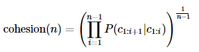
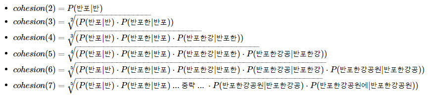

# 2-10. 한국어 전처리 패키지

유용한 한국어 전처리 패키지를 정리한 포스트입니다.

<nav>

목차

- PyKoSpacing
- Py-Hanspell
- SOYNLP를 이용한 단어 토큰화
- SOYNLP를 이용한 반복되는 문자 정제
- Customized KoNLPy

</nav>

### 1. PyKoSpacing

: 띄어쓰기가 되어있지 않은 문장을 띄어쓰기된 문장으로 변환하는 패키지.

- 설치

<aside>
💡 pip install git+https://github.com/haven-jeon/PyKoSpacing.git

</aside>

- 사용법

```jsx
from pykospacing import Spacing

sent = '김철수는극중두인격의사나이이광수역을맡았다.철수는한국유일의태권도전승자를가리는결전의날을앞두고10년간함께훈련한사형인유연재(김광수분)를찾으러속세로내려온인물이다.'

spacing = Spacing()
kospacing_sent = spacing(sent)

print(kospacing_sent)
```

> 김철수는 극중 두 인격의 사나이 이광수 역을 맡았다. 철수는 한국 유일의 태권도 전승자를 가리는 결전의 날을 앞두고 10년간 함께 훈련한 사형인 유연재(김광수 분)를 찾으러 속세로 내려온 인물이다.

### 2. Py-Hanspell

: 네이버 한글 맞춤법 검사기를 바탕으로 만들어진 패키지. 띄어쓰기도 보장해준다.

- 설치

<aside>
💡 pip install git+https://github.com/ssut/py-hanspell.git

</aside>

- 사용법

```jsx
from hanspell import spell_checker

sent = "맞춤법 틀리면 외 않되? 쓰고싶은대로쓰면돼지 "
spelled_sent = spell_checker.check(sent)

hanspell_sent = spelled_sent.checked
print(hanspell_sent)
```

> 맞춤법 틀리면 왜 안돼? 쓰고 싶은 대로 쓰면 되지

### 3. **SOYNLP를 이용한 단어 토큰화**

: 품사 태깅, 단어 토큰화 등을 지원하는 단어 토크나이저. 데이터에 자주 등장하는 단어들을 단어로 분석.

- 설치

<aside>
💡 pip install soynlp

</aside>

1. 신조어 문제

   ```python
   from konlpy.tag import Okt
   tokenizer = Okt()
   print(tokenizer.morphs('에이비식스 이대휘 1월 최애돌 기부 요정'))
   ```

   > ['에이', '비식스', '이대', '휘', '1월', '최애', '돌', '기부', '요정']

   신조어나 형태소 분석기에 등록되지 않은 단어를 제대로 구분하지 못하던 기존 형태서 분석기의 단점을 보완하기 위해, SOYNLP는 텍스트 데이터에서 특정 문자 시퀀스가 함께 자주 등장하는 빈도가 높고, 앞 뒤로 조사 또는 완전히 다른 단어가 등장하는 것을 고려해서 해당 문자 시퀀스를 형태소라고 판단한다. 예를 들어 에이비식스라는 문자열이 자주 연결되어 등장하거나, 에이비식스라는 단어 앞/뒤에 ‘최고’, ‘가수’, ‘실력’과 같은 독립된 다른 단어들이 계속해서 등장한다면 에이비식스를 한 단어로 판단하는 식이다.

2. 학습하기

   먼저 학습에 필요한 한국어 문서를 다운로드한다.

   ```python
   import urllib.request
   from soynlp import DoublespaceLineCorpus
   from soynlp.word import WordExtractor

   urllib.request.urlretrieve("https://raw.githubusercontent.com/lovit/soynlp/master/tutorials/2016-10-20.txt", filename="2016-10-20.txt")
   ```

   훈련 데이터를 다수의 문서로 분리한다.

   ```python
   corpus = DoublespaceLineCorpus("2016-10-20.txt")
   len(corpus)    //30091
   ```

   예시로 상위 3개의 문서만 출력해본다.

   ```python
   i = 0
   for document in corpus:
     if len(document) > 0:
       print(document)
       i = i+1
     if i == 3:
       break
   ```

   <aside>
   💡 19  1990  52 1 22
   오패산터널 총격전 용의자 검거 서울 연합뉴스 경찰 관계자들이 19일 오후 서울 강북구 오패산 터널 인근에서 사제 총기를 발사해 경찰을 살해한 용의자 성모씨를 검거하고 있다 ... 중략 ... 숲에서 발견됐고 일부는 성씨가 소지한 가방 안에 있었다
   테헤란 연합뉴스 강훈상 특파원 이용 승객수 기준 세계 최대 공항인 아랍에미리트 두바이국제공항은 19일 현지시간 이 공항을 이륙하는 모든 항공기의 탑승객은 삼성전자의 갤럭시노트7을 휴대하면 안 된다고 밝혔다 ... 중략 ... 이런 조치는 두바이국제공항 뿐 아니라 신공항인 두바이월드센터에도 적용된다  배터리 폭발문제로 회수된 갤럭시노트7 연합뉴스자료사진

   </aside>

   soylnp는 학습 기반의 단어 토크나이저이므로 기본의 KoNLPy에서 제공하는 형태소 분석기들과는 달리 학습과정을 거쳐야한다.

   WordExtractor.extract()를 통해 전체 코퍼스에 대해 단어 점수표를 계산한다.

   ```python
   word_extractor = WordExtractor()
   word_extractor.train(corpus)
   word_score_table = word_extractor.extract()
   ```

   > training was done. used memory 5.186 Gb
   > all cohesion probabilities was computed. # words = 223348
   > all branching entropies was computed # words = 361598
   > all accessor variety was computed # words = 361598

3. SOYNLP의 응집 확률

   응집 확률 : 내부 문자열(substring)이 얼마나 응집하여 자주 등장하는지를 판단하는 척도. 문자열을 문자 단위로 분리하여 내부 문자열을 만드는 과정에서 왼쪽부터 순서대로 문자를 추가하면서 각 문자열이 주어졌을 때 그 다음 문자가 나올 확률을 계산하여 누적곱을 하여 구한다.

   이 값이 높을수록 전체 코퍼스에서 이 문자열 시퀀스는 하나의 단어로 등장할 가능성이 높다.

   

   ex) ‘반포한강공원에’라는 7글자의 문자시퀀스에 대해 각 내부 문자열의 스코어를 구하는 과정은 다음과 같다.

   

   ```python
   word_score_table["반포한"].cohesion_forward
   //0.08838002913645132
   word_score_table["반포한강"].cohesion_forward
   //0.19841268168224552
   word_score_table["반포한강공"].cohesion_forward
   //0.2972877884078849
   word_score_table["반포한강공원"].cohesion_forward
   //0.37891487632839754
   word_score_table["반포한강공원에"].cohesion_forward
   //0.33492963377557666
   ```

   응집도는 ‘반포한강공원’일 때가 가장 높다. 즉 응집도를 통해 판단하기에 하나의 단어로 판단하기 가장 적합한 문자열은 ‘반포한강공원이다.

4. SOYNLP의 브랜칭 엔트로피

   Branching Entroppy는 확률 분포의 엔트로피 값을 사용한다.

   : 주어진 문자열에서 얼마나 다음 문자가 등장할 수 있는지를 판단하는 척도

   Branching Entroppy가 작을수록 다음 문자를 예측하기 쉬워진다.

   ```python
   word_score_table["디스"].right_branching_entropy
   //1.6371694761537934
   word_score_table["디스플"].right_branching_entropy
   //-0.0
   word_score_table["디스플레이"].right_branching_entropy
   3.1400392861792916
   ```

   ‘디스플’에서 다음 단어인 ‘레’가 오는 것이 당연하기 때문에 Branching Entroppy는 0이 된다. 그리고 ‘디스플레이’에서 갑자기 값이 증가하는데, 이는 ‘디스플레이’라는 단어 뒤에 조사 또는 다른 단어가 붙는 등 다양한 경우가 존재할 수 있기 때문.

   ⇒이런 성질을 이용하여 단어를 판단할 수 있다.

5. SOYNLP의 L Tokenizer

   한국어를 띄어쓰기 단위로 나눈 어절토큰은 주로 L토큰+R토큰의 형식을 가진다.

   ex) 공원에=공원+에, 공부하는=공부+하는

   L 토크나이저는 L토큰+R토큰으로 나누되 분리 기준 점수가 가장 높은 L토큰을 찾아낸다.

   ```python
   from soynlp.tokenizer import LTokenizer

   scores = {word:score.cohesion_forward for word, score in word_score_table.items()}
   l_tokenizer = LTokenizer(scores=scores)
   l_tokenizer.tokenize("국제사회와 우리의 노력들로 범죄를 척결하자", flatten=False)
   ```

   > [('국제사회', '와'), ('우리', '의'), ('노력', '들로'), ('범죄', '를'), ('척결', '하자')]

6. 최대 점수 토크나이저

   : 띄어쓰기가 되지 않는 문장에서 점수가 높은 글자 시퀀스를 순차적으로 찾아내는 토크나이저

   ```python
   from soynlp.tokenizer import MaxScoreTokenizer

   maxscore_tokenizer = MaxScoreTokenizer(scores=scores)
   maxscore_tokenizer.tokenize("국제사회와우리의노력들로범죄를척결하자")
   ```

   > ['국제사회', '와', '우리', '의', '노력', '들로', '범죄', '를', '척결', '하자']

### **4. SOYNLP를 이용한 반복되는 문자 정제**

SNS나 채팅 데이터와 같은 한국어 데이터의 경우 ㅎ, ㅋ와 같은 특정 기호가 불필요하게 연속되는 경우가 많은데 이렇게 반복되는 문자를 하나로 정규화 시켜보자.

```python
print(emoticon_normalize('앜ㅋㅋㅋㅋ이영화존잼쓰ㅠㅠㅠㅠㅠ', num_repeats=2))
print(emoticon_normalize('앜ㅋㅋㅋㅋㅋㅋㅋㅋㅋ이영화존잼쓰ㅠㅠㅠㅠ', num_repeats=2))
print(emoticon_normalize('앜ㅋㅋㅋㅋㅋㅋㅋㅋㅋㅋㅋㅋ이영화존잼쓰ㅠㅠㅠㅠㅠㅠ', num_repeats=2))
print(emoticon_normalize('앜ㅋㅋㅋㅋㅋㅋㅋㅋㅋㅋㅋㅋㅋㅋㅋㅋㅋ이영화존잼쓰ㅠㅠㅠㅠㅠㅠㅠㅠ', num_repeats=2))
```

> 아ㅋㅋ영화존잼쓰ㅠㅠ
> 아ㅋㅋ영화존잼쓰ㅠㅠ
> 아ㅋㅋ영화존잼쓰ㅠㅠ
> 아ㅋㅋ영화존잼쓰ㅠㅠ

```python
print(repeat_normalize('와하하하하하하하하하핫', num_repeats=2))
print(repeat_normalize('와하하하하하하핫', num_repeats=2))
print(repeat_normalize('와하하하하핫', num_repeats=2))
```

> 와하하핫
> 와하하핫
> 와하하핫

### **5. Customized KoNLPy**

형태소 분석기를 사용하여 단어 토큰화를 해보자.

> 형태소 분석 입력 : '은경이는 사무실로 갔습니다.'
> 형태소 분석 결과 : ['은', '경이', '는', '사무실', '로', '갔습니다', '.']

위와 같은 경우에서, ‘은경이’는 사람의 이름이므로 하나의 단어토큰으로 취급되어야 한다.

⇒사용자 사전을 추가해준다. Costomized Konlpy라는 패키지를 사용하면 쉽게 사용자 사전을 추가할 수 있다.

- 설치

<aside>
💡 pip install customized_konlpy

</aside>

- 사용법

```python
from ckonlpy.tag import Twitter
twitter = Twitter()
twitter.morphs('은경이는 사무실로 갔습니다.')
```

> ['은', '경이', '는', '사무실', '로', '갔습니다', '.']

형태소 분석기 Twitter에 ‘은경이’라는 단어를 명사로서 사전 추가해준다.

```python
twitter.add_dictionary('은경이', 'Noun')
```

```python
twitter.morphs('은경이는 사무실로 갔습니다.')
```

> ['은경이', '는', '사무실', '로', '갔습니다', '.']

❗본 게시글은 [딥러닝을 이용한 자연어 처리 입문]을 참고하여 작성되었습니다.

[점프 투 파이썬](https://wikidocs.net/book/2155)
