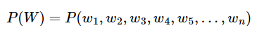

- 언어 모델(Languagel Model) : 단어 시퀀스(문장)에 **확률**을 할당하는 모델
  - 통계에 기반한 전통적인 언어 모델(Statistical Languagel Model, SLM)
  - 인공 신경망 언어 모델(ex : GPT, BERT)

# 3-1 언어 모델(Languagel Model)이란?

### **1. 언어 모델(Language Model)**

: 언어라는 현상을 모델링하고자 단어 시퀀스(문장)에 **확률**을 할당(assign)하는 모델

⇒가장 자연스러운 단어 시퀀스(문장)를 찾아내는 모델

- 가장 보편적으로 사용되는 방법은 언어 모델이 **이전 단어들이 주어졌을 때 다음 단어를 예측**하도록 하는 것이다.
- 다른 유형의 언어 모델로는 주어진 양쪽의 단어들로부터 가운데 비어있는 단어를 예측하는 언어 모델이 있다.(BERT)

⭐**언어 모델링(Language Modeling)**

: 주어진 단어들로부터 아직 모르는 단어를 예측하는 작업

⇒언어 모델이 이전 단어들로부터 다음 단어를 예측하는 일은 언어 모델링

### 2. 단어 시퀀스의 확률 할당

자연어 처리에서 단어 시퀀스에 확률을 할당하는 일이 필요한 이유

1. 기계 번역(Machine Translation)

   <aside>
   💡 P(나는 버스를 탔다) > P(나는 버스를 태운다)

   </aside>

2. 오타 교정(Spell Correction)

   <aside>
   💡 선생님이 교실로 부리나케

   **P**(달려갔다) >**P**(잘려갔다)

   </aside>

3. 음성 인식(Speech Recognition)

   <aside>
   💡 **P**(나는 메롱을 먹는다) < **P**(나는 메론을 먹는다)

   </aside>

언어모델은 위와 같이 확률을 기반으로 더 적절한 문장을 판단한다.

### 3. 주어진 이전 단어들로부터 다음 단어 예측하기

이전 단어들이 주어졌을 때, 다음 단어를 예측하는 것을 **조건부 확률**로 표현한다.

1. 단어 시퀀스(문장)의 확률

   하나의 단어를 w, 단어 시퀀스(문장)를 대문자 W라고 할 때, n개의 단어가 등장하는 단어 시퀀스 W의 확률은 다음과 같다.

   

2. 다음 단어 등장 확률

   n-1개의 단어가 나열된 상태에서 n번째 단어의 확률은 다음과 같다.

   

   ex)5번째 단어의 확률

   

   전체 단어 시퀀스 W의 확률은 모든 단어가 예측되고 나서 알 수 있으므로 단어 시퀀스의 확률은 다음과 같이 표현된다.

   

---

# **3-2 통계적 언어 모델(Statistical Language Model, SLM)**

### 1. 조건부 확률

조건부 확률은 두 확률 P(A),P(B)에 대해서 아래와 같은 관계를 갖는다.

4개의 확률이 조건부 확률의 관계를 가질 경우 아래와 같이 표현 가능하다.

⇒조건부 확률의 연쇄 법칙(chain rule)

⭐n개의 확률에 대해 일반화

### 2. 문장에 대한 확률

문장 `'An adorable little boy is spreading smiles'`의 확률 **P(An adorable little boy is spreading smiles)**를 식으로 표현해보자.

- 각 단어는 문맥이라는 관계로 인해 이전 단어의 영향을 받아 나온 단어이다.
- 모든 단어로부터 하나의 문장이 완성된다.
  ⇒문장의 확률을 구하기 위해 조건부 확률을 사용한다.
  문장의 확률은 각 단어들이 이전 단어가 주어졌을 때 다음 단어로 등장할 확률의 곱으로 구성된다.
  
  

### 3. 카운트 기반의 접근

이전 단어로부터 다음 단어에 대하나 확률을 구하는 방법 → 카운트에 기반하여 확률을 계산한다.

ex)

기계가 학습한 코퍼스 데이터에서 `An adorable little boy`가 100번 등장했는데 그 다음에 is가 등장하나 경우가 30번이라면, **P(is|An adorable little boy)**
는 30%이다.

### 4. 카운트 기반 접근의 한계 - **희소 문제(Sparsity Problem)**

카운트 기반으로 접근하려고 한다면 갖고있는 코퍼스(corpus). 즉, 다시 말해 기계가 훈련하는 데이터는 정말 방대한 양이 필요하다.

ex)

기계가 훈련한 코퍼스에 An adorable little boy is라는 단어 시퀀스가 없었다면 이 단어 시퀀스에 대한 확률은 0이 된다. 또는 An adorable little boy라는 단어 시퀀스가 없었다면 분모가 0이 되어 확률은 정의되지 않는다.

이와 같이 충분한 데이터를 관측하지 못하여 언어를 정확히 모델링하지 못하는 문제를 **희소 문제(sparsity problem)**라고 한다.

- 문제를 완화하는 방법
  - n-gram 언어모델
  - 스무딩/백오프 등의 일반화 기법
    but, 근본적인 해결책은 되지 못했다.

---

# **3-3 N-gram 언어 모델(N-gram Language Model)**

### 1. **코퍼스에서 카운트하지 못하는 경우의 감소.**

- SLM의 한계 : 희소문제
  - 훈련 코퍼스에 확률을 계산하고 싶은 문장이나 단어가 없을 수 있다.
  - 확률을 계산하고 싶은 문장이 길어질수록 갖고있는 코퍼스에 해당 문장이 존재하지 않을 가능성이 높다.
    ⇒참고하는 단어 수를 줄이자.
    
    앞 단어 중 임의의 개수만 포함해서 카운트하여 근사하자는 것. 이렇게 하면 갖고 있는 코퍼스에서 해당 단어의 시퀀스를 카운트할 확률이 높아진다.

### 2. N-gram

이때 임의의 개수를 정하기 위한 기준을 위해 사용하는 것이 n-gram.

n-gram은 n개의 연속적인 단어 나열을 의미한다.

갖고 있는 코퍼스에서 n개의 단어 뭉치 단위로 끊어서 이를 하나의 토큰으로 간주한다.

ex) 문장 `An adorable little boy is spreading smiles`이 있을 때, 각 n에 대해서 n-gram을 전부 구해보면 다음과 같다.

- **uni**grams : `an`, `adorable`, `little`, `boy`, `is`, `spreading`, `smiles`
- **bi**grams : `an adorable`, `adorable little`, `little boy`, `boy is`, `is spreading`, `spreading smiles`
- **tri**grams : `an adorable little`, `adorable little boy`, `little boy is`, `boy is spreading`, `is spreading smiles`
- **4-**grams : `an adorable little boy`, `adorable little boy is`, `little boy is spreading`, `boy is spreading smiles`

n-gram을 사용할 때는 일반적으로 n이 1일 때는 유니그램(unigram), 2일 때는 바이그램(bigram), 3일 때는 트라이그램(trigram)이라고 명명하고 n이 4 이상일 때는 gram 앞에 그대로 숫자를 붙여서 명명한다.

ex)`'An adorable little boy is spreading'` 다음에 나올 단어를 예측하고 싶다고 할 때, n=4라고 한 4-gram을 이용한 언어 모델을 사용한다고 하자.

이 경우 spreading 다음에 올 단어를 예측할 때 n-1에 해당하는 앞의 3개의 단어만을 고려한다.

- 갖고있는 코퍼스에서 boy is spreading가 1,000번 등장했다고 하자.
- boy is spreading insults가 500번 등장했으며, boy is spreading smiles가 200번 등장했다고 하자.
  ⇒그렇게 되면 boy is spreading 다음에 insults가 등장할 확률은 50%이며, smiles가 등장할 확률은 20%이다. 확률적 선택에 따라 우리는 insults가 더 맞다고 판단하게 된다.

### 3. **N-gram Language Model의 한계**

n-gram은 앞의 단어 몇 개만 보다 보니 의도하고 싶은 대로 문장을 끝맺음하지 못하는 경우가 생긴다.

⇒전체 문장을 고려한 언어 모델보다는 정확도가 떨어질 수밖에 없다.

1. 희소 문제(Sparsity Problem)

   결국 카운트 기반의 모델이기 때문에 여전히 희소 문제가 존재한다.

2. n을 선택하는 것은 trade-off 문제.

   ⭐trade-off(상반관계) : 하나가 증가하면 다른 하나는 감소하는 관계

   n-gram의 n이 커질 수록 언어 모델의 성능이 높아지는 반면, 실제 훈련 코퍼스에서 해당 n-gram을 카운트할 수 있는 확률은 적어지므로 희소문제가 심각해지며 모델 사이즈도 커진다는 문제가 있다.

   n이 작아질 경우 카운트는 잘 되겠지만 근사의 정확도는 떨어진다.

   정확도를 높이기 위해 n은 최대 5를 넘게 잡아선 안된다고 권장되고 있다.

   ex) 스탠퍼드 대학교의 공유 자료에 따르면, 월스트리트 저널에서 3,800만 개의 단어 토큰에 대하여 n-gram 언어 모델을 학습하고, 1,500만 개의 테스트 데이터에 대해서 테스트를 했을 때 다음과 같은 성능이 나왔다고 함.

   

   ⭐펄플렉서티(perplexity)는 수치가 낮을수록 더 좋은 성능을 나타냄.

---

# **3-4 한국어에서의 언어 모델(Language Model for Korean Sentences)**

다른 언어에 비해 한국어는 언어 모델로 다음 단어를 예측하기 훨씬 까다롭다.

### **1. 한국어는 어순이 중요하지 않다.**

이전 단어가 주어졌을때, 다음 단어가 나타날 확률을 구해야하는데 어순이 중요하지 않다는 것은 다음 단어로 어떤 단어든 등장할 수 있다는 의미

<aside>
💡  1. 나는 운동을 합니다 체육관에서.

1. 나는 체육관에서 운동을 합니다.
2. 체육관에서 운동을 합니다.
3. 나는 운동을 체육관에서 합니다.
</aside>

⇒주어가 생략되거나 단어 순서가 뒤죽박죽이 되어도 의미가 전달되기 때문에 확률에 기반한 언어 모델이 제대로 다음 단어를 예측하기가 어렵다.

### 2. 한국어는 교착어이다.

영어에는 기본적으로 조사가 없는 반면 한국어에는 조사가 있기 때문에, 하나의 형태소에서 파생되는 단어가 다양하다.

### 3. **한국어는 띄어쓰기가 제대로 지켜지지 않는다.**

한국어는 띄어쓰기를 제대로 하지 않아도 의미가 전달되기 때문에 한국어 코퍼스는 띄어쓰기가 제대로 지켜지지 않는 경우가 많다. 토큰이 제대로 분리되지 않은 채 훈련 데이터로 사용되는 경우 언어모델이 제대로 동작하지 않을 수 있다.

---

# **3-5 펄플렉서티(Perplexity, PPL)**

여러 모델의 성능을 비교하기 위한 지표.

모델을 실제 평가에 투입하는 데에는 시간과 비용이 많이 들기 때문에, 모델 내에서 자신의 성능을 수치화한 펄플렉서티(perplexity)를 사용한다.

### **1. 언어 모델의 평가 방법(Evaluation metric) : PPL**

⭐perplexed : 헷갈리는

⇒PPL은 ‘헷갈리는 정도’라고 할 수 있기 때문에, PPL이 낮을수록 언어 모델의 성능이 좋다.

PPL은 문장의 길이로 정규화된 문장 확률의 역수

문장 W의 길이가 N이라고 하였을 때의 PPL은 다음과 같이 표현된다.

문장의 확률에 체인룰(chain rule)을 적용하면 아래와 같다.

여기에 n-gram을 적용할 수 있다.

ex) bigram 언어모델의 경우

### 2. 분기 계수(Branching factor)

: PPL은 **선택할 수 있는 가능한 경우의 수**를 의미하는 분기계수(branching factor)이다.

PPL이 10인 경우, 해당 언어 모델은 테스트 데이터에 대해 다음 단어를 예측하는 모든 시점마다 평균 10개의 단어를 가지고 어떤 것이 정답인지 고민하고 있다고 해석할 수 있다.

⭐PPL이 낮다≠사람이 느끼기에 좋은 언어 모델이다

⇒언어 모델의 PPL은 테스트 데이터에 의존하기 때문에

---

# **3-6 조건부 확률(Conditional Probability)**

A = 학생이 남학생인 사건

B = 학생이 여학생인 사건

C = 학생이 중학생인 사건

D = 학생이 고등학생인 사건

1. 학생을 뽑았을 때, 남학생일 확률

   P(A)=180/360=0.5

2. 학생을 뽑았을 때, 고등학생이면서 남학생일 확률

   P(A∩D) = 80/360

3. 고등학생 중 한명을 뽑았을 때, 남학생일 확률

   P(A|D) = 80/200 = P(A∩D)/P(D) = (80/360)/(200/360) = 80/200 = 0.4

❗본 게시글은 [딥러닝을 이용한 자연어 처리 입문]을 참고하여 작성되었습니다.

[점프 투 파이썬](https://wikidocs.net/book/2155)
