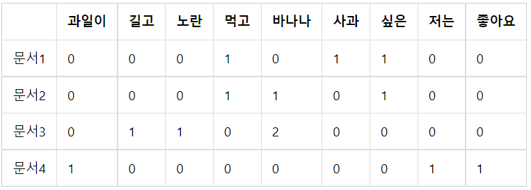
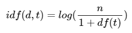
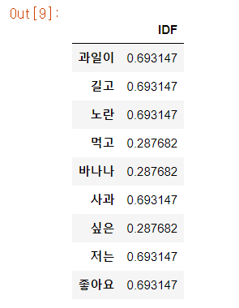
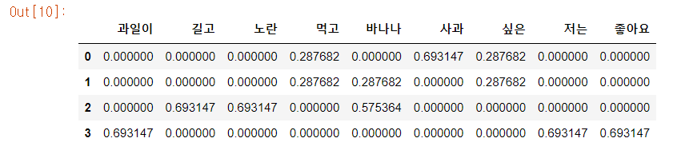

대표적인 카운트 기반의 단어 표현 방법

- DTM(Document Term Matrix)
- TF-IDF(Term Frequency-Inverse Document Frequency)

위와 같은 방식으로 텍스트를 **수치화**하면 통계적인 접근 방법을 통해 특정 문서 내에서 어떤 단어가 가지는 중요도를 표현할 수 있고 문서들 간의 유사도를 구할 수도 있다.

# 4-1 다양한 단어의 표현 방법

### **1. 단어의 표현 방법**

- 국소 표현(Local Representation)(=이산 표현)
  : 해당 단어 그 자체만 보고 특정 값을 매핑하여 단어를 표현하는 방법
- 분산 표현(Distributed Respresentation)(=연속 표현)
  : 그 단어를 표현하고자 주변을 참고하여 단어를 표현하는 방법. 단어의 뉘앙스를 표현할 수 있게 된다.

ex) puppy, cute, lovely라는 단어가 있을 때, 각 단어에 1번, 2번, 3번으로 인덱스를 부여한다면 국소 표현방법, puppy라는 단어 근처에 cute, lovely라는 단어가 자주 등장하므로 puppy는 cute, lovely한 느낌이라고 단어를 정의한다면 분산 표현 방법.

### **2. 단어 표현의 카테고리화**


# 4-2 Bag of Word(BoW)

: 단어의 등장 순서를 고려하지 않는 **빈도수 기반**의 단어 표현 방법

### 1. **Bag of Words란?**

BoW를 만드는 과정은 다음 두 과정으로 나뉜다.

<aside>
💡 (1) 각 단어에 고유한 정수 인덱스를 부여합니다.  # 단어 집합 생성.
(2) 각 인덱스의 위치에 단어 토큰의 등장 횟수를 기록한 벡터를 만듭니다.

</aside>

ex ) 입력된 문서에 대해 단어 집합(vocaburary)를 만들어 각 단어에 정수 인덱스를 할당하여 BoW를 만든다.

<aside>
💡 **문서1 : 정부가 발표하는 물가상승률과 소비자가 느끼는 물가상승률은 다르다.
문서2 : 소비자는 주로 소비하는 상품을 기준으로 물가상승률을 느낀다.
문서3: 정부가 발표하는 물가상승률과 소비자가 느끼는 물가상승률은 다르다. 소비자는 주로 소비하는 상품을 기준으로 물가상승률을 느낀다.**

</aside>

```python
from konlpy.tag import Okt

okt = Okt()

def build_bag_of_words(document):
  # 온점 제거 및 형태소 분석
  document = document.replace('.', '')
  tokenized_document = okt.morphs(document)

  word_to_index = {}
  bow = []

  for word in tokenized_document:
    if word not in word_to_index.keys():
      word_to_index[word] = len(word_to_index)
      # BoW에 전부 기본값 1을 넣는다.
      bow.insert(len(word_to_index) - 1, 1)
    else:
      # 재등장하는 단어의 인덱스
      index = word_to_index.get(word)
      # 재등장한 단어는 해당하는 인덱스의 위치에 1을 더한다.
      bow[index] = bow[index] + 1

  return word_to_index, box
```

```python
doc1 = "정부가 발표하는 물가상승률과 소비자가 느끼는 물가상승률은 다르다."
vocab, bow = build_bag_of_words(doc1)
print('vocabulary :', vocab)
print('bag of words vector :', bow)
```

> vocabulary : {'정부': 0, '가': 1, '발표': 2, '하는': 3, '물가상승률': 4, '과': 5, '소비자': 6, '느끼는': 7, '은': 8, '다르다': 9}
> bag of words vector : [1, 2, 1, 1, 2, 1, 1, 1, 1, 1]

```python
doc2 = '소비자는 주로 소비하는 상품을 기준으로 물가상승률을 느낀다.'

vocab, bow = build_bag_of_words(doc2)
print('vocabulary :', vocab)
print('bag of words vector :', bow)
```

> vocabulary : {'소비자': 0, '는': 1, '주로': 2, '소비': 3, '하는': 4, '상품': 5, '을': 6, '기준': 7, '으로': 8, '물가상승률': 9, '느낀다': 10}
> bag of words vector : [1, 1, 1, 1, 1, 1, 2, 1, 1, 1, 1]

```python
doc3 = doc1 + ' ' + doc2
vocab, bow = build_bag_of_words(doc3)
print('vocabulary :', vocab)
print('bag of words vector :', bow)
```

> vocabulary : {'정부': 0, '가': 1, '발표': 2, '하는': 3, '물가상승률': 4, '과': 5, '소비자': 6, '느끼는': 7, '은': 8, '다르다': 9, '는': 10, '주로': 11, '소비': 12, '상품': 13, '을': 14, '기준': 15, '으로': 16, '느낀다': 17}
> bag of words vector : [1, 2, 1, 2, 3, 1, 2, 1, 1, 1, 1, 1, 1, 1, 2, 1, 1, 1]

⭐문서 3에 대한 단어 집합을 기준으로 문서 1, 문서 2의 BoW를 만든다고 하면 결과는 다음과 같다.

> 문서3 단어 집합에 대한 문서1 BoW : [1, 2, 1, 1, 2, 1, 1, 1, 1, 1, 0, 0, 0, 0, 0, 0, 0, 0]
>
> 문서3 단어 집합에 대한 문서2 BoW : [0, 0, 0, 1, 1, 0, 1, 0, 0, 0, 1, 1, 1, 1, 2, 1, 1, 1]

BoW는 각 단어가 등장한 횟수를 수치화하는 텍스트 표현 방법이므로 주로 어떤 단어가 얼마나 등장했는지를 기준으로 문서가 어떤 성격의 문서인지를 판단하는 작업에 쓰인다.

⇒분류 문제, 여러 문서 간의 유사도를 구하는 문제에 사용됨.

### 3. **CountVectorizer 클래스로 BoW 만들기**

사이킷 런에서는 단어의 빈도를 count하여 vector로 만들어 주는 CountVectorizer 클래스를 지원한다. 해당 클래스를 사용하여 영어 문장에 한해서는 쉽게 BoW를 만들 수 있다.

```python
from sklearn.feature_extraction.text import CountVectorizer

corpus = ['you know I want your love. because I love you.']
vector = CountVectorizer()

# 코퍼스로부터 각 단어의 빈도수를 기록
print('bag of words vector :', vector.fit_transform(corpus).toarray())

# 각 단어의 인덱스가 어떻게 부여되었는지를 출력
print('vocabulary :',vector.vocabulary_)
```

> bag of words vector : [[1 1 2 1 2 1]]
> vocabulary : {'you': 4, 'know': 1, 'want': 3, 'your': 5, 'love': 2, 'because': 0}

⭐CountVectorizer는 단지 띄어쓰기만을 기준으로 단어를 자르는 낮은 수준의 토큰화를 진행하고 BoW를 만들기 때문에 한국어 문장의 경우 조사 등의 이유로 제대로 BoW가 만들어지지 않을 수 있다.

### **4. 불용어를 제거한 BoW 만들기**

불용어 : 자연어 처리에서 별로 의미를 갖지 않는 단어들

자연어 처리의 정확도를 높이기 위해 BoW를 만들기 전 불용어를 제거한다.

CountVectorizer 클래스는 불용어 제거 기능 또한 제공하고 있다.

1. 사용자가 직접 정의한 불용어 사용

   ```python
   text = ["Family is not an important thing. It's everything."]
   vect = CountVectorizer(stop_words=["the", "a", "an", "is", "not"])
   print('bag of words vector :',vect.fit_transform(text).toarray())
   print('vocabulary :',vect.vocabulary_)

   ```

   > bag of words vector : [[1 1 1 1 1]]
   > vocabulary : {'family': 1, 'important': 2, 'thing': 4, 'it': 3, 'everything': 0}

2. CountVectorizer에서 제공하는 자체 불용어 사용

   ```python
   text = ["Family is not an important thing. It's everything."]
   vect = CountVectorizer(stop_words="english")
   print('bag of words vector :',vect.fit_transform(text).toarray())
   print('vocabulary :',vect.vocabulary_)

   ```

   > bag of words vector : [[1 1 1]]
   > vocabulary : {'family': 0, 'important': 1, 'thing': 2}

3. NLTK에서 지원하는 불용어 사용

   ```python
   text = ["Family is not an important thing. It's everything."]
   stop_words = stopwords.words("english")
   vect = CountVectorizer(stop_words=stop_words)
   print('bag of words vector :',vect.fit_transform(text).toarray())
   print('vocabulary :',vect.vocabulary_)

   ```

   > bag of words vector : [[1 1 1 1]]
   > vocabulary : {'family': 1, 'important': 2, 'thing': 3, 'everything': 0}

# 4-3 문서 단어 행렬(Document-Term Matrix, DTM)

서로 다른 문서들을 비교하기 위해 문서들의 BoW들을 결합한 표현 방법

### 1. **문서 단어 행렬(Document-Term Matrix, DTM)의 표기법**

: 다수의 문서에서 등장하는 각 단어들의 빈도를 **행렬**로 표현한 것

ex ) 아래와 같이 4개의 문서가 있다고 하자.

<aside>
💡 **문서1 : 먹고 싶은 사과
문서2 : 먹고 싶은 바나나
문서3 : 길고 노란 바나나 바나나
문서4 : 저는 과일이 좋아요**

</aside>

띄어쓰기 단위로 토큰화를 수행한다고 가정했을 때 위 문장들을 문서 단어 행렬로 표현하면 아래와 같다.



문서들을 서로 비교할 수 있도록 수치화할 수 있다는 점에서 의의를 갖는다.

필요에 따라 형태소 분석기로 단어 토큰화를 수행하고, 불용어에 해당되는 조사를 제거하면 더 정제된 DTM을 만들 수 있다.

### 2. **문서 단어 행렬(Document-Term Matrix)의 한계**

1. 희소 표현(Sparse representation)

   DTM에서의 각 행이 문서 벡터라고 할 때, 각 문서 벡터의 차원은 one-hot 벡터와 마찬가지로 전체 단어 집합만큼의 크기를 가진다. 만약 입력받은 전체 코퍼스가 방대한 데이터라면 문서 벡터의 차원은 수만 이상의 차원을 가질 수도 있다. 또한 많은 문서 벡터 내의 대부분의 값이 0을 가질 수도 있다.

   이처럼 대부분의 값이 0인 표현을 **희소 벡터(sparse vector)** 또는 **희소 행렬(sparse matrix)**이라고 하는데, 희소 벡터는 많은 양의 저장공간과 높은 계산 복잡도를 요구한다. 이러한 이유로 전처리를 통해 단어 집합의 크기를 줄이는 것이 요구된다.

2. 단순 빈도 수 기반 접근

   각 문서에는 중요한 단어와 불필요한 단어(ex : the)들이 혼재되어 있는데 여기서 불필요한 단어의 빈도수가 높은 경우 문서 간 유사도를 판단하는 데 오류가 발생할 수 있다.

   앞서 불용어(stopwords)와 같이 빈도수가 높더라도 자연어 처리에 있어 의미를 갖지 못하는 단어와 중요한 단어에 대해 가중치를 주기 위해 TF-IDF 기법을 사용한다.

# 4-4 TF-IDF(Term Frequency-Inverse Document Frequency)

TF-IDF 가중치를 이용하면 DTM 내에 있는 각 단어에 대한 중요도를 계산할 수 있다.

⭐TF-IDF가 항상 DTM보다 좋은 성능을 보장하는 것은 아니지만 많은 경우에서 더 좋은 성능을 얻을 수 있다.

### **1. TF-IDF(단어 빈도-역 문서 빈도, Term Frequency-Inverse Document Frequency)**

: 단어의 빈도와 역 문서 빈도(문서의 빈도에 특정 식을 취한 것)를 사용하여 DTM 내의 각 단어들마다 중요한 정도를 가중치로 주는 방법

TF-IDF=TF와 IDF를 곱한 값.

d : 문서, 단어 : t, 문서의 총 개수 : n

1. tf(d,t) : 특정 문서 d에서 특정 단어 t가 등장하는 횟수

   DTM의 예제에서 각 단어들이 가진 값들.

2. df(t): 특정 단어 t가 등장한 문서의 수

   만약 단어 ‘바나나’가 문서 2, 문서 3에서 등장했다고 한다면 ‘바나나’의 df는 2이다.

   ⭐각 문서에서 몇 번 등장했는지는 상관이 없다.

3. idf(d,t) : df(t)에 반비례하는 수

   

   ⭐log를 사용하지 않는 경우 총 문서의 수 n이 커질수록 IDF의 값은 기하급수적으로 커질 수 있다. 뿐만 아니라, 불용어와 같이 자주 쓰이는 단어는 비교적 자주 쓰이지 않는 단어들보다 최소 수십 배 자주 등장한다. 따라서 log를 씌워주지 않을 경우 희귀 단어들에 엄청난 가중치가 부여될 수 있기 때문에 이런 격차를 줄여주기 위해 log를 사용한다.

   ⭐분모에 1을 더해주는 이유는 특정 단어가 전체 문서에서 등장하지 않을 경우 분모가 0이 되는 상황을 방지하기 위해서이다.

TF-IDF는 모든 문서에서 자주 등장하는 단어는 중요도가 낮다고 판단하고, 특정 문서에서만 자주 등장하는 단어는 중요도가 높다고 판단한다.

⇒TF-IDF 값이 클수록 중요도가 크다.

### **2. 파이썬으로 TF-IDF 직접 구현하기**

<aside>
💡 **문서1 : 먹고 싶은 사과
문서2 : 먹고 싶은 바나나
문서3 : 길고 노란 바나나 바나나
문서4 : 저는 과일이 좋아요**

</aside>

위 4개의 문서들을 docs에 저장한다.

```python
import pandas as pd # 데이터프레임 사용을 위해
from math import log # IDF 계산을 위해

docs = [
  '먹고 싶은 사과',
  '먹고 싶은 바나나',
  '길고 노란 바나나 바나나',
  '저는 과일이 좋아요'
]
vocab = list(set(w for doc in docs for w in doc.split()))
vocab.sort()
```

TF, IDF, TF-IDF를 구하는 함수를 구현한다.

```python
# 총 문서의 수
N = len(docs)

def tf(t, d):
  return d.count(t)

def idf(t):
  df = 0
  for doc in docs:
    df += t in doc
  return log(N/(df+1))

def tfidf(t, d):
  return tf(t,d)* idf(t)
```

DTM을 데이터 프레임에 저장하여 출력한다.

```python
result = []

# 각 문서에 대해서 아래 연산을 반복
for i in range(N):
  result.append([])
  d = docs[i]
  for j in range(len(vocab)):
    t = vocab[j]
    result[-1].append(tf(t, d))

tf_ = pd.DataFrame(result, columns = vocab)
```


각 단어에 대한 IDF 값을 구한다.

```python
result = []
for j in range(len(vocab)):
    t = vocab[j]
    result.append(idf(t))

idf_ = pd.DataFrame(result, index=vocab, columns=["IDF"])
idf_
```



TF-IDF 행렬 출력

```python
result = []
for i in range(N):
  result.append([])
  d = docs[i]
  for j in range(len(vocab)):
    t = vocab[j]
    result[-1].append(tfidf(t,d))

tfidf_ = pd.DataFrame(result, columns = vocab)
tfidf_
```



- 발생할 수 있는 문제
  만약 전체 문서의 수 n이 4인데 df(t)의 값이 3인 경우 idf(d,t)의 값이 0이 되어 더 이상 가중치의 역할을 수행하지 못한다.
  ⇒조정된 식을 사용한다.

### **3. 사이킷런을 이용한 DTM과 TF-IDF 실습**

CountVectorizer를 사용하여 DTM 생성

```python
from sklearn.feature_extraction.text import CountVectorizer

corpus = [
    'you know I want your love',
    'I like you',
    'what should I do ',
]

vector = CountVectorizer()

# 코퍼스로부터 각 단어의 빈도수를 기록
print(vector.fit_transform(corpus).toarray())

# 각 단어와 맵핑된 인덱스 출력
print(vector.vocabulary_)
```

> [[0 1 0 1 0 1 0 1 1]
[0 0 1 0 0 0 0 1 0]
[1 0 0 0 1 0 1 0 0]]
> {'you': 7, 'know': 1, 'want': 5, 'your': 8, 'love': 3, 'like': 2, 'what': 6, 'should': 4, 'do': 0}

⭐사이킷런은 TF-IDF를 자동 계산해주는 TfidfVectorizer를 제공한다. 사이킷 런의 TF-IDF는 보편적인 TF-IDF 기본 식에서 조정된 식을 사용한다.

```python
from sklearn.feature_extraction.text import TfidfVectorizer

corpus = [
    'you know I want your love',
    'I like you',
    'what should I do ',
]

tfidfv = TfidfVectorizer().fit(corpus)
print(tfidfv.transform(corpus).toarray())
print(tfidfv.vocabulary_)
```

> [[0.         0.46735098 0.         0.46735098 0.         0.46735098 0.         0.35543247 0.46735098]
[0.         0.         0.79596054 0.         0.         0.         0.         0.60534851 0.        ]
[0.57735027 0.         0.         0.         0.57735027 0.         0.57735027 0.         0.]]
> {'you': 7, 'know': 1, 'want': 5, 'your': 8, 'love': 3, 'like': 2, 'what': 6, 'should': 4, 'do': 0}

❗본 게시글은 [딥러닝을 이용한 자연어 처리 입문]을 참고하여 작성되었습니다.

[점프 투 파이썬](https://wikidocs.net/book/2155)
