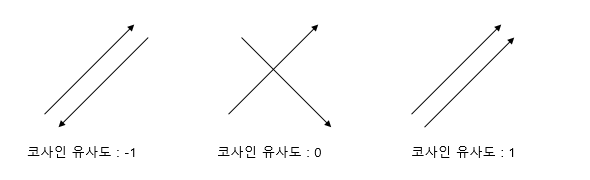
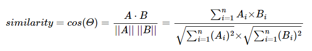
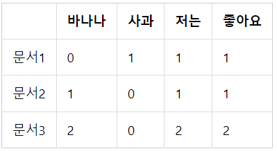
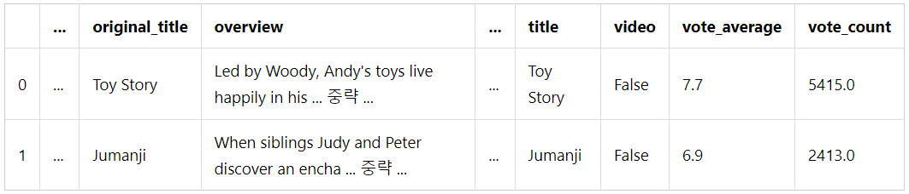
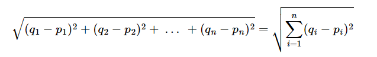
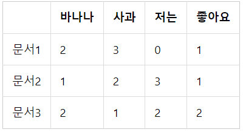
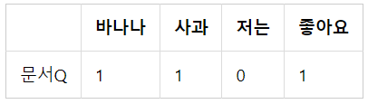
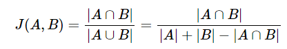
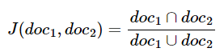

: 문장이나 문서의 유사도를 구하는 작업은 자연어 처리의 주요 주제 중 하나이다. 사람들이 인식하는 문서의 유사도는 문서들 간의 동일한 단어 또는 비슷한 단어가 얼마나 공통적으로 많이 사용되었는지에 따라 결정된다. 자연어 처리 AI도 마찬가지이다.

기계가 문서의 유사도를 계산하는 성능은 각 문서의 단어들을 수치화한 방법(DTM, Word2Vec 등)과 문서 간 단어들의 차이를 계산한 방법(유클리드 거리, 코사인 유사도 등)에 좌우된다.

<nav>

목차

- 코사인 유사도(Cosine Similarity)
- 여러가지 유사도 기법

</nav>

# 5-1 코사인 유사도(Cosine Similarity)

### 1. 코사인 유사도(CosineSimilarity)

: 두 벡터 간의 코사인 각도를 이용하여 구할 수 있는 두 벡터의 유사도

두 벡터의 방향이 완전히 동일한 경우 1, 90도의 각을 이루면 0, 180도로 반대방향을 가지면 -1의 값을 갖는다.

⇒코사인 유사도의 값은 -1 이상 1 이하의 값을 가지며 1에 가까울수록 유사도가 높다고 판단할 수 있다.



두 벡터 A, B에 대해 코사인 유사도를 식으로 표현하면 다음과 같다.



문서 단어 행렬 또는 TF-IDF 행렬을 통해 문서의 유사도를 구하는 경우 문서 단어행렬(TF-IDF 행렬)이 각각의 특징 벡터 A, B가 된다.

ex )

<aside>
💡 문서1 : 저는 사과 좋아요

문서2 : 저는 바나나 좋아요

문서3 : 저는 바나나 좋아요 저는 바나나 좋아요

</aside>

위 문서들에 대해 띄어쓰기 기준 토큰화를 진행했다고 가정하고 위 세 문서에 대해 문서 단어 행렬을 만들면 다음과 같다.



실습 코드를 통해 코사인 유사도를 계산하는 함수를 구현하고 각 문서 벡터 간의 코사인 유사도를 계산해보겠다.

```python
import numpy as np
from numpy import dot
from numpy.linalg import norm

def cos_sim(A, B):
  return dot(A, B)/(norm(A)*norm(B))

doc1 = np.array([0,1,1,1])
doc2 = np.array([1,0,1,1])
doc3 = np.array([2,0,2,2])

print('문서 1과 문서2의 유사도 :',cos_sim(doc1, doc2))
print('문서 1과 문서3의 유사도 :',cos_sim(doc1, doc3))
print('문서 2와 문서3의 유사도 :',cos_sim(doc2, doc3))
```

> 문서 1과 문서2의 유사도 : 0.67
> 문서 1과 문서3의 유사도 : 0.67
> 문서 2과 문서3의 유사도 : 1.00

문서1과 문서2의 코사인 유사도와 문서1과 문서3의 코사인 유사도가 동일하고, 문서2와 문서3의 유사도가 1이 나온다.

이와 같이 한 문서 내의 모든 단어의 빈도 수가 동일하게 증가하는 경우, 기존의 문서와 코사인 유사도의 값은 1이다.

⇒코사인 유사도는 유사도를 구할 때 벡터의 크기(=문서의 길이)가 아닌 벡터의 방향(패턴)에 초점을 두기 때문에 코사인 유사도는 문서의 길이가 다른 상황에서 비교적 공정한 비교를 할 수 있게 해준다.

### 2. 유사도를 이용한 추천 시스템 구현하기

캐글에서 사용된 영화 데이터셋을 가지고 영화 추천 시스템을 만들어보자.

- 다운로드 링크 : [https://www.kaggle.com/rounakbanik/the-movies-dataset](https://www.kaggle.com/rounakbanik/the-movies-dataset)

원본 파일은 위 링크에서 movies_metadata.csv 파일을 다운로드 받으면 된다.

```python
import pandas as pd
from sklearn.feature_extraction.text import TfidfVectorizer
from sklearn.metrics.pairwise import cosine_similarity

data = pd.read_csv('movies_metadata.csv', low_memory=False)
data.head(2)
```



⭐훈련 데이터는 총 24개의 열을 가지고 있지만 너무 많은 관계로 일부 생략하였다.

여기서 영화 제목에 해당하는 title 열과 줄거리에 해당하는 overview 열을 코사인 유사도에 사용할 것이다. 좋아하는 영화를 입력하면 해당 영화의 줄거리와 유사한 줄거리의 영화를 찾아서 추천하는 시스템을 만들어보자.

```python
# 상위 2만개의 샘플을 data에 저장
data = data.head(20000)
```

만약 훈련 데이터의 양을 줄이고 학습을 진행하고자 한다면 위화 같이 데이터를 줄여 재저장할 수 있다.

TF-IDF를 연살할 때 데이터에 Null 값이 들어있으면 에러가 발생한다. TF-IDF의 대상이 되는 data의 overview 열에 결측값이 존재하는지 확인한다.

```python
# overview 열에 존재하는 모든 결측값을 전부 카운트하여 출력
print('overview 열의 결측값의 수:',data['overview'].isnull().sum())
```

> overview 열의 결측값의 수: 135

결측값을 가진 행을 제거하는 pandas의 dropna() 또는 결측값이 존재하는 행에 특정 값을 채워넣는 fillna()를 사용하여 결측값을 제거한다.

```python
# 결측값을 빈 값으로 대체
data['overview'] = data['overview'].fillna('')
```

이제 overview 열에 대해 TF-IDF 행렬을 구한 후 행렬의 크기를 출력해보자.

```python
tfidf = TfidfVectorizer(stop_words='english')
tfidf_matrix = tfidf.fit_transform(data['overview'])
print('TF-IDF 행렬의 크기(shape) :',tfidf_matrix.shape)
```

> TF-IDF 행렬의 크기(shape) : (20000, 47487)

⇒20,000개의 영화를 표현하기 위해 총 47,487개의 단어가 사용되었다는 의미. 다시말해 47,847차원의 문서 벡터가 20,000개 존재한다고 할 수 있다.

20,000개의 문서 벡터에 대해 상호 간의 코사인 유사도를 구한다.

```python
cosine_sim = cosine_similarity(tfidf_matrix, tfidf_matrix)
print('코사인 유사도 연산 결과 :',cosine_sim.shape)
```

> 코사인 유사도 연산 결과 : (20000, 20000)

cosine_sim 행렬에는 모든 20,000개 영화의 상호 유사도가 기록되어 있다. 이제 cosine_sim으로부터 영화의 타이틀을 key, 영화의 인덱스를 value로 하는 딕셔너리 title_to_index를 만들어준다.

```python
title_to_index = dict(zip(data['title'], data.index))

# 영화 제목 Father of the Bride Part II의 인덱스를 리턴
idx = title_to_index['Father of the Bride Part II']
print(idx)    #4
```

선택한 영화의 제목을 입력하면 코사인 유사도를 통해 가장 overview가 유사한 10개의 영화를 찾아내는 함수를 만든다.

```python
def get_recommendations(title, cosine_sim=cosine_sim):
    # 선택한 영화의 타이틀로부터 해당 영화의 인덱스를 받아온다.
    idx = title_to_index[title]

    # 해당 영화와 모든 영화와의 유사도를 가져온다.
    sim_scores = list(enumerate(cosine_sim[idx]))

    # 유사도에 따라 영화들을 정렬한다.
    sim_scores = sorted(sim_scores, key=lambda x: x[1], reverse=True)

    # 가장 유사한 10개의 영화를 받아온다.
    sim_scores = sim_scores[1:11]

    # 가장 유사한 10개의 영화의 인덱스를 얻는다.
    movie_indices = [idx[0] for idx in sim_scores]

    # 가장 유사한 10개의 영화의 제목을 리턴한다.
    return data['title'].iloc[movie_indices]
```

영화 다크 나이트 라이즈와 overview가 유사한 영화들을 찾아보자.

```python
get_recommendations('The Dark Knight Rises')
```

> 12481 The Dark Knight
> 150 Batman Forever
> 1328 Batman Returns
> 15511 Batman: Under the Red Hood
> 585 Batman
> 9230 Batman Beyond: Return of the Joker
> 18035 Batman: Year One
> 19792 Batman: The Dark Knight Returns, Part 1
> 3095 Batman: Mask of the Phantasm
> 10122 Batman Begins
> Name: title, dtype: object

# 5-2 여러가지 유사도 기법

문서의 유사도를 구하기 위한 코사인 유사도 기법 외의 다른 방법들을 알아보자.

### 1. 유클리드 거리(Euclidean distance)

다차원 공간에서 두 개의 점 p와 q가 각각 p=(p1, p2, p3, …, pn)과 q=(q1, q2, q3, …, qn)의 좌표를 가질 때 두 점 사이의 거리를 계산하는 유클리드 거리 공식은 다음과 같다.



수식을 더 쉽게 이해하기 위해 2차원 공간이라고 가정하고 두 점 사이의 거리를 좌표평면 상에서 시각화하면 다음과 같다.


2차원 좌표 평면 상에서 두 점 p와 q 사이의 직선 거리를 구하는 문제이다. 이 경우 피타고라스의 정리를 통해 p와 q 사이의 거리를 계산할 수 있다. 즉 2차원 좌표 평면에서 두 점 사이의 유클리드 거리 공식은 피타고라스 정리를 통해 두 점 사이의 거리를 구하는 것과 동일하다.

여러 문서 간의 유사도를 구하고자 유클리드 거리 공식을 사용한다는 것은 앞서 본 2차원을 단어의 총 개수만큼의 차원으로 확장하는 것과 같다.

다음과 같은 DTM이 있다고 하자.



단어의 개수가 4개이므로 이는 4차원 공간에 문서1, 문서2, 문서3을 배치하는 것과 같다. 즉 DTM의 각 value를 좌표 값으로 취급한다.

이때 다음과 같은 문서 q에 대해 문서1, 문서2, 문서3 중 가장 유사한 문서를 찾고자 한다.



이때 문서 Q 또한 다른 문서들처럼 4차원 공간에 배치시켰다느느 관점에서 4차원 공간에서의 각각의 문서들과의 유사도를 구하면 된다.

```python
import numpy as np

def dist(x,y):
    return np.sqrt(np.sum((x-y)**2))

doc1 = np.array((2,3,0,1))
doc2 = np.array((1,2,3,1))
doc3 = np.array((2,1,2,2))
docQ = np.array((1,1,0,1))

print('문서1과 문서Q의 거리 :',dist(doc1,docQ))
print('문서2과 문서Q의 거리 :',dist(doc2,docQ))
print('문서3과 문서Q의 거리 :',dist(doc3,docQ))
```

> 문서1과 문서Q의 거리 : 2.23606797749979
> 문서2과 문서Q의 거리 : 3.1622776601683795
> 문서3과 문서Q의 거리 : 2.449489742783178

유클리드 거리의 값이 가장 작다는 것은 문서 간 거리가 가장 가깝다는 것을 의미한다. 즉 이 예제에서는 문서 1이 문서 q와 가장 유사하다고 볼 수 있다.

### 2. 자카드 유사도(Jaccard similarity)

A와 B 두 개의 집합이 있다고 하자. 이 때 교집합은 두 개의 집합에서 공통으로 가지고 있는 원소들의 집합을 의미한다. 즉 합집합에서 교집합의 비율을 구해 두 집합 A와 B의 유사도를 구하는 것이 자카드 유사도 기법이다.

자카드 유사도는 0과 1 사이의 값을 가지며, 두 집합이 동일한 경우 1의 값을 가지고 두 집합의 공통 원소가 없다면 0의 값을 가진다.

자카드 유사도를 구하는 함수를 J라고 했을 때, 자카드 유사도 함수 J는 아래와 같다.



두 개의 비교할 문서를 각각 doc1, doc2라고 했을 때, doc1과 doc2의 문서 간 유사도를 구하기 위한 자카드 유사도는 다음과 같다.



두 문서 doc1, doc2 사이의 자카드 유사도 J(doc1, doc2)는 두 집합의 교집합 크기를 두 집합의 합집합 크기로 나눈 값으로 정의된다.

```python
doc1 = "apple banana everyone like likey watch card holder"
doc2 = "apple banana coupon passport love you"

# 토큰화
tokenized_doc1 = doc1.split()
tokenized_doc2 = doc2.split()

print('문서1 :',tokenized_doc1)
print('문서2 :',tokenized_doc2)
```

> 문서1 : ['apple', 'banana', 'everyone', 'like', 'likey', 'watch', 'card', 'holder']
> 문서2 : ['apple', 'banana', 'coupon', 'passport', 'love', 'you']

문서 1과 문서 2의 합집합을 구해보자.

```python
union = set(tokenized_doc1).union(set(tokenized_doc2))
print('문서1과 문서2의 합집합 :',union)
```

> 문서1과 문서2의 합집합 : {'you', 'passport', 'watch', 'card', 'love', 'everyone', 'apple', 'likey', 'like', 'banana', 'holder', 'coupon'}

문서 1과 문서 2의 합집합의 단어의 총 개수는 12개이다.

이제 문서 1과 문서 2의 교집합을 구해보자. 문서 1과 문서 2에서 둘 다 등장한 단어를 찾으면 된다.

```python
intersection = set(tokenized_doc1).intersection(set(tokenized_doc2))
print('문서1과 문서2의 교집합 :',intersection)
```

> 문서1과 문서2의 교집합 : {'apple', 'banana'}

이제 교집합의 크기를 합집합의 크기로 나누면 자카드 유사도가 계산된다.

```python
print('자카드 유사도 :',len(intersection)/len(union))
```

> 자카드 유사도 : 0.16666666666666666

❗본 게시글은 [딥러닝을 이용한 자연어 처리 입문]을 참고하여 작성되었습니다.

[점프 투 파이썬](https://wikidocs.net/book/2155)
